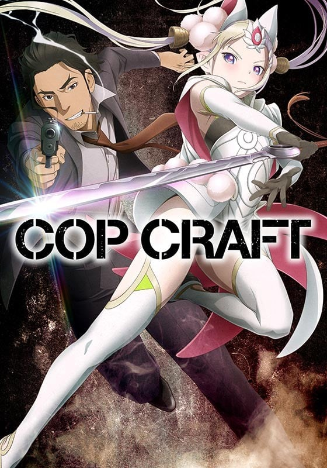
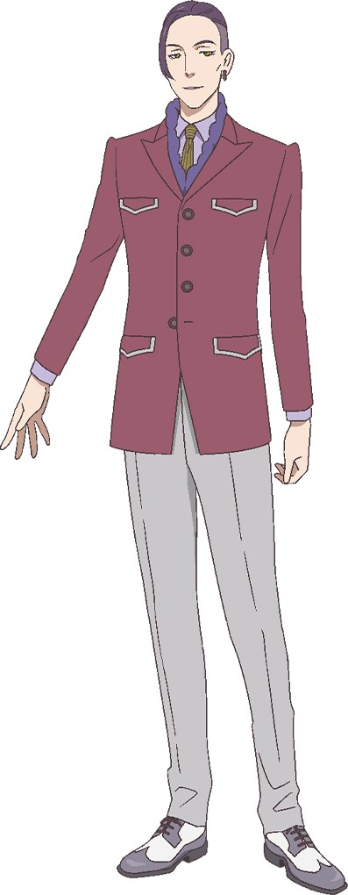

> [!bookinfo|noicon]+ **COP CRAFT**
> 
>
| 日文名 | コップクラフト |
|:------: |:------------------------------------------: |
| 类型 | 小说改 |
| 新番 | 2019 年 7 月 |
| 集数 | 共12话 |
| 官网 | [http://copcraft.tv/](https://http://copcraft.tv/) |
| 制作 | ミルパンセ |
| 导演 | 板垣伸 |
| 脚本 | 賀東招二,永井真吾 |
| 评分 | 5.9|
| 制片人 | 白石直子 |

> [!abstract]+ **简介**
> 十五年前，太平洋上出现了一个未知的超空间大门。在门的对面，是妖精和魔物居住的奇妙异世界“莱特·塞玛尼”。
“圣特雷萨市”是有着超过200万的来自两个世界的移民居住的都市。那里有着多样的民族和多彩的文化，有着富裕者和贫困者。那里是全世界最新的“梦幻之城”。但是，在那混沌的暗影中，涌动着各种各样的犯罪。
毒品贩卖、色情交易、武器走私。
而面对这些犯罪的刑警们，就存在于圣特雷萨市的警察局……
刑警桂·的场与异世界骑士缇拉娜，性别、性格以及“出生的世界”均不相同的两人相遇之时，案件发生了。
两个世界，两种正义，在其前方——搭档警察动作剧开幕！

> [!tip]+ **章节列表**
>- [ ] 第1话：COP SHOW, WITCH CRAFT (2019-07-08)
>- [ ] 第2话：DRAGNET MIRAGE (2019-07-15)
>- [ ] 第3话：MIDNIGHT TRAIN (2019-07-22)
>- [ ] 第4话：IN THE AIR TONIGHT (2019-07-29)
>- [ ] 第5话：LONESOME VAMPIRE (2019-08-05)
>- [ ] 第6话：NEED FOR SPEED (2019-08-12)
>- [ ] 第7话：GIRLS ON ICE (2019-08-19)
>- [ ] 第8话：SMELLS LIKE TOON SPIRITS (2019-08-26)
>- [ ] 第9话：A KING MAKER (2019-09-02)
>- [ ] 第10话：COCK ROBIN, JOHN DOE (2019-09-16)
>- [ ] 第11话：TRANSITIONAL CRISES (2019-09-23)
>- [ ] 第12话：TWO WORLDS, TWO JUSTICES (2019-09-30)
>- [ ] 第9.5话：美丽的女骑士！寻找被囚禁的妖精！ (2019-09-09)

> [!tip]+ **主要角色**
> 
| 角色 | CV | 简介| 角色图片 |
|:----:|:---:|:---:|:--------:|
| ケイ・マトバ | 津田健次郎 | 圣特雷萨市警局的特别风纪班的干练刑警。对猫过敏，但又因为某个原因而饲养着一只黑猫。 |  |
| ティラナ・エクセディリカ | 吉岡茉祐 | 来自异世界“莱特·塞玛尼”的ファルバーニ王国的见习骑士。除了剑术，还会使用被称为“术（ミルディ）”的魔法。 |  |
| セシル・エップス | 折笠富美子 | 圣特雷萨市警局的法医，的场的前女友。 |  |
| ジャック・ロス | 浜田賢二 | 圣特雷萨市警局的特别风纪班的主任。是个为人严格的人物。 |  |
| トニー・マクビー | 高橋良輔 | 特别风纪班的刑警。担当风纪班中的母亲一角。 |  |
| ジェミー・オースティン | 中原麻衣 | 特别风纪班的刑警。キャミー的搭档。以前是个肥胖女孩。 |  |
| キャメロン・エステファン | 井上麻里奈 | 特别风纪班的刑警。ジェミー的搭档。以前是个腐女子。 |  |
| アレクサンドル・ゴドノフ | 鶴岡聡 | 特別風紀班の刑事。トニーの相棒。妻子持ち。 |  |
| ビズ・オニール | 高木渉 | 自称牧師の情報屋。クラブの経営者。 |  |
| ケニー | ボルケーノ太田 | オニールの秘書兼用心棒。 |  |
| ゼラーダ | 大塚芳忠 | セマーニ人の魔術師。 |  |