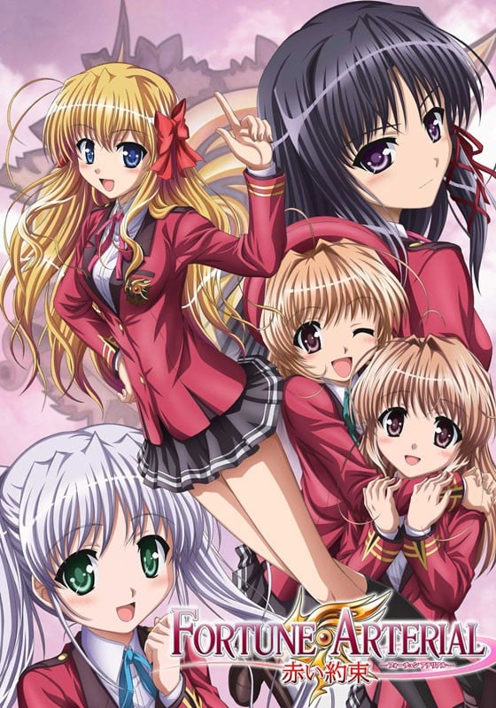
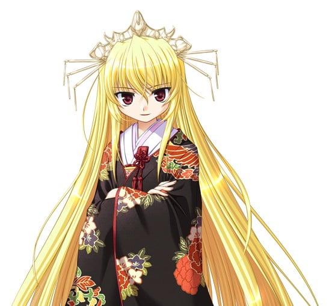

> [!bookinfo|noicon]+ **FORTUNE ARTERIAL -赤之约束-**
> 
>
| 日文名 | FORTUNE ARTERIAL -赤い約束- |
|:------: |:------------------------------------------: |
| 类型 | 游戏改 |
| 新番 | 2010 年 10 月 |
| 集数 | 共12话 |
| 官网 | [https://www.tv-tokyo.co.jp/contents/fortune/](https://https://www.tv-tokyo.co.jp/contents/fortune/) |
| 制作 | ZEXCS |
| 导演 | 名和宗則 |
| 脚本 | 山田靖智,大知慶一郎,長谷川勝己,待田堂子 |
| 评分 | 6.3|
| 制片人 | 橋本和典,川﨑とも子；制作制片人：橋本和典 |

> [!abstract]+ **简介**
> 继「夜明前的琉璃色」后，游戏公司AUGUST于08年推出的美少女恋爱游戏「FORTUNE ARTERIAL」也加入了动画化行列。

【STORY】
在樱花飞舞的4月，主人公支仓孝平转学到了一所英国贵族学校修智馆学院。面对陌生的环境和全宿制的校园生活，支仓孝平感到一丝不安，但很快地这点不安就被各种各样的日常生活取代了。与各位美少女的邂逅使得他的生活变得更丰富多彩，而且这里居然还有吸血鬼的存在？！

【CAST】
支仓孝平：小野大辅
千堂瑛里华：神田理江
东仪白：峰岸由香里
红濑桐叶：鸣海绘里香
悠木奏：生天目仁美
悠木阳菜：田口宏子
千堂伊织：诹访部顺一
东仪征一郎：坪井智浩
八幡平司：伊藤健太郎

> [!tip]+ **章节列表**
>- [ ] 第1话：候鳥 (2010-10-08)
>- [ ] 第2话：開學典禮 (2010-10-15)
>- [ ] 第3话：千年泉 (2010-10-22)
>- [ ] 第4话：新人 (2010-10-29)
>- [ ] 第5话：钥匙 (2010-11-05)
>- [ ] 第6话：信 (2010-11-12)
>- [ ] 第7话：前触れ (2010-11-19)
>- [ ] 第8话：記憶 (2010-11-26)
>- [ ] 第9话：眷属 (2010-12-03)
>- [ ] 第10话：渇き (2010-12-10)
>- [ ] 第11话：決別 (2010-12-17)
>- [ ] 第12话：赤い約束 (2010-12-24)

> [!tip]+ **主要角色**
> 
| 角色 | CV | 简介| 角色图片 |
|:----:|:---:|:---:|:--------:|
| 千堂瑛里華 | 神田理江 | 和主人公一樣是5年級學生。 学業・運動都很出色，容姿端麗。一邊擔任學生會副會長一職，一邊還是学院中最有人氣的女子学生。 性格是好奇心旺盛的直腸子。總是因爲覺得有趣而探出頭，眼睛閃閃發光。 只要一開始行動就很難使其停止下來，應該說她具備著連阻止她的人都會被捲入的過剩精力。 雖説如此卻不是橫衝直撞的類型，有著事先會進行細緻計劃的謹慎一面。 哥哥是學生會長。因其美貌和爽朗的性格，而成爲学院中最有名的男子学生 |  |
| 東儀白 | 峰岸由香里 | 4年生。雖然沉默卻是能和別人一見如故的性格。 因其白皙又夢幻的容貌，留給人以繊細如同玻璃工藝品般的感覺。 受到在學生會擔任財務一職的哥哥征一郞的邀請而加入學生會，因爲不習慣集団行動，所以放課後比較多的時間是不參加活動的。 不管什麽時候都把哥哥放在最優先，是個相當戀兄的女孩子。 要和總是深思熟慮的她能夠對上話也許是一件非常不容易的事也説不定。 |  |
| 紅瀬桐葉 | 鳴海エリカ | 主人公的同班同學。經常一個人待在教室裏，但從來不擺出一副寂寞的樣子。 偶爾會和主人公搭話，不過只以必要最低限度的話語來回答。 容姿・身材比例都很出色。 只在有興趣的事情上花精力，覺得無聊的科目總是得到赤點。 但是數學係科目卻能夠發揮她令人驚異的能力，經常穩坐学年第1位。 對総合成績佔頂峰的瑛里華而言也許正好是一件好事。 不過，桐葉本人完全沒有介意的樣子。 |  |
| 悠木かなで | 生天目仁美 | 6年生。主人公的青梅竹馬，陽菜的姐姐。總是性質高漲的我行我素。 雖然很寵溺主人公，但也基於其獨特的基準而行動，如果沒有一定程度的交往的話是無法預測她的行動的。 用一句話來概括，能夠制御她的似乎只有妹妹陽菜一個人。 かなで自身也很寵愛妹妹，總是念叨著如果自己是男人的話絕對要和陽菜結婚。 就言語方面，就字面而言看上去很傲氣偉大，但再看她的口吻以及行爲的話就會讓人感覺年齡最小。 感情表現豐富，一會笑，一會發怒，一會又閙變扭了。 |  |
| 悠木陽菜 | 田口宏子 | 5年生，主人公的同班同學。かなで的妹妹主人公的青梅竹馬。是個讓人擔心的堅強女孩。 雖然每天都因爲破天荒姐姐的行動而嘆氣，但實際上相當以此為樂。 因其明快開朗的個性和喜歡照顧別人的性格而不問學年的擁有很多朋友，和全體學生都是朋友，擁有讓人有啊？地吃驚程度的交友関係。 根據かなで的話來説，至今爲止不知被幾個男子学生告白過，全部都乾脆地回絕了。不過本人一直在否定這個説法。 擅長替其他女孩子編辮子。 |  |
| 千堂伊織 | 諏訪部順一 | 生徒会会長にして、瑛里華の兄。自由奔放な人で、彼独自の論理をさも宇宙の絶対法則であるかのように展開する。  爽やかな言動とモデルに勝るとも劣らない容貌を持っていることから、告白した女の子の数は計り知れない。瑛里華に言わせれば「外見はサンプルであり内容とは異なる」と明示すべきである、とのこと。男女問わず学生の間では圧倒的な人気があり、行事などでの彼の挨拶は毎回注目の的。財務の征一郞とは長いつきあいのようだ。 |  |
| 東儀征一郎 | 坪井智浩 | 白の兄で、生徒会財務を務める。伊織と長くコンビを組んでいることからも、彼の並外れた忍耐力と冷静さが窺える。千堂兄妹が無尽蔵に生み出す無理難題を粛々と解決する係。どちらかというと無口で冷たい印象を持つ人もいるが、妹の白にはシスコンの噂が立つほど優しい。その涼しげな容貌に胸をときめかす女の子も多いようだが、本人はあまり気にしていない様子。  かつて入っていた弓道部では主将を務め腕前もかなりのものだったらしいが、生徒会に入ると同時に惜しまれつつ退部した。 |  |
| 八幡平司 | 伊藤健太郎 | ５年生であり、主人公のクラスメート。  一見不良っぽい外見や言動のせいで、初対面の相手には怖がられることもしばしば。自由に生きることをモットーとし、学院に縛られることなく生活している。友達思いで信義に篤い一面も。陽菜とともに、転校してくる主人公とクラスの中では最初に仲良くなり、その後は、寮でも学院でも主人公とつるむことが多くなる。  遠く離れた実家には、双子の妹がいるらしい。 |  |
| 天池志津子 | 星野千寿子 |  |  |
| 青砥正則 | 一条和矢 |  |  |
| 美術部部長 | 水霧けいと |  |  |
| 千堂伽耶 | 水橋かおり |  |  |