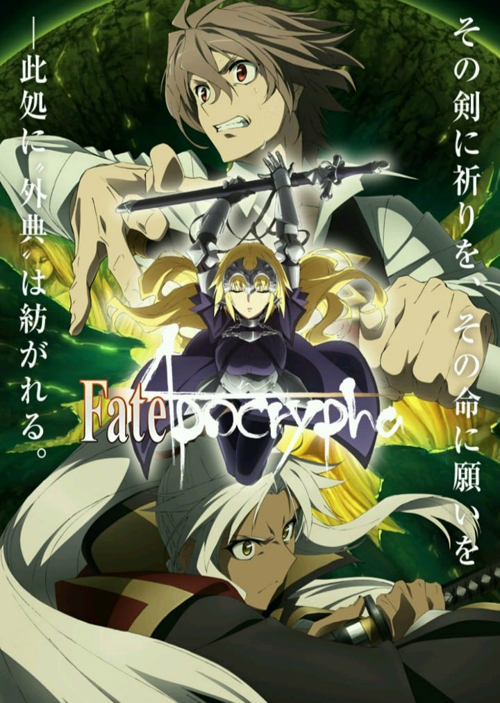
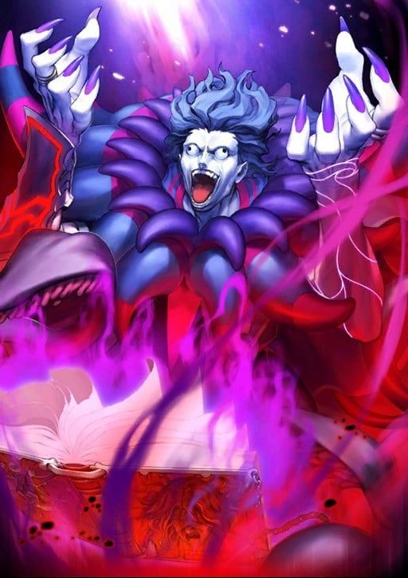
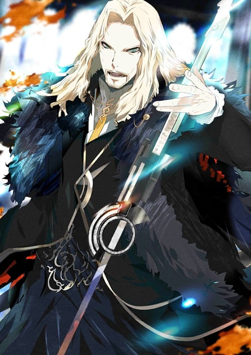
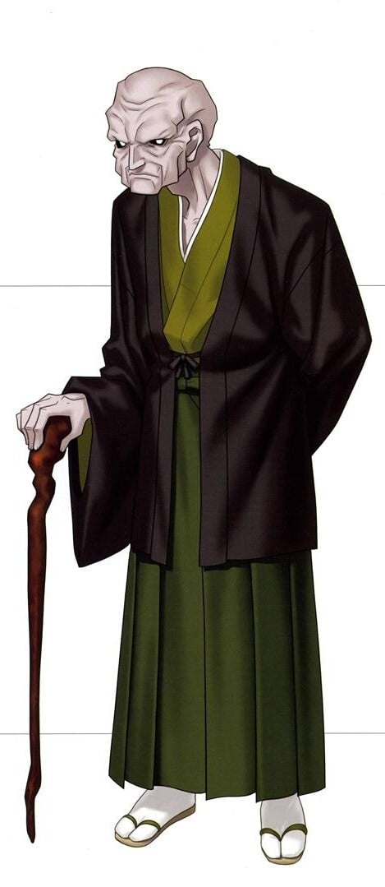
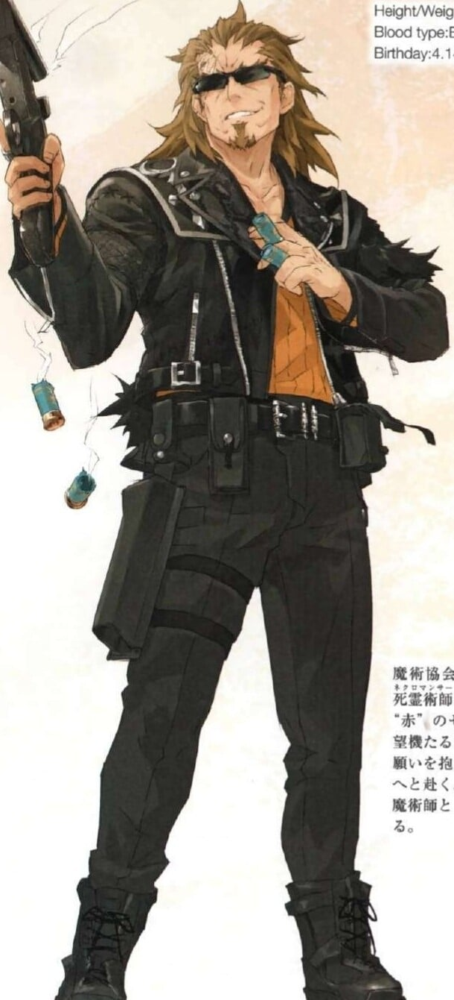
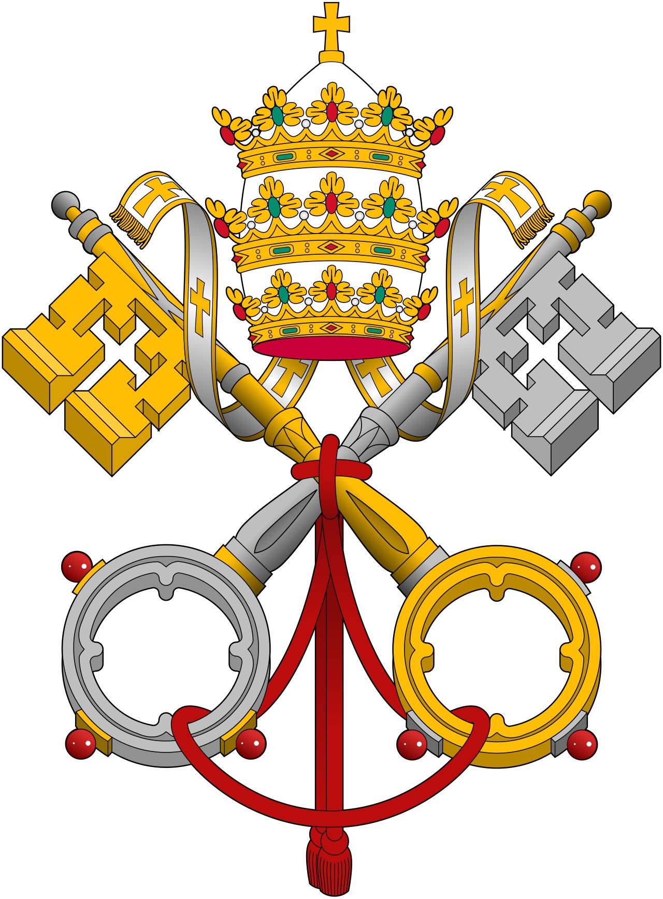
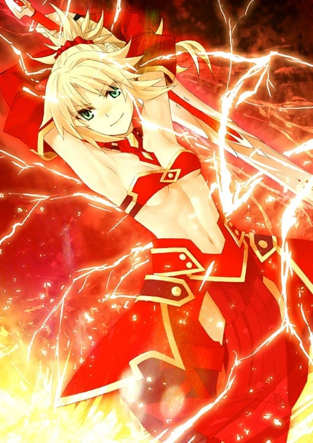

> [!bookinfo|noicon]+ **Fate/Apocrypha**
> 
>
| 日文名 | Fate/Apocrypha |
|:------: |:------------------------------------------: |
| 类型 | 小说改 |
| 新番 | 2017 年 7 月 |
| 集数 | 共25话 |
| 官网 | [http://fate-apocrypha.com/](https://http://fate-apocrypha.com/) |
| 制作 | A-1 Pictures |
| 导演 | 浅井義之 |
| 脚本 | 関根アユミ,東出祐一郎,三輪清宗,小太刀右京 |
| 评分 | 4.7|
| 制片人 | 藤田祥雄 |

> [!abstract]+ **简介**
> 过去，在被称作冬木的城市曾举行过由七位魔术师与英灵参加的“圣杯战争”。
然而趁着第二次世界大战的混乱，“某位魔术师”强行夺走了圣杯——

数十年过去，千界树一族高举那个圣杯为象征，叛离了魔术协会，宣布独立。
愤怒的魔术协会派遣了刺客，但他们却遭到了召唤出的Servant的反击。

——对抗Servant的是Servant。

——“圣杯战争”的系统被变更，前所未有的七对七规模的战争爆发了。
因此，以罗马尼亚的图利法斯为舞台，空前绝后的规模的战争——“圣杯大战”拉开了帷幕。

> [!tip]+ **章节列表**
>- [ ] 第1话：外典：圣杯大战 (2017-07-01)
>- [ ] 第2话：圣女的启程 (2017-07-08)
>- [ ] 第3话：迈开步伐的命运 (2017-07-15)
>- [ ] 第4话：生的代价、死的偿还 (2017-07-22)
>- [ ] 第5话：天之声 (2017-07-29)
>- [ ] 第6话：叛逆的骑士 (2017-08-05)
>- [ ] 第7话：自由之所在 (2017-08-12)
>- [ ] 第8话：开战的狼烟 (2017-08-19)
>- [ ] 第9话：百焰与百花 (2017-08-26)
>- [ ] 第10话：与花共逝 (2017-09-02)
>- [ ] 第11话：永远的光辉 (2017-09-09)
>- [ ] 第12话：圣人的凯旋 (2017-09-16)
>- [ ] 第13话：最后的Master (2017-09-30)
>- [ ] 第14话：救世的祈祷 (2017-10-07)
>- [ ] 第15话：即便道路不同 (2017-10-14)
>- [ ] 第16话：开膛手杰克 (2017-10-21)
>- [ ] 第17话：梦幻曲 (2017-10-28)
>- [ ] 第18话：来自地狱 (2017-11-04)
>- [ ] 第19话：终结的早晨 (2017-11-11)
>- [ ] 第20话：翱翔天际 (2017-11-25)
>- [ ] 第21话：天蝎一射 (2017-12-02)
>- [ ] 第22话：再会与离别 (2017-12-09)
>- [ ] 第23话：前往彼方 (2017-12-16)
>- [ ] 第24话：圣杯战争 (2017-12-23)
>- [ ] 第25话：Apocrypha (2017-12-30)
>- [ ] 第12.5话：圣杯大战开幕篇 (2017-09-23)
>- [ ] 第19.5话：圣杯大战动乱篇 (2017-11-18)

> [!tip]+ **主要角色**
> 
| 角色 | CV | 简介| 角色图片 |
|:----:|:---:|:---:|:--------:|
| アルトリア・ペンドラゴン | 川澄綾子 | Fate/stay night 被卫宫士郎召唤的英灵。作为三骑士之一的Saber，以「最优秀的剑之骑士」闻名。她曾在第四次圣杯战争中被召唤，当时士郎的养父——卫宫切嗣是她的Master。 她的真实身份是英格兰传说中的英雄——亚瑟王。从石中拔出选王之剑的少女「阿尔托莉雅」，为了成为理想的君主而隐瞒了自己的性别。然而，在内乱中目睹国土荒废的她，认为自己未能胜任王者之位，因此渴望借由圣杯重新选定合格的王，以拯救祖国不列颠。 她拥有不负传说之名的强大力量，但由于与士郎之间缺乏魔力的“通路”，常因魔力不足而陷入苦战。性格极其刻板认真，对于自己是女性的自觉也相当淡薄，以至于一开始总与士郎意见不合。但最终，她在与士郎的相处中肯定了自己的人生，并决心摧毁寄宿着“此世全部之恶”的圣杯。对她而言，能让自己镜像一般的士郎成为Master，或许是再幸运不过的事情了。  Fate/Zero 传说中的骑士王亚瑟现界的身姿，真名是阿尔托莉雅。卫宫切嗣召唤的从者，召唤时所用的圣遗物是Excalibur的剑鞘，她在第四次圣杯战争中保护着作为代理Master的爱丽丝菲尔。 传说中的亚瑟王是男性，那是因为她为了统治方便而隐瞒了性别。拔出选定之剑后身体便不再成长与老化，因此一直是少女的模样。高尚而廉洁、认真而顽固，怀抱的愿望是拯救曾经走上灭亡之路的祖国不列颠。  Fate/Grand Order 不列颠传说中的王。也被誉为骑士王。阿尔托莉雅是幼名，自从当上国王之后，就开始被称为亚瑟王了。在骑士道凋零的时代，手持圣剑，给不列颠带来了短暂的和平与最后的繁荣。史实上虽为男性，但在这个世界内却似乎是男装丽人，行为举止都以男性为标准，因此很不擅长应对异性向自己表达的好感。 崇尚万人眼中正确生活、正确人生的理想王者之一。锄强扶弱，是个无可非议的人物。冷静沉着，无论何时都十分认真的优等生。尽管如此……虽说从不愿意开口承认，但她却有着不服输的一面。对任何需要一争高下的事都不会手下留情，一旦败北则会非常懊悔。 她具有指挥军团的天生才能。在团体战斗中，可令我军的能力提升。贯彻清廉正直，大公无私的王。其公正令骑士们愿意守护于她的身旁，令民众们在对贫困的忍耐中看到了希望。她的王者之路并不是为了统帅少数强者，而是为了领导更多无力之人而存在的。 亚瑟王传说以骑士时代的终结为结局。亚瑟王虽然击退了异民族，但却无法回避不列颠土地的毁灭。圆桌骑士之一·莫德雷德的反叛导致国家一分为二，骑士之城卡美洛也失去了其辉煌。亚瑟王在卡姆兰之丘成功讨伐了莫德雷德，自己却也因负重伤而倒下。在去世前，她将圣剑交给了最后的心腹贝德维尔，离开了这个世界。死后她被送往了理想乡——不存于此世的乐园·阿瓦隆，并打算在遥远的未来再次拯救不列颠。 |  |
| ランスロット |  | 被讴歌为圆桌骑士中最强者的“湖之骑士”。 他热爱正义，尊敬女性，憎恶邪恶，清廉而又洋溢着浪漫的身姿，被亚瑟王评价为「理想的骑士」。 与王妃桂妮薇儿的不伦之恋将卡美洛引向了破灭，确实是象征着亚瑟王传说的败北的人物。 幼时父母双亡，由湖之妖精妮妙养育长大，因此得到了“湖之骑士”的异名。 成年后渡海来到不列颠岛，经历了与亚瑟王的相遇，继承了圆桌骑士之名。 其武勇与骑士道精神同其他普通人不能相提并论。 对王妃桂妮薇儿的感情而献出生命，是他的骑士道所导致的必然结果。若不是对王的背叛加快了他走向毁灭的速度，说不定还能得到救赎。但却正是因他的武勇天下无双，才致使事态发展到最坏的结局。 |  |
| ジル・ド・レェ | 鶴岡聡 | 法国贵族、军人。百年战争时期与圣女贞德一起夺回了奥尔良，被人们称颂为英雄。清廉勇敢，被赋予了军人最高荣誉的元帅称号。 深爱艺术的吉尔·德·雷用其庞大的财产，搜集各种艺术品。本以为永远不会见底的财产被他瞬间浪费殆尽。起初吉尔与他好友兼导师的弗朗索瓦·普勒拉蒂一起，为了解决财政困难而接触了炼金术，但不知不觉中失去了当初的目的，开始为恶魔召唤所倾倒。一些人担心吉尔为了钱可能会将领土贩卖给敌国，因此以他平时的恶行之名定罪，没收其领地，最终将他处决。对他残酷行为与亵渎神明的弹劾，都只是政治上的借口罢了。——蓝胡子。这成了后世人们对其的称呼。 圣女贞德对吉尔·德·雷而言是一切。她才是这腐败现实中唯一的救赎，对吉尔而言或许也是神灵存在的证明。他本是个非常虔诚的信徒，却因为贞德被当做异端予以处决后，感受到深深的绝望，失去了对神信仰的方向。他最终那些残暴的行为也只是，为了证明（本应惩罚恶行的）神并不存在的手段。过去绝不会改变。无论曾经是个多么优秀的武将，也无法改变他是杀人魔的事实。尽管如此，他也不得不永远寻求救赎。 在几乎所有的圣杯战争中，吉尔多半都并非作为Saber，而是作为Caster被召唤出来的。这都是因为蓝胡子的恶名早已传遍了整个世界吧。 |  |
| ヴラド三世 | 置鮎龍太郎 | 罗马尼亚历史上有名的王和英雄。 坚持瓦拉几亚独立，被誉为是基督教世界的盾的高洁武人。 不过，德古拉这个名字却更加广为流传。 为将瓦拉几亚坚守到底免受土耳其掠夺，肃清了荒废国土的贵族们，对敌对的2万土耳其士兵施行了刺杀之刑，但因贯彻了严惩主义，被贵族们背叛离弃。 最终死于手下瓦拉几亚贵族们的暗杀。 |  |
| ガウェイン |  | 亚瑟王传奇中圆桌骑士之一。 是随从亚瑟王最久的骑士之一，也是服侍王的战争，直到其终结的忠义骑士。 拥有被称为Excalibur姐妹剑的太阳之圣剑，又因圣者的祝福，在白天作为无人并肩的无双骑士而驰名于世。 不论怎样的工作也会认真完成，就算有时那个任务是讨债。 非常适合温和笑容的白马王子。 虽然性格极其认真，但没有过于沉重的架势，不论和谁相处都非常客气友善。 虽然也会冲动，但因为不会出现嫉妒或者怨恨之类的负面感情，所以不论身处什么样的战场也给人以神清气爽之感。 正如其他圆桌骑士所说，「能像他这么不讨人厌已经是一种才能了」什么的。 虽然拥有与生俱来的才能和家室，却仍没有被嫉妒，可能是由于高文自身的良好性格，和认为理所当然而又不骄傲自满的天然使然。 他是忠诚的骑士，对王的忠心好似钢铁一般。 高文自己，希望能够成为为王挥舞的一把剑。 ……他这样的姿态，恐怕在不了解他内心的第三者看来甚至会显得盲目。 |  |
| 間桐臓硯 |  | "五百多年——呵。回想起来，只是瞬间即逝的宿愿。" |  |
| ジャンヌ・ダルク | 坂本真綾 | 筋力B 耐久B 敏捷A 魔力A 幸运C 宝具A++  对魔力：EX 启示：A 领导力：C 圣人：B  宝具：  主与我同在（Luminosite Eternelle）A  红莲之圣女（La Pucelle）EX                                           原型为法国军事家、天主教圣人、领导法兰西逆转百年战争局势的少女英雄。作为被圣杯战争本身所召唤的英灵，有着管理圣杯战争的职责。因此，她和其他Servant不同，会继承不断重覆的圣杯战争中的记忆。  以调整者身份登场时，沉默寡言而冷静。另一方面，本性是个素朴又温顺的16岁女子。虽然将规则放在第一位，为了守护秩序而挥剑，但基本上，她重视全部参与圣杯战争的人类和英灵。  虽然担当Ruler的职介，但本身是作为潜在的Saber而存在，因此兼具两种职介的特长。一方面能够随时探知附近全部英灵的真名、存在与现况，另一方面，具有高超的对魔力。不过因为是教会的圣人，因此对魔力对于基督教神术无效。 |  |
| 天草四郎 | 内山昂輝 | 名为天草四郎时贞的这位少年（尽管有多名浪人从旁教导）毫无疑问是岛原之乱的领袖。然而他究竟是如何被人们所发现，他的前半生几乎完全是个谜。 在江户初期的起义——岛原之乱中担任领袖的少年。幼年期就为学问所倾倒的他以某个时期为契机，忽然开始能够创造各种各样的奇迹。治愈伤口，能在水面上行走的他作为神之子开始被信禁教的农民们热心地崇拜。 随后，以他为领袖的小西行长的旧家臣们，成立了对抗江户幕府的叛乱军。与当时在痛苦中挣扎的岛原农民们一起，掀起了大规模的叛乱。起初没把起义当回事的江户幕府，在派去讨伐军结果被击败之后，才终于认真了起来，请出了老中松平信纲作为部队统帅。 松平信纲对在原城闭门不出的起义军采用了断绝其兵粮的战术，看准对方食物弹药用尽的时机，发动了总攻击。传说除了一名内奸以外，包括天草四郎时贞在内的三万七千人，全部被幕府军杀光（有各种说法）。  能力值非常平凡，在冬木的第三次圣杯战争中，曾有他被作为Ruler召唤的记录。通过神明裁决的令咒执行机能，与真名识破的攻击弱点的作战方式，还差一步就能获得圣杯的时候，因为御主的死亡而失败。 天草四郎的梦由此开始。 |  |
| 獅子劫界離 | 乃村健次 | 「赤」Saber的Master。不过并没有跟随言峰四郎，而是和从者一同采取独自行动。 凶恶的外表给人一种美国逃犯的感觉。不是魔术师，是魔术使。虽然知识这点无法和魔术师们相提并论，但论战斗经验可是能和活了百年的达尼克比肩。 平常在战场四处回收魔术师的尸体或互相抢夺魔术刻印。基本上不会故意去做增加死者之类的事情。再说因为就算不用做那种事，在这世界上每分每秒都会出现死者。 魔术礼装虽然爱用短型猎枪，但这不过是拿来当咒弹应用魔术的媒介在使用，没有拿来当普通的枪用过。其他基本上使用心脏加工成的手榴弹或动物的眼球和猴子的手之类的，因为是死灵魔术，所以礼装大部分都非常恶趣味。 作为魔术师的力量是以前一流，现在二流。魔术使的话是一流。 似乎非常喜爱连名字都没出现过的养女，只要找外套后面的内口袋就会出现一些老照片之类的。 |  |
| カルナ | 遊佐浩二 | 印度古代叙事诗《摩诃婆罗多》的大英雄，既是摩诃婆罗多中心的英雄阿周那的对手，也是其异父兄弟。 由人类女性贡蒂与太阳神苏利耶所生，然而，他出生后就立刻被贡蒂抛弃，作为车夫的儿子被抚养长大，但是其作为英雄的资质却从未被掩盖。 母亲贡蒂舍弃迦尔纳之后，又生下了般度五兄弟，其中的三男，也就是对迦尔纳来说可谓是终生的对手的阿周那。 成长起来的迦尔纳成为了与般度家对立的俱卢家的养子，然而和阿周那对战之前，迦尔纳的已是诅咒缠身、障碍累累。 婆罗门的诅咒，因陀罗的欺骗，连母亲向他的求诉，要他发誓不跟阿周那之外的人战斗，他也一并接受了下来。  迦尔纳是极为宽大的Servant，一切都能以「事该如此」的理由接受下来。 他不仅对万般人等平等对待，更是将万般人等当作“各自的花朵”加以尊重。 拥有绝不会被众多的偏见公正对待的武艺和高洁的精神，即便论其英雄之格也仍能在众Servant中夺得一二。 |  |
| Ecclesia Catholica |  | 天主教会，即罗马大公教会，是以罗马主教为首的教会，为基督宗教的主要宗派之一，自承其历史从耶稣基督创立以来一脉相承。在大多数场合，天主教会即等同于天主教。 西元5世纪，罗马帝国分裂为东、西两部份之后，东罗马帝国奉君士坦丁堡主教为正宗，并演变成日后的东正教；而原领导教务的罗马主教，则成为了分裂后西罗马帝国的正宗，并逐渐独承教宗的称号，当时各地方教会普遍承认罗马主教为宗徒长伯多禄(即第一使徒圣彼得)的继承人，并在教会拥有首席的领导地位。 11世纪发生东西教会大分裂后，当时的教会分裂为以君士坦丁堡普世牧首为首的正教会，和以罗马教宗为首的公教会，“罗马天主教会”、“罗马天主教”、“罗马公教”等别名由此而来。天主教会自认为自身是普世的教会，而新教徒常加注“罗马”一词以否定其普世性，以显示出其仅是由罗马教宗领导的教会。 天主教的教义是以《圣经》为中心，但教会当局的教导也有一定的地位。天主教的信仰生活的核心是七件圣事，即圣洗圣事、坚振圣事、修和圣事、圣体圣事、婚配圣事、圣秩(神品)圣事、病人傅油。在这其中，弥撒（圣体圣事为其主题）是最重要的。 日常生活中，诵经也是天主教信徒经常进行的活动。这些经文大都是一些经过编排好的重要经文的连祷，例如《天主经》、《宗徒信经》和《玫瑰经》。 天主教的节日很多，在基督宗教三大派别少于东正教而多于基督新教。其中比较重要的有圣诞节、复活节、圣神降临节、圣母升天节、圣体圣血节等。 截至2021年，天主教会在全球拥有约13亿7585万2千名信徒，约占同时期总人口的六分之一，是基督宗教中信徒人数最为庞大的教会；现时（第267任）教宗为良十四世（Leo PP. XIV），于2025年5月8日当选。  =============================================  天主教会是二次元作品中出现得最为频繁的现实组织投影之一。尽管世界上存在的宗教和派别非常之多，但基本牵涉到宗教性组织和出现有牧师/神职角色的作品时，其模仿的蓝本八，九成来自于天主教会。这不仅因为它是迄今最知名和庞大的教会，还因为它集中有效的管理和扩张系统，以及在历史上参与世俗事务（经济，政治和军事）的频繁度也非其它宗教机构能够比拟，在宗教以外的领域仍然是非常活跃的角色，因此非常适合作为创作（尤其是架空世界创作）的参考。 |  |
| モードレッド | 沢城みゆき | 莫德雷德是圆桌骑士之一，亚瑟王的亲生子。同时也是终结了传说的反叛骑士——在卡姆兰之丘杀死了亚瑟王。 在亚瑟王的姐姐兼宿敌的魔女摩根的奸计下，莫德雷德作为人造生命——人工生命体的一种而诞生，体格和阿尔托莉雅完全一致。她正是为了杀死亚瑟，同时也是为了成为超越亚瑟的王而诞生的。由于莫德雷德是人工生命体，成长速度极快，出生后数年就成了侍奉亚瑟王的骑士。因其模仿了亚瑟王的能力，她很快就作为骑士崭露头角。 与摩根原本的企图相反，莫德雷德憧憬父亲，并希望得到父亲的承认。然而在遭到了亚瑟王的拒绝后骤然一变。为了践踏父亲建立的伟业而研磨自己的毒牙。本来就已达极限的不列颠在二人的激斗中走向崩溃。作为人工生命体而诞生于这个世界，如疾风般经历了各种事件的她，寿命很短。或许正因此，将人生的一切都献给父王后，莫德雷德无比希望能得到她的认同。然而，她却也仍然无法理解亚瑟的苦恼。 莫德雷德很容易相处。只要不说亚瑟王的坏话，不夸奖亚瑟王，不将她作为女性对待，也不要露骨地将她视为男性，不要太死板，也不要被其他从者迷得神魂颠倒，要认真倾听她的意见。很简单吧？ |  |