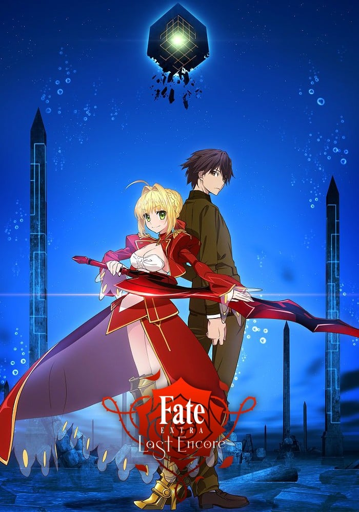
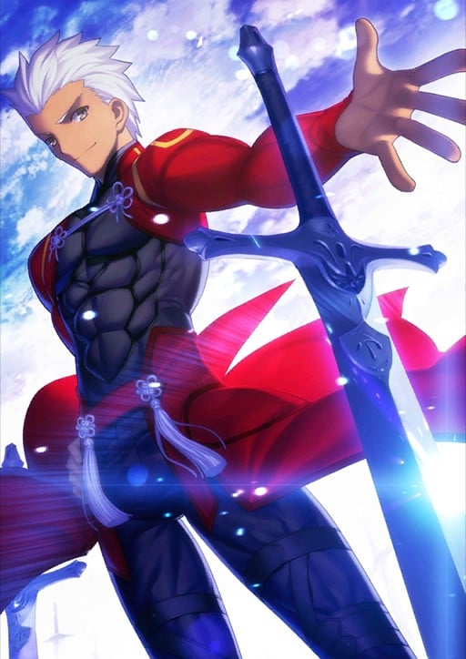
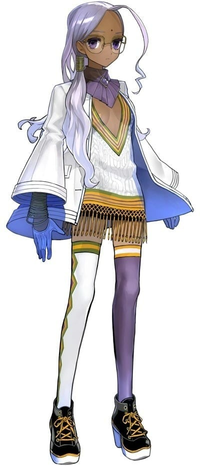
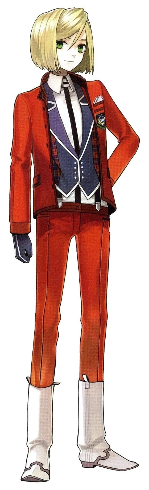
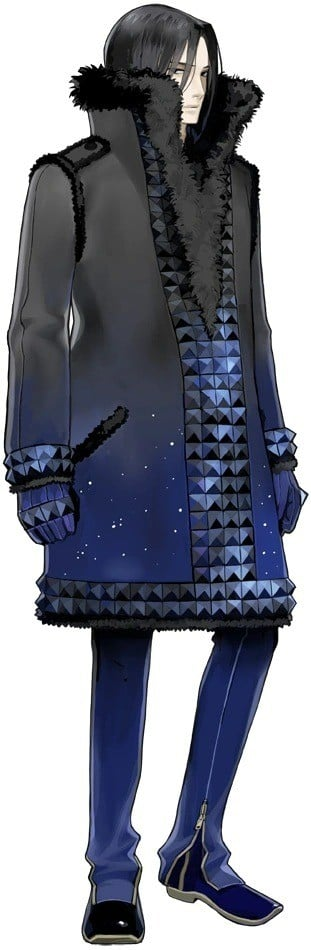
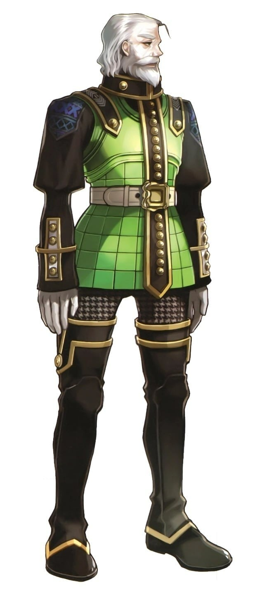
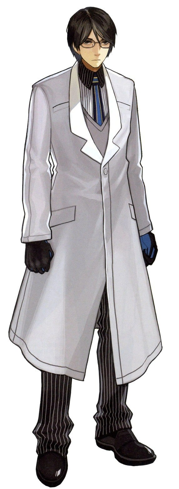
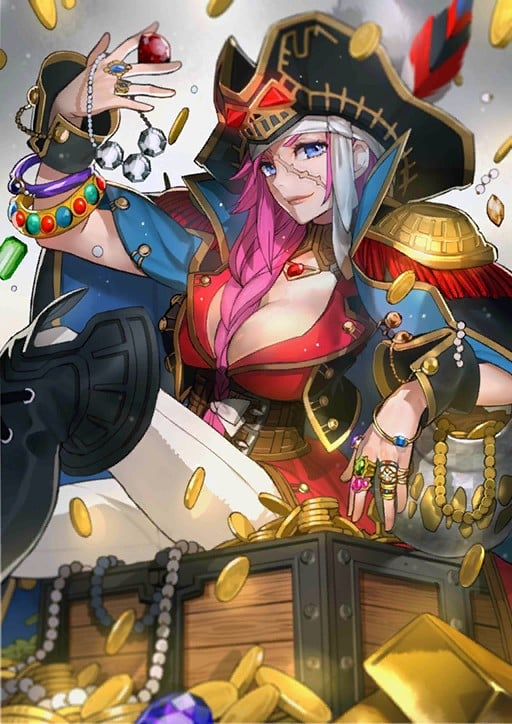

> [!bookinfo|noicon]+ **Fate/EXTRA Last Encore**
> 
>
| 日文名 | Fate/EXTRA Last Encore |
|:------: |:------------------------------------------: |
| 类型 | 游戏改 |
| 新番 | 2018 年 1 月 |
| 集数 | 共13话 |
| 官网 | [http://fate-extra-lastencore.com/](https://http://fate-extra-lastencore.com/) |
| 制作 | SHAFT |
| 导演 |  |
| 脚本 | 奈須きのこ,桜井光,奈須きのこ、桜井光 |
| 评分 | 5.8|
| 制片人 | 網谷一将 |

> [!abstract]+ **简介**
> 那是，在被忘却的月球上开演的“EXTRA”之物语。

存在于月球的，拥有能实现任何愿望之力量的灵子计算机“Mooncell Automaton”。
构筑于Mooncell内部的灵子虚构世界“SE.RA.PH”。
赌上“圣杯”，由魔术师与英灵引发的新的月之圣杯战争，开演。 

> [!tip]+ **章节列表**
>- [ ] 第1话：如今在古老边狱之底 -Preteritus Linbus Vorago- (2018-01-27)
>- [ ] 第2话：死相 -Dead Face- (2018-02-03)
>- [ ] 第3话：黄金鹿与暴风夜 -Golden Wild Hunt- (2018-02-10)
>- [ ] 第4话：无貌之王 -No Face May King- (2018-02-17)
>- [ ] 第5话：祈祷之弓 -Yew Bow- (2018-02-24)
>- [ ] 第6话：永久机关·少女帝国 -Queen's Glass Game- (2018-03-03)
>- [ ] 第7话：献给某人的故事 -Nursery Rhyme- (2018-03-10)
>- [ ] 第8话：无二打 -Dead End- (2018-03-17)
>- [ ] 第9话：邀至心荡神驰的黄金剧场 -Aestus Domus Aurea- (2018-03-24)
>- [ ] 第10话：无限的残骸 -Unlimited／Raise Dead- (2018-03-31)
>- [ ] 第11话：轮转胜利之剑 -Excalibur Gallatin- (2018-07-29)
>- [ ] 第12话：天轮圣王 -Chakravartin- (2018-07-29)
>- [ ] 第13话：喝彩的玫瑰 -Olympia Plaudere- (2018-07-29)

> [!tip]+ **主要角色**
> 
| 角色 | CV | 简介| 角色图片 |
|:----:|:---:|:---:|:--------:|
| エミヤ |  | 与凛订定契约·弓兵的英灵。 经常嘲讽他人的现实主义者，不过与凛之间互相有着坚强的羁绊。 喜欢单独行动，明明是Archer却喜欢近身战，拿手的武器是雌雄双刀－干将莫邪，超人的弓技直到Fate/hollow ataraxia才展现。 他本人自称由于召唤时的事故忘了自己的真身为何，拿手的技术是家事全能，凛曾称赞过他泡的红茶非常好喝。 |  |
| ラニ=VIII | 真田アサミ | 来自于阿特拉斯学院的人造人，以学习人类行为之类为目的参加了圣杯战争。 |  |
| レオナルド・ビスタリオ・ハーウェイ | 朴璐美 | 西欧财阀—哈维财阀的下任盟主。自以为是天命之子的天才少年。 |  |
| ありす | 野中藍 | 凭借着残存的回忆不断地用游戏排解着孤独的小女孩。 |  |
| ユリウス・ベルキスク・ハーウェイ | 羽多野渉 | 月海原学園に赴任してきた教師。 外套も髪の色も漆黒で、全体的に黒を主体とした色調のコーディネートをしている。非常に目つきが冷徹で、会う人会う人に畏怖される。レオの異母兄にあたる。聖杯内に保存されている「葛木宗一郎」のキャラクタープロフィールを書き換え、それを元にアバターを作り、葛木センセイとして赴任してくる。ハーウェイの黒蠍とも呼ばれ、レオの影として様々な人物を暗殺してきた。デザインベビーとして産み落とされたものの、ハーウェイの家では「失敗作」と揶揄され冷遇を受けていたが、義母（レオの母親）、アリシアのみ彼に理解を示していた。そのために精神的に義母に依存している面もある。サーヴァントはアサシン。 歩んできた人生故の執念は、主人公にある種の同情を抱かせることになる。亡霊となった彼との戦いの後、彼とは『友人』となる。 『CCC』ではレオ同様に月の裏側に落とされ、生徒会のサポートを行う。枷が外れたレオや天然すぎるガウェインの行動に頭を悩ませている。サーヴァントは不在。 表の聖杯戦争に敗北して執念で亡霊となっていた所をBBに回収されており、記憶を取り戻すと同時にBBの配下に付いた。しかし、これらの行動は全て彼女を騙すため（及びその裏に居るであろう黒幕を探る為）の芝居であり、虚数空間に落とされた唯一の『友人』を助けるため、自身を犠牲にしながらもサーヴァントへの道を切り開いた。 |  |
| ダン・ブラックモア | 麦人 | 曾经服侍女王的退伍军人，执着地固守着骑士之道的白发绅士。 |  |
| トワイス・H・ピースマン | 東地宏樹 | 通过战争发觉人类命运的狂气科学家的记忆所形成的足以突破自我获得双重身份的天才NPC。 |  |
| フランシス・ドレイク | 高乃麗 | 比男人更男人的女海盗。冒险家兼私掠船长，同时也是舰队司令官。完成了环游世界一周的壮举，并以其收益，为英国开辟了大航海时代霸者之路的人物。此外，还葬送了强大的西班牙无敌舰队，令俗称日不落帝国的西班牙瓦解的“射落太阳的女人”。 不论善恶立场，公平对待的性格。享乐主义者，喜欢华丽的东西。崇尚瞬间的快乐，在私生活与战争方面，都喜爱暴风雨过后寸草不生的样子。喜欢金银财宝，但不喜欢收集，更喜欢散财。 弗朗西斯·德雷克是世上首位活着完成环游世界的伟人。（第一位的麦哲伦在完成中途死去）史实上虽为男性，但在本作中，德雷克以女性形象出现。这是因为周围的人谁都不将德雷克视为女性所致。船员表示「哎呀，如果将船长视为女性的话，我就根本不能算男人了嘛，而且这也是在侮辱船长吧」 刹那快乐主义者，最后迎来的只有华丽陨落的结局。该英灵不执著于生（人生。作为人类的意义、尊严），而是乐见死亡（万人共同迎来的没落）。53岁时，因疫病倒下。死前精神错乱，多有诡异行径，比如在病床上想要穿上铠甲。 |  |
| ロビンフッド | 鳥海浩輔 | 没有容貌，没有名字的侠盗。正如本人所述，该青年是被称为罗宾汉的诸多“某个人”中的一位而已。最原始的传说是出自潜藏于雪伍德森林的侠盗。最起初的罗宾汉与暴君约翰无地王对抗，最后却因为柯克利斯修道院院长的阴谋，失血过多而死。 为获得胜利不择手段，擅长偷袭、暗算、毒箭。轻佻，爱挖苦人，嘴巴很毒，但本性善良。略有些胆小谨慎，为掩饰执着于正义的不成熟的自己，总是表现得十分玩世不恭的别扭家伙。和卫宫性格相似，但因同性相斥，两者关系很不好。 擅长暗杀、扰乱的英灵，同样精通自然毒素。红豆杉也被视为通往冥界的树。祈祷之弓拥有瞬间增幅目标腹部囤积的不净物（毒或病）并使其释放的力量，若对象带有毒，更可令这种毒产生像火药一般爆发的效果。 观点虽然有些矛盾扭曲，但本质上喜爱人类。每当看到愉快的团圆场景，总会在角落偷偷加入其中，最终安于非友人但也非陌生人的立场。此外，由于打从心底为自己战斗与生活方式之卑劣感到内疚，因此绝不会嘲笑他人的努力以及徒劳无功。 |  |
| ネロ・クラウディウス | 丹下桜 | 「仰望朕之艺才！ 聆听这万雷般的喝彩！ 帝国的荣耀就在此处 如花怒放般绽开！ 揭幕吧！招荡的黄金剧场！！」  身穿红色礼装、手持奇异长剑、职阶为剑兵的少女从者。 她外貌与『Fate/stay night』中登场的Saber相似：金发、绿瞳、呆毛、萝莉体型（胸围除外），然则为身份不同的另一人。作为主角可选的Servant之一，红Saber是万能型的新手向英灵。 红Saber被设定为身穿男装的少女，裙子的前摆是半透明式设计，上身的装束也比Saber来得更为大胆。她的武器是自制的红色陨铁长剑“原初之火”，剑身上刻有regnum caelorum et gehenna（拉丁语“天堂与地狱”）之文字；宝具为“招荡的黄金剧场”，效用同于带来绝对支配权的固有结界。红Saber性格外向、善辩、敢爱敢恨，嗜好奢华铺张、自我表现；在面对心爱的对象时则会害羞撒娇，变得百依百顺。性取向是外表美丽即可，男女通吃。她乐意广开后宫，也能包容心爱对象临幸他人。红Saber在剧情中会对主角展开猛烈追求，与远坂凛也有床战的交情。 红Saber的原型是罗马帝国第五任皇帝尼禄，一位身世传奇且恶名昭彰的暴君，宝具来源于其生前建造的黄金剧场。尼禄热爱艺术与表演，自称“比肩阿波罗神的艺术家”，然而才能并未得到普遍认可。尼禄早期励精图治，却因弑母杀妻、逼死恩师、罗马大火、剧场锁门等事件导致风评恶化，又残酷镇压异教势力，迫害贵族及元老，最终引发了叛乱。动乱中尼禄因心虚而误判形势，选择自杀而死。 红Saber拥有EX级别的皇帝特权，原则上可以驾驭任何职阶，但头痛症令她难以使用咒语，又以“骑马坐车会屁股痛”为由拒绝了Rider；听闻Saber是最强的职阶，果断霸占此位降临在EXTRA舞台上。 |  |
| ナーサリー・ライム | 野中藍 | 『童谣是儿歌。拇指汤米的可爱绘本。鹅妈妈的最初形态。寂寞的你，悲伤的我。一同去实现，最后的愿望吧。』 『悲哀而可爱的拇指汤米，长途跋涉辛苦了，但是，冒险已结束啦。因为你即将进梦境。黑夜的帷幕已降临。你的首级也会噗通一声掉地！』 『聪明伶俐，乖张淋漓，离合悲欢，施虐倍还。呆在这里，大家都是单纯的物体。人即为人，鸟则为鸟，这样一切刚刚好。你的名字，那就归我了哦。』  童谣并非实际存在的英雄，而是所有绘本的总称。身高体重是人类形态的数据。 作为深受英国民众喜爱的文学体裁，承载众多孩童梦想，成为了一个概念，作为“孩子们的英雄”，而被从者化。也为著名作家路易斯·卡罗的诞生做了铺垫。 |  |
| 李書文 | 安井邦彦 | 是一位生于近代，却在武术史上刻下无数传奇的中国传说中的武术家。作为八极拳的高手名扬四海，但其枪术造诣之精妙也足以被人誉为「神枪」。 清朝末期，出生于沧州的李书文在修炼八极拳之初，就已经开始崭露头角，直到被称为拳法史上最强为止，比起熟学百艺，选择了精通一门并修炼至极致的他，正如字面一般体现了一击必杀的精髓。 李书文老年时与年轻时不同，是一位稳重的老人。尽管也会使用凶拳，但威力始终被控制在必要最低限度。这是『遏制凶暴性』与『年轻时未曾理解』的平静的境界。但只要能与其一战，就会发现，他那年轻时锐气仍在不断打磨。 李书文具有Lancer、Berserker、以及Assassin的职阶适应性。全盛期的肉体当然是以青年时代作为基准，但他武术方面的全盛期则是在其年过花甲之后，这样的说法也是有的。所以有过青年时期的李书文作为Assassin被召唤，也有老年的李书文作为Lancer被召唤的例子。 |  |