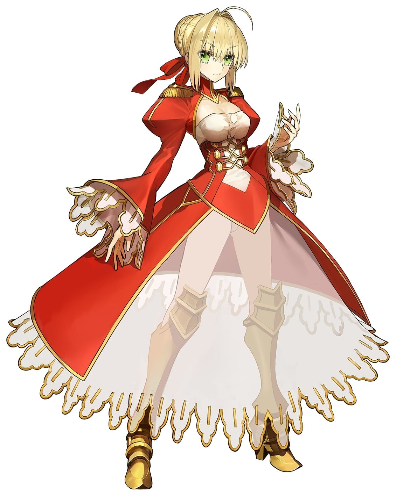
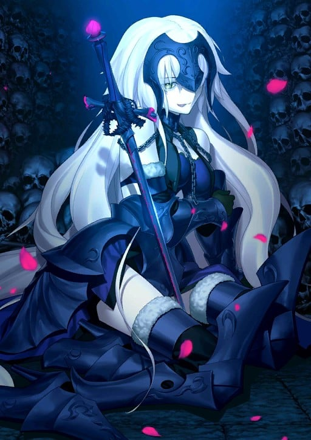
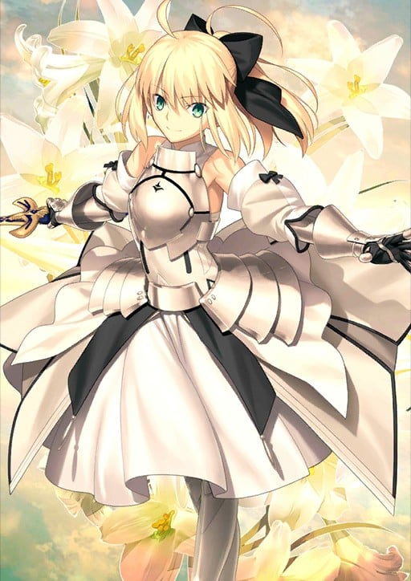
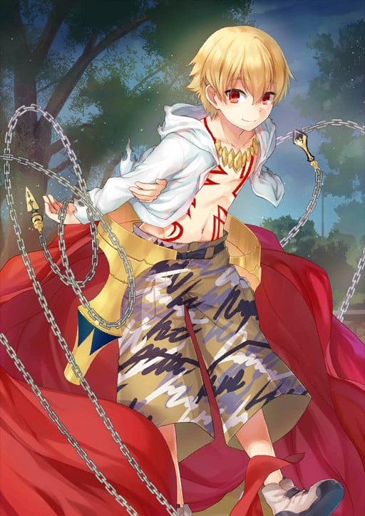

> [!bookinfo|noicon]+ **Fate/Grand Carnival**
> 
>
| 日文名 | Fate/Grand Carnival |
|:------: |:------------------------------------------: |
| 类型 | 游戏改 |
| 新番 | 2021 年 6 月 |
| 集数 | 共4话 |
| 官网 | [https://anime.fate-go.jp/fgc](https://https://anime.fate-go.jp/fgc) |
| 制作 | ラルケ |
| 导演 | 岸誠二 |
| 脚本 | 上江洲誠 |
| 评分 | 7.1|
| 制片人 |  |

> [!abstract]+ **简介**
> 久しぶり、カーニバル！

OVA「Fate/Grand Carnival」1st Season Blu-ray&DVD大好評発売中！
2nd Seasonは10月13日に発売予定！

ともに祝おう！奇跡のカーニバルを！

> [!tip]+ **章节列表**
>- [ ] 第1话：第一季 第一特异盛宴 英灵极限祭典奥林匹亚 (2020-12-31)
>- [ ] 第2话：第一季 第二特异盛宴 夜之特异点歌舞伎町 (2021-06-02)
>- [ ] 第3话：2nd Season 第三特異宴 ザ・ドキュメンタリー 拡がる英霊格差 ～英霊労働基準法～ (2021-10-13)
>- [ ] 第4话：2nd Season 第四特異宴 絆MAXチャンネル (2021-10-13)

> [!tip]+ **主要角色**
> 
| 角色 | CV | 简介| 角色图片 |
|:----:|:---:|:---:|:--------:|
| アルトリア・ペンドラゴン |  | Fate/stay night 被卫宫士郎召唤的英灵。作为三骑士之一的Saber，以「最优秀的剑之骑士」闻名。她曾在第四次圣杯战争中被召唤，当时士郎的养父——卫宫切嗣是她的Master。 她的真实身份是英格兰传说中的英雄——亚瑟王。从石中拔出选王之剑的少女「阿尔托莉雅」，为了成为理想的君主而隐瞒了自己的性别。然而，在内乱中目睹国土荒废的她，认为自己未能胜任王者之位，因此渴望借由圣杯重新选定合格的王，以拯救祖国不列颠。 她拥有不负传说之名的强大力量，但由于与士郎之间缺乏魔力的“通路”，常因魔力不足而陷入苦战。性格极其刻板认真，对于自己是女性的自觉也相当淡薄，以至于一开始总与士郎意见不合。但最终，她在与士郎的相处中肯定了自己的人生，并决心摧毁寄宿着“此世全部之恶”的圣杯。对她而言，能让自己镜像一般的士郎成为Master，或许是再幸运不过的事情了。  Fate/Zero 传说中的骑士王亚瑟现界的身姿，真名是阿尔托莉雅。卫宫切嗣召唤的从者，召唤时所用的圣遗物是Excalibur的剑鞘，她在第四次圣杯战争中保护着作为代理Master的爱丽丝菲尔。 传说中的亚瑟王是男性，那是因为她为了统治方便而隐瞒了性别。拔出选定之剑后身体便不再成长与老化，因此一直是少女的模样。高尚而廉洁、认真而顽固，怀抱的愿望是拯救曾经走上灭亡之路的祖国不列颠。  Fate/Grand Order 不列颠传说中的王。也被誉为骑士王。阿尔托莉雅是幼名，自从当上国王之后，就开始被称为亚瑟王了。在骑士道凋零的时代，手持圣剑，给不列颠带来了短暂的和平与最后的繁荣。史实上虽为男性，但在这个世界内却似乎是男装丽人，行为举止都以男性为标准，因此很不擅长应对异性向自己表达的好感。 崇尚万人眼中正确生活、正确人生的理想王者之一。锄强扶弱，是个无可非议的人物。冷静沉着，无论何时都十分认真的优等生。尽管如此……虽说从不愿意开口承认，但她却有着不服输的一面。对任何需要一争高下的事都不会手下留情，一旦败北则会非常懊悔。 她具有指挥军团的天生才能。在团体战斗中，可令我军的能力提升。贯彻清廉正直，大公无私的王。其公正令骑士们愿意守护于她的身旁，令民众们在对贫困的忍耐中看到了希望。她的王者之路并不是为了统帅少数强者，而是为了领导更多无力之人而存在的。 亚瑟王传说以骑士时代的终结为结局。亚瑟王虽然击退了异民族，但却无法回避不列颠土地的毁灭。圆桌骑士之一·莫德雷德的反叛导致国家一分为二，骑士之城卡美洛也失去了其辉煌。亚瑟王在卡姆兰之丘成功讨伐了莫德雷德，自己却也因负重伤而倒下。在去世前，她将圣剑交给了最后的心腹贝德维尔，离开了这个世界。死后她被送往了理想乡——不存于此世的乐园·阿瓦隆，并打算在遥远的未来再次拯救不列颠。 |  |
| ネロ・クラウディウス |  | 「仰望朕之艺才！ 聆听这万雷般的喝彩！ 帝国的荣耀就在此处 如花怒放般绽开！ 揭幕吧！招荡的黄金剧场！！」  身穿红色礼装、手持奇异长剑、职阶为剑兵的少女从者。 她外貌与『Fate/stay night』中登场的Saber相似：金发、绿瞳、呆毛、萝莉体型（胸围除外），然则为身份不同的另一人。作为主角可选的Servant之一，红Saber是万能型的新手向英灵。 红Saber被设定为身穿男装的少女，裙子的前摆是半透明式设计，上身的装束也比Saber来得更为大胆。她的武器是自制的红色陨铁长剑“原初之火”，剑身上刻有regnum caelorum et gehenna（拉丁语“天堂与地狱”）之文字；宝具为“招荡的黄金剧场”，效用同于带来绝对支配权的固有结界。红Saber性格外向、善辩、敢爱敢恨，嗜好奢华铺张、自我表现；在面对心爱的对象时则会害羞撒娇，变得百依百顺。性取向是外表美丽即可，男女通吃。她乐意广开后宫，也能包容心爱对象临幸他人。红Saber在剧情中会对主角展开猛烈追求，与远坂凛也有床战的交情。 红Saber的原型是罗马帝国第五任皇帝尼禄，一位身世传奇且恶名昭彰的暴君，宝具来源于其生前建造的黄金剧场。尼禄热爱艺术与表演，自称“比肩阿波罗神的艺术家”，然而才能并未得到普遍认可。尼禄早期励精图治，却因弑母杀妻、逼死恩师、罗马大火、剧场锁门等事件导致风评恶化，又残酷镇压异教势力，迫害贵族及元老，最终引发了叛乱。动乱中尼禄因心虚而误判形势，选择自杀而死。 红Saber拥有EX级别的皇帝特权，原则上可以驾驭任何职阶，但头痛症令她难以使用咒语，又以“骑马坐车会屁股痛”为由拒绝了Rider；听闻Saber是最强的职阶，果断霸占此位降临在EXTRA舞台上。 |  |
| ジャンヌ・ダルク |  | 筋力B 耐久B 敏捷A 魔力A 幸运C 宝具A++  对魔力：EX 启示：A 领导力：C 圣人：B  宝具：  主与我同在（Luminosite Eternelle）A  红莲之圣女（La Pucelle）EX                                           原型为法国军事家、天主教圣人、领导法兰西逆转百年战争局势的少女英雄。作为被圣杯战争本身所召唤的英灵，有着管理圣杯战争的职责。因此，她和其他Servant不同，会继承不断重覆的圣杯战争中的记忆。  以调整者身份登场时，沉默寡言而冷静。另一方面，本性是个素朴又温顺的16岁女子。虽然将规则放在第一位，为了守护秩序而挥剑，但基本上，她重视全部参与圣杯战争的人类和英灵。  虽然担当Ruler的职介，但本身是作为潜在的Saber而存在，因此兼具两种职介的特长。一方面能够随时探知附近全部英灵的真名、存在与现况，另一方面，具有高超的对魔力。不过因为是教会的圣人，因此对魔力对于基督教神术无效。 |  |
| マシュ・キリエライト | 高橋李依 | 登场于Fate/Grand Order, 源于Fate/stay night最初设定的, 持有巨大盾牌的迷之少女。  Chaldea局的成员，玛修·基列莱特与Servant凭依融合的姿态。被称作Demi Servant。Demi Servant持有的特殊技能。能将凭依的英灵持有的技能仅仅一个继承下来，并升华为自我的流派。玛修的场合是“魔力防御”。与魔力放出同类型的技能，将魔力直接变换为防御力。如果是持有庞大魔力的英灵的话，那将会是连一个国家都能守护的神圣壁垒吧。玛修得知了凭依于自身的英灵的真名。那个骑士的名字叫加拉哈德。存在于亚瑟王传说中的圆桌骑士的一人。唯一一个入手了圣杯，随后返回了天堂的圣者。Chaldea能够用独自的方法成功完成英灵召唤，作为其基础的是作为加拉哈德召唤的触媒的“英雄们集结的场所”——也就是玛修所持有的，利用圆桌制成的盾牌。  宝具简介『如今仍是遥远的理想之城』 等级:B+++  种类:对恶宝具 Lord・Camelot 英灵・加拉哈德持有的宝具。白亚之城卡美洛的中心，使用圆桌骑士们的圆桌为盾的究极的守护。强度根据使用者的精神程度，内心绝不屈服的话城壁绝对不会崩溃。 将之冠以Chaldea之名向来是由存在于玛修心底的祈愿，“守望人类的未来”而来吧。 |  |
| 藤丸立香 | 関根明良 | 人理継続保障機関(カルデア)のマスター候補の1人だが、数合わせとして呼ばれた「素人」。人類史を正すため、英霊召喚システム「フェイト」を使ってサーヴァントを召喚し、7つの聖杯探索(グランドオーダー)を巡ることになる。 |  |
| ジャンヌ・ダルク〔オルタ〕 |  | 　　虽然被称呼为Alter，但并不能说她是贞德的另一面。 　　而是叹惋贞德之死的法军元帅，吉尔・德・雷利用圣杯虚构出的，复仇的贞德。 　　作为与原本的贞德完全相反的英灵，以Avenger职阶现界。 　　原本的贞德并不是英雄而是圣女，因此绝无“以另一面召唤”的可能性。 　　这位黑色圣女是其根本性部分将吉尔・德・雷的愤怒……偏见以及希望会如此的愿望……混入其中，从而造就出的原本不该出现的“另一面”。 　　向法国复仇的龙之魔女。 　　（法国贵族）旁若无人地夸耀着所谓的正义，人们却对此深信不疑——被对人们的愤怒所驱使的圣女才是，吉尔・德・雷所盼望的她的姿态。 |  |
| アルトリア・ペンドラゴン〔リリィ〕 |  | 拔出了选定之剑Caliburn，刚开始踏上王之道路的阿尔托莉雅的模样。还是个不成熟的少女骑士。其容貌宛若惹人怜爱的百合，此外，其眼瞳中充满着闪烁的希望。她为了积累更多的经验遍历国境，留下了诸多冒险传说。被她搭救的人们似乎纷纷称颂这华美的少女为骑士姬。 虽然王者修行很艰苦，但只要能照顾马就是一种幸福。为了成为理想的王而日夜钻研的浪漫骑士。由于尚未成熟，还无法拭去少女的稚嫩，其内心充满了梦想与希望。漫游诸国时，队伍内有她的义兄凯及随同的魔术师梅林，所有的问题基本都是由阿尔托莉雅的多管闲事开的头，而梅林的嘲讽将事情闹大，最后由凯负责收拾残局。 为了拯救神秘淡去且逐渐走向毁灭的不列颠岛的命运之子。是在先代王尤瑟与魔术师梅林的计划下，被创造的『龙的化身』。也因此被比喻成守护不列颠的红龙。拥有隶属幻想种最高位的龙之心脏，可在体内生成的魔力量远凌驾其他英灵。 Caliburn与Excalibur是不同的圣剑。Caliburn也就是王权，为了将亚瑟王培养成一名王的存在。Caliburn原本是仪式用剑。若将其用作武器，一旦解放真名，甚至能发挥Excalibur同规模的威力，然而其剑身并不能承受阿尔托莉雅的魔力，想必会崩溃吧。 |  |
| 子ギル | 遠藤綾 | 乌鲁克的英雄王。人类最古老的英雄。性格冷酷无情。不听他人的意见，只以自己基准为绝对标准的暴君——的这种性质，并不能适用于这个模样的他。他基本还是名彬彬有礼而谦虚的少年。 喜欢的女性是「犹如盛开于野外的鲜花」类。 |  |
| シトナイ | 門脇舞以 | 『Fate/Grand Order』第2部『Cosmos in the Lostbelt』に登場するアルターエゴのサーヴァント。  主人公がかつて会ったことがある魔法少女とは違う世界の、アインツベルンのイリヤを基にした疑似サーヴァントにしてハイ・サーヴァント。 |  |