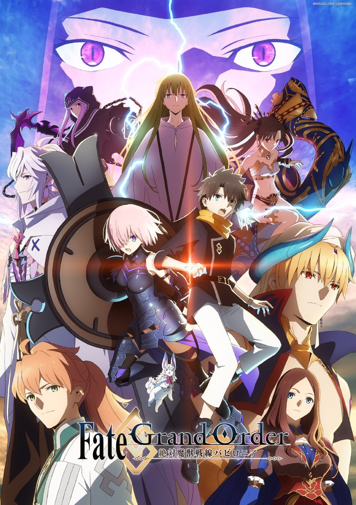
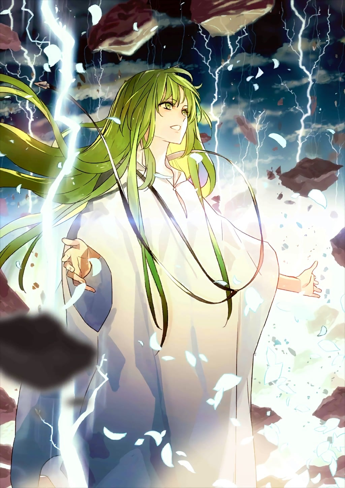
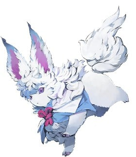
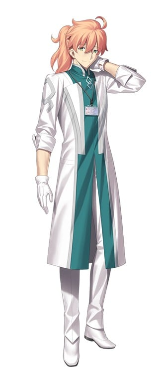
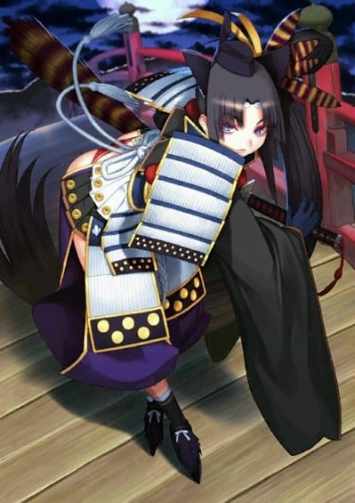
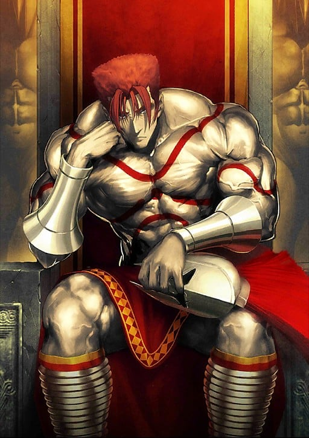
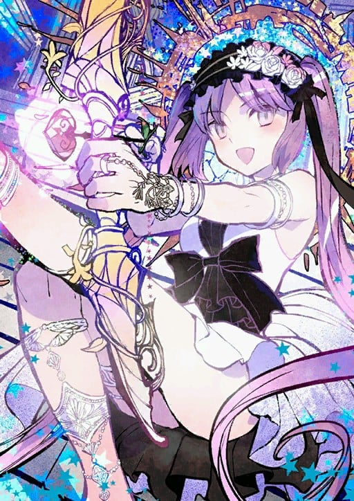
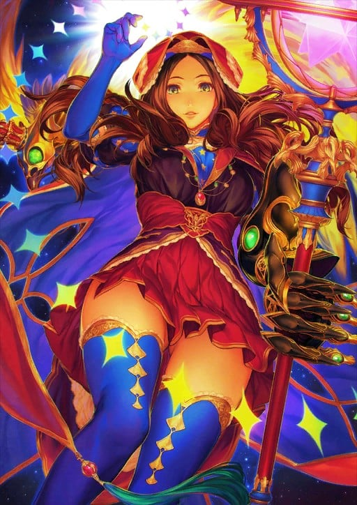
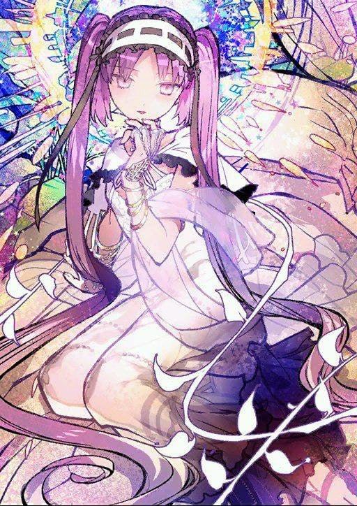
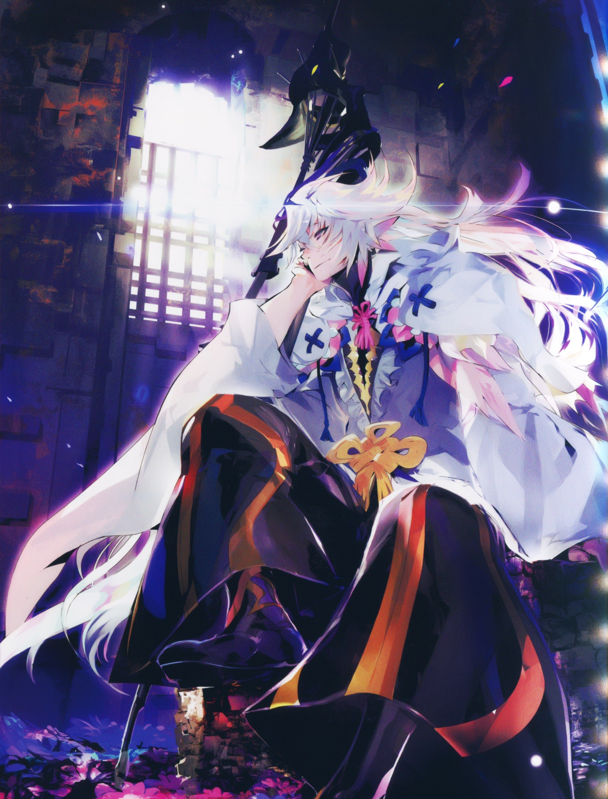

> [!bookinfo|noicon]+ **Fate/Grand Order -绝对魔兽战线巴比伦尼亚-**
> 
>
| 日文名 | Fate/Grand Order -絶対魔獣戦線バビロニア- |
|:------: |:------------------------------------------: |
| 类型 | 游戏改 |
| 新番 | 2019 年 10 月 |
| 集数 | 共21话 |
| 官网 | [https://anime.fate-go.jp/ep7-tv](https://https://anime.fate-go.jp/ep7-tv) |
| 制作 | CloverWorks |
| 导演 | 赤井俊文 |
| 脚本 | 東出祐一郎,桜井光,小太刀右京,永井千晶,武井風太,武井風太、小太刀右京、永井千晶、東出祐一郎、桜井光 |
| 评分 | 6.8|
| 制片人 | 福島祐一 |

> [!abstract]+ **简介**
> 人理续存保障机构·迦勒底，对于仅凭魔术无法看见的世界，仅凭科学无法计算的世界进行观测，为了让已被证明会灭亡于2017年的人类史存续下去，日夜持续着活动。
人类灭亡的原因，是在历史上数个地点突然出现的“无法观测领域”——“特异点”。
迦勒底唯一残存的御主·藤丸立香，与亚从者玛修·基列莱特一同介入这些特异点的事象，从而执行将其解明或破坏的禁断仪式——“圣杯探索Grand Order”。
这一次新发现的是第七个特异点——纪元前2655年的古代美索不达米亚。由结束了不老不死灵草的探索的“天之楔·贤王吉尔伽美什”所统治，以繁荣而自豪的乌鲁克之地，在三柱女神及众多魔兽的蹂躏下面临灭亡的危机。以及，通过前往过去的时间旅行——“灵子转移”而到达乌鲁克之地的藤丸与玛修，所遇到的是阻挡住魔兽猛攻的要塞都市·绝对魔兽战线，以及人们那即使暴露于威胁之下仍然拼命求生的样子。袭来的诸神与魔兽。以及对其反抗的人类——。
这里是人与神分道扬镳，命运的时代。跨越了六个探索Order的两人——藤丸与玛修所挑战的最后一战开始了。

> [!tip]+ **章节列表**
>- [ ] 第1话：绝对魔兽战线 巴比伦尼亚 (2019-10-05)
>- [ ] 第2话：城塞都市乌鲁克 (2019-10-12)
>- [ ] 第3话：王与民 (2019-10-19)
>- [ ] 第4话：密林的呼唤 (2019-10-26)
>- [ ] 第5话：吉尔伽美什纪行 (2019-11-02)
>- [ ] 第6话：天命泥板 (2019-11-09)
>- [ ] 第7话：声东击西作战 (2019-11-16)
>- [ ] 第8话：魔兽母神 (2019-11-23)
>- [ ] 第9话：早安、金星女神 (2019-11-30)
>- [ ] 第10话：你好、太阳女神 (2019-12-07)
>- [ ] 第11话：太阳神殿 (2019-12-14)
>- [ ] 第12话：王之死 (2020-01-04)
>- [ ] 第13话：再见、冥界女神 (2020-01-11)
>- [ ] 第14话：决战 (2020-01-18)
>- [ ] 第15话：新人类的形态 (2020-01-25)
>- [ ] 第16话：觉醒 (2020-02-08)
>- [ ] 第17话：国会舞曲 (2020-02-15)
>- [ ] 第18话：起源之星、仰望星空 (2020-02-22)
>- [ ] 第19话：绝对魔兽战线美索不达米亚 I (2020-03-07)
>- [ ] 第20话：绝对魔兽战线美索不达米亚 II (2020-03-14)
>- [ ] 第21话：冠位指定 (2020-03-21)
>- [ ] 第0话：旅途的开始 (2019-08-04)
>- [ ] 第11.51话：总集篇I 旅途的开始 (2019-12-21)
>- [ ] 第11.52话：总集篇II 灵魂的战斗 (2019-12-28)
>- [ ] 第15.5话：总集篇III 决战 (2020-02-01)
>- [ ] 第18.5话：Fate Project 2020 英国英灵纪行~特別篇~ (2020-02-29)
>- [ ] 第0话：PV1 (2018-07-29)

> [!tip]+ **主要角色**
> 
| 角色 | CV | 简介| 角色图片 |
|:----:|:---:|:---:|:--------:|
| ギルガメッシュ | 関智一 | 号称拥有最强宝具的Servant，将其他所有人都蔑称为“杂种”的傲慢的王者。其真身乃是人类最古老的英灵——英雄王吉尔伽美什。 |  |
| マシュ・キリエライト | 高橋李依 | 登场于Fate/Grand Order, 源于Fate/stay night最初设定的, 持有巨大盾牌的迷之少女。  Chaldea局的成员，玛修·基列莱特与Servant凭依融合的姿态。被称作Demi Servant。Demi Servant持有的特殊技能。能将凭依的英灵持有的技能仅仅一个继承下来，并升华为自我的流派。玛修的场合是“魔力防御”。与魔力放出同类型的技能，将魔力直接变换为防御力。如果是持有庞大魔力的英灵的话，那将会是连一个国家都能守护的神圣壁垒吧。玛修得知了凭依于自身的英灵的真名。那个骑士的名字叫加拉哈德。存在于亚瑟王传说中的圆桌骑士的一人。唯一一个入手了圣杯，随后返回了天堂的圣者。Chaldea能够用独自的方法成功完成英灵召唤，作为其基础的是作为加拉哈德召唤的触媒的“英雄们集结的场所”——也就是玛修所持有的，利用圆桌制成的盾牌。  宝具简介『如今仍是遥远的理想之城』 等级:B+++  种类:对恶宝具 Lord・Camelot 英灵・加拉哈德持有的宝具。白亚之城卡美洛的中心，使用圆桌骑士们的圆桌为盾的究极的守护。强度根据使用者的精神程度，内心绝不屈服的话城壁绝对不会崩溃。 将之冠以Chaldea之名向来是由存在于玛修心底的祈愿，“守望人类的未来”而来吧。 |  |
| エルキドゥ | 小林ゆう | 安定的语调，温和的举止，却具备了难以想象超强战斗能力的“拥有意识的宝具”。曾被英雄王吉尔伽美什誉为最强之人，连接天与地之锁。既是由众神之手所造的人偶，亦是自然与调和一体化的大地分身。作为英雄王唯一的友人，曾与其经历许多冒险，获得人之心之后，却最终以人偶之躯归于尘土的可悲兵器。 吉尔伽美什史诗中描述的最古老英雄之一。由诸神创造而出的兵器。原本是诸神创造而出的“能变形成任何东西的粘土工艺品”。能根据状况随心所欲改变形态。全身等同于诸神的武器。只不过不具备人类那样的精神与感情，起初与野兽几乎没什么差别。据说在显现于地上之后，由于遇见了一位圣妓，获得了诸多认知，才终于选择了人类的形态（作为基本形态）。这姿态是因为尊重那位圣妓，而模仿她的结果。 战斗力与英雄王吉尔伽美什全盛期几乎等同。在史诗中描述的与吉尔伽美什的一战中，他发挥出了与被誉为人类史最强英雄之一的他不相上下的性能。是孤傲的吉尔伽美什王首次选出的朋友，他自身也将吉尔伽美什视为独一无二的朋友。在乌鲁克市的战斗后，成为了朋友的吉尔伽美什与恩奇都经历了众多冒险，最终在与神兽古伽兰那的战斗后殒命。 内向、主动、强势。平时犹如美丽的花朵般伫立，但一旦行动，却会成为不等人、不留情、不自重的可怕活跃怪物。人类也是地球上的生命，所以是“喜欢”的对象，但人类会基于知性将自然与自己划分着考虑，因此不是很愿意拥护。动物、植物身上有与自己相近的感觉，因此大多数行动都是为了保护它们。不过由于原本就好奇心（求知欲）强烈，所以恩奇都很喜欢与人类对话。如果这个人具备讨人喜欢的性格（充满博爱精神，全体主义者，但依然最优先自己）的话，会由衷表示敬爱与敬佩，乐于作为朋友支持对方。 |  |
| フォウ | 川澄綾子 | マシュとともに主人公と出会う、愛らしい動物。カルデアの中を自由に散歩しているようだ。 |  |
| ロマニ・アーキマン | 鈴村健一 | 「人理継続保障機関（カルデア）」に所属する青年医師。カルデアの医療担当のトップを預かる人物。 周囲からは呼びにくい名前のせいか“Dr.ロマン”とも呼ばれ、当人も存外気に入っている。 主人公とはプロローグにて、主人公の自室になる予定の部屋で仕事をサボっている現場に出くわすという、色々と残念な出会い方をしてる。 その後カルデアが破壊工作に遭い、主人公とマシュ・キリエライトが2004年の特異点となった冬木市に飛ばされた際、唯一カルデアでの被害を免れて動くことが出来たため、以後物語では彼らのサポートに回ることになった。 |  |
| 牛若丸 | 早見沙織 | 在日本无人不知无人不晓的著名悲剧武将。天赋异禀，有着过人的领袖气质，然而却遭到了兄长赖朝的疏远，最后与随从弁庆一起被打败。牛若丸是源义经的乳名。 牛若丸（源义经）足以称为日本史上最有名的武将。以知名度而言，只有织田信长可以与她媲美了吧。……然而，关于她的历史存在很多不明确的要素，尤其是起兵前的前半生完全是个谜。 十一岁时，被寄养在鞍马寺的牛若丸，遇到了阴阳师鬼一法眼，并因此被传授了兵法（另有说法称此人是鞍马天狗）。义经无疑是个优秀的兵法家，但也欠缺了致命的要素。那就是对战场的恐惧。她一生都与其他武将水火不容。赖朝竟会对义经心怀杀意的原因，她想必终生都没能理解吧。对天才的她而言，根本无法体会对于能力的恐惧。 |  |
| レオニダス一世 | 三木眞一郎 | 身为斯巴达之王，统领着这个催生了“斯巴达教育”一词的国家。因在温泉关战役中，用区区三百人，挡下了入侵的十万波斯大军而名扬天下。 列奥尼达虽然贵为斯巴达的王，不过由于斯巴达这个国家，基本已经成了盛产「无脑肌肉」的土地，所以施政的难度极高。 |  |
| エウリュアレー |  | 希腊神话中戈耳工三姊妹的次女。男性憧憬的体现，作为完成的「偶像」，以及「理想少女」而诞生于世的女神。仿佛无瑕与纯真拥有了具体形态般的美丽少女。姐姐是斯忒诺，妹妹是美杜莎。 无条件喜爱漂亮、可爱的东西。无条件厌恶丑陋的存在。极度爱撒娇，令男人神魂颠倒的「可爱少女」。起码表面看上去是这样—— 实际上虽然确实具备无瑕与纯真的特质，但更进一步说，其实她的性格严重阴晴不定，也具有狡猾的一面。主张只要保持沉默就不会惹恼别人，只要不被识破就不算作弊。（当然事后会陷入自责） 古代希腊神祗之一，原本不可能作为英灵被召唤。而作为获得了永恒的美貌的代价，成为了这世间最弱的存在……本应是这样一名女神，但随着英灵化，还是获得了些许强化。 表面对御主露出充满了好感的微笑，然而实际上，她只是想愉快地观赏其走向毁灭的过程而已。毕竟好不容易才遇见了久违的人类，一定要好好在一旁观察其痛苦的样子—— |  |
| レオナルド・ダ・ヴィンチ | 坂本真綾 | 被誉为万能的天才。十五～十六世纪欧洲的人物。对文明发展造成了大量影响，留名于人类史的屈指可数的天才。记录说他曾是绝世美少年、绝世美青年，但实际情况却是现在这样。在真正的天才面前，性别和年龄都没有关系。主义以及流行会随着时代而改变，但真相只有一个。无论什么情况，他都是万能无敌的达·芬奇亲！ 正因为是睿智伟人，才被赐予了Caster的职阶……其实并非如此。生前他／她就是个强大的魔术师。这没什么好奇怪的。只是除了科学、数学、工学、博物学、音乐、建筑、雕刻、绘画、发明、兵器开发等以外，也具备魔术才能而已。  被迦勒底召唤的英灵第三号。在英灵召唤系统·命运尚未完成时召唤的从者。由于系统不安定，据说本打算当即离去，但听说了迦勒底的情况，产生了兴趣，并被罗玛尼·阿其曼说服，选择留在了迦勒底。达·芬奇亲制作了自己的复制人偶，并声称这就是自己的御主，得以留在现世。做的这事和某位人偶师没什么两样。 达·芬奇亲是通过所谓的「伪装契约」留在现世的欺诈从者。只要通过召唤，获得正规的御主，才能真正成为「上前线战斗」的从者。话虽如此，两者间也不会是普通的契约关系。达·芬奇亲将御主视为「学生」，而自己则以「老师」自居。比起「伟大的导师」，他更有一种「和学生年龄相近的教师」的亲近感。 |  |
| ステンノ |  | 希腊神话中戈耳工三姊妹的长女。男性所有的憧憬的具现化存在，作为完成的「偶像」以及「理想女性」而诞生的女神。犹如优雅与高贵的代名词的美丽女性。有尤瑞艾莉、美杜莎两位妹妹。 无论面对怎样的男性，都会夸奖吹捧对方。虽说具备了优雅与高贵，但更进一步来说，其实也有很怕麻烦的性质。对那些无关紧要的对手则表现得极为冷酷。甚至能令冥府（塔耳塔罗斯）的守门犬吓得发抖。 一有鸡毛蒜皮的小事，就会和另一个自己（尤瑞艾莉）一起，欺负妹妹（美杜莎），但其实是很喜欢她的。——很爱她。由衷地。死后依然。 |  |
| マーリン | 櫻井孝宏 | 乐园的流浪者。亚瑟王传说中登场的宫廷魔术师兼导师、预言者。面对想要跨越众多敌人与困难的亚瑟王，他时而引导，时而增添烦恼，时而出手相助。但虽说是贤人，本质上也依然不是人类。毕竟他是梦魔与人类的混血。 传说母亲是威尔士的公主，但父亲却是月与大地间诞生的超自然梦魔。据说年轻时候就已经做出了许多预言。其中令梅林声名远播的预言，是说中了艾利尔山地下沉睡着红龙与白龙的存在后，还描述了觉醒了的红龙与白龙相互争斗的场面。作为梅林预言流传后世的这段话中，红龙指的是不列颠，白龙指的是撒克逊，在伟大王者的领导下，不列颠将集结力量，并打倒高卢与罗马的吧——内容就是这样。除此以外，他还留下了诸多预言，其中甚至还有关于战争与王之死的内容。 梅林帮助亚瑟的父亲尤瑟·潘德拉贡迎娶了王妃，从亚瑟王诞生前就一直守护在旁，根据传说，他教导了年幼的亚瑟很多知识，犹如见证其成长的养父般的存在。 犹如吹拂于草原上的风一般的青年。只要在他的面前，任何人都会松懈下来。是个飒爽且正义的人。但看上去欠缺紧张感和责任感，因此有时会令人觉得他是个可疑的诈骗犯。是个虽然能客观认识事物，承认人类世界十分残酷，但依然能用一句『但这样就没意思了吧？』将气氛活跃起来的能言善道之士。 喜欢人类的世界，喜欢恶作剧，喜欢女性。是能用「好啦好啦」与飒爽笑容对大多数情况予以反击的花之魔术师。看上去是那种没有任何烦恼的完美乐天人格，但梅林自己很清楚自己在人类社会中属于异物，所以始终不会破坏最后一步……也就是名为好友的壁垒。为了最后，人类能迎来完美的结局，日夜守护着。 拥有卓越的千里眼，虽然预见了圆桌的崩溃与不列颠的危机，却没有告知亚瑟王，离开了不列颠。关于梅林为何没将命运告知亚瑟王的问题，诸说纷纭，但据说这或许是因为他不会偏袒任何个人，只爱着命运本身的缘故。之后，梅林来到了理想乡阿瓦隆，在那里，他将自己幽禁在了『塔』中。此后也因无法死去，始终见证着人类世界，直到世界终结为止。……这似乎可以说是带着好玩的心情干涉了某位少女命运的愚蠢男人的末路。 |  |
| 藤丸立香 | 島﨑信長 | 人理継続保障機関(カルデア)のマスター候補の1人だが、数合わせとして呼ばれた「素人」。人類史を正すため、英霊召喚システム「フェイト」を使ってサーヴァントを召喚し、7つの聖杯探索(グランドオーダー)を巡ることになる。 |  |