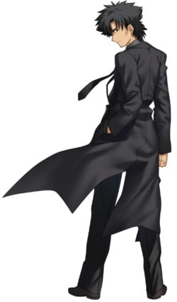
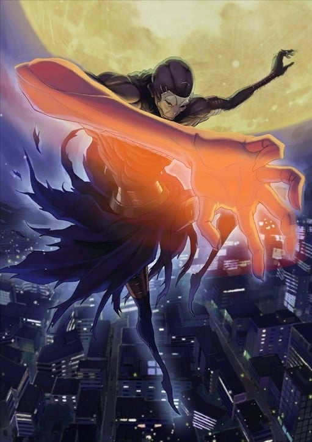
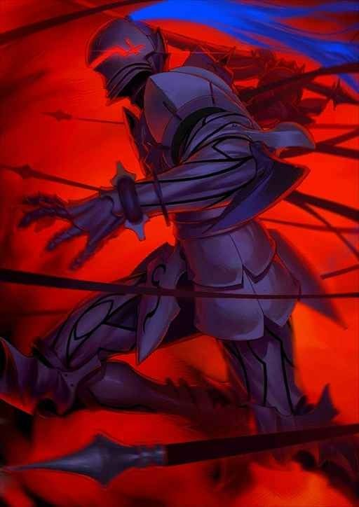
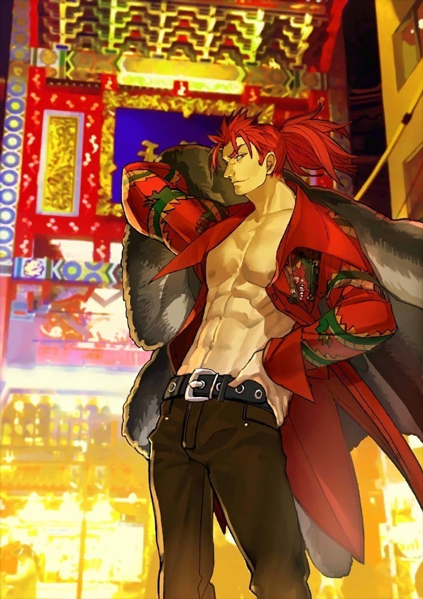

> [!bookinfo|noicon]+ **Fate/Grand Order 藤丸立香想不明白**
> 
>
| 日文名 | Fate/Grand Order 藤丸立香はわからない |
|:------: |:------------------------------------------: |
| 类型 | 漫改 |
| 新番 | 2023 年 2 月 |
| 集数 | 共33话 |
| 官网 | [https://anime.fate-go.jp/nazomaru/](https://https://anime.fate-go.jp/nazomaru/) |
| 制作 | DLE |
| 导演 | 槌田 |
| 脚本 | 槌田 |
| 评分 | 6.9|
| 制片人 |  |

> [!abstract]+ **简介**
> TYPE-MOON コミックエースにて連載中のマンガ「Fate/Grand Order 藤丸立香はわからない」（漫画：槌田／原作：TYPE-MOON）が著者・槌田＆スタジオDLEによって、まさかのショートアニメ化！

人類最後のマスター「藤丸立香」。
彼なくしては人理修復することはできなかっただろう。
しかし、そんな彼にも欠点があった…。
それは、素直すぎること！
コミックのシュール感をそのままに、藤丸の素朴な疑問に英霊たちが振り回される
新感覚FGOショートギャグアニメが、2022年末のFate Project 大晦日TVスペシャル2022での
放送をきっかけに2023年にショートアニメシリーズ化が決定！

乞うご期待！！

※本作は「Fate/Grand Order」第2部のネタバレを含んでいます

> [!tip]+ **章节列表**
>- [ ] 第1话：突然昏睡的理由是… (2023-02-04)
>- [ ] 第2话：睿智的结晶材质是… (2023-02-04)
>- [ ] 第3话：你的口味是… (2023-02-07)
>- [ ] 第4话：米饭的吃法是… (2023-02-14)
>- [ ] 第5话：全体攻击的代价是… (2023-02-21)
>- [ ] 第6话：整理仓库的方法是... (2023-02-28)
>- [ ] 第7话：箱子里的是... (2023-03-07)
>- [ ] 第8话：无法切开的东西是... (2023-03-14)
>- [ ] 第9话：最想说的话是… (2023-03-21)
>- [ ] 第10话：芙芙的本体是… (2023-03-26)
>- [ ] 第11话：船长脑子里想的是... (2023-03-28)
>- [ ] 第12话：写报告最重要的是... (2023-04-04)
>- [ ] 第13话：咒腕真正的价值是... (2023-04-11)
>- [ ] 第14话：强化船需要的是... (2023-04-18)
>- [ ] 第15话：能超越金羊毛的东西是… (2023-04-25)
>- [ ] 第16话：最合适的礼装是… (2023-05-02)
>- [ ] 第17话：你的外号是… (2023-05-09)
>- [ ] 第18话：视线前方的东西是… (2023-05-16)
>- [ ] 第19话：梦到的东西是... (2023-05-23)
>- [ ] 第20话：在紧急情况时该做的是… (2023-05-30)
>- [ ] 第21话：预防感染的对策是… (2023-06-06)
>- [ ] 第22话：改变主意的理由是… (2023-06-13)
>- [ ] 第23话：银之臂的实力是… (2023-06-20)
>- [ ] 第24话：操控不流畅的原因是… (2023-06-27)
>- [ ] 第25话：正确使用令咒的方法是... (2023-07-04)
>- [ ] 第26话：我的后辈是... (2023-07-11)
>- [ ] 第27话：躲起来的情绪是…… (2023-07-18)
>- [ ] 第28话：想传达的想法是… (2023-07-25)
>- [ ] 第29话：恶属性的精髓是... (2023-07-29)
>- [ ] 第30话：夏天的回忆是... (2023-07-29)
>- [ ] 第31话：ジェットスキーの乗り方は… (2023-07-30)
>- [ ] 第32话：事件の真相は… (2023-07-30)
>- [ ] 第33话：聖杯に願うことは… (2023-07-30)
>- [ ] 第1话：年末特番 (2022-12-31)

> [!tip]+ **主要角色**
> 
| 角色 | CV | 简介| 角色图片 |
|:----:|:---:|:---:|:--------:|
| アルトリア・ペンドラゴン | 川澄綾子 | Fate/stay night 被卫宫士郎召唤的英灵。作为三骑士之一的Saber，以「最优秀的剑之骑士」闻名。她曾在第四次圣杯战争中被召唤，当时士郎的养父——卫宫切嗣是她的Master。 她的真实身份是英格兰传说中的英雄——亚瑟王。从石中拔出选王之剑的少女「阿尔托莉雅」，为了成为理想的君主而隐瞒了自己的性别。然而，在内乱中目睹国土荒废的她，认为自己未能胜任王者之位，因此渴望借由圣杯重新选定合格的王，以拯救祖国不列颠。 她拥有不负传说之名的强大力量，但由于与士郎之间缺乏魔力的“通路”，常因魔力不足而陷入苦战。性格极其刻板认真，对于自己是女性的自觉也相当淡薄，以至于一开始总与士郎意见不合。但最终，她在与士郎的相处中肯定了自己的人生，并决心摧毁寄宿着“此世全部之恶”的圣杯。对她而言，能让自己镜像一般的士郎成为Master，或许是再幸运不过的事情了。  Fate/Zero 传说中的骑士王亚瑟现界的身姿，真名是阿尔托莉雅。卫宫切嗣召唤的从者，召唤时所用的圣遗物是Excalibur的剑鞘，她在第四次圣杯战争中保护着作为代理Master的爱丽丝菲尔。 传说中的亚瑟王是男性，那是因为她为了统治方便而隐瞒了性别。拔出选定之剑后身体便不再成长与老化，因此一直是少女的模样。高尚而廉洁、认真而顽固，怀抱的愿望是拯救曾经走上灭亡之路的祖国不列颠。  Fate/Grand Order 不列颠传说中的王。也被誉为骑士王。阿尔托莉雅是幼名，自从当上国王之后，就开始被称为亚瑟王了。在骑士道凋零的时代，手持圣剑，给不列颠带来了短暂的和平与最后的繁荣。史实上虽为男性，但在这个世界内却似乎是男装丽人，行为举止都以男性为标准，因此很不擅长应对异性向自己表达的好感。 崇尚万人眼中正确生活、正确人生的理想王者之一。锄强扶弱，是个无可非议的人物。冷静沉着，无论何时都十分认真的优等生。尽管如此……虽说从不愿意开口承认，但她却有着不服输的一面。对任何需要一争高下的事都不会手下留情，一旦败北则会非常懊悔。 她具有指挥军团的天生才能。在团体战斗中，可令我军的能力提升。贯彻清廉正直，大公无私的王。其公正令骑士们愿意守护于她的身旁，令民众们在对贫困的忍耐中看到了希望。她的王者之路并不是为了统帅少数强者，而是为了领导更多无力之人而存在的。 亚瑟王传说以骑士时代的终结为结局。亚瑟王虽然击退了异民族，但却无法回避不列颠土地的毁灭。圆桌骑士之一·莫德雷德的反叛导致国家一分为二，骑士之城卡美洛也失去了其辉煌。亚瑟王在卡姆兰之丘成功讨伐了莫德雷德，自己却也因负重伤而倒下。在去世前，她将圣剑交给了最后的心腹贝德维尔，离开了这个世界。死后她被送往了理想乡——不存于此世的乐园·阿瓦隆，并打算在遥远的未来再次拯救不列颠。 |  |
| エミヤ | 諏訪部順一 | 与凛订定契约·弓兵的英灵。 经常嘲讽他人的现实主义者，不过与凛之间互相有着坚强的羁绊。 喜欢单独行动，明明是Archer却喜欢近身战，拿手的武器是雌雄双刀－干将莫邪，超人的弓技直到Fate/hollow ataraxia才展现。 他本人自称由于召唤时的事故忘了自己的真身为何，拿手的技术是家事全能，凛曾称赞过他泡的红茶非常好喝。 |  |
| メディア | 田中敦子 | 魔术师的英灵。 能够使用自神话时代以后就不存在的高等魔术。 并以柳洞寺当作根据地，擅长策略。 真实身份为美狄亚（Medea），在希腊神话中是以背叛和欺骗闻名的女巫，宝具是“破尽万法之符（Rule Breaker）”，可破除所有魔术效果的短刀，可以将被魔力强化的物体、以契约连起的关系以及用魔力制造的生命回复到“施术之前”的状态。 因自身也是魔术师的关系所以能召唤从者，因此她利用了这个规则漏洞召唤了Assassin。 |  |
| 衛宮切嗣 | 小山力也 | Fate/Zero 中Saber的Master。 被外界称为“魔术师杀手”。觉得魔术与机械一样 ，只是一种达成目标的手段 。 代表爱因兹贝伦一族出战，为了自身坚信的正义可变得冷酷无情，对目标贯彻到底不择手段，能使用“固有时制御”此高等魔术。经常因为自身理想和行动有所出入而气愤。具有火与土的双重属性。 深爱著自己的妻子爱丽丝与自己女儿伊莉雅 。 对于招出Saber感到不满，相比以骑士道自居的骑士，他更喜欢暗中行动的Caster或Assassin。 |  |
| ヘラクレス | 西前忠久 | 狂战士的英灵。 其身份是海格力斯（Heracles，或译为赫拉克勒斯、赫丘力士），是希腊神话中最伟大的英雄，身高高达253cm。拥有宝具“十二的试练（God Hand）”。 1、将自己的肉体变为顽强的铠甲，无效化全部等级B以下的攻击，无论物理性手段还是魔术。 2、拥有死亡后自动使肉体苏生的效果，而且因为此苏生贮存着11次的份量，所以海格力斯只要不被杀12次就不会消灭。另外，由于依莉雅的魔力庞大，若有时间的话，减少的苏生次数甚至可以回复。 3、除了“苏生”与“使攻击无效”外，宝具“十二试炼”还拥有第3个效果那就是“让受过一次的攻击第二次就不管用”。即使以多么强大的宝具打倒了海格力斯，当他再次苏生后该宝具就被无效化了。 拥有所有从者中最优秀的战斗能力，可惜因为狂化的效果，令他不能使出他最信赖的宝具，射杀百头。 海格力斯是这次爱兹贝伦家犯规召唤来的从者，以牺牲理性的方式换取压倒性的破坏力。 |  |
| クー・フーリン | 神奈延年 | 三骑士之一的枪兵，拥有很高的敏捷性与白刃战斗力。他曾是[mask]隶属于魔术协会的巴泽特·弗拉加·麦克雷米兹所召唤的从者，然而在巴泽特遭到绮礼的暗算、带有令咒的左臂被切除之后，在令咒的的力量下变成了绮礼的从者。[/mask] 他的真身是凯尔特神话的英雄库·丘林。擅于防御，谈到在战斗中存活的技能的话非他人所能比拟。宝具是只要解放力量就必定贯穿对方心脏的“穿刺死棘之枪(Gae Bolg)”。此枪也有投掷出去的攻击方式，这是本来的使用方法。他虽然也学得了十八个“原初之卢恩”，但由于喜好直接的战斗而很少使用。 粗野粗蛮又和蔼可亲，本性正直而笃于忠义，会向喜欢的人积极搭话。他回应召唤不是因为圣杯，而是期望殊死的战斗其本身。然而Master命令他保留实力进行侦察，因此他的愿望几乎没有实现。一开始为了杀人灭口而追逐撞见自己与Archer之间战斗的士郎，反而促使士郎在情急之下召唤出了Saber。 |  |
| メドゥーサ | 浅川悠 | 骑兵的英灵。 因此擅长在特殊地形（如：高空）战斗。 Rider这个职阶同时必需拥有强力宝具才能担任，使用可隐形的锁链刃作为武器。 其身分为希腊神话中的女妖美杜莎（Medusa，又译梅杜莎，即“蛇发女妖”），因而有“妖艳的黑蛇”的称号。 有着驾驭传说中天马的骑乘能力，具有极高的机动性，持有宝具为“他者封印·鲜血神殿（Blood Fort Andromeda）”、“自我封印·暗黑神殿（Breaker Gorgon）”与“骑英之缰绳（Bellerophon）”，也拥有特殊技能石化魔眼（Cybele）。 |  |
| 呪腕のハサン | 稲田徹 | 白骷髅的暗杀者。起源于中东的暗杀教团党首。别名「山中老人」，作为Assassin语源，尼查里派传说中的头目之一。据说山中老人历代共有18人，每位都是修炼成特殊技能的达人。 戴着骷髅的面具，身披黑色的斗篷，拥有如棍棒般的右手，外观诡异。骷髅假面下的面容已被割掉，因此没有脸。自从他继承了「哈桑·萨巴赫」之名后，就舍弃了他过去个人所有的一切。 从人类角度而言并不能称之为好人，但永远忠实于主人的命令，无论主人陷入多么绝望的劣势，他也不会背叛，甚至愿意默默地执行一些强人所难的命令。认为杀戮只是一种任务与义务，从中感受不到任何喜怒哀乐。 |  |
| シオン・エルトナム・アトラシア | 青木志貴 | 全名Sion Eltnam Atlasia。出身于魔术协会三大部门之一Altas的炼金术师。 MeltyBlood的女主角，紫色的制服和长长的单马尾是特征。 用以纳米为单位的Filament•Etherlight和黑色枪身的Relipca手枪作为武器。 Altas的没落贵族出身，在Altas院内获得了首席的成绩，被授予了下届院长之证的Altasia之名。 但她自己长期以来都对自己的存在方式保有疑问，“总感觉是不是有什么地方出错了”。 结果烦恼中的Sion自愿参加了教会发出的讨伐吸血鬼的邀请，同二十七祖之一的TATARI对决，并被击败。 她边抑制着吸血鬼化，边逃避着教会和学院的追踪，试图再次挑战TATARI。 性情一本正经而理性。虽说性格不好动，但玩的时候会玩，要说是心里到底还是想着去玩，乖乖班长的类型。 MeltyBlood根据胜负会引出不同的故事 ，多数结局Sion都会怀着爱慕离开城市。 还未开始就孤独地结束了，这就是Sion的初恋。 在关系恶劣的月姬女主角之中，她是能和任何一个人都能相处融洽的稀有类型。 展示了格斗动作之后就立马能明白，一开始的印象就是炼金术师和军人。 严谨的动作才最符合Sion。 接着，不可能视而不见的迷你裙~果然窥视不能啊。不管怎么说这才称得上是绝对领域？ |  |
| ランスロット | 置鮎龍太郎 | 被讴歌为圆桌骑士中最强者的“湖之骑士”。 他热爱正义，尊敬女性，憎恶邪恶，清廉而又洋溢着浪漫的身姿，被亚瑟王评价为「理想的骑士」。 与王妃桂妮薇儿的不伦之恋将卡美洛引向了破灭，确实是象征着亚瑟王传说的败北的人物。 幼时父母双亡，由湖之妖精妮妙养育长大，因此得到了“湖之骑士”的异名。 成年后渡海来到不列颠岛，经历了与亚瑟王的相遇，继承了圆桌骑士之名。 其武勇与骑士道精神同其他普通人不能相提并论。 对王妃桂妮薇儿的感情而献出生命，是他的骑士道所导致的必然结果。若不是对王的背叛加快了他走向毁灭的速度，说不定还能得到救赎。但却正是因他的武勇天下无双，才致使事态发展到最坏的结局。 |  |
| 李書文 | 安井邦彦 | 是一位生于近代，却在武术史上刻下无数传奇的中国传说中的武术家。作为八极拳的高手名扬四海，但其枪术造诣之精妙也足以被人誉为「神枪」。 清朝末期，出生于沧州的李书文在修炼八极拳之初，就已经开始崭露头角，直到被称为拳法史上最强为止，比起熟学百艺，选择了精通一门并修炼至极致的他，正如字面一般体现了一击必杀的精髓。 李书文老年时与年轻时不同，是一位稳重的老人。尽管也会使用凶拳，但威力始终被控制在必要最低限度。这是『遏制凶暴性』与『年轻时未曾理解』的平静的境界。但只要能与其一战，就会发现，他那年轻时锐气仍在不断打磨。 李书文具有Lancer、Berserker、以及Assassin的职阶适应性。全盛期的肉体当然是以青年时代作为基准，但他武术方面的全盛期则是在其年过花甲之后，这样的说法也是有的。所以有过青年时期的李书文作为Assassin被召唤，也有老年的李书文作为Lancer被召唤的例子。 |  |
| 天草四郎 | 内山昂輝 | 名为天草四郎时贞的这位少年（尽管有多名浪人从旁教导）毫无疑问是岛原之乱的领袖。然而他究竟是如何被人们所发现，他的前半生几乎完全是个谜。 在江户初期的起义——岛原之乱中担任领袖的少年。幼年期就为学问所倾倒的他以某个时期为契机，忽然开始能够创造各种各样的奇迹。治愈伤口，能在水面上行走的他作为神之子开始被信禁教的农民们热心地崇拜。 随后，以他为领袖的小西行长的旧家臣们，成立了对抗江户幕府的叛乱军。与当时在痛苦中挣扎的岛原农民们一起，掀起了大规模的叛乱。起初没把起义当回事的江户幕府，在派去讨伐军结果被击败之后，才终于认真了起来，请出了老中松平信纲作为部队统帅。 松平信纲对在原城闭门不出的起义军采用了断绝其兵粮的战术，看准对方食物弹药用尽的时机，发动了总攻击。传说除了一名内奸以外，包括天草四郎时贞在内的三万七千人，全部被幕府军杀光（有各种说法）。  能力值非常平凡，在冬木的第三次圣杯战争中，曾有他被作为Ruler召唤的记录。通过神明裁决的令咒执行机能，与真名识破的攻击弱点的作战方式，还差一步就能获得圣杯的时候，因为御主的死亡而失败。 天草四郎的梦由此开始。 |  |