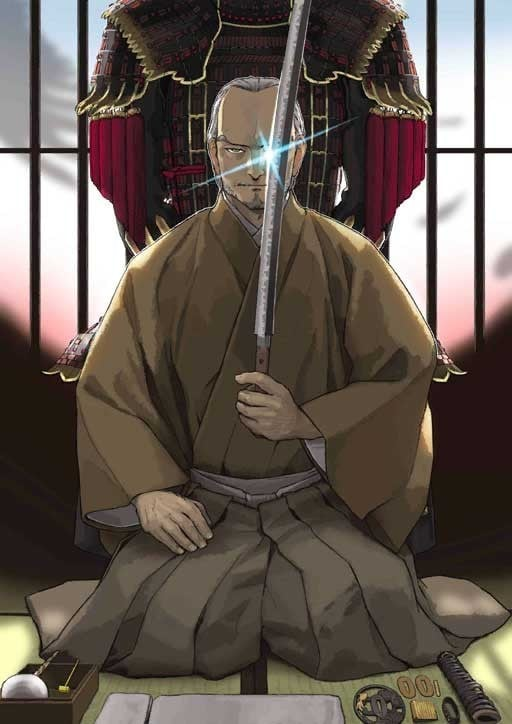
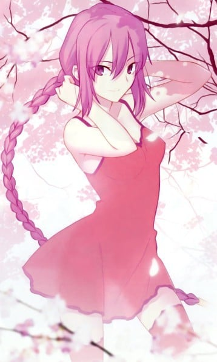
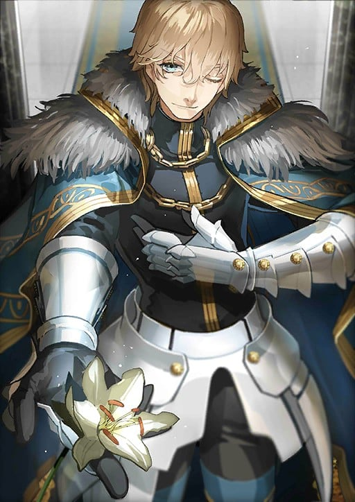
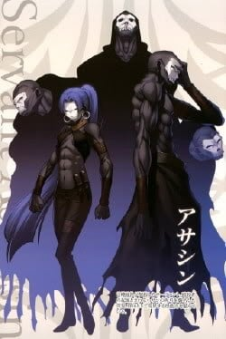
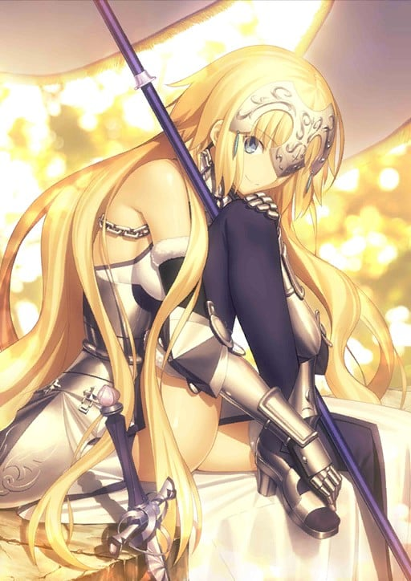
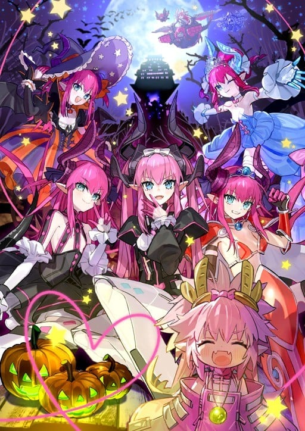
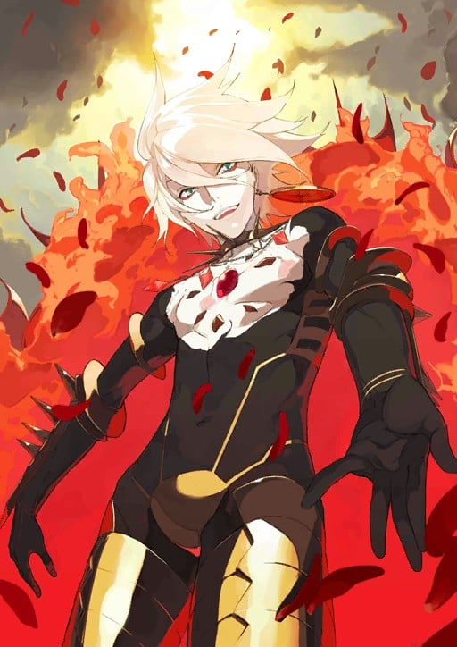

> [!bookinfo|noicon]+ **Fate/Grand Order 藤丸立香想不明白 第2季**
> 
>
| 日文名 | Fate/Grand Order 藤丸立香はわからない Season2 |
|:------: |:------------------------------------------: |
| 类型 | 游戏改 |
| 新番 | 2024 年 8 月 |
| 集数 | 共28话 |
| 官网 | [https://anime.fate-go.jp/nazomaru/](https://https://anime.fate-go.jp/nazomaru/) |
| 制作 | DLE |
| 导演 | 槌田 |
| 脚本 | 槌田 |
| 评分 | 6.9|
| 制片人 |  |

> [!abstract]+ **简介**
> この男、まだわかっていない！

人類最後のマスター「藤丸立香」。
彼なくしては人理修復することはできなかっただろう。
しかし、そんな彼にも欠点があった……

それは、素直すぎること！

藤丸の素朴な疑問に英霊たちが振り回されるドタバタコメディ、再び開幕！
※本作は「Fate/Grand Order」第2部のネタバレを含んでいます

> [!tip]+ **章节列表**
>- [ ] 第1话：大量消耗茶的方法是... (2024-08-03)
>- [ ] 第2话：度过假期的方法是... (2024-08-03)
>- [ ] 第3话：喜欢的理由是... (2024-08-07)
>- [ ] 第4话：真正的堕落是... (2024-08-14)
>- [ ] 第5话：管理愤怒的方式是… (2024-08-21)
>- [ ] 第6话：与狗相处方法是… (2024-08-28)
>- [ ] 第7话：让人安心的Myroom是… (2024-09-04)
>- [ ] 第8话：赠送叶子的人是… (2024-09-11)
>- [ ] 第9话：马的去向是... (2024-09-18)
>- [ ] 第10话：离开琦玉的方法是… (2024-09-25)
>- [ ] 第11话：不请自来的客人是… (2024-10-02)
>- [ ] 第12话：罗兰的弱点是… (2024-10-09)
>- [ ] 第13话：在野外能派上用场的技能是… (2024-10-16)
>- [ ] 第14话：魔导书的替代品是… (2024-10-23)
>- [ ] 第15话：和孩子们的相处方式是… (2024-10-30)
>- [ ] 第16话：刀匠是… (2024-11-06)
>- [ ] 第17话：偷走宝物的犯人是… (2024-11-13)
>- [ ] 第18话：灵感的来源是… (2024-11-20)
>- [ ] 第19话：威胁世界的是… (2024-11-27)
>- [ ] 第20话：战斗前应该做的是… (2024-12-04)
>- [ ] 第21话：适当训练的菜单是… (2024-12-11)
>- [ ] 第22话：在修罗场值得依靠的人是… (2024-12-18)
>- [ ] 第23话：崭新的圣诞老人形象是… (2024-12-25)
>- [ ] 第24话：为孩子准备的演出是... (2024-12-31)
>- [ ] 第25话：新的剑术风格是... (2024-12-31)
>- [ ] 第26话：联欢会压台节目是... (2024-12-31)
>- [ ] 第27话：那块布的颜色是... (2025-03-19)
>- [ ] 第28话：前员工的回忆是... (2025-03-19)

> [!tip]+ **主要角色**
> 
| 角色 | CV | 简介| 角色图片 |
|:----:|:---:|:---:|:--------:|
| アルトリア・ペンドラゴン | 川澄綾子 | Fate/stay night 被卫宫士郎召唤的英灵。作为三骑士之一的Saber，以「最优秀的剑之骑士」闻名。她曾在第四次圣杯战争中被召唤，当时士郎的养父——卫宫切嗣是她的Master。 她的真实身份是英格兰传说中的英雄——亚瑟王。从石中拔出选王之剑的少女「阿尔托莉雅」，为了成为理想的君主而隐瞒了自己的性别。然而，在内乱中目睹国土荒废的她，认为自己未能胜任王者之位，因此渴望借由圣杯重新选定合格的王，以拯救祖国不列颠。 她拥有不负传说之名的强大力量，但由于与士郎之间缺乏魔力的“通路”，常因魔力不足而陷入苦战。性格极其刻板认真，对于自己是女性的自觉也相当淡薄，以至于一开始总与士郎意见不合。但最终，她在与士郎的相处中肯定了自己的人生，并决心摧毁寄宿着“此世全部之恶”的圣杯。对她而言，能让自己镜像一般的士郎成为Master，或许是再幸运不过的事情了。  Fate/Zero 传说中的骑士王亚瑟现界的身姿，真名是阿尔托莉雅。卫宫切嗣召唤的从者，召唤时所用的圣遗物是Excalibur的剑鞘，她在第四次圣杯战争中保护着作为代理Master的爱丽丝菲尔。 传说中的亚瑟王是男性，那是因为她为了统治方便而隐瞒了性别。拔出选定之剑后身体便不再成长与老化，因此一直是少女的模样。高尚而廉洁、认真而顽固，怀抱的愿望是拯救曾经走上灭亡之路的祖国不列颠。  Fate/Grand Order 不列颠传说中的王。也被誉为骑士王。阿尔托莉雅是幼名，自从当上国王之后，就开始被称为亚瑟王了。在骑士道凋零的时代，手持圣剑，给不列颠带来了短暂的和平与最后的繁荣。史实上虽为男性，但在这个世界内却似乎是男装丽人，行为举止都以男性为标准，因此很不擅长应对异性向自己表达的好感。 崇尚万人眼中正确生活、正确人生的理想王者之一。锄强扶弱，是个无可非议的人物。冷静沉着，无论何时都十分认真的优等生。尽管如此……虽说从不愿意开口承认，但她却有着不服输的一面。对任何需要一争高下的事都不会手下留情，一旦败北则会非常懊悔。 她具有指挥军团的天生才能。在团体战斗中，可令我军的能力提升。贯彻清廉正直，大公无私的王。其公正令骑士们愿意守护于她的身旁，令民众们在对贫困的忍耐中看到了希望。她的王者之路并不是为了统帅少数强者，而是为了领导更多无力之人而存在的。 亚瑟王传说以骑士时代的终结为结局。亚瑟王虽然击退了异民族，但却无法回避不列颠土地的毁灭。圆桌骑士之一·莫德雷德的反叛导致国家一分为二，骑士之城卡美洛也失去了其辉煌。亚瑟王在卡姆兰之丘成功讨伐了莫德雷德，自己却也因负重伤而倒下。在去世前，她将圣剑交给了最后的心腹贝德维尔，离开了这个世界。死后她被送往了理想乡——不存于此世的乐园·阿瓦隆，并打算在遥远的未来再次拯救不列颠。 |  |
| 柳生但馬守宗矩 | 山路和弘 | 江户柳生最强剑士之一。不带任何感情，凭寒冰般理性凝视一切的合理性之鬼。术理即为合理，换言之，只要将剑术钻研到极致，自然就能摈弃无谓实现一切—— 从来不提热情，不着急，不焦虑。为达目的，会极端冷静地采用最优、最快捷的手段执行。成为己方时会是位非常可靠的人，但若为敌，则是个冷如钢铁的可怕男人。 以柳生石舟斋之子，柳生十兵卫之父而著称的剑术天才。在大阪夏之阵（1615年）保护了将军秀忠，据说他瞬间斩杀了七名武士。根据记录，三代将军·家光对宗矩的爱称是「柳但」。是从柳生与但马中各取一个字取出来的爱称。死后，被将军家光赞为「剑术无双」。 剑术家兼政治家。为各大名与其子弟教导新阴流，还将自己的弟子送去给有权有势的大名当剑术师傅。在时代小说与时代剧中，被描写为稀世阴谋家。想必是因为大家都认为在江户时代初期，柳生家之所以提拔到一万二千五百石的大名地位，光靠清廉洁白是做不到的吧。 擅长预测，记录称其在第一时间就意识到岛原之乱将会扩大。宽永十四年（1637年），刚接到天主教徒发动叛乱的消息后没多久，宗矩便拼命阻止被任命为讨伐使的板仓内膳正重昌。当将军家光问及为何要这么做时，宗矩回答「宗教教徒之战都极为重要」「重昌阁下一定会战死沙场」。 事态发展完全如宗矩的预料。凭借一万五千石大名的重昌，是不足以率领西国大名的，结果无奈陷入苦战。认识到状况严重性的将军家光派出了重臣·松平信纲担任总大将，而得知了这个消息的重昌感到心焦，急着在信纲赶到前向敌阵发起了突击，最终惨死沙场。  生前，宗矩曾有过非难武藏存在的轶事。宗矩以「武藏乃西军之人」「德川之敌」为主旨阐述。生前的宗矩与武藏并未正面交锋过，也没有理睬过武藏，但实际上，还是有些介意的——本作是这么设定的。因此在『英灵剑豪七番决胜』中，执着于与武藏的对决。尽管明知，她与自己世界中的「宫本武藏」并非同一个人。 作为英灵被召唤到迦勒底的宗矩承认了武藏的实力与生活方式。但他究竟是怎么看待自己世界的「宫本武藏」这点……至今仍不明了。 |  |
| 佐々木小次郎 | 三木眞一郎 | 暗杀者的英灵。有“气配遮断（Presence Concealment）”这样能偷偷靠近暗杀对象的特殊技能。由Caster利用自身也是魔术师的规则漏洞召唤订定契约，以柳洞寺的山门作为凭依，不能离开柳洞寺的大门，只能充当守门人。对圣杯没兴趣，只是想与强者过招。 以佐佐木小次郎之名召唤出来的[mask]无名剑士，是架空的英灵，历史上不实存在佐佐木小次郎这个人物。[/mask] 没有任何宝具，但凭著一己之力练出了“秘剑·燕返”（同一时间斩出三刀），根据Saber所叙“燕返”的造成为“多重空间曲折现象”单凭剑术不靠任何宝具及魔术就达到如此境界。单论剑技的话是众从者中最强的，连Saber也未必是其对手。 |  |
| シオン・エルトナム・アトラシア | 青木志貴 | 全名Sion Eltnam Atlasia。出身于魔术协会三大部门之一Altas的炼金术师。 MeltyBlood的女主角，紫色的制服和长长的单马尾是特征。 用以纳米为单位的Filament•Etherlight和黑色枪身的Relipca手枪作为武器。 Altas的没落贵族出身，在Altas院内获得了首席的成绩，被授予了下届院长之证的Altasia之名。 但她自己长期以来都对自己的存在方式保有疑问，“总感觉是不是有什么地方出错了”。 结果烦恼中的Sion自愿参加了教会发出的讨伐吸血鬼的邀请，同二十七祖之一的TATARI对决，并被击败。 她边抑制着吸血鬼化，边逃避着教会和学院的追踪，试图再次挑战TATARI。 性情一本正经而理性。虽说性格不好动，但玩的时候会玩，要说是心里到底还是想着去玩，乖乖班长的类型。 MeltyBlood根据胜负会引出不同的故事 ，多数结局Sion都会怀着爱慕离开城市。 还未开始就孤独地结束了，这就是Sion的初恋。 在关系恶劣的月姬女主角之中，她是能和任何一个人都能相处融洽的稀有类型。 展示了格斗动作之后就立马能明白，一开始的印象就是炼金术师和军人。 严谨的动作才最符合Sion。 接着，不可能视而不见的迷你裙~果然窥视不能啊。不管怎么说这才称得上是绝对领域？ |  |
| ランスロット |  | 被讴歌为圆桌骑士中最强者的“湖之骑士”。 他热爱正义，尊敬女性，憎恶邪恶，清廉而又洋溢着浪漫的身姿，被亚瑟王评价为「理想的骑士」。 与王妃桂妮薇儿的不伦之恋将卡美洛引向了破灭，确实是象征着亚瑟王传说的败北的人物。 幼时父母双亡，由湖之妖精妮妙养育长大，因此得到了“湖之骑士”的异名。 成年后渡海来到不列颠岛，经历了与亚瑟王的相遇，继承了圆桌骑士之名。 其武勇与骑士道精神同其他普通人不能相提并论。 对王妃桂妮薇儿的感情而献出生命，是他的骑士道所导致的必然结果。若不是对王的背叛加快了他走向毁灭的速度，说不定还能得到救赎。但却正是因他的武勇天下无双，才致使事态发展到最坏的结局。 |  |
| ジル・ド・レェ | 鶴岡聡 | 法国贵族、军人。百年战争时期与圣女贞德一起夺回了奥尔良，被人们称颂为英雄。清廉勇敢，被赋予了军人最高荣誉的元帅称号。 深爱艺术的吉尔·德·雷用其庞大的财产，搜集各种艺术品。本以为永远不会见底的财产被他瞬间浪费殆尽。起初吉尔与他好友兼导师的弗朗索瓦·普勒拉蒂一起，为了解决财政困难而接触了炼金术，但不知不觉中失去了当初的目的，开始为恶魔召唤所倾倒。一些人担心吉尔为了钱可能会将领土贩卖给敌国，因此以他平时的恶行之名定罪，没收其领地，最终将他处决。对他残酷行为与亵渎神明的弹劾，都只是政治上的借口罢了。——蓝胡子。这成了后世人们对其的称呼。 圣女贞德对吉尔·德·雷而言是一切。她才是这腐败现实中唯一的救赎，对吉尔而言或许也是神灵存在的证明。他本是个非常虔诚的信徒，却因为贞德被当做异端予以处决后，感受到深深的绝望，失去了对神信仰的方向。他最终那些残暴的行为也只是，为了证明（本应惩罚恶行的）神并不存在的手段。过去绝不会改变。无论曾经是个多么优秀的武将，也无法改变他是杀人魔的事实。尽管如此，他也不得不永远寻求救赎。 在几乎所有的圣杯战争中，吉尔多半都并非作为Saber，而是作为Caster被召唤出来的。这都是因为蓝胡子的恶名早已传遍了整个世界吧。 |  |
| ナーサリー・ライム | 野中藍 | 『童谣是儿歌。拇指汤米的可爱绘本。鹅妈妈的最初形态。寂寞的你，悲伤的我。一同去实现，最后的愿望吧。』 『悲哀而可爱的拇指汤米，长途跋涉辛苦了，但是，冒险已结束啦。因为你即将进梦境。黑夜的帷幕已降临。你的首级也会噗通一声掉地！』 『聪明伶俐，乖张淋漓，离合悲欢，施虐倍还。呆在这里，大家都是单纯的物体。人即为人，鸟则为鸟，这样一切刚刚好。你的名字，那就归我了哦。』  童谣并非实际存在的英雄，而是所有绘本的总称。身高体重是人类形态的数据。 作为深受英国民众喜爱的文学体裁，承载众多孩童梦想，成为了一个概念，作为“孩子们的英雄”，而被从者化。也为著名作家路易斯·卡罗的诞生做了铺垫。 |  |
| ガウェイン |  | 亚瑟王传奇中圆桌骑士之一。 是随从亚瑟王最久的骑士之一，也是服侍王的战争，直到其终结的忠义骑士。 拥有被称为Excalibur姐妹剑的太阳之圣剑，又因圣者的祝福，在白天作为无人并肩的无双骑士而驰名于世。 不论怎样的工作也会认真完成，就算有时那个任务是讨债。 非常适合温和笑容的白马王子。 虽然性格极其认真，但没有过于沉重的架势，不论和谁相处都非常客气友善。 虽然也会冲动，但因为不会出现嫉妒或者怨恨之类的负面感情，所以不论身处什么样的战场也给人以神清气爽之感。 正如其他圆桌骑士所说，「能像他这么不讨人厌已经是一种才能了」什么的。 虽然拥有与生俱来的才能和家室，却仍没有被嫉妒，可能是由于高文自身的良好性格，和认为理所当然而又不骄傲自满的天然使然。 他是忠诚的骑士，对王的忠心好似钢铁一般。 高文自己，希望能够成为为王挥舞的一把剑。 ……他这样的姿态，恐怕在不了解他内心的第三者看来甚至会显得盲目。 |  |
| 百貌のハサン |  | 出典：中東、山の老翁 時代：11～13世紀 地域：イラク、シリア  歴代の山の老翁ハサンの一人。 あまりに多岐にわたる技能と豊富な知識、 そして誰にも動向を予測できない不可思議な精神性により「百の貌」と畏怖されたが、 その実態は現代において多重人格といわれる精神障害を患っていた人物だった。  筋力	C	 耐久	D 敏捷	A	 魔力	C 幸運	E	 宝具	B  职阶技能： 气息切断A+ 完全切断气息后几乎不可能被发现。但在自身转入攻击态势时气息切断的等级会大幅下降。  固有技能： 藏知的司书C 通过多重人格将记忆分散处理。LUC判定成功后，在就算无法理解的场合也可以将过去获得的知识、情报明确地再现于记忆中。 百技精通A+ 通过多种人格的随意切换将专业技能的使用分开。战术、学术、隐秘术、暗杀术、诈术、话术等总共32种专业技能，都能发挥出B级以上的熟练度。  宝具：妄想幻象（Zabaniya） 等级：B+ 性质：对人宝具 单一个体当中存在着多个独立的灵魂，将自身的灵体潜力细分化后，可以多个Servant的方式现界。最多可分裂成80人。并且有可能会出现无意识的自我。 |  |
| ジャンヌ・ダルク | 坂本真綾 | 筋力B 耐久B 敏捷A 魔力A 幸运C 宝具A++  对魔力：EX 启示：A 领导力：C 圣人：B  宝具：  主与我同在（Luminosite Eternelle）A  红莲之圣女（La Pucelle）EX                                           原型为法国军事家、天主教圣人、领导法兰西逆转百年战争局势的少女英雄。作为被圣杯战争本身所召唤的英灵，有着管理圣杯战争的职责。因此，她和其他Servant不同，会继承不断重覆的圣杯战争中的记忆。  以调整者身份登场时，沉默寡言而冷静。另一方面，本性是个素朴又温顺的16岁女子。虽然将规则放在第一位，为了守护秩序而挥剑，但基本上，她重视全部参与圣杯战争的人类和英灵。  虽然担当Ruler的职介，但本身是作为潜在的Saber而存在，因此兼具两种职介的特长。一方面能够随时探知附近全部英灵的真名、存在与现况，另一方面，具有高超的对魔力。不过因为是教会的圣人，因此对魔力对于基督教神术无效。 |  |
| エリザベート・バートリー | 大久保瑠美 | 吸血鬼卡米拉的原型的血之伯爵夫人。……但是，作为从者被召唤的是她尚未犯下罪行之前十四岁的姿态。自称偶像的甜食系从者。高贵、霸道、残忍、无情，但其实并不像传说里一样惨无人道。 虽然是邪恶的反英灵，却同时也是个向往恋爱的少女。性子上胆小的部分简直是灾难，结果上要么是帮了自己人，要么就是放跑了敌人，会在关键时刻“哎，怎么说也是个英灵嘛”地发起善心来。但她很讨厌被人说“其实是个好人来的吧？”之类的话。 |  |
| カルナ | 遊佐浩二 | 印度古代叙事诗《摩诃婆罗多》的大英雄，既是摩诃婆罗多中心的英雄阿周那的对手，也是其异父兄弟。 由人类女性贡蒂与太阳神苏利耶所生，然而，他出生后就立刻被贡蒂抛弃，作为车夫的儿子被抚养长大，但是其作为英雄的资质却从未被掩盖。 母亲贡蒂舍弃迦尔纳之后，又生下了般度五兄弟，其中的三男，也就是对迦尔纳来说可谓是终生的对手的阿周那。 成长起来的迦尔纳成为了与般度家对立的俱卢家的养子，然而和阿周那对战之前，迦尔纳的已是诅咒缠身、障碍累累。 婆罗门的诅咒，因陀罗的欺骗，连母亲向他的求诉，要他发誓不跟阿周那之外的人战斗，他也一并接受了下来。  迦尔纳是极为宽大的Servant，一切都能以「事该如此」的理由接受下来。 他不仅对万般人等平等对待，更是将万般人等当作“各自的花朵”加以尊重。 拥有绝不会被众多的偏见公正对待的武艺和高洁的精神，即便论其英雄之格也仍能在众Servant中夺得一二。 |  |