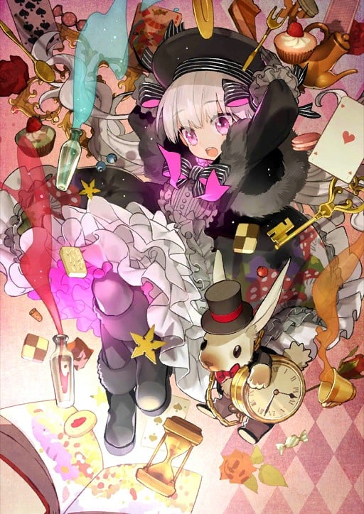

> [!bookinfo|noicon]+ **Fate/Grand Order 藤丸立香想不明白 第3季**
> 
>
| 日文名 | Fate/Grand Order 藤丸立香はわからない Season3 |
|:------: |:------------------------------------------: |
| 类型 | 漫改 |
| 新番 | 2025 年 8 月 |
| 集数 | 共26话 |
| 官网 |  |
| 制作 | DLE |
| 导演 | 槌田 |
| 脚本 | 槌田 |
| 评分 | 6.8|
| 制片人 | 谷洋一郎 |

> [!abstract]+ **简介**
> グランドオーダー。
それは終わりなき未知との戦い。

かもしれないし、そうじゃないかもしれない。
だが、少なくとも……
このマスターは未だにわかっていない。

この先に待ち受ける結末も。
霊基保管室の空き具合も。
なんか大事そうなアイテムの使い時も。
今日の日替わり定食が何なのかも。

藤丸の素朴な疑問に英霊たちが振り回されるドタバタコメディ、
三たび開幕！

> [!tip]+ **章节列表**
>- [ ] 第1话：蔵を圧迫する人は… (2025-08-02)
>- [ ] 第2话：移動中の楽しみは… (2025-08-02)
>- [ ] 第3话：夏にやりたいことは… (2025-08-06)
>- [ ] 第4话：ローマの精神は… (2025-08-13)
>- [ ] 第5话：お師匠様の行方は… (2025-08-20)
>- [ ] 第6话：マスターにできることは… (2025-08-27)
>- [ ] 第7话：夏休みの宿題は… (2025-09-03)
>- [ ] 第8话：湖にはびこる魔は… (2025-09-10)
>- [ ] 第9话：蒸気機関の活用法は… (2025-09-17)
>- [ ] 第10话：照明係の適任は… (2025-09-24)
>- [ ] 第11话：単独行動の意味は… (2025-10-01)
>- [ ] 第12话：怪人の心は… (2025-10-08)
>- [ ] 第13话：お母さんの愛情は… (2025-10-15)
>- [ ] 第14话：巨大を求める気持ちは… (2025-10-22)
>- [ ] 第15话：チョコの味は… (2025-10-29)
>- [ ] 第16话：王子の口に合う料理は… (2025-11-05)
>- [ ] 第17话：パンダに会う方法は… (2025-11-12)
>- [ ] 第18话：次にくる食べ物は… (2025-11-19)
>- [ ] 第19话：般若湯の秘密は… (2025-11-26)
>- [ ] 第20话：おじいちゃんのセンスは… (2025-12-03)
>- [ ] 第21话：最善の選択は… (2025-12-10)
>- [ ] 第22话：妖精円卓会議の議案は… (2025-12-17)
>- [ ] 第23话：大掃除の秘訣は… (2025-12-17)
>- [ ] 第24话：最強の仲間は… (2025-12-17)
>- [ ] 第25话：モテる男の悩みは… (2026-03-25)
>- [ ] 第26话：暴走する想いは… (2026-03-25)

> [!tip]+ **主要角色**
> 
| 角色 | CV | 简介| 角色图片 |
|:----:|:---:|:---:|:--------:|
| アルトリア・ペンドラゴン |  | Fate/stay night 被卫宫士郎召唤的英灵。作为三骑士之一的Saber，以「最优秀的剑之骑士」闻名。她曾在第四次圣杯战争中被召唤，当时士郎的养父——卫宫切嗣是她的Master。 她的真实身份是英格兰传说中的英雄——亚瑟王。从石中拔出选王之剑的少女「阿尔托莉雅」，为了成为理想的君主而隐瞒了自己的性别。然而，在内乱中目睹国土荒废的她，认为自己未能胜任王者之位，因此渴望借由圣杯重新选定合格的王，以拯救祖国不列颠。 她拥有不负传说之名的强大力量，但由于与士郎之间缺乏魔力的“通路”，常因魔力不足而陷入苦战。性格极其刻板认真，对于自己是女性的自觉也相当淡薄，以至于一开始总与士郎意见不合。但最终，她在与士郎的相处中肯定了自己的人生，并决心摧毁寄宿着“此世全部之恶”的圣杯。对她而言，能让自己镜像一般的士郎成为Master，或许是再幸运不过的事情了。  Fate/Zero 传说中的骑士王亚瑟现界的身姿，真名是阿尔托莉雅。卫宫切嗣召唤的从者，召唤时所用的圣遗物是Excalibur的剑鞘，她在第四次圣杯战争中保护着作为代理Master的爱丽丝菲尔。 传说中的亚瑟王是男性，那是因为她为了统治方便而隐瞒了性别。拔出选定之剑后身体便不再成长与老化，因此一直是少女的模样。高尚而廉洁、认真而顽固，怀抱的愿望是拯救曾经走上灭亡之路的祖国不列颠。  Fate/Grand Order 不列颠传说中的王。也被誉为骑士王。阿尔托莉雅是幼名，自从当上国王之后，就开始被称为亚瑟王了。在骑士道凋零的时代，手持圣剑，给不列颠带来了短暂的和平与最后的繁荣。史实上虽为男性，但在这个世界内却似乎是男装丽人，行为举止都以男性为标准，因此很不擅长应对异性向自己表达的好感。 崇尚万人眼中正确生活、正确人生的理想王者之一。锄强扶弱，是个无可非议的人物。冷静沉着，无论何时都十分认真的优等生。尽管如此……虽说从不愿意开口承认，但她却有着不服输的一面。对任何需要一争高下的事都不会手下留情，一旦败北则会非常懊悔。 她具有指挥军团的天生才能。在团体战斗中，可令我军的能力提升。贯彻清廉正直，大公无私的王。其公正令骑士们愿意守护于她的身旁，令民众们在对贫困的忍耐中看到了希望。她的王者之路并不是为了统帅少数强者，而是为了领导更多无力之人而存在的。 亚瑟王传说以骑士时代的终结为结局。亚瑟王虽然击退了异民族，但却无法回避不列颠土地的毁灭。圆桌骑士之一·莫德雷德的反叛导致国家一分为二，骑士之城卡美洛也失去了其辉煌。亚瑟王在卡姆兰之丘成功讨伐了莫德雷德，自己却也因负重伤而倒下。在去世前，她将圣剑交给了最后的心腹贝德维尔，离开了这个世界。死后她被送往了理想乡——不存于此世的乐园·阿瓦隆，并打算在遥远的未来再次拯救不列颠。 |  |
| ギルガメッシュ | 関智一 | 号称拥有最强宝具的Servant，将其他所有人都蔑称为“杂种”的傲慢的王者。其真身乃是人类最古老的英灵——英雄王吉尔伽美什。 |  |
| 柳生但馬守宗矩 | 山路和弘 | 江户柳生最强剑士之一。不带任何感情，凭寒冰般理性凝视一切的合理性之鬼。术理即为合理，换言之，只要将剑术钻研到极致，自然就能摈弃无谓实现一切—— 从来不提热情，不着急，不焦虑。为达目的，会极端冷静地采用最优、最快捷的手段执行。成为己方时会是位非常可靠的人，但若为敌，则是个冷如钢铁的可怕男人。 以柳生石舟斋之子，柳生十兵卫之父而著称的剑术天才。在大阪夏之阵（1615年）保护了将军秀忠，据说他瞬间斩杀了七名武士。根据记录，三代将军·家光对宗矩的爱称是「柳但」。是从柳生与但马中各取一个字取出来的爱称。死后，被将军家光赞为「剑术无双」。 剑术家兼政治家。为各大名与其子弟教导新阴流，还将自己的弟子送去给有权有势的大名当剑术师傅。在时代小说与时代剧中，被描写为稀世阴谋家。想必是因为大家都认为在江户时代初期，柳生家之所以提拔到一万二千五百石的大名地位，光靠清廉洁白是做不到的吧。 擅长预测，记录称其在第一时间就意识到岛原之乱将会扩大。宽永十四年（1637年），刚接到天主教徒发动叛乱的消息后没多久，宗矩便拼命阻止被任命为讨伐使的板仓内膳正重昌。当将军家光问及为何要这么做时，宗矩回答「宗教教徒之战都极为重要」「重昌阁下一定会战死沙场」。 事态发展完全如宗矩的预料。凭借一万五千石大名的重昌，是不足以率领西国大名的，结果无奈陷入苦战。认识到状况严重性的将军家光派出了重臣·松平信纲担任总大将，而得知了这个消息的重昌感到心焦，急着在信纲赶到前向敌阵发起了突击，最终惨死沙场。  生前，宗矩曾有过非难武藏存在的轶事。宗矩以「武藏乃西军之人」「德川之敌」为主旨阐述。生前的宗矩与武藏并未正面交锋过，也没有理睬过武藏，但实际上，还是有些介意的——本作是这么设定的。因此在『英灵剑豪七番决胜』中，执着于与武藏的对决。尽管明知，她与自己世界中的「宫本武藏」并非同一个人。 作为英灵被召唤到迦勒底的宗矩承认了武藏的实力与生活方式。但他究竟是怎么看待自己世界的「宫本武藏」这点……至今仍不明了。 |  |
| エミヤ | 諏訪部順一 | 与凛订定契约·弓兵的英灵。 经常嘲讽他人的现实主义者，不过与凛之间互相有着坚强的羁绊。 喜欢单独行动，明明是Archer却喜欢近身战，拿手的武器是雌雄双刀－干将莫邪，超人的弓技直到Fate/hollow ataraxia才展现。 他本人自称由于召唤时的事故忘了自己的真身为何，拿手的技术是家事全能，凛曾称赞过他泡的红茶非常好喝。 |  |
| シオン・エルトナム・アトラシア |  | 全名Sion Eltnam Atlasia。出身于魔术协会三大部门之一Altas的炼金术师。 MeltyBlood的女主角，紫色的制服和长长的单马尾是特征。 用以纳米为单位的Filament•Etherlight和黑色枪身的Relipca手枪作为武器。 Altas的没落贵族出身，在Altas院内获得了首席的成绩，被授予了下届院长之证的Altasia之名。 但她自己长期以来都对自己的存在方式保有疑问，“总感觉是不是有什么地方出错了”。 结果烦恼中的Sion自愿参加了教会发出的讨伐吸血鬼的邀请，同二十七祖之一的TATARI对决，并被击败。 她边抑制着吸血鬼化，边逃避着教会和学院的追踪，试图再次挑战TATARI。 性情一本正经而理性。虽说性格不好动，但玩的时候会玩，要说是心里到底还是想着去玩，乖乖班长的类型。 MeltyBlood根据胜负会引出不同的故事 ，多数结局Sion都会怀着爱慕离开城市。 还未开始就孤独地结束了，这就是Sion的初恋。 在关系恶劣的月姬女主角之中，她是能和任何一个人都能相处融洽的稀有类型。 展示了格斗动作之后就立马能明白，一开始的印象就是炼金术师和军人。 严谨的动作才最符合Sion。 接着，不可能视而不见的迷你裙~果然窥视不能啊。不管怎么说这才称得上是绝对领域？ |  |
| ロビンフッド | 鳥海浩輔 | 没有容貌，没有名字的侠盗。正如本人所述，该青年是被称为罗宾汉的诸多“某个人”中的一位而已。最原始的传说是出自潜藏于雪伍德森林的侠盗。最起初的罗宾汉与暴君约翰无地王对抗，最后却因为柯克利斯修道院院长的阴谋，失血过多而死。 为获得胜利不择手段，擅长偷袭、暗算、毒箭。轻佻，爱挖苦人，嘴巴很毒，但本性善良。略有些胆小谨慎，为掩饰执着于正义的不成熟的自己，总是表现得十分玩世不恭的别扭家伙。和卫宫性格相似，但因同性相斥，两者关系很不好。 擅长暗杀、扰乱的英灵，同样精通自然毒素。红豆杉也被视为通往冥界的树。祈祷之弓拥有瞬间增幅目标腹部囤积的不净物（毒或病）并使其释放的力量，若对象带有毒，更可令这种毒产生像火药一般爆发的效果。 观点虽然有些矛盾扭曲，但本质上喜爱人类。每当看到愉快的团圆场景，总会在角落偷偷加入其中，最终安于非友人但也非陌生人的立场。此外，由于打从心底为自己战斗与生活方式之卑劣感到内疚，因此绝不会嘲笑他人的努力以及徒劳无功。 |  |
| ネロ・クラウディウス | 丹下桜 | 「仰望朕之艺才！ 聆听这万雷般的喝彩！ 帝国的荣耀就在此处 如花怒放般绽开！ 揭幕吧！招荡的黄金剧场！！」  身穿红色礼装、手持奇异长剑、职阶为剑兵的少女从者。 她外貌与『Fate/stay night』中登场的Saber相似：金发、绿瞳、呆毛、萝莉体型（胸围除外），然则为身份不同的另一人。作为主角可选的Servant之一，红Saber是万能型的新手向英灵。 红Saber被设定为身穿男装的少女，裙子的前摆是半透明式设计，上身的装束也比Saber来得更为大胆。她的武器是自制的红色陨铁长剑“原初之火”，剑身上刻有regnum caelorum et gehenna（拉丁语“天堂与地狱”）之文字；宝具为“招荡的黄金剧场”，效用同于带来绝对支配权的固有结界。红Saber性格外向、善辩、敢爱敢恨，嗜好奢华铺张、自我表现；在面对心爱的对象时则会害羞撒娇，变得百依百顺。性取向是外表美丽即可，男女通吃。她乐意广开后宫，也能包容心爱对象临幸他人。红Saber在剧情中会对主角展开猛烈追求，与远坂凛也有床战的交情。 红Saber的原型是罗马帝国第五任皇帝尼禄，一位身世传奇且恶名昭彰的暴君，宝具来源于其生前建造的黄金剧场。尼禄热爱艺术与表演，自称“比肩阿波罗神的艺术家”，然而才能并未得到普遍认可。尼禄早期励精图治，却因弑母杀妻、逼死恩师、罗马大火、剧场锁门等事件导致风评恶化，又残酷镇压异教势力，迫害贵族及元老，最终引发了叛乱。动乱中尼禄因心虚而误判形势，选择自杀而死。 红Saber拥有EX级别的皇帝特权，原则上可以驾驭任何职阶，但头痛症令她难以使用咒语，又以“骑马坐车会屁股痛”为由拒绝了Rider；听闻Saber是最强的职阶，果断霸占此位降临在EXTRA舞台上。 |  |
| ナーサリー・ライム |  | 『童谣是儿歌。拇指汤米的可爱绘本。鹅妈妈的最初形态。寂寞的你，悲伤的我。一同去实现，最后的愿望吧。』 『悲哀而可爱的拇指汤米，长途跋涉辛苦了，但是，冒险已结束啦。因为你即将进梦境。黑夜的帷幕已降临。你的首级也会噗通一声掉地！』 『聪明伶俐，乖张淋漓，离合悲欢，施虐倍还。呆在这里，大家都是单纯的物体。人即为人，鸟则为鸟，这样一切刚刚好。你的名字，那就归我了哦。』  童谣并非实际存在的英雄，而是所有绘本的总称。身高体重是人类形态的数据。 作为深受英国民众喜爱的文学体裁，承载众多孩童梦想，成为了一个概念，作为“孩子们的英雄”，而被从者化。也为著名作家路易斯·卡罗的诞生做了铺垫。 |  |
| 殺生院キアラ | 田中理恵 | 藤村大河の名で主人公の『夢』に現れた尼僧服の美女。彼女も聖杯戦争に参加したマスターであり、月の裏側に落ち、主人公たちと同じく休校舎に逃れているが自力での脱出は諦めてしまっている。ちなみに前作で名前のみ登場している。 その生い立ちは江戸時代に途絶えたとされる真言宗の密教立川流最後の導師。真言立川詠天流というカルト組織で幹部をしており、彼女の欲求から生み出したある魔術が原因で西欧財閥から国際手配されていた。聖杯戦争に参加する以前、彼女はその教義のもとで多くの衆生を救い、その救った者たちに裏切られ、それでもなお人間を救おうと手を伸ばしたのだという。アンデルセンはそんな彼女を「おぞましい」とも「菩薩癖」とも呼ぶ。聖杯にかける望みもまた「人々を救いたい」というものであるが、彼女自身その願いは自分の欲を満たすものであり、恥知らずな欲望であると語る。サーヴァントは青髪のキャスター。 『CCC』に置ける黒幕。自分の快楽の為だけにムーンセルを乗っ取り、神になろうと画策する。本来の人格は他人を虫同然と見做し、己の快楽のための道具として扱うことに何の抵抗もない。しかしその上で、全ての人間を愛していると言う常軌を逸した異常性を持っている。自身の欲を追求した結果として人類が滅びてもかまわないと考えており、自分の欲のために人を救う、あるいは滅ぼすことにためらいを持たない。CCCにおける真のルートで本性を現し、月の裏側でマスター達の魂を吸収した「魔人」となって主人公に立ち塞がる。 宝具は「この世、全ての欲（アンリマユ/CCC）」。ムーンセルを介する事で『全能の力』を得た事によって人類すべての欲望を受け止める大地母神に変生した彼女は、コードキャスト『万色悠滞』により人々の魂を自身の身体に招き入れ、何十億という快楽の渦を作り上げる。この快楽の渦は知性あるものを融かし、その『人生』を一瞬で昇華させる。この能力はどれほど知性構造が異なっていようと、知性あるものには例外なく作用する。アンデルセンは「最低最悪の宝具」と評しその発動前にわざわざ敵である主人公達に教えてくれる。但しあるストーリー的な理由から、この攻撃だけで敗北する事は無い割合ダメージ仕様になっている。 |  |
| ハンス・クリスチャン・アンデルセン |  | 世界三大童话作家之一。想必『美人鱼』『卖火柴的小女孩』这些童话人尽皆知。1805年生，1875年因肝癌去世。现代虽然将其誉为三大作家之一，但据说他的半生都充满着挫折与苦恼。 阴暗厌世的诗人。由于厌恶自己的人生，所以作为从者被召唤时的模样，正如大家所见，是幼年时期的他。本人则有些破罐子破摔地评论说，「这说明孩童时代的我才是最有才能的吧！」 有了名气之后他依然没有与女性交往，一辈子单身。传说他有喜欢的对象，但介于自尊心以及对容貌的自卑，最终数次错过了告白的机会。70岁时因肝癌去世。他一直贴身带着初恋寄来的信函，据说直至临死前也握在手中。 |  |
| マシュ・キリエライト | 高橋李依 | 登场于Fate/Grand Order, 源于Fate/stay night最初设定的, 持有巨大盾牌的迷之少女。  Chaldea局的成员，玛修·基列莱特与Servant凭依融合的姿态。被称作Demi Servant。Demi Servant持有的特殊技能。能将凭依的英灵持有的技能仅仅一个继承下来，并升华为自我的流派。玛修的场合是“魔力防御”。与魔力放出同类型的技能，将魔力直接变换为防御力。如果是持有庞大魔力的英灵的话，那将会是连一个国家都能守护的神圣壁垒吧。玛修得知了凭依于自身的英灵的真名。那个骑士的名字叫加拉哈德。存在于亚瑟王传说中的圆桌骑士的一人。唯一一个入手了圣杯，随后返回了天堂的圣者。Chaldea能够用独自的方法成功完成英灵召唤，作为其基础的是作为加拉哈德召唤的触媒的“英雄们集结的场所”——也就是玛修所持有的，利用圆桌制成的盾牌。  宝具简介『如今仍是遥远的理想之城』 等级:B+++  种类:对恶宝具 Lord・Camelot 英灵・加拉哈德持有的宝具。白亚之城卡美洛的中心，使用圆桌骑士们的圆桌为盾的究极的守护。强度根据使用者的精神程度，内心绝不屈服的话城壁绝对不会崩溃。 将之冠以Chaldea之名向来是由存在于玛修心底的祈愿，“守望人类的未来”而来吧。 |  |
| フォウ | 川澄綾子 | マシュとともに主人公と出会う、愛らしい動物。カルデアの中を自由に散歩しているようだ。 |  |