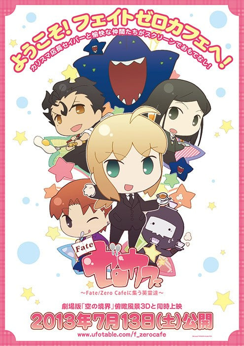

> [!bookinfo|noicon]+ **Fate/Zero cafe**
> 
>
| 日文名 | Fate/ゼロカフェ |
|:------: |:------------------------------------------: |
| 类型 | 漫改 |
| 新番 | 2013 年 7 月 |
| 集数 | 共1话 |
| 官网 | [http://www.ufotable.com/f_zerocafe/](https://http://www.ufotable.com/f_zerocafe/) |
| 制作 | ufotable |
| 导演 | 白井俊行 |
| 脚本 | 近藤光,ufotable |
| 评分 | 6.3|
| 制片人 | 近藤光 |

> [!abstract]+ **简介**
> 2013年7月13日公開の『俯瞰風景3D』と同時上映の短編作品。Fate/ZEROのキャラクターがディフォルメになって登場する。

「Fate/Zero」のキャラクターたちが可愛い姿で経営しているカフェ“ゼロカフェ”。騎士道を重んじた素晴らしい接客が人気のカリスマ店長のセイバー、顔もココロもイケメンながら女性にトラウマがあるので厨房から出てこないシェフのランサーたちが忙しく働く中、今日も個性的なお客が“ゼロカフェ”にやって来た……。

> [!tip]+ **章节列表**
>- [ ] 第1话：

> [!tip]+ **主要角色**
> 
| 角色 | CV | 简介| 角色图片 |
|:----:|:---:|:---:|:--------:|
| - | - | - | - |