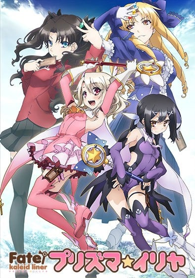
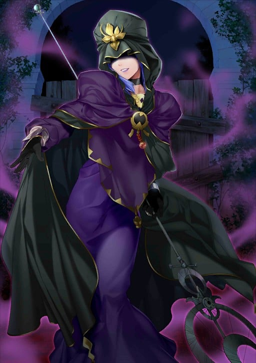
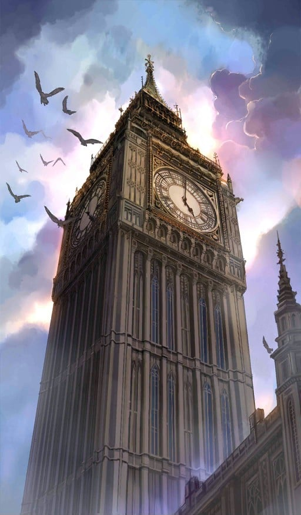
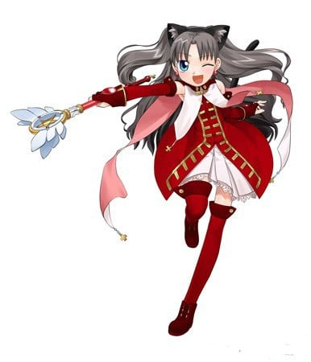

> [!bookinfo|noicon]+ **Fate/kaleid liner 魔法少女☆伊莉雅**
> 
>
| 日文名 | Fate/kaleid liner プリズマ☆イリヤ |
|:------: |:------------------------------------------: |
| 类型 | 漫改 |
| 新番 | 2013 年 7 月 |
| 集数 | 共10话 |
| 官网 | [http://anime.prisma-illya.jp/1st/](https://http://anime.prisma-illya.jp/1st/) |
| 制作 | SILVER LINK. |
| 导演 | 大沼心 |
| 脚本 | 水瀬葉月,井上堅二,井上堅二(1-3,7-10)、水瀬葉月(4-6) |
| 评分 | 6.9|
| 制片人 | 金子逸人 |

> [!abstract]+ **简介**
> 伊莉雅是一个就读穗群原学园的普通女孩子，在某天遇到了自称人工天然精灵的魔法露比万花筒之杖，并强制地被缔结契约，成为了魔法少女伊莉雅。而已是红宝石之星持有人的她，还变成了万花筒之杖原持有者的魔术师远坂凛的奴隶，在其的命令之下，被迫帮忙回收沉睡于冬木市的某危险的卡片……

> [!tip]+ **章节列表**
>- [ ] 第1话：诞生！魔法少女！ (2013-07-12)
>- [ ] 第2话：谁？ (2013-07-19)
>- [ ] 第3话：少女遇见少女 (2013-07-26)
>- [ ] 第4话：输了 (2013-08-02)
>- [ ] 第5话：两个选项？ (2013-08-09)
>- [ ] 第6话：空白 黑夜的结束 (2013-08-16)
>- [ ] 第7话：胜利与逃走 (2013-08-23)
>- [ ] 第8话：做回普通的女孩 (2013-08-30)
>- [ ] 第9话：让一切在此结束 (2013-09-06)
>- [ ] 第10话：万花筒 (2013-09-13)
>- [ ] 第1话：红宝石酱的心跳满是灯笼裤的反省大会 (2013-09-27)
>- [ ] 第2话：クイズ☆マジカルルビオネア (2013-10-25)
>- [ ] 第3话：キロバトル (2013-11-29)
>- [ ] 第4话：彼女たちの事情 (2013-12-27)
>- [ ] 第5话：脱衣战争 (2014-01-31)

> [!tip]+ **主要角色**
> 
| 角色 | CV | 简介| 角色图片 |
|:----:|:---:|:---:|:--------:|
| メディア | 田中敦子 | 魔术师的英灵。 能够使用自神话时代以后就不存在的高等魔术。 并以柳洞寺当作根据地，擅长策略。 真实身份为美狄亚（Medea），在希腊神话中是以背叛和欺骗闻名的女巫，宝具是“破尽万法之符（Rule Breaker）”，可破除所有魔术效果的短刀，可以将被魔力强化的物体、以契约连起的关系以及用魔力制造的生命回复到“施术之前”的状态。 因自身也是魔术师的关系所以能召唤从者，因此她利用了这个规则漏洞召唤了Assassin。 |  |
| ヘラクレス | 西前忠久 | 狂战士的英灵。 其身份是海格力斯（Heracles，或译为赫拉克勒斯、赫丘力士），是希腊神话中最伟大的英雄，身高高达253cm。拥有宝具“十二的试练（God Hand）”。 1、将自己的肉体变为顽强的铠甲，无效化全部等级B以下的攻击，无论物理性手段还是魔术。 2、拥有死亡后自动使肉体苏生的效果，而且因为此苏生贮存着11次的份量，所以海格力斯只要不被杀12次就不会消灭。另外，由于依莉雅的魔力庞大，若有时间的话，减少的苏生次数甚至可以回复。 3、除了“苏生”与“使攻击无效”外，宝具“十二试炼”还拥有第3个效果那就是“让受过一次的攻击第二次就不管用”。即使以多么强大的宝具打倒了海格力斯，当他再次苏生后该宝具就被无效化了。 拥有所有从者中最优秀的战斗能力，可惜因为狂化的效果，令他不能使出他最信赖的宝具，射杀百头。 海格力斯是这次爱兹贝伦家犯规召唤来的从者，以牺牲理性的方式换取压倒性的破坏力。 |  |
| メドゥーサ | 浅川悠 | 骑兵的英灵。 因此擅长在特殊地形（如：高空）战斗。 Rider这个职阶同时必需拥有强力宝具才能担任，使用可隐形的锁链刃作为武器。 其身分为希腊神话中的女妖美杜莎（Medusa，又译梅杜莎，即“蛇发女妖”），因而有“妖艳的黑蛇”的称号。 有着驾驭传说中天马的骑乘能力，具有极高的机动性，持有宝具为“他者封印·鲜血神殿（Blood Fort Andromeda）”、“自我封印·暗黑神殿（Breaker Gorgon）”与“骑英之缰绳（Bellerophon）”，也拥有特殊技能石化魔眼（Cybele）。 |  |
| 時計塔 |  | 　　魔術協会三大部門の一角。倫敦は大英博物館にある。 　　三大部門の中では最も新しく、設立は西暦元年。現在は魔術協会総本部とされる。しかし、時計塔が本部となって以後、他の二つとの交流は途絶えているらしい。 　　工房のほとんどは地下にあり、下へ行けばいくほど狂気度が増すダンジョンと化しているとか。 　　組織内部は権威主義の温床で、完全に不健全な状態。フラガのような新興の名門が座る(幹部の)椅子は何世紀も前から存在すらしない。 教育機関においてもそれは同様で、講師・生徒ともに血統の強さを重視する傾向が非常に強いため、ウェイバー・ベルベットは非常に苦労した |  |
| 百貌のハサン | 阿部彬名 | 出典：中東、山の老翁 時代：11～13世紀 地域：イラク、シリア  歴代の山の老翁ハサンの一人。 あまりに多岐にわたる技能と豊富な知識、 そして誰にも動向を予測できない不可思議な精神性により「百の貌」と畏怖されたが、 その実態は現代において多重人格といわれる精神障害を患っていた人物だった。  筋力	C	 耐久	D 敏捷	A	 魔力	C 幸運	E	 宝具	B  职阶技能： 气息切断A+ 完全切断气息后几乎不可能被发现。但在自身转入攻击态势时气息切断的等级会大幅下降。  固有技能： 藏知的司书C 通过多重人格将记忆分散处理。LUC判定成功后，在就算无法理解的场合也可以将过去获得的知识、情报明确地再现于记忆中。 百技精通A+ 通过多种人格的随意切换将专业技能的使用分开。战术、学术、隐秘术、暗杀术、诈术、话术等总共32种专业技能，都能发挥出B级以上的熟练度。  宝具：妄想幻象（Zabaniya） 等级：B+ 性质：对人宝具 单一个体当中存在着多个独立的灵魂，将自身的灵体潜力细分化后，可以多个Servant的方式现界。最多可分裂成80人。并且有可能会出现无意识的自我。 |  |
| カレイドルビー | 植田佳奈 | 魔法少女四天王之一，由神秘的魔术礼装·万华杖露比的引导而出现。是能够自由穿梭于平行世界，为了爱与和平而元气满满地发射着魔弹的赤之魔法少女。由其主役的《无限妖精卡莲多露比》正在和Phantas-Moon主役的《白之月姬幻象之月》进行着激烈的收视率战争。 根据露比的指示来到冬木市，为了寻找拥有魔法少女因子的少女而展开了战斗。 |  |
| マジカルルビー | 高野直子 | 自称爱和正义的魔法杖。被称之为愉快型魔术礼装，虽然是人工精灵但是性格有小恶魔的倾向，喜好谈论八卦话题跟恶作剧，尤其喜欢捉弄自己的主人。 第二魔法的应用的一级品的魔术礼装。能够使用多元转变，让使用者能够下载平行世界的技能。在变身的同时能够让使用者使用A级的魔术障壁、物理保护、促进治疗、身体能力强化等常备能力。  魔術礼装「カレイドステッキ」の1本。手にしたマスターに魔力を無制限に供給できる一級品である一方、マスターをいじるなど、性格的に難がある。    代表着爱与正义，为世界带来和平与微笑的纯白色愉悦型魔术礼装，魔法少女得以变身的力量源泉。虽然是魔杖，但却具有自我意识，总能在关键的时刻为少女们指引出前进的方向，在困难的时刻对少女们进行激励和鼓舞，可以说是魔法少女们最值得信赖的良师益友。如果你相信的话…… |  |
| モブキャラクター | 藏合紗恵子 | 闲角，常称作路人，在电视剧、电影等作品中，指戏份薄弱的副角、不相关的小人物、串场的闲杂人等。可能用来表达地方民众的声音，或是充当背景。 モブキャラクター（mob character）とは、漫画、アニメ、映画、コンピュータゲームなどに描かれる端役のこと。群衆（群集）、または主要キャラクター以外の、その他大勢のこと。群集キャラ、背景キャラともいう。 |  |
| 美遊・エーデルフェルト | 名塚佳織 | 全能少女。 学力、体力ともに他の追随を許さないところがあり、クールな性格で他人との関わりをなるべく避ける少女。マジカルサファイヤ、そしてルヴィアと出会ったことで、イリヤと同じく魔法少女になってしまう。 |  |
| マジカルサファイア | 松来未祐 | 红宝石的妹妹，比起姊姊个性较为正经，基本性能与红宝石相同。跟姊姊一样，放弃原持有人露维亚瑟琳塔的控制，而变成由美游所持有。 曾为了收拾红宝石搞出的残局而对她大义灭亲(放出洗脑电波)，而让红宝石整整故障了三天。  マジカルルビーの妹にあたるカレイドステッキ。ルビーと違い、冷静で合理的な性格をしており、本来はマスターに忠実だが、ルヴィアの元を離れてしまう。 |  |
| 嶽間沢龍子 | 加藤英美里 | 伊莉雅的同班同学。武术世家岳间泽家的幺女，上头有两位兄长，有恋兄癖。因为是在一群粗汉中长大，所以说话和行动也是粗里粗气，不过身心都称不上坚强，反而动不动就掉泪。可以穿着裸露不在意的到处走，被好友们称作会走路的儿童色情制造机。活生生的麻烦制造者，为身边的朋友们带来许多麻烦。在第3季番外篇中，经历一连串的打击下，而决定舍弃武术。自称穗群原小学的四神之一，代表动物为青龙（海马）。 |  |
| 桂美々 | 佐藤聡美 | 伊莉雅的同班同学，被小黑强吻后昏倒的可怜人，虽然不起眼，却是个良善温柔的乖孩子。是从《Fate/hollow ataraxia》的路人中选出来的角色。有一个弟弟。曾偷看到伊莉雅用接吻替小黑补魔力的过程，似乎有在写百合小说。第三期的番外篇中，透露了她已加入了腐女行列。最近写了以士郎及一成作题材，一共十二本笔记本厚度的BL小说。与性向还算普通的一般腐女不同，已经严重到会主张男人与男人，女人与女人恋爱；因而吓得伊莉雅及小黑落荒而逃。 |  |