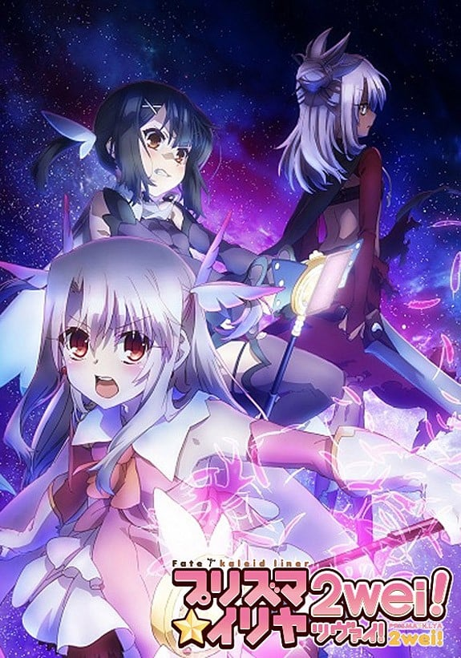
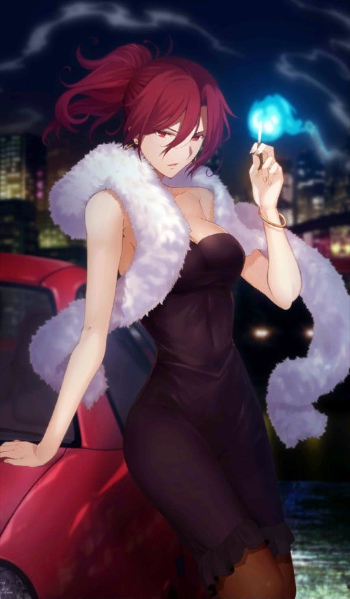
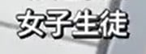

> [!bookinfo|noicon]+ **Fate/kaleid liner 魔法少女☆伊莉雅 2wei!**
> 
>
| 日文名 | Fate/kaleid liner プリズマ☆イリヤ ツヴァイ! |
|:------: |:------------------------------------------: |
| 类型 | 漫改 |
| 新番 | 2014 年 7 月 |
| 集数 | 共10话 |
| 官网 | [http://anime.prisma-illya.jp/2wei/](https://http://anime.prisma-illya.jp/2wei/) |
| 制作 | SILVER LINK. |
| 导演 | 神保昌登 |
| 脚本 | 水瀬葉月,井上堅二(1,3-7)、水瀬葉月(2,8-10),井上堅二 |
| 评分 | 7.1|
| 制片人 | 金子逸人 |

> [!abstract]+ **简介**
> 某天夜里，伊莉雅被突然飞进浴室的魔法红宝石的巧妙言辞欺骗，而变成了魔法少女。她听从红宝石原来的主人凛的指示，开始回收“职阶卡片”。伊莉雅和作为对手的另一位魔法少女·美游一起，在经历了艰苦的战斗之后终于成功回收了7张职阶卡片。伊莉雅等人也回归了平稳的日常。之后，在回收任务结束的几个星期后，伊莉雅和美游从凛等人之处收到了新的任务。让魔力流入地脉使之安定，本应是如此简单的任务，但却因为出了差错而发生了大麻烦！而这就是新的故事的开端……

> [!tip]+ **章节列表**
>- [ ] 第1话：伊莉雅grow up！？ (2014-07-09)
>- [ ] 第2话：伊莉雅X伊莉雅 (2014-07-16)
>- [ ] 第3话：日常破坏者 (2014-07-23)
>- [ ] 第4话：暴风雨一般的转学生 (2014-07-30)
>- [ ] 第5话：这个嘛、总归是 (2014-08-06)
>- [ ] 第6话：谎言与逞强的另一边 (2014-08-13)
>- [ ] 第7话：激战！Cooking Sisters (2014-08-20)
>- [ ] 第8话：她的名字是 (2014-08-27)
>- [ ] 第9话：一人的战斗 (2014-09-03)
>- [ ] 第10话：这双手想要守护的宝物是 (2014-09-10)
>- [ ] 第1话：第一个 bra 伊莉雅篇 (2014-09-26)
>- [ ] 第2话：第一个 bra 美游篇 (2014-10-31)
>- [ ] 第3话：姐姐的人肌治疗 (2014-11-28)
>- [ ] 第4话：小学生旗袍 (2014-12-26)
>- [ ] 第5话：魔法少女伊莉雅××× (2015-01-30)

> [!tip]+ **主要角色**
> 
| 角色 | CV | 简介| 角色图片 |
|:----:|:---:|:---:|:--------:|
| 巫淨琥珀 |  | 远野家的烹饪妇，双子的姊，本作里篇的女主角之一，个性开朗明亮，和沉默的翡翠为正反的存在，但有着悲惨的过去。负责控管远野家金钱使用和健康管理，过去负责照顾远野前当家，因此现在也负责照顾秋叶的生活起居。  兴趣是研究药草和种植植物（有毒居多），其房间也是家里唯一有电视、监视器等电器设备的房间。  在远野家受害最深的人，早在慎久在生时便被迫受凌辱来抑止他的反转冲动，而现在又为秋叶提供血液抑止她的冲动。   琥珀也属于两仪、浅神、巫净、七夜四家退魔一族中的巫净家，巫净家的能力不像其他三家仅能透过血缘继承，而可经由知识、技术教授。但翡翠和琥珀则是因为血缘关系而继承其能力。 |  |
| 蒼崎橙子 |  | 　　奈须小说《空之境界》中的最高位的人形使，整部《空之境界》的故事导向者。礼园女学院的校友，被魔术协会制定封印的人偶师。个性独特，二十多岁就升到支配者层级，有魔眼，拥有魔术回路二十左右。虽身为魔术师却有接近魔法使的实力。在魔术协会学习期间以追求肉体的原型为目标，结识了同样研究卢文字和人偶制作的柯尼勒斯·阿鲁巴和追求魂之原型的荒耶宗莲，对荒耶有着相当复杂的感情。 　　与《空之境界》的主角两仪式相遇后将其收为名义上的使魔，并偶尔会交一些工作给她。 　　喜欢抽烟，而且似乎还抽得很凶。香烟据说是产自台湾的劣质烟，剧场版里可以看见品牌貌似叫做“烟龙”。是个浪漫主义者，喜欢新的东西，对有兴趣的东西百般折腾。也是一个飚车爱好者，小说中喜欢的车是Mini Maina—1000型的迷你酷派车，剧场版中开的则是阿斯顿·马丁的DB9，并且貌似不止一辆，拥有的哈雷摩托似乎也是复数。　 　　橙子的专长是伦文字（Rune）魔术、人偶制作及各种创作设计。 　　《月姬》中 远野志贵 的眼镜——魔眼杀，就是出自她手。《Fate stay night》「Heaven Feel」True End中，替代卫宫士郎被破坏的人偶也被怀疑由橙子制作。（川添绿注：魔眼杀是苍崎橙子的妹妹苍崎青子交给远野志贵的） 　　能够利用伦文字【如尼文（Rune）】进行火焰的攻击，也会使用自制的各种使魔进行战斗，其使魔的强度据说是可以瞬间吞下一栋公寓的魔兽。使魔通常被装在随身携带的橙色提包或提箱中。自己则身披一件能够防御各种魔术侵袭的茶色大衣。（剧场版改为橙色） 　　同时，在《空之境界》中也曾设计出可令进入者陷入混乱状态的螺旋型建筑——小川公寓。是一个集魔术，创作及设计天赋于一身的多面天才。 　　大概是奈须目前已发表的故事中，最能代表魔术师存在的一个人。 　　讨厌橙色，不太喜欢自己橙子(とうこ)这个名字，不过偏偏身上总是会挂着橙色的装饰品。 |  |
| エミヤ |  | 与凛订定契约·弓兵的英灵。 经常嘲讽他人的现实主义者，不过与凛之间互相有着坚强的羁绊。 喜欢单独行动，明明是Archer却喜欢近身战，拿手的武器是雌雄双刀－干将莫邪，超人的弓技直到Fate/hollow ataraxia才展现。 他本人自称由于召唤时的事故忘了自己的真身为何，拿手的技术是家事全能，凛曾称赞过他泡的红茶非常好喝。 |  |
| クー・フーリン |  | 三骑士之一的枪兵，拥有很高的敏捷性与白刃战斗力。他曾是[mask]隶属于魔术协会的巴泽特·弗拉加·麦克雷米兹所召唤的从者，然而在巴泽特遭到绮礼的暗算、带有令咒的左臂被切除之后，在令咒的的力量下变成了绮礼的从者。[/mask] 他的真身是凯尔特神话的英雄库·丘林。擅于防御，谈到在战斗中存活的技能的话非他人所能比拟。宝具是只要解放力量就必定贯穿对方心脏的“穿刺死棘之枪(Gae Bolg)”。此枪也有投掷出去的攻击方式，这是本来的使用方法。他虽然也学得了十八个“原初之卢恩”，但由于喜好直接的战斗而很少使用。 粗野粗蛮又和蔼可亲，本性正直而笃于忠义，会向喜欢的人积极搭话。他回应召唤不是因为圣杯，而是期望殊死的战斗其本身。然而Master命令他保留实力进行侦察，因此他的愿望几乎没有实现。一开始为了杀人灭口而追逐撞见自己与Archer之间战斗的士郎，反而促使士郎在情急之下召唤出了Saber。 |  |
| マジカルルビー | 高野直子 | 自称爱和正义的魔法杖。被称之为愉快型魔术礼装，虽然是人工精灵但是性格有小恶魔的倾向，喜好谈论八卦话题跟恶作剧，尤其喜欢捉弄自己的主人。 第二魔法的应用的一级品的魔术礼装。能够使用多元转变，让使用者能够下载平行世界的技能。在变身的同时能够让使用者使用A级的魔术障壁、物理保护、促进治疗、身体能力强化等常备能力。  魔術礼装「カレイドステッキ」の1本。手にしたマスターに魔力を無制限に供給できる一級品である一方、マスターをいじるなど、性格的に難がある。    代表着爱与正义，为世界带来和平与微笑的纯白色愉悦型魔术礼装，魔法少女得以变身的力量源泉。虽然是魔杖，但却具有自我意识，总能在关键的时刻为少女们指引出前进的方向，在困难的时刻对少女们进行激励和鼓舞，可以说是魔法少女们最值得信赖的良师益友。如果你相信的话…… |  |
| 美遊・エーデルフェルト | 名塚佳織 | 全能少女。 学力、体力ともに他の追随を許さないところがあり、クールな性格で他人との関わりをなるべく避ける少女。マジカルサファイヤ、そしてルヴィアと出会ったことで、イリヤと同じく魔法少女になってしまう。 |  |
| マジカルサファイア | 松来未祐 | 红宝石的妹妹，比起姊姊个性较为正经，基本性能与红宝石相同。跟姊姊一样，放弃原持有人露维亚瑟琳塔的控制，而变成由美游所持有。 曾为了收拾红宝石搞出的残局而对她大义灭亲(放出洗脑电波)，而让红宝石整整故障了三天。  マジカルルビーの妹にあたるカレイドステッキ。ルビーと違い、冷静で合理的な性格をしており、本来はマスターに忠実だが、ルヴィアの元を離れてしまう。 |  |
| クロエ・フォン・アインツベルン | 斎藤千和 | 在第二部的时候登场，因处理地脉正常化的仪式出了差错，导致从伊莉雅身上分离出来并实体化的人格。 其真实身分为爱因兹贝伦家在十年前的圣杯战争时所使用的许愿仪，并在伊莉雅婴儿时期被母亲封印的魔力、记忆及知识，经长年累积后实体化的人格（第一部伊莉雅的英灵化就是她）。 皮肤较伊莉雅黝黑，发色也偏银色，服装类似Archer，但比较裸露。性格较伊莉雅来的狡猾活泼，但除了凛、露维亚、美游及伊莉雅的母亲外，没人认得出来她不是伊莉雅，为了方便和伊莉雅区别，而被凛取名叫“小黑”（クロ），而克洛伊·冯·爱因兹贝伦为自己掰出来的名字。 |  |
| 女子生徒 | 幸田夢波 |  |  |
| 嶽間沢龍子 | 加藤英美里 | 伊莉雅的同班同学。武术世家岳间泽家的幺女，上头有两位兄长，有恋兄癖。因为是在一群粗汉中长大，所以说话和行动也是粗里粗气，不过身心都称不上坚强，反而动不动就掉泪。可以穿着裸露不在意的到处走，被好友们称作会走路的儿童色情制造机。活生生的麻烦制造者，为身边的朋友们带来许多麻烦。在第3季番外篇中，经历一连串的打击下，而决定舍弃武术。自称穗群原小学的四神之一，代表动物为青龙（海马）。 |  |
| 桂美々 | 佐藤聡美 | 伊莉雅的同班同学，被小黑强吻后昏倒的可怜人，虽然不起眼，却是个良善温柔的乖孩子。是从《Fate/hollow ataraxia》的路人中选出来的角色。有一个弟弟。曾偷看到伊莉雅用接吻替小黑补魔力的过程，似乎有在写百合小说。第三期的番外篇中，透露了她已加入了腐女行列。最近写了以士郎及一成作题材，一共十二本笔记本厚度的BL小说。与性向还算普通的一般腐女不同，已经严重到会主张男人与男人，女人与女人恋爱；因而吓得伊莉雅及小黑落荒而逃。 |  |
| 森山那奈亀 | 伊瀬茉莉也 | 伊莉雅的同班同学。在呆头呆脑的外表下意外的相当聪明，也较会冷静判断。喜欢不动声色的欺负龙子，拥有轻度的S属性，且对武术的领悟力极高，曾看过一次岳间泽流派的武术后就现学现卖，将身为道馆馆主的龙子父亲给瞬间秒杀。自称穗群原小学的四神之一，代表动物为玄武（乌龟）。 |  |