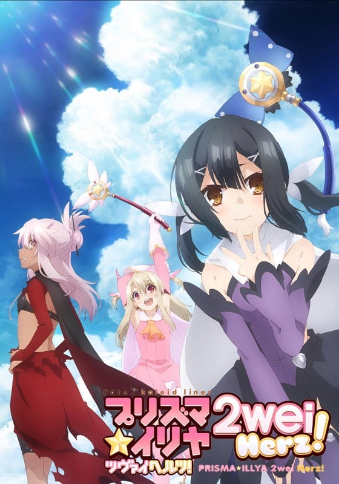
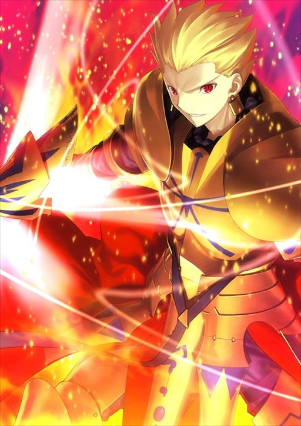
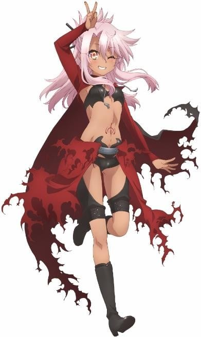

> [!bookinfo|noicon]+ **Fate/kaleid liner 魔法少女☆伊莉雅 2wei Herz!**
> 
>
| 日文名 | Fate/kaleid liner プリズマ☆イリヤ ツヴァイヘルツ! |
|:------: |:------------------------------------------: |
| 类型 | 漫改 |
| 新番 | 2015 年 7 月 |
| 集数 | 共10话 |
| 官网 | [http://anime.prisma-illya.jp/2weihelz/](https://http://anime.prisma-illya.jp/2weihelz/) |
| 制作 | SILVER LINK. |
| 导演 | 神保昌登 |
| 脚本 | 井上堅二(1-3,5,10)、水瀬葉月(4,6-9),水瀬葉月,井上堅二 |
| 评分 | 7.1|
| 制片人 | 金子逸人、伏見宣人,金子逸人,伏見宣人 |

> [!abstract]+ **简介**
> 在与巴泽特经历一场恶战之后，伊莉雅她们好不容易才回到平稳的日常当中，但就在此时，凛和露维雅却发现了潜藏在地底的第8张职阶卡片！为了回收这第8张卡片，伊莉雅她们不得不与巴泽特合作，但回收卡片的困难程度却超出了她们的想象……

> [!tip]+ **章节列表**
>- [ ] 第1话：简直像是在照镜子 好讨厌 (2015-07-24)
>- [ ] 第2话：Tricolore Birthday (2015-07-31)
>- [ ] 第3话：人生苦短，腐起来吧少女 (2015-08-07)
>- [ ] 第4话：主题乐园恐慌! (2015-08-14)
>- [ ] 第5话：浴衣和烟花 (2015-08-21)
>- [ ] 第6话：Blue glass moon (2015-08-28)
>- [ ] 第7话：执行者 (2015-09-04)
>- [ ] 第8话：监视者 (2015-09-11)
>- [ ] 第9话：金色少年 (2015-09-18)
>- [ ] 第10话：在世界的角落呼喊你的名字 (2015-09-25)
>- [ ] 第1话：ビースト、再び！ (2015-09-25)
>- [ ] 第2话：無限の服製 (2015-10-30)
>- [ ] 第3话：乙女よ闘志を抱け（前編） (2015-11-27)
>- [ ] 第4话：乙女よ闘志を抱け（後編） (2015-12-25)
>- [ ] 第5话：巴泽特第一次的打工 (2016-01-29)

> [!tip]+ **主要角色**
> 
| 角色 | CV | 简介| 角色图片 |
|:----:|:---:|:---:|:--------:|
| ギルガメッシュ | 関智一 | 号称拥有最强宝具的Servant，将其他所有人都蔑称为“杂种”的傲慢的王者。其真身乃是人类最古老的英灵——英雄王吉尔伽美什。 |  |
| 柳洞一成 | 真殿光昭 | 与士郎同年级的学生会长，也是士郎的朋友，忠诚老实认真的好青年。身为柳洞家的长子，是柳洞寺的继承人，具有看穿远坂凛的本质的尖锐洞察力，也因此讨厌凛。 |  |
| マジカルルビー | 高野直子 | 自称爱和正义的魔法杖。被称之为愉快型魔术礼装，虽然是人工精灵但是性格有小恶魔的倾向，喜好谈论八卦话题跟恶作剧，尤其喜欢捉弄自己的主人。 第二魔法的应用的一级品的魔术礼装。能够使用多元转变，让使用者能够下载平行世界的技能。在变身的同时能够让使用者使用A级的魔术障壁、物理保护、促进治疗、身体能力强化等常备能力。  魔術礼装「カレイドステッキ」の1本。手にしたマスターに魔力を無制限に供給できる一級品である一方、マスターをいじるなど、性格的に難がある。    代表着爱与正义，为世界带来和平与微笑的纯白色愉悦型魔术礼装，魔法少女得以变身的力量源泉。虽然是魔杖，但却具有自我意识，总能在关键的时刻为少女们指引出前进的方向，在困难的时刻对少女们进行激励和鼓舞，可以说是魔法少女们最值得信赖的良师益友。如果你相信的话…… |  |
| セイバーライオン |  | 嗷嗷嗷嗷嗷嗷嗷嗷，嗷嗷嗷嗷嗷嗷、嗷嗷、嗷嗷嗷嗷嗷~ 嗷嗷嗷嗷嗷嗷，嗷嗷嗷嗷嗷嗷嗷嗷嗷嗷，嗷嗷哦嗷嗷嗷嗷嗷嗷~ 嗷嗷嗷嗷嗷嗷嗷嗷嗷嗷嗷，嗷嗷嗷嗷嗷嗷嗷嗷嗷嗷嗷嗷嗷，嗷嗷嗷嗷嗷嗷嗷嗷嗷嗷，嗷嗷嗷嗷嗷嗷嗷嗷嗷嗷嗷~ 嗷嗷嗷嗷嗷嗷嗷嗷~ |  |
| モブキャラクター | 森川智之 | 闲角，常称作路人，在电视剧、电影等作品中，指戏份薄弱的副角、不相关的小人物、串场的闲杂人等。可能用来表达地方民众的声音，或是充当背景。 モブキャラクター（mob character）とは、漫画、アニメ、映画、コンピュータゲームなどに描かれる端役のこと。群衆（群集）、または主要キャラクター以外の、その他大勢のこと。群集キャラ、背景キャラともいう。 |  |
| 美遊・エーデルフェルト | 名塚佳織 | 全能少女。 学力、体力ともに他の追随を許さないところがあり、クールな性格で他人との関わりをなるべく避ける少女。マジカルサファイヤ、そしてルヴィアと出会ったことで、イリヤと同じく魔法少女になってしまう。 |  |
| マジカルサファイア | 松来未祐 | 红宝石的妹妹，比起姊姊个性较为正经，基本性能与红宝石相同。跟姊姊一样，放弃原持有人露维亚瑟琳塔的控制，而变成由美游所持有。 曾为了收拾红宝石搞出的残局而对她大义灭亲(放出洗脑电波)，而让红宝石整整故障了三天。  マジカルルビーの妹にあたるカレイドステッキ。ルビーと違い、冷静で合理的な性格をしており、本来はマスターに忠実だが、ルヴィアの元を離れてしまう。 |  |
| クロエ・フォン・アインツベルン | 斎藤千和 | 在第二部的时候登场，因处理地脉正常化的仪式出了差错，导致从伊莉雅身上分离出来并实体化的人格。 其真实身分为爱因兹贝伦家在十年前的圣杯战争时所使用的许愿仪，并在伊莉雅婴儿时期被母亲封印的魔力、记忆及知识，经长年累积后实体化的人格（第一部伊莉雅的英灵化就是她）。 皮肤较伊莉雅黝黑，发色也偏银色，服装类似Archer，但比较裸露。性格较伊莉雅来的狡猾活泼，但除了凛、露维亚、美游及伊莉雅的母亲外，没人认得出来她不是伊莉雅，为了方便和伊莉雅区别，而被凛取名叫“小黑”（クロ），而克洛伊·冯·爱因兹贝伦为自己掰出来的名字。 |  |
| アナウンス | 川澄綾子 | 各作品通用广播/播音员。 |  |
| 嶽間沢龍子 | 加藤英美里 | 伊莉雅的同班同学。武术世家岳间泽家的幺女，上头有两位兄长，有恋兄癖。因为是在一群粗汉中长大，所以说话和行动也是粗里粗气，不过身心都称不上坚强，反而动不动就掉泪。可以穿着裸露不在意的到处走，被好友们称作会走路的儿童色情制造机。活生生的麻烦制造者，为身边的朋友们带来许多麻烦。在第3季番外篇中，经历一连串的打击下，而决定舍弃武术。自称穗群原小学的四神之一，代表动物为青龙（海马）。 |  |
| 桂美々 | 佐藤聡美 | 伊莉雅的同班同学，被小黑强吻后昏倒的可怜人，虽然不起眼，却是个良善温柔的乖孩子。是从《Fate/hollow ataraxia》的路人中选出来的角色。有一个弟弟。曾偷看到伊莉雅用接吻替小黑补魔力的过程，似乎有在写百合小说。第三期的番外篇中，透露了她已加入了腐女行列。最近写了以士郎及一成作题材，一共十二本笔记本厚度的BL小说。与性向还算普通的一般腐女不同，已经严重到会主张男人与男人，女人与女人恋爱；因而吓得伊莉雅及小黑落荒而逃。 |  |
| 森山那奈亀 | 伊瀬茉莉也 | 伊莉雅的同班同学。在呆头呆脑的外表下意外的相当聪明，也较会冷静判断。喜欢不动声色的欺负龙子，拥有轻度的S属性，且对武术的领悟力极高，曾看过一次岳间泽流派的武术后就现学现卖，将身为道馆馆主的龙子父亲给瞬间秒杀。自称穗群原小学的四神之一，代表动物为玄武（乌龟）。 |  |