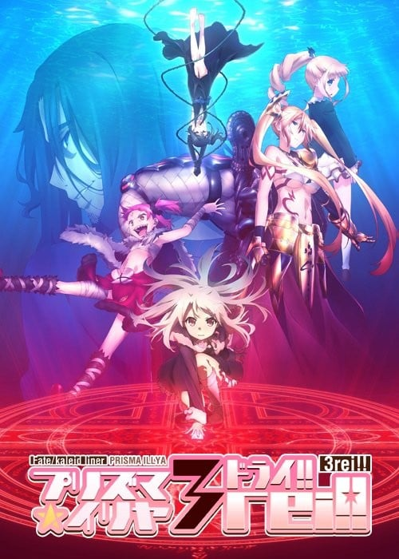
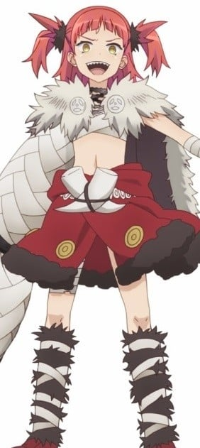
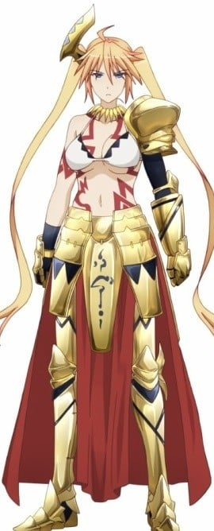

> [!bookinfo|noicon]+ **Fate/kaleid liner 魔法少女☆伊莉雅 3rei!!**
> 
>
| 日文名 | Fate/kaleid liner プリズマ☆イリヤ ドライ!! |
|:------: |:------------------------------------------: |
| 类型 | 漫改 |
| 新番 | 2016 年 7 月 |
| 集数 | 共12话 |
| 官网 | [http://anime.prisma-illya.jp/3rei/](https://http://anime.prisma-illya.jp/3rei/) |
| 制作 | SILVER LINK. |
| 导演 | 高橋賢,高橋賢・神保昌登,神保昌登 |
| 脚本 | 水瀬葉月,井上堅二(1,3,5,7,9,12)、水瀬葉月(2,4,6,8,10,11),井上堅二 |
| 评分 | 6.9|
| 制片人 | 金子逸人 |

> [!abstract]+ **简介**
> “这样的时间，若能一直持续下去就好了——。”
结束了与第8张职阶卡片的英灵之间战斗的伊莉雅等人。
为了尽情享受所剩不多的暑假，她们再次进入度假模式。
但，这样的日常，过于轻易地被打破。
在奔向发生异变的圆藏山的伊莉雅等人面前出现的脱离现实的人影。
在突然的交战之后，空间震动。
之后，在震动结束后，伊莉雅醒来所见到的是，隆冬的冬木市——平行世界。
那里是，美游所出生、成长的世界。
将重要的事物，全部守护住——。魔法少女的，实现普通而壮大愿望的战斗现在开幕！

> [!tip]+ **章节列表**
>- [ ] 第1话：银装素裹的城镇 (2016-07-06)
>- [ ] 第2话：邂逅与再会 (2016-07-13)
>- [ ] 第3话：你真正的敌人 (2016-07-20)
>- [ ] 第4话：致懦弱的妹妹 (2016-07-27)
>- [ ] 第5话：小淑女来袭 (2016-08-03)
>- [ ] 第6话：冰寒的敌意 (2016-08-10)
>- [ ] 第7话：人偶与玩偶 (2016-08-17)
>- [ ] 第8话：人与道具 (2016-08-24)
>- [ ] 第9话：伊莉雅的选择 (2016-08-31)
>- [ ] 第10话：前往公主身边 (2016-09-07)
>- [ ] 第11话：并不孤独 (2016-09-14)
>- [ ] 第12话：连成一线的奇迹 (2016-09-21)
>- [ ] 第1话：小学生们的○○修行 (2016-09-30)
>- [ ] 第2话：实践生存技巧 (2016-10-28)
>- [ ] 第3话：着替えよ、さらば思い出さん (2016-11-25)
>- [ ] 第4话：絶対負けるもんですか！ (2016-12-23)
>- [ ] 第5话：エリカのねまき研究 (2017-01-27)
>- [ ] 第6话：ルビーの衛宮邸浴場観察録 (2017-02-24)

> [!tip]+ **主要角色**
> 
| 角色 | CV | 简介| 角色图片 |
|:----:|:---:|:---:|:--------:|
| マジカルルビー | 高野直子 | 自称爱和正义的魔法杖。被称之为愉快型魔术礼装，虽然是人工精灵但是性格有小恶魔的倾向，喜好谈论八卦话题跟恶作剧，尤其喜欢捉弄自己的主人。 第二魔法的应用的一级品的魔术礼装。能够使用多元转变，让使用者能够下载平行世界的技能。在变身的同时能够让使用者使用A级的魔术障壁、物理保护、促进治疗、身体能力强化等常备能力。  魔術礼装「カレイドステッキ」の1本。手にしたマスターに魔力を無制限に供給できる一級品である一方、マスターをいじるなど、性格的に難がある。    代表着爱与正义，为世界带来和平与微笑的纯白色愉悦型魔术礼装，魔法少女得以变身的力量源泉。虽然是魔杖，但却具有自我意识，总能在关键的时刻为少女们指引出前进的方向，在困难的时刻对少女们进行激励和鼓舞，可以说是魔法少女们最值得信赖的良师益友。如果你相信的话…… |  |
| 美遊・エーデルフェルト | 名塚佳織 | 全能少女。 学力、体力ともに他の追随を許さないところがあり、クールな性格で他人との関わりをなるべく避ける少女。マジカルサファイヤ、そしてルヴィアと出会ったことで、イリヤと同じく魔法少女になってしまう。 |  |
| マジカルサファイア | かかずゆみ | 红宝石的妹妹，比起姊姊个性较为正经，基本性能与红宝石相同。跟姊姊一样，放弃原持有人露维亚瑟琳塔的控制，而变成由美游所持有。 曾为了收拾红宝石搞出的残局而对她大义灭亲(放出洗脑电波)，而让红宝石整整故障了三天。  マジカルルビーの妹にあたるカレイドステッキ。ルビーと違い、冷静で合理的な性格をしており、本来はマスターに忠実だが、ルヴィアの元を離れてしまう。 |  |
| ダリウス・エインズワース | 小西克幸 | 並行世界の冬木に居を構える魔術師の当主。 外見は中年の男性。普段は朴訥そうなのんびりとしているが、ふとした拍子に狂気じみた表情と言動を見せる。何かと演劇に物事を例える癖がある。聖杯を現出させようとしており、現在は美遊を手中に収めて聖杯の機能を得ようとしている。またクラスカードを作った張本人でもある。その本拠地は深山町のクレーターの中心部に存在する壮麗な城郭で、普段は魔術によって完全に秘匿されている。圧倒的な戦力を有しており、内側の酸素を消費しながら非常に頑丈な氷のドームを生成する「三〇一秒の永久氷宮（アプネイック・ビューティ）」、概念的な干渉で対象を屈服させる「黒玉皇に顔は無し（オーソリテリアン・パーソナリズム）」といった、ギルガメッシュでも未知の宝具を難なく使用する事が出来る。敵対者にその圧倒的な実力でもって屈服させる事も厭わないが、何らかの意図があるのか無暗な虐殺行為などは行っていない。 |  |
| クロエ・フォン・アインツベルン | 斎藤千和 | 在第二部的时候登场，因处理地脉正常化的仪式出了差错，导致从伊莉雅身上分离出来并实体化的人格。 其真实身分为爱因兹贝伦家在十年前的圣杯战争时所使用的许愿仪，并在伊莉雅婴儿时期被母亲封印的魔力、记忆及知识，经长年累积后实体化的人格（第一部伊莉雅的英灵化就是她）。 皮肤较伊莉雅黝黑，发色也偏银色，服装类似Archer，但比较裸露。性格较伊莉雅来的狡猾活泼，但除了凛、露维亚、美游及伊莉雅的母亲外，没人认得出来她不是伊莉雅，为了方便和伊莉雅区别，而被凛取名叫“小黑”（クロ），而克洛伊·冯·爱因兹贝伦为自己掰出来的名字。 |  |
| 嶽間沢龍子 | 加藤英美里 | 伊莉雅的同班同学。武术世家岳间泽家的幺女，上头有两位兄长，有恋兄癖。因为是在一群粗汉中长大，所以说话和行动也是粗里粗气，不过身心都称不上坚强，反而动不动就掉泪。可以穿着裸露不在意的到处走，被好友们称作会走路的儿童色情制造机。活生生的麻烦制造者，为身边的朋友们带来许多麻烦。在第3季番外篇中，经历一连串的打击下，而决定舍弃武术。自称穗群原小学的四神之一，代表动物为青龙（海马）。 |  |
| 桂美々 | 佐藤聡美 | 伊莉雅的同班同学，被小黑强吻后昏倒的可怜人，虽然不起眼，却是个良善温柔的乖孩子。是从《Fate/hollow ataraxia》的路人中选出来的角色。有一个弟弟。曾偷看到伊莉雅用接吻替小黑补魔力的过程，似乎有在写百合小说。第三期的番外篇中，透露了她已加入了腐女行列。最近写了以士郎及一成作题材，一共十二本笔记本厚度的BL小说。与性向还算普通的一般腐女不同，已经严重到会主张男人与男人，女人与女人恋爱；因而吓得伊莉雅及小黑落荒而逃。 |  |
| 森山那奈亀 | 伊瀬茉莉也 | 伊莉雅的同班同学。在呆头呆脑的外表下意外的相当聪明，也较会冷静判断。喜欢不动声色的欺负龙子，拥有轻度的S属性，且对武术的领悟力极高，曾看过一次岳间泽流派的武术后就现学现卖，将身为道馆馆主的龙子父亲给瞬间秒杀。自称穗群原小学的四神之一，代表动物为玄武（乌龟）。 |  |
| 栗原雀花 | 伊藤かな恵 | 伊莉雅的同班同学。腐女，会和姐姐联手创作同人志，以小学生来说，在某项题材内建立起了自己的地位。拥有优秀的绘画才能；曾在美术课中绘画了一幅BL题材的画。与满分的美术科相对，其他科目皆只有2分(满分为5)。 对士郎及柳洞一成两人的关系有强烈的妄想。自称穗群原小学的四神之一，代表动物为朱雀（麻雀）。 |  |
| 田中 | 福圓美里 | 在平行世界与伊莉雅相遇的少女。一直是体操服的打扮。失去了记忆，连姓名也想不起来。但对此并不在意。 |  |
| ベアトリス・フラワーチャイルド | 釘宮理恵 | エインズワース家に仕えるドールズ。小さな体の見た目に似合わずどう猛な性格で、サディスト。バーサーカーのクラスカードを所有。インストール後には、雷撃を司る宝具“悉く打ち砕く雷神の鎚”（ミョルニル）を操る。 |  |
| アンジェリカ・エインズワース | 白石涼子 | エインズワース家に仕えるドールズ。置換魔術の使い手で常に沈着冷静だが、目的のためには残忍にもなれる。アーチャーにして英雄王ギルガメシュのクラスカードを所有し、無限の宝具を武器とする。 |  |