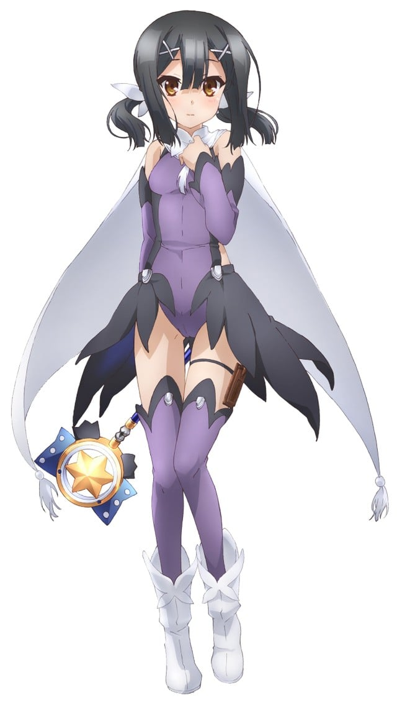
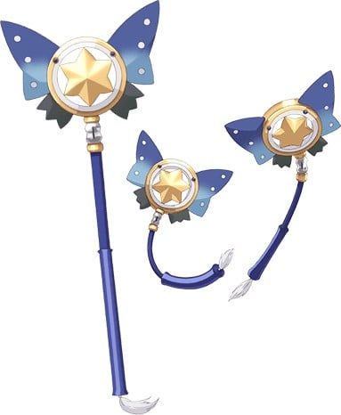

> [!bookinfo|noicon]+ **Fate/kaleid liner 魔法少女☆伊莉雅 OAD**
> 
>
| 日文名 | Fate/kaleid liner プリズマ☆イリヤ「運動会 DE ダンス!」 |
|:------: |:------------------------------------------: |
| 类型 | 漫改 |
| 新番 | 2014 年 3 月 |
| 集数 | 共1话 |
| 官网 |  |
| 制作 | SILVER LINK. |
| 导演 | 大沼心 |
| 脚本 | 水瀬葉月 |
| 评分 | 6.8|
| 制片人 | 金子逸人 |

> [!abstract]+ **简介**
> ただし第11話が原作『ドライ!!』4巻の限定版にOADとして付属する。

> [!tip]+ **章节列表**
>- [ ] 第11话：在运动会上跳舞！ (2014-03-07)

> [!tip]+ **主要角色**
> 
| 角色 | CV | 简介| 角色图片 |
|:----:|:---:|:---:|:--------:|
| マジカルルビー | 高野直子 | 自称爱和正义的魔法杖。被称之为愉快型魔术礼装，虽然是人工精灵但是性格有小恶魔的倾向，喜好谈论八卦话题跟恶作剧，尤其喜欢捉弄自己的主人。 第二魔法的应用的一级品的魔术礼装。能够使用多元转变，让使用者能够下载平行世界的技能。在变身的同时能够让使用者使用A级的魔术障壁、物理保护、促进治疗、身体能力强化等常备能力。  魔術礼装「カレイドステッキ」の1本。手にしたマスターに魔力を無制限に供給できる一級品である一方、マスターをいじるなど、性格的に難がある。    代表着爱与正义，为世界带来和平与微笑的纯白色愉悦型魔术礼装，魔法少女得以变身的力量源泉。虽然是魔杖，但却具有自我意识，总能在关键的时刻为少女们指引出前进的方向，在困难的时刻对少女们进行激励和鼓舞，可以说是魔法少女们最值得信赖的良师益友。如果你相信的话…… |  |
| モブキャラクター | 桂一雅 | 闲角，常称作路人，在电视剧、电影等作品中，指戏份薄弱的副角、不相关的小人物、串场的闲杂人等。可能用来表达地方民众的声音，或是充当背景。 モブキャラクター（mob character）とは、漫画、アニメ、映画、コンピュータゲームなどに描かれる端役のこと。群衆（群集）、または主要キャラクター以外の、その他大勢のこと。群集キャラ、背景キャラともいう。 |  |
| 美遊・エーデルフェルト | 名塚佳織 | 全能少女。 学力、体力ともに他の追随を許さないところがあり、クールな性格で他人との関わりをなるべく避ける少女。マジカルサファイヤ、そしてルヴィアと出会ったことで、イリヤと同じく魔法少女になってしまう。 |  |
| マジカルサファイア | 松来未祐 | 红宝石的妹妹，比起姊姊个性较为正经，基本性能与红宝石相同。跟姊姊一样，放弃原持有人露维亚瑟琳塔的控制，而变成由美游所持有。 曾为了收拾红宝石搞出的残局而对她大义灭亲(放出洗脑电波)，而让红宝石整整故障了三天。  マジカルルビーの妹にあたるカレイドステッキ。ルビーと違い、冷静で合理的な性格をしており、本来はマスターに忠実だが、ルヴィアの元を離れてしまう。 |  |
| アナウンス | ブリドカットセーラ恵美 | 各作品通用广播/播音员。 |  |
| 嶽間沢龍子 | 加藤英美里 | 伊莉雅的同班同学。武术世家岳间泽家的幺女，上头有两位兄长，有恋兄癖。因为是在一群粗汉中长大，所以说话和行动也是粗里粗气，不过身心都称不上坚强，反而动不动就掉泪。可以穿着裸露不在意的到处走，被好友们称作会走路的儿童色情制造机。活生生的麻烦制造者，为身边的朋友们带来许多麻烦。在第3季番外篇中，经历一连串的打击下，而决定舍弃武术。自称穗群原小学的四神之一，代表动物为青龙（海马）。 |  |
| 桂美々 | 佐藤聡美 | 伊莉雅的同班同学，被小黑强吻后昏倒的可怜人，虽然不起眼，却是个良善温柔的乖孩子。是从《Fate/hollow ataraxia》的路人中选出来的角色。有一个弟弟。曾偷看到伊莉雅用接吻替小黑补魔力的过程，似乎有在写百合小说。第三期的番外篇中，透露了她已加入了腐女行列。最近写了以士郎及一成作题材，一共十二本笔记本厚度的BL小说。与性向还算普通的一般腐女不同，已经严重到会主张男人与男人，女人与女人恋爱；因而吓得伊莉雅及小黑落荒而逃。 |  |
| 森山那奈亀 | 伊瀬茉莉也 | 伊莉雅的同班同学。在呆头呆脑的外表下意外的相当聪明，也较会冷静判断。喜欢不动声色的欺负龙子，拥有轻度的S属性，且对武术的领悟力极高，曾看过一次岳间泽流派的武术后就现学现卖，将身为道馆馆主的龙子父亲给瞬间秒杀。自称穗群原小学的四神之一，代表动物为玄武（乌龟）。 |  |
| 栗原雀花 | 伊藤かな恵 | 伊莉雅的同班同学。腐女，会和姐姐联手创作同人志，以小学生来说，在某项题材内建立起了自己的地位。拥有优秀的绘画才能；曾在美术课中绘画了一幅BL题材的画。与满分的美术科相对，其他科目皆只有2分(满分为5)。 对士郎及柳洞一成两人的关系有强烈的妄想。自称穗群原小学的四神之一，代表动物为朱雀（麻雀）。 |  |
| イリヤスフィール・フォン・アインツベルン (プリズマ☆イリヤ) | 門脇舞以 | 就读于穗群原学园小学部的普通女孩子。银发赤眼，名字很有贵族的风格，常不在家的双亲从事神秘的工作，分明是一般宅邸，却不知为何有两位女仆在，顺便还有一个没有血缘关系的哥哥，但还是一个非常普通的小学五年级女孩子。 | .jpg) |
| 遠坂凛 (プリズマ☆イリヤ) | 植田佳奈 | 冬木市に潜在するカード回収のため、ロンドンから派遣された魔術師。マジカルルビーの力を使ってカード回収にあたるはずが、一緒に来日したルヴィアと争っているうちにマジカルルビーに逃げられてしまう。 | .jpg) |
| ルヴィアゼリッタ・エーデルフェルト (プリズマ☆イリヤ) | 伊藤静 | 高飛車な性格のお嬢様で、宝石魔術を使う際も、宝石に糸目を付けない財力の持ち主。凛とともに日本へはカード回収にやってきたものの、凛との争いに辟易したマジカルサファイアに逃げられてしまう。 | .jpg) |