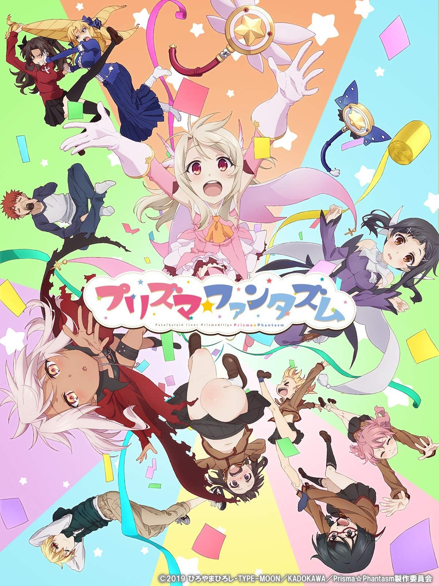
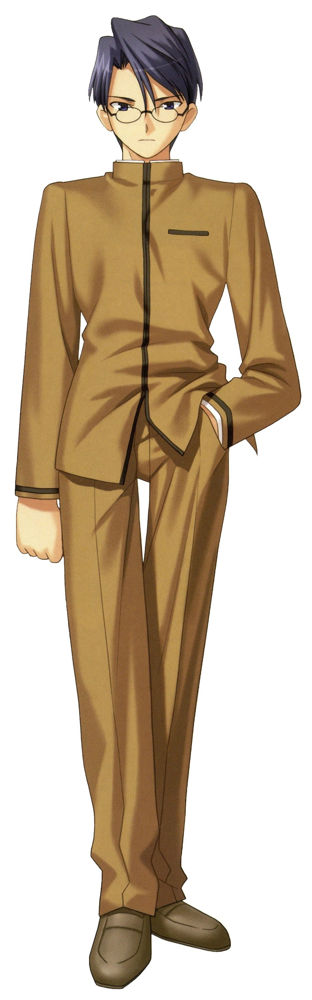
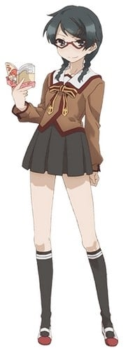

> [!bookinfo|noicon]+ **Fate/kaleid liner 魔法少女☆伊莉雅 Prisma☆Phantasm**
> 
>
| 日文名 | Fate/kaleid liner プリズマ☆イリヤ プリズマ☆ファンタズム |
|:------: |:------------------------------------------: |
| 类型 | 漫改 |
| 新番 | 2019 年 11 月 |
| 集数 | 共1话 |
| 官网 | [http://anime.prisma-illya.jp/movie/prismaphantasm/](https://http://anime.prisma-illya.jp/movie/prismaphantasm/) |
| 制作 | SILVER LINK. |
| 导演 | 大沼心 |
| 脚本 | 水瀬葉月,井上堅二、水瀬葉月,井上堅二 |
| 评分 | 6.5|
| 制片人 |  |

> [!abstract]+ **简介**
> 在2017年10月7日的“Machi☆Asobi”漫展上，宣布将制作续篇。2018年12月22日在周年纪念活动“Prisma☆Klangfest ～kaleidoscope～”上宣布新作OVA制作决定。
OVA于2019年6月14日在剧场上映，标题为《Fate/kaleid liner 魔法少女☆伊莉雅 Prisma☆Phantasm》（neta自Carnival Phantasm），共63分钟，为原作者广山弘监修的原创搞笑剧情。正式的BD/DVD于2019年11月27日发售。

プリズマ☆イリヤ オールキャスト総出演のドタバタギャグコメディがここに開幕! 
「Fate/kaleid liner プリズマ☆イリヤ」シリーズのキャラクターが平行世界の垣根を越えて大集合! 
原作ひろやまひろし監修による完全新作オリジナルエピソード。少女たちのもう一つの物語が描かれる――。

> [!tip]+ **章节列表**
>- [ ] 第1话：Fate/kaleid liner 魔法少女☆伊莉雅 Prisma☆Phantasm (2019-06-14)

> [!tip]+ **主要角色**
> 
| 角色 | CV | 简介| 角色图片 |
|:----:|:---:|:---:|:--------:|
| 柳洞一成 |  | 与士郎同年级的学生会长，也是士郎的朋友，忠诚老实认真的好青年。身为柳洞家的长子，是柳洞寺的继承人，具有看穿远坂凛的本质的尖锐洞察力，也因此讨厌凛。 |  |
| ヘラクレス |  | 狂战士的英灵。 其身份是海格力斯（Heracles，或译为赫拉克勒斯、赫丘力士），是希腊神话中最伟大的英雄，身高高达253cm。拥有宝具“十二的试练（God Hand）”。 1、将自己的肉体变为顽强的铠甲，无效化全部等级B以下的攻击，无论物理性手段还是魔术。 2、拥有死亡后自动使肉体苏生的效果，而且因为此苏生贮存着11次的份量，所以海格力斯只要不被杀12次就不会消灭。另外，由于依莉雅的魔力庞大，若有时间的话，减少的苏生次数甚至可以回复。 3、除了“苏生”与“使攻击无效”外，宝具“十二试炼”还拥有第3个效果那就是“让受过一次的攻击第二次就不管用”。即使以多么强大的宝具打倒了海格力斯，当他再次苏生后该宝具就被无效化了。 拥有所有从者中最优秀的战斗能力，可惜因为狂化的效果，令他不能使出他最信赖的宝具，射杀百头。 海格力斯是这次爱兹贝伦家犯规召唤来的从者，以牺牲理性的方式换取压倒性的破坏力。 |  |
| メドゥーサ | 浅川悠 | 骑兵的英灵。 因此擅长在特殊地形（如：高空）战斗。 Rider这个职阶同时必需拥有强力宝具才能担任，使用可隐形的锁链刃作为武器。 其身分为希腊神话中的女妖美杜莎（Medusa，又译梅杜莎，即“蛇发女妖”），因而有“妖艳的黑蛇”的称号。 有着驾驭传说中天马的骑乘能力，具有极高的机动性，持有宝具为“他者封印·鲜血神殿（Blood Fort Andromeda）”、“自我封印·暗黑神殿（Breaker Gorgon）”与“骑英之缰绳（Bellerophon）”，也拥有特殊技能石化魔眼（Cybele）。 |  |
| 呪腕のハサン |  | 白骷髅的暗杀者。起源于中东的暗杀教团党首。别名「山中老人」，作为Assassin语源，尼查里派传说中的头目之一。据说山中老人历代共有18人，每位都是修炼成特殊技能的达人。 戴着骷髅的面具，身披黑色的斗篷，拥有如棍棒般的右手，外观诡异。骷髅假面下的面容已被割掉，因此没有脸。自从他继承了「哈桑·萨巴赫」之名后，就舍弃了他过去个人所有的一切。 从人类角度而言并不能称之为好人，但永远忠实于主人的命令，无论主人陷入多么绝望的劣势，他也不会背叛，甚至愿意默默地执行一些强人所难的命令。认为杀戮只是一种任务与义务，从中感受不到任何喜怒哀乐。 |  |
| マジカルルビー | 高野直子 | 自称爱和正义的魔法杖。被称之为愉快型魔术礼装，虽然是人工精灵但是性格有小恶魔的倾向，喜好谈论八卦话题跟恶作剧，尤其喜欢捉弄自己的主人。 第二魔法的应用的一级品的魔术礼装。能够使用多元转变，让使用者能够下载平行世界的技能。在变身的同时能够让使用者使用A级的魔术障壁、物理保护、促进治疗、身体能力强化等常备能力。  魔術礼装「カレイドステッキ」の1本。手にしたマスターに魔力を無制限に供給できる一級品である一方、マスターをいじるなど、性格的に難がある。    代表着爱与正义，为世界带来和平与微笑的纯白色愉悦型魔术礼装，魔法少女得以变身的力量源泉。虽然是魔杖，但却具有自我意识，总能在关键的时刻为少女们指引出前进的方向，在困难的时刻对少女们进行激励和鼓舞，可以说是魔法少女们最值得信赖的良师益友。如果你相信的话…… |  |
| 美遊・エーデルフェルト | 名塚佳織 | 全能少女。 学力、体力ともに他の追随を許さないところがあり、クールな性格で他人との関わりをなるべく避ける少女。マジカルサファイヤ、そしてルヴィアと出会ったことで、イリヤと同じく魔法少女になってしまう。 |  |
| マジカルサファイア | かかずゆみ | 红宝石的妹妹，比起姊姊个性较为正经，基本性能与红宝石相同。跟姊姊一样，放弃原持有人露维亚瑟琳塔的控制，而变成由美游所持有。 曾为了收拾红宝石搞出的残局而对她大义灭亲(放出洗脑电波)，而让红宝石整整故障了三天。  マジカルルビーの妹にあたるカレイドステッキ。ルビーと違い、冷静で合理的な性格をしており、本来はマスターに忠実だが、ルヴィアの元を離れてしまう。 |  |
| クロエ・フォン・アインツベルン | 斎藤千和 | 在第二部的时候登场，因处理地脉正常化的仪式出了差错，导致从伊莉雅身上分离出来并实体化的人格。 其真实身分为爱因兹贝伦家在十年前的圣杯战争时所使用的许愿仪，并在伊莉雅婴儿时期被母亲封印的魔力、记忆及知识，经长年累积后实体化的人格（第一部伊莉雅的英灵化就是她）。 皮肤较伊莉雅黝黑，发色也偏银色，服装类似Archer，但比较裸露。性格较伊莉雅来的狡猾活泼，但除了凛、露维亚、美游及伊莉雅的母亲外，没人认得出来她不是伊莉雅，为了方便和伊莉雅区别，而被凛取名叫“小黑”（クロ），而克洛伊·冯·爱因兹贝伦为自己掰出来的名字。 |  |
| 嶽間沢龍子 | 加藤英美里 | 伊莉雅的同班同学。武术世家岳间泽家的幺女，上头有两位兄长，有恋兄癖。因为是在一群粗汉中长大，所以说话和行动也是粗里粗气，不过身心都称不上坚强，反而动不动就掉泪。可以穿着裸露不在意的到处走，被好友们称作会走路的儿童色情制造机。活生生的麻烦制造者，为身边的朋友们带来许多麻烦。在第3季番外篇中，经历一连串的打击下，而决定舍弃武术。自称穗群原小学的四神之一，代表动物为青龙（海马）。 |  |
| 桂美々 | 佐藤聡美 | 伊莉雅的同班同学，被小黑强吻后昏倒的可怜人，虽然不起眼，却是个良善温柔的乖孩子。是从《Fate/hollow ataraxia》的路人中选出来的角色。有一个弟弟。曾偷看到伊莉雅用接吻替小黑补魔力的过程，似乎有在写百合小说。第三期的番外篇中，透露了她已加入了腐女行列。最近写了以士郎及一成作题材，一共十二本笔记本厚度的BL小说。与性向还算普通的一般腐女不同，已经严重到会主张男人与男人，女人与女人恋爱；因而吓得伊莉雅及小黑落荒而逃。 |  |
| 森山那奈亀 | 伊瀬茉莉也 | 伊莉雅的同班同学。在呆头呆脑的外表下意外的相当聪明，也较会冷静判断。喜欢不动声色的欺负龙子，拥有轻度的S属性，且对武术的领悟力极高，曾看过一次岳间泽流派的武术后就现学现卖，将身为道馆馆主的龙子父亲给瞬间秒杀。自称穗群原小学的四神之一，代表动物为玄武（乌龟）。 |  |
| 栗原雀花 | 伊藤かな恵 | 伊莉雅的同班同学。腐女，会和姐姐联手创作同人志，以小学生来说，在某项题材内建立起了自己的地位。拥有优秀的绘画才能；曾在美术课中绘画了一幅BL题材的画。与满分的美术科相对，其他科目皆只有2分(满分为5)。 对士郎及柳洞一成两人的关系有强烈的妄想。自称穗群原小学的四神之一，代表动物为朱雀（麻雀）。 |  |