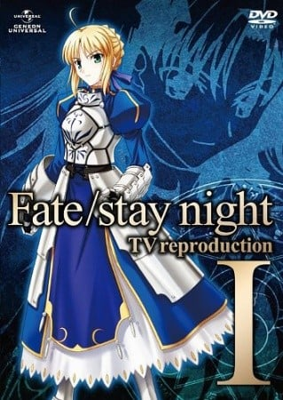
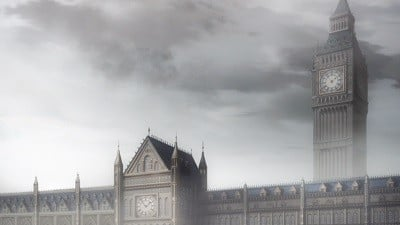
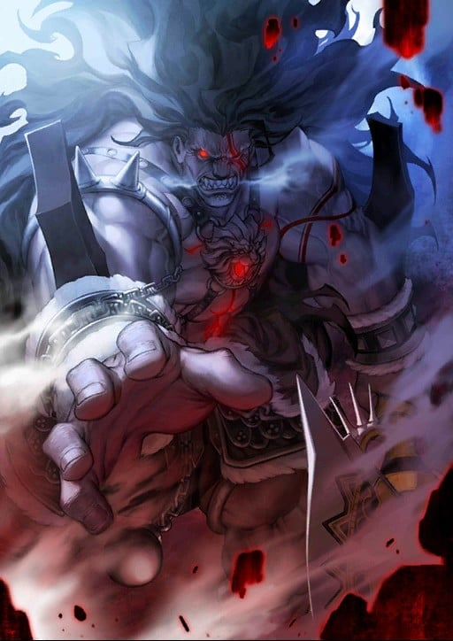
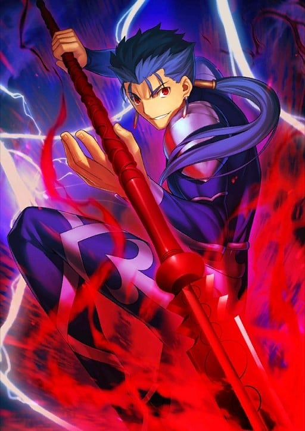
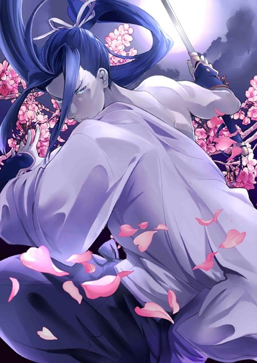
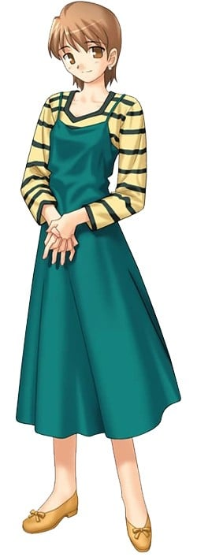

> [!bookinfo|noicon]+ **Fate/stay night TV总集篇**
> 
>
| 日文名 | Fate/stay night TV reproduction |
|:------: |:------------------------------------------: |
| 类型 | 游戏改 |
| 新番 | 2010 年 1 月 |
| 集数 | 共2话 |
| 官网 | [http://www.typemoon.com/main.html](https://http://www.typemoon.com/main.html) |
| 制作 | スタジオディーン |
| 导演 | 山口祐司 |
| 脚本 |  |
| 评分 | 6.9|
| 制片人 |  |

> [!abstract]+ **简介**
> 劇場公開を記念して、大ヒットTVシリーズ「Fate/stay night」が特別版で登場。
2010年1月の劇場公開を記念して、TVシリーズを再編集した特別版が登場!
TVシリーズ前半(#1~12)を再編集し、全編再撮影による高画質化。オープニング/エンディングともに新曲制作。
新作映像によるオープニングアニメ収録。曲はTVシリーズ本編のOPテーマである「タイナカ サチ/disillusion」を大胆にアレンジ&ホ゛ーカル新録音。
EDテーマも、この作品の為の新曲!前編は“樹海 feat. タイナカ サチ”、後編は“タイナカ サチ”がそれぞれ担当!

> [!tip]+ **章节列表**
>- [ ] 第1话：Fate/stay night TV reproduction I
>- [ ] 第2话：Fate/stay night TV reproduction II

> [!tip]+ **主要角色**
> 
| 角色 | CV | 简介| 角色图片 |
|:----:|:---:|:---:|:--------:|
| アルトリア・ペンドラゴン | 川澄綾子 | Fate/stay night 被卫宫士郎召唤的英灵。作为三骑士之一的Saber，以「最优秀的剑之骑士」闻名。她曾在第四次圣杯战争中被召唤，当时士郎的养父——卫宫切嗣是她的Master。 她的真实身份是英格兰传说中的英雄——亚瑟王。从石中拔出选王之剑的少女「阿尔托莉雅」，为了成为理想的君主而隐瞒了自己的性别。然而，在内乱中目睹国土荒废的她，认为自己未能胜任王者之位，因此渴望借由圣杯重新选定合格的王，以拯救祖国不列颠。 她拥有不负传说之名的强大力量，但由于与士郎之间缺乏魔力的“通路”，常因魔力不足而陷入苦战。性格极其刻板认真，对于自己是女性的自觉也相当淡薄，以至于一开始总与士郎意见不合。但最终，她在与士郎的相处中肯定了自己的人生，并决心摧毁寄宿着“此世全部之恶”的圣杯。对她而言，能让自己镜像一般的士郎成为Master，或许是再幸运不过的事情了。  Fate/Zero 传说中的骑士王亚瑟现界的身姿，真名是阿尔托莉雅。卫宫切嗣召唤的从者，召唤时所用的圣遗物是Excalibur的剑鞘，她在第四次圣杯战争中保护着作为代理Master的爱丽丝菲尔。 传说中的亚瑟王是男性，那是因为她为了统治方便而隐瞒了性别。拔出选定之剑后身体便不再成长与老化，因此一直是少女的模样。高尚而廉洁、认真而顽固，怀抱的愿望是拯救曾经走上灭亡之路的祖国不列颠。  Fate/Grand Order 不列颠传说中的王。也被誉为骑士王。阿尔托莉雅是幼名，自从当上国王之后，就开始被称为亚瑟王了。在骑士道凋零的时代，手持圣剑，给不列颠带来了短暂的和平与最后的繁荣。史实上虽为男性，但在这个世界内却似乎是男装丽人，行为举止都以男性为标准，因此很不擅长应对异性向自己表达的好感。 崇尚万人眼中正确生活、正确人生的理想王者之一。锄强扶弱，是个无可非议的人物。冷静沉着，无论何时都十分认真的优等生。尽管如此……虽说从不愿意开口承认，但她却有着不服输的一面。对任何需要一争高下的事都不会手下留情，一旦败北则会非常懊悔。 她具有指挥军团的天生才能。在团体战斗中，可令我军的能力提升。贯彻清廉正直，大公无私的王。其公正令骑士们愿意守护于她的身旁，令民众们在对贫困的忍耐中看到了希望。她的王者之路并不是为了统帅少数强者，而是为了领导更多无力之人而存在的。 亚瑟王传说以骑士时代的终结为结局。亚瑟王虽然击退了异民族，但却无法回避不列颠土地的毁灭。圆桌骑士之一·莫德雷德的反叛导致国家一分为二，骑士之城卡美洛也失去了其辉煌。亚瑟王在卡姆兰之丘成功讨伐了莫德雷德，自己却也因负重伤而倒下。在去世前，她将圣剑交给了最后的心腹贝德维尔，离开了这个世界。死后她被送往了理想乡——不存于此世的乐园·阿瓦隆，并打算在遥远的未来再次拯救不列颠。 |  |
| 間桐桜 | 下屋則子 | 過去のちょっとしたきっかけから、主人公や藤村先生とは家族同然の付き合いを続けている一学年下の後輩。 やや引っ込み思案なおとなしい性格をしているが、時折主人公に対して積極的になる一面も持ち合わせている。 穏やかな日常の象徴で、戦いに巻き込まれる事はないのだが……？ |  |
| イリヤスフィール・フォン・アインツベルン | 門脇舞以 | サーヴァント・バーサーカーのマスターとして聖杯戦争に参加。 銀色の髪と赤い瞳をした謎の少女。雪をイメージさせる容姿とは裏腹に、無邪気で人懐っこい性格をしている。 物語の導入において、何も知らない主人公に接触するが──── |  |
| 間桐慎二 | 神谷浩史 | 间桐家长男，前任家督间桐鹤野的亲生子。个性相当差劲，欺软怕硬，好色、冷血，在男生之中如同公敌般受到敌视，但因外貌和家中有钱等原因受到一些女孩子欢迎。曾经追求过凛，却被其无视。卫宫士郎中学以来的同学，与士郎曾经关系不错，不过在上了高中之后便开始疏远，后来因为性格等原因而在第五次圣杯战争之中成为对手。弓道部副主将，在弓道上有一定实力。很受女同学欢迎，但在学校的男性朋友就只有士郎。对待自己名义上的妹妹间桐樱十分粗暴，曾因殴打樱让其留下伤痕而被士郎揍过。（之后樱也仍然原谅并对士郎说要好好对待哥哥，原因是「因为哥哥只有你一个朋友」）  虽然出生在魔术世家，但到了慎二这代已经完全没有魔术回路，不过仍具备相当魔术知识。因为持有樱以令咒制作的“伪臣之书”，他也成了参加圣杯战争的御主。在三条路线之中，都有他带着Rider袭击无辜平民的情节（Fate和UBW之中是试图吸取全校师生的生命力，而HF线之中则是在公园袭击路人）。 |  |
| 言峰綺礼 | 中田譲治 | 此次的圣杯战争担任监督的神父，也是教会的“代行者（Executer）”，有着言行复杂常人不能理解的地方。曾参加过上次（第四次）的圣杯战争。远坂凛的监护人及师兄，爱吃麻婆豆腐，虽是代行者，本作中并未使用过圣典（于HF线中绮礼曾提到若想与从者对战取得胜利，必须配备代行者专用武器-圣典，关于圣典使用者，可参照月姬中埋葬机关的代行者－希耶尔（Ciel（シエル））。 第四次圣杯战争中利用远坂时臣后将其杀害，最后与卫宫切嗣争夺圣杯。第四次圣杯战争最后被切嗣射杀，但因为圣杯流出的黑色物质无法污染Gilgamesh而逆流回御主身上，填补了他被射穿的心脏使他复活。详细资讯可以参照‘Fate/Zero’。 喜欢看到人死亡和痛苦，十年前的灾难对他来说也只是愉悦。 事实上在第五次圣杯战争中，他是游戏的最大作弊者，控制Lancer和Gilgamesh两个从者，对士郎来说是相当于“绝对恶”的存在。 在三线中战斗方法与相当大的差异，Fate线中利用圣杯中溢出的污染物攻击，HF线中则是利用黑键及其超凡的肉体能力，甚至可与Assassin（真）匹敌。 此外绮礼也会使用中国拳法，但并非精通，本人表示只是模仿拳师拳路的架式，而没有使用上内力，在Fate/Zero中也曾用此种战斗方式。 会使用洗礼咏唱的技能，是圣典中以“神的教诲”来让世界固定化的魔术基础之中最大的对灵魔术，可让徘徊世间的魂魄归于无的神意之钥，绮礼于HF线曾这此技能对付间桐 臓砚。 过去曾有位妻子，是为身怀病痛的女子，绮礼是为了欣赏她的痛苦才选择她。绮礼尝试让自己像一个普通人一样爱她，最后女子临死前绮礼否认自己爱上她，但女子却笑着说绮礼已经爱上自己了。女子自杀后，绮礼只想着既然要死为何不是自己亲手享受她的死亡，但这样的想法等同否认女子死亡的意义。他不希望女子的死亡毫无意义。 虽然对士郎来说是相当于“绝对恶”的存在，但是说到底，言峰绮礼并不是纯粹意义上的“恶”，而是无法感受常人的喜悦心情的“感情异常者”，在这一层面上说与过分崇拜正义到排斥自身存在的卫宫士郎是身为“感情异常者”的同类。 |  |
| 魔術協会 |  | 国籍・ジャンルを問わず魔術師たちによって作られた自衛・管理団体。魔術を管理し、隠匿し、その発展を使命とする。（無論、名目上ではある） 外敵（教会、自分たち以外の魔術団体、禁忌に触れる人間を罰する怪異）に対抗するための武力と、魔術の更なる発展（衰退ともいう）のための研究機関を持ち、魔術犯罪の防止法律を敷く。 一般社会で魔術がらみの事件を起こしたものは処刑されるが、「正義」「道徳」ではなく、「神秘の漏洩」を防ぐことがその最大の目的。 アトラス院は特に徹底されているが、魔術師は己の研究を公表することはなく、魔術師同士の研究の交流などというものはない（交流などというもがあるとすれば、それは世俗的な権力闘争くらいである）。隣り合った研究室を持つ魔術師同士が、互いが何を研究しているのか知らないなんてことは当たり前。 魔術の研究は一人でするものであり、協会による束縛を嫌う魔術師も勿論いるが、大半の教本と、魔術の実践に適した歪みを抱えている霊地は、協会が押さえている。魔術を学ぶには最高の環境であり、自分の研究こそが最優先の魔術師にとって、それらの魅力は何物にも代え難い。名目上、支配者ではないことを標榜する協会は辞めることは自由だが、そんなことを考える魔術師はそうそういない（封印指定でも受ければしかたないが）。  聖堂教会とは表向きは不可侵であるが、裏では記録に残さないことを条件に現在も殺し合いが続いている。  また、中東圏の魔術基盤、及び大陸（中国）の思想魔術とは互いに相容れず、やはり不可侵を装っている。加え、西洋魔術を扱う魔術協会では呪術は学問ではないとされて蔑視されており、中東圏に大きく遅れをとっている。 |  |
| 遠坂凛 | 植田佳奈 | 穂群原学園2年A組に通う女生徒で、魔術師。魔術の名門、遠坂家の後継者。 学園内では非の打ち所のない優等生として男子生徒の人気も上々だが、イジワル大好きないじめっこ、という小悪魔的な本性を持つ。 現代に生きる魔術師として聖杯戦争に参加。素人同然の主人公と衝突する。 |  |
| ヘラクレス | 西前忠久 | 狂战士的英灵。 其身份是海格力斯（Heracles，或译为赫拉克勒斯、赫丘力士），是希腊神话中最伟大的英雄，身高高达253cm。拥有宝具“十二的试练（God Hand）”。 1、将自己的肉体变为顽强的铠甲，无效化全部等级B以下的攻击，无论物理性手段还是魔术。 2、拥有死亡后自动使肉体苏生的效果，而且因为此苏生贮存着11次的份量，所以海格力斯只要不被杀12次就不会消灭。另外，由于依莉雅的魔力庞大，若有时间的话，减少的苏生次数甚至可以回复。 3、除了“苏生”与“使攻击无效”外，宝具“十二试炼”还拥有第3个效果那就是“让受过一次的攻击第二次就不管用”。即使以多么强大的宝具打倒了海格力斯，当他再次苏生后该宝具就被无效化了。 拥有所有从者中最优秀的战斗能力，可惜因为狂化的效果，令他不能使出他最信赖的宝具，射杀百头。 海格力斯是这次爱兹贝伦家犯规召唤来的从者，以牺牲理性的方式换取压倒性的破坏力。 |  |
| クー・フーリン | 神奈延年 | 三骑士之一的枪兵，拥有很高的敏捷性与白刃战斗力。他曾是[mask]隶属于魔术协会的巴泽特·弗拉加·麦克雷米兹所召唤的从者，然而在巴泽特遭到绮礼的暗算、带有令咒的左臂被切除之后，在令咒的的力量下变成了绮礼的从者。[/mask] 他的真身是凯尔特神话的英雄库·丘林。擅于防御，谈到在战斗中存活的技能的话非他人所能比拟。宝具是只要解放力量就必定贯穿对方心脏的“穿刺死棘之枪(Gae Bolg)”。此枪也有投掷出去的攻击方式，这是本来的使用方法。他虽然也学得了十八个“原初之卢恩”，但由于喜好直接的战斗而很少使用。 粗野粗蛮又和蔼可亲，本性正直而笃于忠义，会向喜欢的人积极搭话。他回应召唤不是因为圣杯，而是期望殊死的战斗其本身。然而Master命令他保留实力进行侦察，因此他的愿望几乎没有实现。一开始为了杀人灭口而追逐撞见自己与Archer之间战斗的士郎，反而促使士郎在情急之下召唤出了Saber。 |  |
| メドゥーサ | 浅川悠 | 骑兵的英灵。 因此擅长在特殊地形（如：高空）战斗。 Rider这个职阶同时必需拥有强力宝具才能担任，使用可隐形的锁链刃作为武器。 其身分为希腊神话中的女妖美杜莎（Medusa，又译梅杜莎，即“蛇发女妖”），因而有“妖艳的黑蛇”的称号。 有着驾驭传说中天马的骑乘能力，具有极高的机动性，持有宝具为“他者封印·鲜血神殿（Blood Fort Andromeda）”、“自我封印·暗黑神殿（Breaker Gorgon）”与“骑英之缰绳（Bellerophon）”，也拥有特殊技能石化魔眼（Cybele）。 |  |
| 佐々木小次郎 | 三木眞一郎 | 暗杀者的英灵。有“气配遮断（Presence Concealment）”这样能偷偷靠近暗杀对象的特殊技能。由Caster利用自身也是魔术师的规则漏洞召唤订定契约，以柳洞寺的山门作为凭依，不能离开柳洞寺的大门，只能充当守门人。对圣杯没兴趣，只是想与强者过招。 以佐佐木小次郎之名召唤出来的[mask]无名剑士，是架空的英灵，历史上不实存在佐佐木小次郎这个人物。[/mask] 没有任何宝具，但凭著一己之力练出了“秘剑·燕返”（同一时间斩出三刀），根据Saber所叙“燕返”的造成为“多重空间曲折现象”单凭剑术不靠任何宝具及魔术就达到如此境界。单论剑技的话是众从者中最强的，连Saber也未必是其对手。 |  |
| 藤村大河 | 伊藤美紀 | 月世界最强的三人之一，具有制造圣杯并发动圣杯战争的力量。 |  |