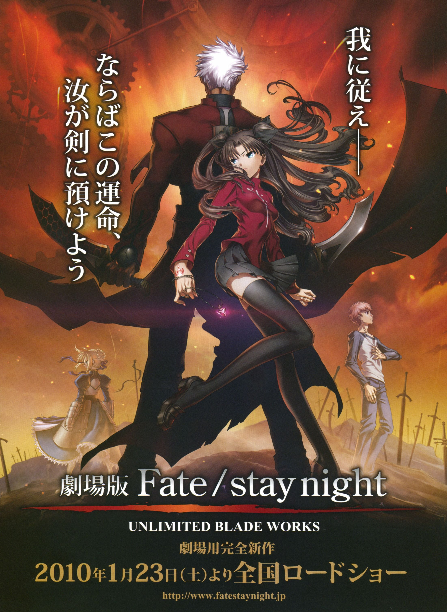
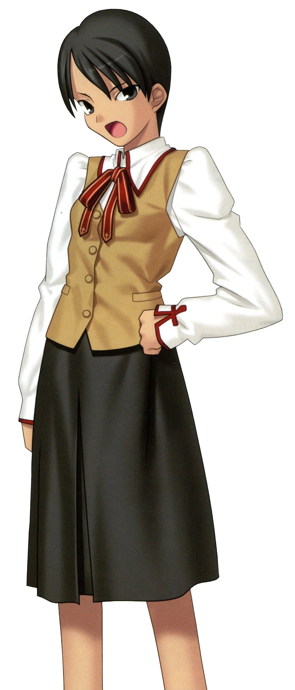

> [!bookinfo|noicon]+ **Fate/stay night UNLIMITED BLADE WORKS**
> 
>
| 日文名 | Fate/stay night UNLIMITED BLADE WORKS |
|:------: |:------------------------------------------: |
| 类型 | 游戏改 |
| 新番 | 2010 年 1 月 |
| 集数 | 共1话 |
| 官网 | [http://www.fatestaynight.jp/](https://http://www.fatestaynight.jp/) |
| 制作 | スタジオディーン |
| 导演 | 山口祐司 |
| 脚本 | 佐藤卓哉 |
| 评分 | 6.9|
| 制片人 |  |

> [!abstract]+ **简介**
> 剧场版以原作「Fate/stay night」的攻略线之一Unlimited Blade Works、原作女主角之一远坂凛为主线展述，将主人公卫宫士郎和Archer的因缘作为故事中心进行描写，沿用TV版的制作班底和声优阵容，

> [!tip]+ **章节列表**
>- [ ] 第1话：Fate/stay night UNLIMITED BLADE WORKS

> [!tip]+ **主要角色**
> 
| 角色 | CV | 简介| 角色图片 |
|:----:|:---:|:---:|:--------:|
| アルトリア・ペンドラゴン | 川澄綾子 | Fate/stay night 被卫宫士郎召唤的英灵。作为三骑士之一的Saber，以「最优秀的剑之骑士」闻名。她曾在第四次圣杯战争中被召唤，当时士郎的养父——卫宫切嗣是她的Master。 她的真实身份是英格兰传说中的英雄——亚瑟王。从石中拔出选王之剑的少女「阿尔托莉雅」，为了成为理想的君主而隐瞒了自己的性别。然而，在内乱中目睹国土荒废的她，认为自己未能胜任王者之位，因此渴望借由圣杯重新选定合格的王，以拯救祖国不列颠。 她拥有不负传说之名的强大力量，但由于与士郎之间缺乏魔力的“通路”，常因魔力不足而陷入苦战。性格极其刻板认真，对于自己是女性的自觉也相当淡薄，以至于一开始总与士郎意见不合。但最终，她在与士郎的相处中肯定了自己的人生，并决心摧毁寄宿着“此世全部之恶”的圣杯。对她而言，能让自己镜像一般的士郎成为Master，或许是再幸运不过的事情了。  Fate/Zero 传说中的骑士王亚瑟现界的身姿，真名是阿尔托莉雅。卫宫切嗣召唤的从者，召唤时所用的圣遗物是Excalibur的剑鞘，她在第四次圣杯战争中保护着作为代理Master的爱丽丝菲尔。 传说中的亚瑟王是男性，那是因为她为了统治方便而隐瞒了性别。拔出选定之剑后身体便不再成长与老化，因此一直是少女的模样。高尚而廉洁、认真而顽固，怀抱的愿望是拯救曾经走上灭亡之路的祖国不列颠。  Fate/Grand Order 不列颠传说中的王。也被誉为骑士王。阿尔托莉雅是幼名，自从当上国王之后，就开始被称为亚瑟王了。在骑士道凋零的时代，手持圣剑，给不列颠带来了短暂的和平与最后的繁荣。史实上虽为男性，但在这个世界内却似乎是男装丽人，行为举止都以男性为标准，因此很不擅长应对异性向自己表达的好感。 崇尚万人眼中正确生活、正确人生的理想王者之一。锄强扶弱，是个无可非议的人物。冷静沉着，无论何时都十分认真的优等生。尽管如此……虽说从不愿意开口承认，但她却有着不服输的一面。对任何需要一争高下的事都不会手下留情，一旦败北则会非常懊悔。 她具有指挥军团的天生才能。在团体战斗中，可令我军的能力提升。贯彻清廉正直，大公无私的王。其公正令骑士们愿意守护于她的身旁，令民众们在对贫困的忍耐中看到了希望。她的王者之路并不是为了统帅少数强者，而是为了领导更多无力之人而存在的。 亚瑟王传说以骑士时代的终结为结局。亚瑟王虽然击退了异民族，但却无法回避不列颠土地的毁灭。圆桌骑士之一·莫德雷德的反叛导致国家一分为二，骑士之城卡美洛也失去了其辉煌。亚瑟王在卡姆兰之丘成功讨伐了莫德雷德，自己却也因负重伤而倒下。在去世前，她将圣剑交给了最后的心腹贝德维尔，离开了这个世界。死后她被送往了理想乡——不存于此世的乐园·阿瓦隆，并打算在遥远的未来再次拯救不列颠。 |  |
| ギルガメッシュ | 関智一 | 号称拥有最强宝具的Servant，将其他所有人都蔑称为“杂种”的傲慢的王者。其真身乃是人类最古老的英灵——英雄王吉尔伽美什。 |  |
| 衛宮士郎 | 杉山紀彰 | 穗群原学园（Homurabara）高中部二年级学生及见习中的魔术师、10年前冬木市（Fuyuki）大火中的少数生还者之一。被身为魔术师的卫宫切嗣所救并收养，受卫宫切嗣的影响，是个英雄迷，并发誓长大之后一定要成为“正义的伙伴”拯救所有受到苦难的人们。所以只要是他人的请求他从不会拒绝。擅长分析物件构造（可以解析眼中所见的任何东西的构造）和修理电器。 虽然是魔术师，不过除了构造把握、强化和投影以外，并不会其他基本的魔术。因为十年前那场大火的关系，在右肩留下一道火烧的伤痕，在礼射时男性要露出右肩，以此原因而退出弓道社。早上为和食派，曾有一段时间教樱作饭，领悟性高的樱很快就学会了。在料理方面不管是日式还是西式都很擅长。在饮食方面对于红茶、日本茶及咖啡一律平等，唯独不喜欢喝梅昆布茶。酒量不好，顶多是撑一下的程度。爱好是修理东西，曾经帮藤村大河的祖父藤村雷画改造摩托车，而从雷画那里拿到大量的零用钱。而加入弓道部的契机，是因为看到体格劣于他人却不服输的性格，雷画推荐他学习弓道。在此之前的相扑似乎也是雷画推荐的。 天生就对剑特别喜好。此外弓术也早已到达了大师的境界，“箭矢呢，是在射出前就已经射中的”，因此他唯一的失误只是因为他本来就没有要让箭矢击中红心。拥有技能：投影魔术的实质与Archer相同，是其心象风景“固有结界—无限剑制”。由于本身的属性是剑，可以投影所有理解范围内的武器（限定为剑，也能投影防具，但通常需要二至三倍的魔力）。因此在UBW线中与英雄王匹敌。（因为本身魔力回路太少，所以透过跟远坂 凛进行性行为建立魔力回路以支撑结界）此外固有结界—无限剑制由于与Archer的心象风景不太相同，因此唱诵的咒文也有一些差别，此外虽然Archer与士郎有相当大的实力差距，但在此线与Archer对战的过程中士郎逐渐吸收了Archer的战斗经验，两人处于势均力敌的状态。 此外，虽然叫做投影，不过一般的投影可以在投影出和原型相似的某种物品后，在加上补强，但是士郎的投影是完全靠自己心中的想像来凭空制造物品，是将内心具现化的技能(同时也是固有结界-无限剑制的基础)。 根据投影的规则，就算完美的投影出宝具，也会比原先的宝具降低一个等级。但是在制剑过程中，会自然了解剑的一切，包含持有过剑的人的剑术武技虽然不到完全拷贝，所以只要投影出来的剑都能够立刻的上手使用，仿佛是自己曾用过的剑一样，但并不是变成真正的武学大师，还是有很大的部份依赖士郎本身学习到的剑术和战斗经验。 在HF线中失去了左手，因而接受了Archer的左手，绮礼曾对两人的肉体契合度异常之高感到惊讶，即使如此，由于Archer的左手拥有远远超越于现在的士郎所拥有的大量魔力回路、战斗经验、投影知识，所以需要以扼杀魔力的圣骸布紧紧封印住，借此骗过身体，若是轻率使用，反而会被手臂侵蚀，唯一的方法便是透过自身的锻炼，在未来成长至足以驾驭左手后，才能够将之自由使用。此外，士郎可使用手臂中所累积的投影知识，在与Rider联手与黑Saber的途中，也曾投影出英灵卫宫曾投影出的结界宝具－炽天覆七重圆环（Lo.Aias），在fate/hollow ataraxia中Archer在最后一日进行决战时，身上便携带当初用来封印左手的圣骸布，该Archer是否为此线中成长并且成功驾驭左手的英灵卫宫这点尚存争议，因HF线最后结局士郎原本的肉体已经崩坏，之后使用的身体是由樱变卖间桐的房子向苍崎橙子购买的人偶（仅有略为提到），其原因可推测为fate/hollow ataraxia是融合本作三线从而发展出类似续篇的关系，极有可能为圣杯所制造的矛盾现象。 士郎的自我治疗能力是来自他体内Excalibur的剑鞘“遗世独立的理想乡（Avalon）”，此宝具必须与Saber建立契约以及她的魔力才能发动，靠近Saber效果更明显。但在游戏中的死亡路线都派不上用场。 此外英雄王的乖离剑・Ea是在“剑”这一武器的概念出现之前所创造出来的，因此士郎无法理解其构造及投影。 |  |
| 間桐桜 | 下屋則子 | 過去のちょっとしたきっかけから、主人公や藤村先生とは家族同然の付き合いを続けている一学年下の後輩。 やや引っ込み思案なおとなしい性格をしているが、時折主人公に対して積極的になる一面も持ち合わせている。 穏やかな日常の象徴で、戦いに巻き込まれる事はないのだが……？ |  |
| エミヤ | 諏訪部順一 | 与凛订定契约·弓兵的英灵。 经常嘲讽他人的现实主义者，不过与凛之间互相有着坚强的羁绊。 喜欢单独行动，明明是Archer却喜欢近身战，拿手的武器是雌雄双刀－干将莫邪，超人的弓技直到Fate/hollow ataraxia才展现。 他本人自称由于召唤时的事故忘了自己的真身为何，拿手的技术是家事全能，凛曾称赞过他泡的红茶非常好喝。 |  |
| メディア | 田中敦子 | 魔术师的英灵。 能够使用自神话时代以后就不存在的高等魔术。 并以柳洞寺当作根据地，擅长策略。 真实身份为美狄亚（Medea），在希腊神话中是以背叛和欺骗闻名的女巫，宝具是“破尽万法之符（Rule Breaker）”，可破除所有魔术效果的短刀，可以将被魔力强化的物体、以契约连起的关系以及用魔力制造的生命回复到“施术之前”的状态。 因自身也是魔术师的关系所以能召唤从者，因此她利用了这个规则漏洞召唤了Assassin。 |  |
| イリヤスフィール・フォン・アインツベルン | 門脇舞以 | サーヴァント・バーサーカーのマスターとして聖杯戦争に参加。 銀色の髪と赤い瞳をした謎の少女。雪をイメージさせる容姿とは裏腹に、無邪気で人懐っこい性格をしている。 物語の導入において、何も知らない主人公に接触するが──── |  |
| 間桐慎二 | 神谷浩史 | 间桐家长男，前任家督间桐鹤野的亲生子。个性相当差劲，欺软怕硬，好色、冷血，在男生之中如同公敌般受到敌视，但因外貌和家中有钱等原因受到一些女孩子欢迎。曾经追求过凛，却被其无视。卫宫士郎中学以来的同学，与士郎曾经关系不错，不过在上了高中之后便开始疏远，后来因为性格等原因而在第五次圣杯战争之中成为对手。弓道部副主将，在弓道上有一定实力。很受女同学欢迎，但在学校的男性朋友就只有士郎。对待自己名义上的妹妹间桐樱十分粗暴，曾因殴打樱让其留下伤痕而被士郎揍过。（之后樱也仍然原谅并对士郎说要好好对待哥哥，原因是「因为哥哥只有你一个朋友」）  虽然出生在魔术世家，但到了慎二这代已经完全没有魔术回路，不过仍具备相当魔术知识。因为持有樱以令咒制作的“伪臣之书”，他也成了参加圣杯战争的御主。在三条路线之中，都有他带着Rider袭击无辜平民的情节（Fate和UBW之中是试图吸取全校师生的生命力，而HF线之中则是在公园袭击路人）。 |  |
| 言峰綺礼 | 中田譲治 | 此次的圣杯战争担任监督的神父，也是教会的“代行者（Executer）”，有着言行复杂常人不能理解的地方。曾参加过上次（第四次）的圣杯战争。远坂凛的监护人及师兄，爱吃麻婆豆腐，虽是代行者，本作中并未使用过圣典（于HF线中绮礼曾提到若想与从者对战取得胜利，必须配备代行者专用武器-圣典，关于圣典使用者，可参照月姬中埋葬机关的代行者－希耶尔（Ciel（シエル））。 第四次圣杯战争中利用远坂时臣后将其杀害，最后与卫宫切嗣争夺圣杯。第四次圣杯战争最后被切嗣射杀，但因为圣杯流出的黑色物质无法污染Gilgamesh而逆流回御主身上，填补了他被射穿的心脏使他复活。详细资讯可以参照‘Fate/Zero’。 喜欢看到人死亡和痛苦，十年前的灾难对他来说也只是愉悦。 事实上在第五次圣杯战争中，他是游戏的最大作弊者，控制Lancer和Gilgamesh两个从者，对士郎来说是相当于“绝对恶”的存在。 在三线中战斗方法与相当大的差异，Fate线中利用圣杯中溢出的污染物攻击，HF线中则是利用黑键及其超凡的肉体能力，甚至可与Assassin（真）匹敌。 此外绮礼也会使用中国拳法，但并非精通，本人表示只是模仿拳师拳路的架式，而没有使用上内力，在Fate/Zero中也曾用此种战斗方式。 会使用洗礼咏唱的技能，是圣典中以“神的教诲”来让世界固定化的魔术基础之中最大的对灵魔术，可让徘徊世间的魂魄归于无的神意之钥，绮礼于HF线曾这此技能对付间桐 臓砚。 过去曾有位妻子，是为身怀病痛的女子，绮礼是为了欣赏她的痛苦才选择她。绮礼尝试让自己像一个普通人一样爱她，最后女子临死前绮礼否认自己爱上她，但女子却笑着说绮礼已经爱上自己了。女子自杀后，绮礼只想着既然要死为何不是自己亲手享受她的死亡，但这样的想法等同否认女子死亡的意义。他不希望女子的死亡毫无意义。 虽然对士郎来说是相当于“绝对恶”的存在，但是说到底，言峰绮礼并不是纯粹意义上的“恶”，而是无法感受常人的喜悦心情的“感情异常者”，在这一层面上说与过分崇拜正义到排斥自身存在的卫宫士郎是身为“感情异常者”的同类。 |  |
| 蒔寺楓 | 結下みちる | 穗群原学园2年A班学生，远坂凛、美缀绫子的同班同学。三年级升入3年A班。田径部三人组之一，搞笑役。 田径部的短跑队员，拥有“穗群的黑豹”之外号。俗称Makiji。 在做美味和想阴谋上是优等生的远坂凛的朋友，凛少有的朋友，作为对手般看待着美缀绫子。爱好为收集风铃、很喜欢玻璃工艺品。那个与凛是爱好一致，假日二人就会去古董店巡游。 家里是历史悠久的吴服屋咏鸟庵，因此也非常适应传统文化。 |  |
| 魔術協会 |  | 国籍・ジャンルを問わず魔術師たちによって作られた自衛・管理団体。魔術を管理し、隠匿し、その発展を使命とする。（無論、名目上ではある） 外敵（教会、自分たち以外の魔術団体、禁忌に触れる人間を罰する怪異）に対抗するための武力と、魔術の更なる発展（衰退ともいう）のための研究機関を持ち、魔術犯罪の防止法律を敷く。 一般社会で魔術がらみの事件を起こしたものは処刑されるが、「正義」「道徳」ではなく、「神秘の漏洩」を防ぐことがその最大の目的。 アトラス院は特に徹底されているが、魔術師は己の研究を公表することはなく、魔術師同士の研究の交流などというものはない（交流などというもがあるとすれば、それは世俗的な権力闘争くらいである）。隣り合った研究室を持つ魔術師同士が、互いが何を研究しているのか知らないなんてことは当たり前。 魔術の研究は一人でするものであり、協会による束縛を嫌う魔術師も勿論いるが、大半の教本と、魔術の実践に適した歪みを抱えている霊地は、協会が押さえている。魔術を学ぶには最高の環境であり、自分の研究こそが最優先の魔術師にとって、それらの魅力は何物にも代え難い。名目上、支配者ではないことを標榜する協会は辞めることは自由だが、そんなことを考える魔術師はそうそういない（封印指定でも受ければしかたないが）。  聖堂教会とは表向きは不可侵であるが、裏では記録に残さないことを条件に現在も殺し合いが続いている。  また、中東圏の魔術基盤、及び大陸（中国）の思想魔術とは互いに相容れず、やはり不可侵を装っている。加え、西洋魔術を扱う魔術協会では呪術は学問ではないとされて蔑視されており、中東圏に大きく遅れをとっている。 |  |
| 聖堂教会 |  | 「普遍的な」意味を持つ一大宗教。その裏側に存在する組織。 教義に反したモノを熱狂的に排斥する者たちによって設立された、「異端狩り」に特化した巨大な部門。これを聖堂教会と呼ぶ。 TYPE-MOON世界最大の組織であり、代行者、各教会が保有する騎士団、そして教会本部が隠し持つ埋葬機関と、強大な戦力を保有しており、吸血種をはじめ、人の範疇から外れてしまった者達にとっての天敵として君臨している。  彼らの目的は全ての異端を消し去り、人の手に余る神秘を正しく管理することである。このため、「神秘の秘匿」を第一主義とする魔術協会とは仲が悪く、幾度と無く刃を交えてきた間柄。しかし彼等にとって最大の敵は吸血種である為、現在は協定が結ばれ、表面上は不可侵を保ち、時として協力し合っている。尤も実際のところは、記録に残さない事を前提に、陰では現在もなお殺し合いを続けている。 ただ、特に教義に反しているというわけではないので、魔術師の持つ根源への渇望には関知しない。 |  |