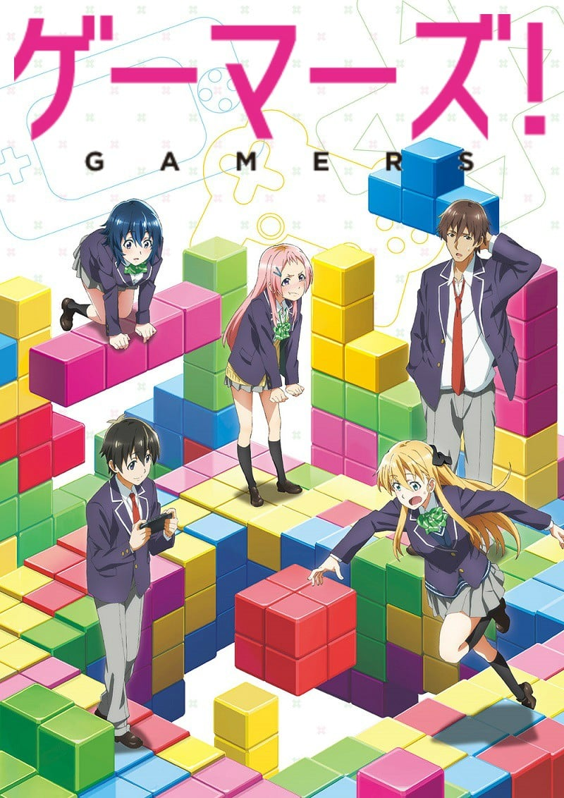
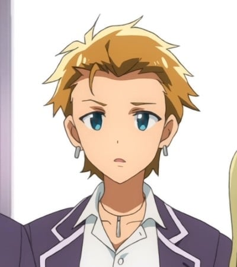

> [!bookinfo|noicon]+ **GAMERS电玩咖**
> 
>
| 日文名 | ゲーマーズ! |
|:------: |:------------------------------------------: |
| 类型 | 小说改 |
| 新番 | 2017 年 7 月 |
| 集数 | 共12话 |
| 官网 | [http://www.gamers-anime.com/](https://http://www.gamers-anime.com/) |
| 制作 | PINE JAM |
| 导演 | 岡本学 |
| 脚本 | 岡本学,内田裕基 |
| 评分 | 6.9|
| 制片人 | 向峠和喜 |

> [!abstract]+ **简介**
> “……和我一起，试着加入游戏部怎样？”兴趣是游戏，除此之外毫无显眼的特征，仅仅是个龙套的游戏玩家雨野景太，某天突然被学园第一的美少女，游戏部部长天道花怜搭话了。
由此开始，景太的日常为之一转，开始了与喜爱游戏的美少女们共度的恋爱喜剧展开的日子……本以为如此！？只有游戏的价值观不同，特立独行的女子玩家星之守千秋。班上的中心人物，虽然有女友却私下里爱好游戏的残念现充上原祐。祐的女友，毫无游戏知识的亚玖璃。
将这些人物一并卷入，重复着互相误会、徒劳无功、陷入迷途，乱成一团的游戏玩家们带来的“擦肩而过青春错综系恋爱喜剧”开幕！

> [!tip]+ **章节列表**
>- [ ] 第1话：雨野景太与受指引的人们 (2017-07-13)
>- [ ] 第2话：上原祐与高难度新游戏 (2017-07-20)
>- [ ] 第3话：星之守千秋与交错通信 (2017-07-27)
>- [ ] 第4话：幕间 天道花怜与低潮期 (2017-08-03)
>- [ ] 第5话：亚玖璃与通信错误 (2017-08-10)
>- [ ] 第6话：Gamers与全灭Game Over (2017-08-17)
>- [ ] 第7话：雨野景太与天道花怜的顶级娱乐 (2017-08-24)
>- [ ] 第8话：黄油玩家与观战模式/Gamers与半生游戏 (2017-08-31)
>- [ ] 第9话：星之守千秋与账户黑客 (2017-09-07)
>- [ ] 第10话：Gamers与Next Stage (2017-09-14)
>- [ ] 第11话：Gamers与青春Continue (2017-09-21)
>- [ ] 第12话：幕间 Gamers与氪金Talk (2017-09-28)

> [!tip]+ **主要角色**
> 
| 角色 | CV | 简介| 角色图片 |
|:----:|:---:|:---:|:--------:|
| 雨野景太 | 潘めぐみ | 本作男主角。音吹高中二年级生，喜爱游戏的平庸高中生，从家用机到社交游戏的全部游戏都喜欢，但水平却很差。平凡又没有特点，没有朋友的落单族，经常负面思考的巨蟹座。同时也是造成花怜日后“崩坏”的元凶。 |  |
| 天道花憐 | 金元寿子 | 容姿端麗、成績優秀、頭脳明晰、スポーツ万能と現実の人間とは思えないスペックを誇る美少女。いわゆる「学内アイドル」だが、ゲーム部部長という顔も持つ。 |  |
| 星ノ守千秋 | 石見舞菜香 | 音吹高中二年级生，天道的同班同学。除了喜爱游戏，也是一位免费游戏制作者。 虽然和景太兴趣相投到像分身的程度，且对于游戏的价值观也几乎雷同，但千秋与景太在“萌”这个要素究竟该不该存在于游戏中产生分歧因而大吵一架。实际上真实身份就是景太喜爱的社交游戏上的战友‘MONO’和景太最喜欢的游戏制作人‘NOBE’。 |  |
| 桜野亜玖璃 | 大久保瑠美 |  |  |
| 上原祐 | 豊永利行 |  |  |
| 三角瑛一 | 花江夏樹 |  |  |
| 加瀬岳人 | 内匠靖明 |  |  |
| 大磯新那 | 芳野由奈 |  |  |
| 星ノ守心春 | 桑原由気 | 碧阳国中的学生会长。虽然外表看不出来，但其实非常喜欢工口游戏。 |  |
| 美嘉 | 石上静香 |  |  |
| 大樹 | 山下誠一郎 |  |  |
| 雅也 | 石谷春貴 | 上原祐の友達。 |  |