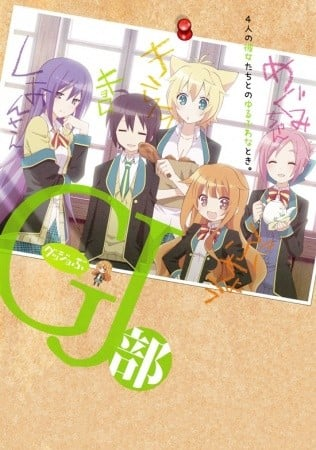
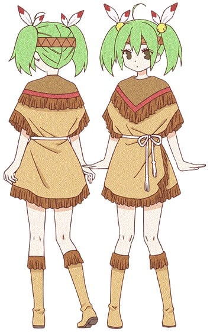
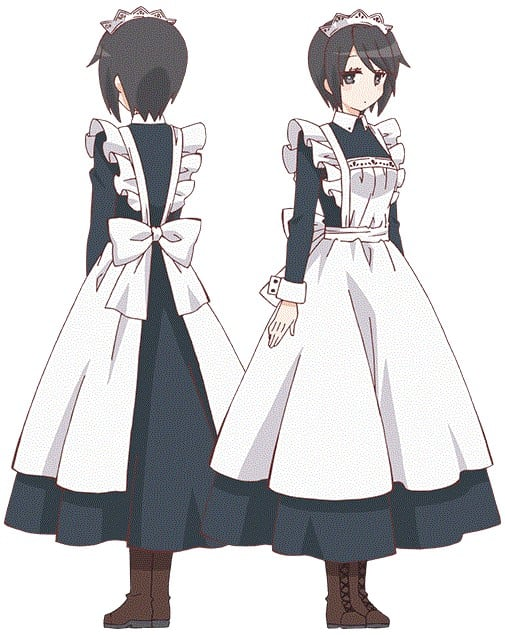
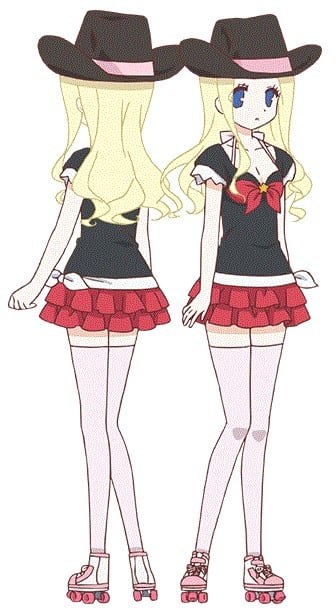

> [!bookinfo|noicon]+ **GJ部**
> 
>
| 日文名 | GJ部 |
|:------: |:------------------------------------------: |
| 类型 | 小说改 |
| 新番 | 2013 年 1 月 |
| 集数 | 共12话 |
| 官网 | [http://www.ntv.co.jp/gj/](https://http://www.ntv.co.jp/gj/) |
| 制作 | 動画工房 |
| 导演 | 藤原佳幸 |
| 脚本 | 子安秀明 |
| 评分 | 7|
| 制片人 | 鎌田肇 |

> [!abstract]+ **简介**
> 改编自号称“四格小说”的同名轻小说。
故事主要讲述了主人公四之宫京夜与他所属的活动内容不明的GJ部的部员们——有着要强性格的部长天使真央、游戏天才皇紫音、性格我行我素的天使惠、身体丰满的绮罗々・伯恩斯坦以及之后的新入部员的神无月环交织而成的日常小故事。

> [!tip]+ **章节列表**
>- [ ] 第1话：我是GJ部！ (2013-01-09)
>- [ ] 第2话：友情・爱情・她的异常？ (2013-01-16)
>- [ ] 第3话：GJ線上的Kyoro (2013-01-23)
>- [ ] 第4话：放学后文化祭派对 (2013-01-30)
>- [ ] 第5话：双重幻想 (2013-02-06)
>- [ ] 第6话：闯进四个妹妹！？ (2013-02-13)
>- [ ] 第7话：新部员出现了 (2013-02-20)
>- [ ] 第8话：妹妹・突袭！ (2013-02-27)
>- [ ] 第9话：GJ线上的kyoron・新生 (2013-03-06)
>- [ ] 第10话：艺术和食欲和袭击之秋 (2013-03-13)
>- [ ] 第11话：协・定・解・除 (2013-03-20)
>- [ ] 第12话：说声GJ部再见 (2013-03-27)

> [!tip]+ **主要角色**
> 
| 角色 | CV | 简介| 角色图片 |
|:----:|:---:|:---:|:--------:|
| 四ノ宮京夜 | 下野紘 | 姑且算是主人公，爱称是キョロ（kyoro）的高中一年生。逍遥自在的和平主义者，因为总是说出不合时宜的台词而每天遭到GJ部其他成员的欺负。 |  |
| 天使真央 | 内田真礼 | 高中二年生，GJ部的部长，天使恵的姐姐。一有不合意的地方就会找京夜的麻烦，不过也有纯真的地方，连带有接吻场面的漫画都不好意思去看。 |  |
| 皇紫音 | 三森すずこ | 高中二年生，不论是自己还是别人都公认的天才。有着大人一般的性格，总是在调戏京夜。而与外表不符的是，欠缺致命的常识，偶尔会犯异常的错误。 |  |
| 天使恵 | 宮本侑芽 | 高中一年生，真央的妹妹（GJ部第5卷后为二年级）。性格和姐姐相反，温柔有礼、心胸开阔。但是惹火惠似乎会很不好过，对体重非常在意。 |  |
| 綺羅々・バーンシュタイン | 荒川ちか | 高中二年生，无口的奇妙“野生”人类，什么时候都会有一只手里拿着肉，偶尔还会和动物对话。 |  |
| 四ノ宮霞 | 木戸衣吹 | 京夜の妹。GJ部の校外活動にたまに参加する。真央のことを年下だと思っている。初登場時は小学6年生（「GJ部」第5巻から中学1年生）。中学生になってからは、聖羅やジェラルディンらと度々GJ部の部室へも顔を出すようになり、GJ部への憧れから、中等部でGJ部中等部を設立する。 「GJ部中等部」第1巻からは中学2年生となり、同好会から正式に部となったGJ部中等部の部長を務める。数学オリンピック級の数学力の持ち主で、暗算が得意。 |  |
| 神無月環 | 上坂すみれ | 第5卷后GJ部的新入部员。昵称“タマ”。被四之宫京夜在俺特曼模式下错叫做“狸猫”，家里是神社。有一名弟弟。 |  |
| 森さん | 恒松あゆみ | 是个女仆，见到京都会转一圈。有女儿。 |  |
| 森さん | 恒松あゆみ | 天使家の侍従の女性。年齢は不詳。本名は森羅万象（しん らばんしょう）。愛車はハーレー。副業として、仕事の合間にスマートフォンで株の売買を行っている。土曜日と日曜日は見た目がそっくりな母親と入れ替わっている。森さん（娘）は京夜のことを気に入っているようで、森さん（母）の方は京夜に髪の毛をブラッシングしてもらった経験がある。小森同様、たまに不調の日があり、皿を割ったり、料理を焦がしたりしてしまう。健太からは「大きいトモちゃん」と呼ばれる。 |  |
| 天使聖羅 | 諸星すみれ | 真央・恵の妹。霞・ジェラルディンとは中学校のクラスメイト（『GJ部』第5巻から中学1年生）。物腰丁寧で礼儀正しい少女であるが、一部の人間にだけ聴こえる副音声（初登場から『GJ部中等部』第7巻までの間で作中の登場人物で聞こえてないとされるのは恵、仁、冴子の3人）で毒舌を振るうが、本人は聞こえていないものと思っていた。但し、姉達や友人のお気に入りとなっている京夜に対して「私にまで」と告げていることから半ば多重人格とも取れる発言をしている。狐の面を横掛けにしているが、面なら何でもいい模様。何らかの面を着けていないと落ち着きを無くしてしまうが、特訓の結果短時間なら面が無くても平常通りに振る舞えるようになった。真央のことは「姉さま」、恵のことは「姉様」と呼ぶ。聖羅が天使家の当主であり、会ったことのない許嫁が第8候補まで居る。 『GJ部中等部』第1巻からは中学2年生（『GJ部中等部』第5巻より中学3年生。『GJ部ロスタイム』から高校生）になり、GJ部（中等部）の副部長を自称している。メールで頻繁にラブレターを貰うほど、男子に人気がある。森や小森に頼りがちで、日常生活のスキルが低い。GJ部中等部設立の際、男子囲碁部との部室を賭けた囲碁勝負で、囲碁部の助っ人の院生に勝利したほどの実力の持ち主だが、後にリベンジされてしまい、一度は部室を失いかけたが、使っていないプレハブ小屋を新たな部室にしている。仁のことを弟のように見ていたが、成長著しい現状に戸惑っていることを理央から指摘されている他、複雑な家庭事情に踏み込もうとする等、認識を徐々に変えつつある。 |  |
| ジェラルディン・バーンシュタイン | 葵わかな | 綺羅々の妹。綺羅々は養女であるため、戸籍上はジェラルディンがバーンシュタイン家の長女である。作中の2度目の春（『GJ部』第5巻）に、姉を慕いカナダから日本にやってきて日本の学校に通い始める。霞や聖羅と同学年で、中学1年生では2人と同じ学校の同じクラスになる。日本語での会話は苦手であり、ホワイトボードを用いて会話をする。霞・聖羅と合わせて「シスターズ」などと書かれることもある。京夜とは初めて会った時から惹かれていたが、『GJ部中等部』第6巻では理央にその気持ちが「尊敬の念」なのか「恋愛感情」なのかが解ってない節を指摘されている。 『GJ部中等部』第1巻からは中学2年生（『GJ部中等部』第5巻より中学3年生。『GJ部ロスタイム』から高校生）。進級して、霞・聖羅とは3人それぞれ別々のクラスに別れてしまった。年の割にスタイルが良く、仁はやきもきすることがある。将来は日本への帰化も視野に入れているが、納豆は苦手。 |  |