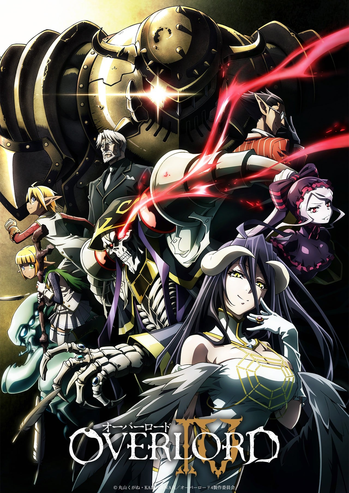
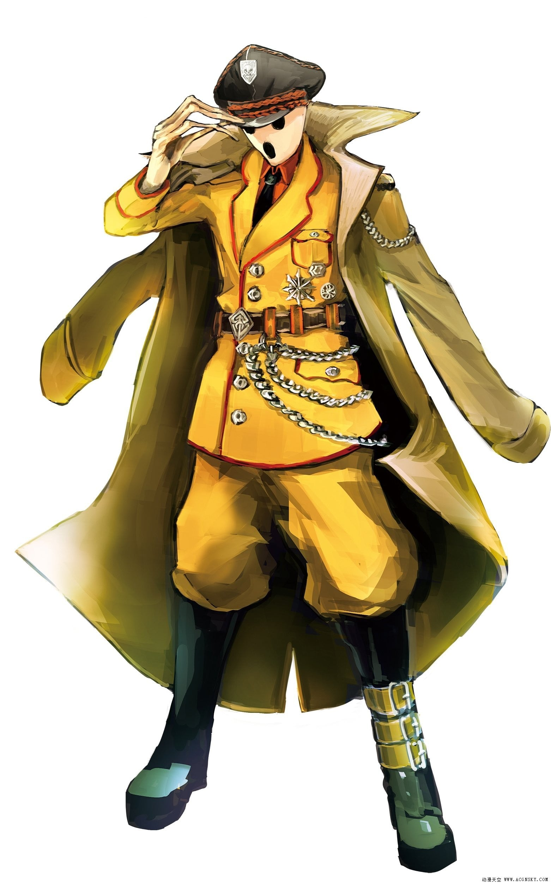
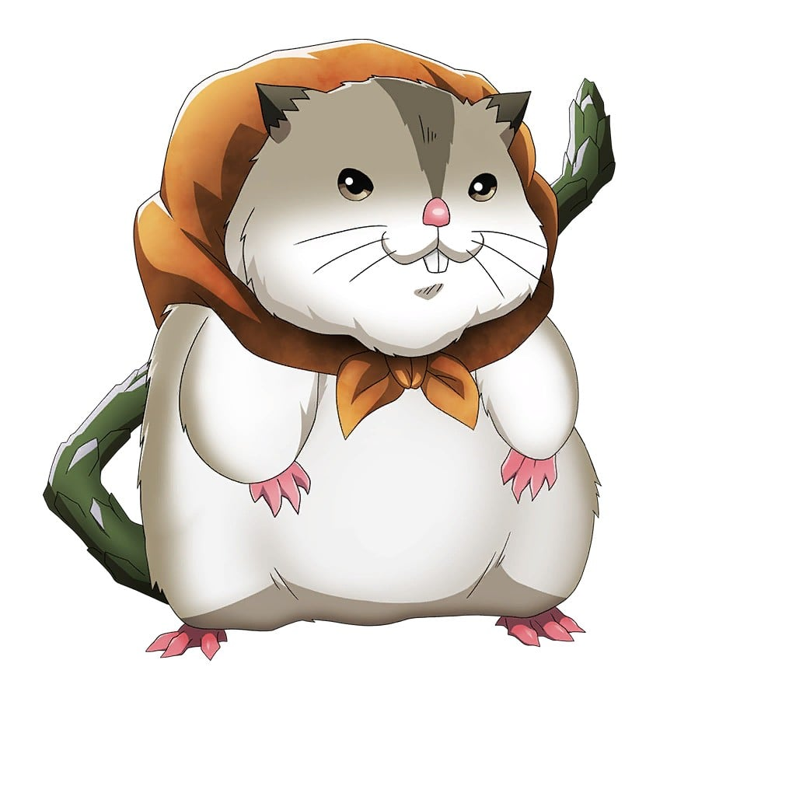
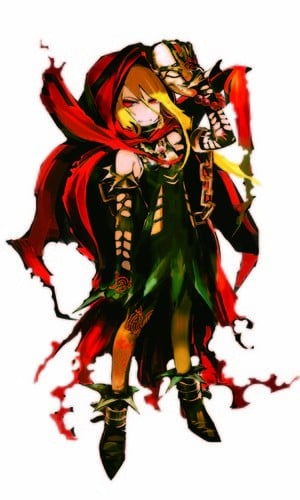

> [!bookinfo|noicon]+ **OVERLORD 第四季**
> 
>
| 日文名 | オーバーロードIV |
|:------: |:------------------------------------------: |
| 类型 | 小说改 |
| 新番 | 2022 年 7 月 |
| 集数 | 共13话 |
| 官网 | [http://overlord-anime.com/](https://http://overlord-anime.com/) |
| 制作 | MADHOUSE |
| 导演 | 伊藤尚往 |
| 脚本 | 菅原雪絵 |
| 评分 | 6.6|
| 制片人 | 橋本健太郎 |

> [!abstract]+ **简介**
> アインズは悩んでいた。
アインズ・ウール・ゴウン魔導国の王として、この国をどのように導くのか。

アルベド、デミウルゴスら優秀なNPCたちと不眠不休で働けるアンデッドによって、
魔導国は今や安全で飢えもない場所となっている。
しかし、そこで暮らす人々はいまだ恐怖と不安を抱え、
街は火が消えたように静かでかつての活気は失われていた。

答えが見つからぬ中、アインズは一人で冒険者組合を訪問。
組合長のアインザックにある提案をする。

一方、突如できた魔導国に戸惑う諸国の支配者たちも各々に対抗策を講じていた。
果たしてアインズは各国の謀略を阻み、自身の理想郷を作ることができるのか。

> [!tip]+ **章节列表**
>- [ ] 第1话：安兹·乌尔·恭魔导国 (2022-07-05)
>- [ ] 第2话：里·耶斯提杰王国 (2022-07-12)
>- [ ] 第3话：巴哈斯帝国 (2022-07-19)
>- [ ] 第4话：谋略统治者 (2022-07-26)
>- [ ] 第5话：求见矮人国 (2022-08-02)
>- [ ] 第6话：逼近的危机 (2022-08-09)
>- [ ] 第7话：霜之龙王 (2022-08-16)
>- [ ] 第8话：计算之外的一手 (2022-08-23)
>- [ ] 第9话：通往灭亡的开始 (2022-08-30)
>- [ ] 第10话：最后的王 (2022-09-06)
>- [ ] 第11话：被布下的陷阱 (2022-09-13)
>- [ ] 第12话：王都侵攻 (2022-09-20)
>- [ ] 第13话：灭国的魔女 (2022-09-27)

> [!tip]+ **主要角色**
> 
| 角色 | CV | 简介| 角色图片 |
|:----:|:---:|:---:|:--------:|
| アインズ・ウール・ゴウン | 日野聡 | 职位：至高无上的四十一位至尊 住处：纳萨力克地下大坟墓地下第九层的房间 属性：极恶↔正义值:-500 种族：骷髅魔法师(Skeleton Mage)Lv15 死者大魔法师(Elder Lich)Lv10 死之统治者(オーバーロード overlord)Lv5 职业：死灵法师(ネクロマンサー Necromancer)Lv10 巅峰不死者Lv10 持有：十一个世界级道具 公会武器：安兹乌尔恭之杖 <复活魔杖/wand of resurrection>(蘇生の短杖/ワンド・オブ・リザレクション) 无限背包(インフィニティ・ハヴァサック) 在网路游戏「YGGDRASIL」关闭运营的最后，依旧留在游戏中等待系统强制登出时，意外穿越至异世界的本书的主人公。现实世界当中是一名喜欢电玩的普通青年，在游戏中是一名拥有骷髅外表的最强魔法咏唱者，所属「安兹．乌尔．恭」公会。 元角色名音译为“莫莫伽”。 在第一卷中把自己的名字改为安兹·乌尔·恭，作为纳萨里克的象征及核心。 |  |
| アルベド | 原由実 | 职位：纳萨力克地下大坟墓的守护者总管 王妃(自称) 住处：王座之厅 纳萨力克地下大坟墓地下第九层的一个房间 属性：极恶↔正义值：-500 种族：小恶魔（インプ Imp）Lv10 职业：守护者(ガーディアン)Lv10 黑色护卫Lv5 邪恶骑士Lv10 护卫之主Lv5 持有：一个世界级道具 制作者：タブラ・スマラグディナ 由主角公会成员之一翠玉录所创建的NPC，职务为纳萨力克地下大坟墓的守护者总管 性格原本被设定成“贱人”，但飞鼠在游戏关闭运营的最后时刻抱着“反正是最后了”的心情更改为：爱着飞鼠 是主角的得力助手，在所有守护者中防御力最强。 |  |
| シャルティア・ブラッドフォールン | 上坂すみれ | 职位：纳萨力克地下大坟墓地下第一至三层守护者 住处：不明 属性：邪恶~极恶↔正义值：-450 种族：吸血鬼真祖(トゥルー・ヴァンパイア)Lv10 职业：被诅咒的骑士(カースドナイト)Lv5 持有：神器级武器-滴管长枪（能力是生命吸取） 制作者：ペロロンチーノ 守护者之中单挑最强，持有多种特殊能力和生命吸取，异常状态抗性等，令安兹陷入苦战。 |  |
| マーレ・ベロ・フィオーレ | 内山夕実 | 职位：纳萨力克地下大坟墓地下第六层守护者 住处：纳萨力克地下大坟墓地下第六层的大树 属性：中立～恶↔正义值：-100 种族：暗精灵 职业：森林祭司(ドルイド Druid)Lv10 高级森林祭司Lv10 大自然先锋Lv10 灾厄使徒Lv5 森林法师Lv10 制作者：ぶくぶく茶釜 亚乌菈的弟弟（伪娘），守护者中魔法系最强。给人印象胆小怕事，言行吞吞吐吐扭扭捏捏，但其实只是创造主给与的属性，行凶时只有表面的扭捏眼神毫无感情可言。 |  |
| アウラ・ベラ・フィオーラ | 加藤英美里 | 职位：纳萨力克地下大坟墓地下第六层守护者 住处：纳萨力克地下大坟墓地下第六层的大树 属性：中立～恶↔正义值：-100 种族：暗精灵 职业：游击兵Lv5 驯兽师(ビーストテイマー)Lv5 射手Lv5 狙击手Lv5 高级驯兽师Lv10 制作者：ぶくぶく茶釜 马雷的姐姐，假小子性格。拥有多种高级魔兽作为下仆，团战最强的存在。持有广域侦察技能，森林中的王者。 |  |
| デミウルゴス | 加藤将之 | 职位：纳萨力克地下大坟墓地下第七层守护者 住处：纳萨力克地下大坟墓地下第七层赤热神殿 属性：极恶↔正义值：-500 种族：小恶魔（インプ Imp）Lv10 最高阶恶魔(アーチデヴィル Archdevil)Lv5 职业：混沌(カオス)Lv10 黑暗王子Lv10 变形魔(Shapeshifter)Lv10 制作者：ウルベルト・アレイン・オードル 守护者中的军师，各种特殊能力，有着最精明的头脑，时常向安兹提出建言。对纳萨力克的同伴很温柔，些外则非常残忍无道并以此为乐，跟赛巴斯的关系不太好。 |  |
| コキュートス | 三宅健太 | 职位：纳萨力克地下大坟墓第五层守护者 住处：纳萨力克地下大坟墓第五层大白球(Snowball Earth) 属性：中立↔正义值：50 种族：昆虫战士(Insect Fighter)Lv10 虫王(Worm Lord)Lv10 职业：剑圣(ケンセイ)Lv10 阿修罗Lv5 尼福尔海姆骑士Lv5 制作者：武人武御雷 守护者中使用武器最强，武士性格，一根筋的角色。十分憧憬侍奉安兹的后代并陷入联想中。 |  |
| ナーベラル・ガンマ | 沼倉愛美 | 種族レベル：二重の影（ドッペルゲンガー）Lv1 職業レベル：ウォー・ウィザードLv10など ナザリックにおいて戦闘能力を持つ6人のメイド、チーム「プレアデス」の1人。 種族レベルを最低限の1に抑え、それを除くレベルの全てを職業クラスに割り振った生粋の魔法職。 ナザリックの全般的な傾向である人間蔑視の思想を強く持つ一人である。やや短気なところがあり、毒舌家。 真の姿はナザリックでは過半を占める異形種のものであるものの、彼の地では希少な人間と変わらない姿を常から取れるNPCであることを見込まれ、アインズの勅命を受ける。 ウェブ版では凡庸な姿をした男性「モモン」に姿を偽り、冒険者ギルドに潜入しての情報収集に従事する。 書籍版では普段の姿のままで漆黒の英雄「モモン」の相方、美姫「ナーベ」として活動する。こちらでは力を抑えてはいるが、本来の魔法詠唱者としてモモンをサポートする。しかし、崇拝する主人の傍らという環境もあってか人間を侮蔑する性格を全く隠しきれておらず、事ある度に敵意と暴言を飛ばすためアインズからは度々釘を差されている。 仮の姿はウェブ版ではサイドテール、書籍版ではポニーテールという違いはあるものの、黒髪の極めて端正な容姿をしていることに変わりはない。 |  |
| エントマ・ヴァシリッサ・ゼータ | 真堂圭 | 種族レベル：蜘蛛人（アラクノイド）Lv10ほか 職業レベル：フジュツシLv10など 制作者：源次郎 ナザリックにおいて戦闘能力を持つ6人のメイド、チーム「プレアデス」の1人。精神系魔法詠唱者。 アインズの前ではかしこまっているものの、語尾をはじめ全体的に幼く甘ったるい喋り方をする。符術師と蟲使いの職業を修めている。 ソリュシャンと共に人間を食材として好むプレアデスメンバーであるが、嗜虐して楽しむ一面も持つ彼女とは違い単純な食料と捉える傾向が強い。通常は声同様に幼げで整った姿であり、和服調のメイド服を纏っているがその本性は異形。顔も声も蟲で擬態したものであり、シニヨンにした髪も偽毛とされている。 ウェブ版では、ほっそりとした体つきで艶やかな黒髪をサイドアップでまとめた、端正な顔立ちをした大人しげな女性。魔法戦士の職業を修めている。 書籍版では王都を舞台にした一大作戦「ゲヘナ」においてマーレと共にヒルマの屋敷を襲撃したが、その帰りに単独でいた所をガガーランと遭遇し、性格上見過ごせなかった彼女と交戦する羽目になる。レベルと種族としての地力や装備の差、召喚主とは独立して行動する蟲と自己強化・攻撃などに使用する符などによって、ティアの加勢後も彼女たちを終始翻弄した。 人間を侮り食料として捉えながらも油断することなく相手の出方を伺っては追い詰め、とどめの間際まで追い詰めるも自身と互角の強者であるイビルアイの乱入を受ける。彼女の発言に激昂し切り札を晒して襲い掛かるが、自分自身と使役する蟲武器の両方にとって特効となる殺虫魔法によって顔と声の両方を構成する蟲を殺されてしまう。 ここに至りなりふり構わず、蜘蛛の足や多種多様の糸など種族に由来する能力も加え全身で三人の蒼の薔薇チームと激闘を繰り広げるが手数と絆の差によって敗北。デミウルゴスの助けによって瀕死の状態で辛くも逃れる。イビルアイと再び対峙した際もその憎悪は衰えることはなかったが、顔の蟲は元通りでも声は彼女の嫌う本来のものそのままであった。 |  |
| パンドラズ・アクター | 宮野真守 | 種族レベル：上位二重の影（グレータードッペルゲンガー）Lv10ほか 職業レベル：エキスパートLv10など 制作者：モモンガ（アインズ） ナザリック宝物殿の領域守護者。宝物殿の管理のほか、金貨の出納などを行う財政面での責任者でもある。 同じドッペルゲンガー系列でも変化できる姿をギルドメンバーのデザインした普段のひとつに絞ったナーベラルとは違い、「至高の四十一人」全員の外装をコピーし、その能力の八割ほどを行使できるLv100NPCである。そのためアインズ（モモン）の影武者を務めることも可能であり、明言こそされていないものの主人の代行を度々している。 ウェブ版では、ピンク色の卵に似た頭部に眼鏡をかけ、ダークスーツに白シャツやネクタイ、黒い革靴と紳士風の衣服を着込んでいる。 書籍版では、ナチス親衛隊制服に酷似した軍服を身に纏っている。 マジック・アイテム・フェチであり、伊達男のような派手な言動・挙動で周囲を振り回すその姿は、制作者であるモモンガ自身が「格好いい」と思っていた忘れたい過去＝黒歴史そのものであった。 そのため、設定上ナザリックトップクラスの頭脳と知略に加え上記の通り利便性に富む能力を持ちながらも、かつてのギルドメンバーの姿を永久保存する意味もあってアインズ本人は表に出すことを躊躇していた。 |  |
| ハムスケ | 渡辺明乃 | 職業レベル：ユグドラシルに同種がいないため不明。 書籍版のみでの登場。 アインズが冒険者「モモン」として名声を高める過程で出会ったモンスター。 「エ・ランテル」近郊では「森の賢王」と称され数百年を生きた伝説の魔獣として広まっており、ナザリック近隣のトブの大森林南部を縄張りとしていた。 一人称「それがし」、語尾に「ござる」など、口調・響きともに厳しい戦士か侍のそれであるが、外見は人間1人が騎乗可能なほど巨大なジャンガリアンハムスターそのものである。 鱗に覆われた20メートルの尾から繰り出される強烈な一撃や、体毛に浮かぶ文様から発動される8種ほどの魔法、推定で30レベル強とされるステータスなどこの世界基準では確かに伝説であり、周囲の認識もそれ相応に高い。ただし、ナザリック基準では貧弱な部類であり、前評判通りに強大な魔獣として扱う周囲との美的感覚のあまりなギャップにアインズに脱力される。アインズが少しばかり本気を出したため、それに怖れをなして頭を垂れ、彼を「殿」と呼んで忠誠を誓うようになる。この際に「ハムスケ」と命名された。 その後は名声のシンボル、看板の意味や騎乗する馬の代わりなどとして「モモン」としての行動の際はともに行動し、ナザリックでは戦士クラス習得のための実験体兼アインズのペットとして扱われている。アインズも複雑な心境を抱えつつ微妙に愛着を持ってきてはいるが、それが祟ってナザリックNPCたちの妬心を買う羽目になっている。 |  |
| イビルアイ | 花守ゆみり | 魔力系魔法詠唱者。全身を黒いローブで、顔を仮面で覆い隠した謎多き女性。 八欲王の秘宝や十三英雄の実態についてなど、世界の裏側について多くの知見を持つ知恵者。法国の立ち位置について、己が狩られる立場にあると知りつつ一定の賛意を送るなど、大局を知り含意を含んだ意見も持つ。 その正体は二百五十年の時を生き、かつて一国を滅ぼしたという吸血鬼「国堕とし」。外見年齢12歳程度と言う幼い姿に膨大な知識と魔力を詰め込んでいる。その実力は「蒼の薔薇」でも一線を画する。プレアデスの一人エントマと単独で互角以上に戦える実力を持つ為、ユグドラシル基準でLv50以上と推測される。 書籍版では、ヤルダバオトに追い詰められたところを圧倒的な実力をもって参戦したモモンに惚れこむが、実際はエントマを殺しかけたことからモモンに憎悪を抱かれている。ヤルダバオト討伐に実力の近さからモモンと同行した際は互いに戦友として認識していると勘違いをしており、男女の仲に発展することを期待さえしていた。 なお、特殊な指輪をつけることによってアインズのアンデッド感知スキルを誤魔化した為、正体はばれていない。 |  |