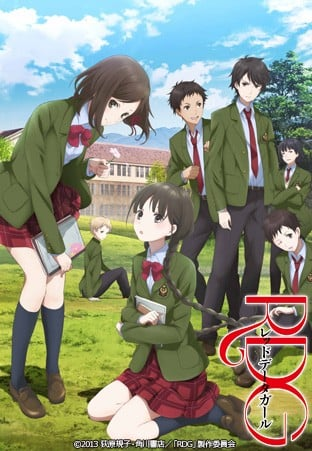

> [!bookinfo|noicon]+ **RDG 濒危物种少女**
> 
>
| 日文名 | RDG レッドデータガール |
|:------: |:------------------------------------------: |
| 类型 | 小说改 |
| 新番 | 2013 年 4 月 |
| 集数 | 共12话 |
| 官网 | [http://rdg-anime.jp/](https://http://rdg-anime.jp/) |
| 制作 | P.A.WORKS |
| 导演 | 篠原俊哉 |
| 脚本 | 横手美智子 |
| 评分 | 6.3|
| 制片人 |  |

> [!abstract]+ **简介**
> 就读凤城学园的15岁少女泉水子，自少便在熊野古道的玉仓神社之中长大。泉水子是名颇害羞的少女，而且所有给她触碰到的电子产品也必定损坏。当她想到想离开这熊野古道并往城巿里居住的时候，她的监护人雪政却建议她往东京的鳯城学园就读，并逼他的儿子深行与泉水子同行，以便照顾她。起初，泉水子与深行也互相讨厌大家，但当一件怪异的事件发生在今年以「战国时代」为主题的学园祭上，他们的关系便产生变化。在这事件中，泉水子得知她是姬神的最后一名依代，而深行则是泉水子的山伏守护者。作为姬神的最后一名依代，作为濒临灭絶的姬神依代，泉水子与深行将展开改变世界的事件。 

> [!tip]+ **章节列表**
>- [ ] 第1话：初来的转学生 (2013-04-03)
>- [ ] 第2话：第一次牵手 (2013-04-10)
>- [ ] 第3话：第一个神使 (2013-04-17)
>- [ ] 第4话：第一个室友 (2013-04-24)
>- [ ] 第5话：第一次化妆 (2013-05-01)
>- [ ] 第6话：第一次留宿 (2013-05-08)
>- [ ] 第7话：第一次迷路 (2013-05-15)
>- [ ] 第8话：第一次许愿 (2013-05-22)
>- [ ] 第9话：第一次展示 (2013-05-29)
>- [ ] 第10话：第一个学园祭 (2013-06-05)
>- [ ] 第11话：第一次拒绝 (2013-06-12)
>- [ ] 第12话：世界遗产少女 (2013-06-19)

> [!tip]+ **主要角色**
> 
| 角色 | CV | 简介| 角色图片 |
|:----:|:---:|:---:|:--------:|
| 鈴原泉水子 | 早見沙織 | 凤城学园1年生。 由于眼睛很像母亲，十分灵光，所以佩戴着母亲给的眼镜。其实不戴眼镜也看得到，但有散光及远视。 起初讨厌深行，后对其产生好感。 |  |
| 相楽深行 | 内山昂輝 | 泉水子的青梅竹马、同班同学。山伏的家系。曾看过泉水子跳舞。小时候（五岁）拿球反复扔泉水子的背。成绩优异。 |  |
| 和宮さとる | 釘宮理恵 | 存在感稀薄的身材矮小的男子，因由泉水子的愿望而生。 |  |
| 相楽雪政 | 福山潤 | 深行的父親，十分重視作為姬神附身容器的泉水子，並令其兒子深行和泉水子同校。 |  |
| 宗田真響 | 米澤円 | 就讀高中部1年A班，宿舍與泉水子同室的女孩。國中時期三年的成績為學年第二，在男女生之間皆有人氣。 |  |
| 宗田真夏 | 石川界人 | 就讀高中部1年C班。真響的弟弟，靠著真響的關係而進鳳城學園就讀。嗜好是流鏑馬。是頗為坦率的少年。 |  |
| 宗田真澄 | 木村良平 | 與真響、真夏為三人兄弟，年幼時已過世。 |  |
| 高柳一条 | 野島裕史 | 就讀高中部1年A班。為陰陽師家族的名門子弟，能夠役使式神。 國中時期三年的成績皆是學年第一。 |  |
| 如月・ジーン・仄香 | ブリドカットセーラ恵美 | 現任學生會會長。總是穿著男生制服。目前在學習日本舞。 |  |
| 村上穂高 | 石田彰 | 前學生會會長。現被稱為「影子學生會長」。教授仄香日本舞的技巧。 |  |