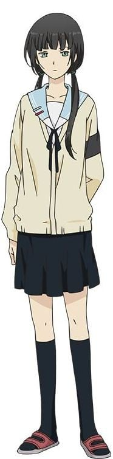
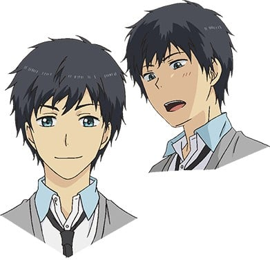

> [!bookinfo|noicon]+ **ReLIFE**
> 
>
| 日文名 | ReLIFE |
|:------: |:------------------------------------------: |
| 类型 | 漫改 |
| 新番 | 2016 年 7 月 |
| 集数 | 共13话 |
| 官网 | [http://relife-anime.com/](https://http://relife-anime.com/) |
| 制作 | トムス・エンタテインメント |
| 导演 | 小坂知 |
| 脚本 | 兵頭一歩,横手美智子 |
| 评分 | 7.7|
| 制片人 |  |

> [!abstract]+ **简介**
> 海崎新太（27岁）在作为新毕业生进入的公司工作了3个月就辞职了。
之后他的就职活动也不顺利。
双亲寄来的生活费也中断了，不得已只好回到乡下。
能够倾听他烦恼的朋友和女友全都没有……
穷途末路的海崎面前出现了一位神秘人物·夜明了。
夜明向海崎提出，要他参加以尼特为对象的社会复归程序“ReLIFE”。
其内容是，利用神秘的秘药，仅仅让外表回复年轻，并在一年内以高中生的身份去读高中——。

> [!tip]+ **章节列表**
>- [ ] 第1话：海崎新太(27)无业 (2016-07-01)
>- [ ] 第2话：沟通能力0分 (2016-07-08)
>- [ ] 第3话：因为是大叔 (2016-07-15)
>- [ ] 第4话：坠落 (2016-07-22)
>- [ ] 第5话：重叠 (2016-07-29)
>- [ ] 第6话：才不是初次见面 (2016-08-05)
>- [ ] 第7话：实验对象001→002 (2016-08-12)
>- [ ] 第8话：龟裂 (2016-08-19)
>- [ ] 第9话：复仇 (2016-08-26)
>- [ ] 第10话：大家的任性 (2016-09-02)
>- [ ] 第11话：过去之旅 (2016-09-09)
>- [ ] 第12话：双重危机 (2016-09-16)
>- [ ] 第13话：告白 (2016-09-23)

> [!tip]+ **主要角色**
> 
| 角色 | CV | 简介| 角色图片 |
|:----:|:---:|:---:|:--------:|
| モブキャラクター | 置鮎龍太郎 | 闲角，常称作路人，在电视剧、电影等作品中，指戏份薄弱的副角、不相关的小人物、串场的闲杂人等。可能用来表达地方民众的声音，或是充当背景。 モブキャラクター（mob character）とは、漫画、アニメ、映画、コンピュータゲームなどに描かれる端役のこと。群衆（群集）、または主要キャラクター以外の、その他大勢のこと。群集キャラ、背景キャラともいう。 |  |
| アナウンス | 鳴海杏子 | 各作品通用广播/播音员。 |  |
| 女子生徒 | 鳴海杏子 |  |  |
| 男子生徒 | 生田鷹司 |  |  |
| 日代千鶴 | 茅野愛衣 | 青叶高中3年3班34号，12月25日生，B型，身高162cm。 成绩优秀，学年第一的天才，每年开学试中均获得班级第一而成为班长。但社交能力很差，因此经常单独一人并没有朋友，虽然如此，但也勇于改变自己的积极派。与新太沟通过后成为朋友。有遇到不解的问题立即上网搜索的癖好。 |  |
| 海崎新太 | 小野賢章 | 本作主人公，青叶高中3年3班4号，27岁，8月12日生，O型，身高176cm。 老家为九州的渔村。重考两次才考上东京的大学，毕业前成功就业但只做了三个月就辞职，导致之后招工都被雇佣方以此刁难，没有女朋友，老家由于其长时间没找到工作准备不再提供生活费要求其回老家。 |  |
| 小野屋杏 | 上田麗奈 | 青叶高中3年3班23号，5月27日生，B型，身高153cm。 与新太一样的同班转校生，和新太一样开学试不合格，但和新太十分理解大神与玲奈的关系。 |  |
| 夜明了 | 木村良平 | 青叶高中3年3班20号，27岁，1月5日生，B型，身高173cm。 ReLIFE研究所的工作员，邀请新太参加ReLIFE实验，并一同以17岁的外貌身份同时入读高中以协助和记录新太的试验情况，编写相应的《ReLIFE实验报告书（リライフ実験報告書）》，自称在实验前已经开始入读高中一年级以适应学校生活。 说话总保持微笑和敬语用法，但总是说出击中别人痛处的话，被新太形容为“抖S”。同时也曾担任 ReLIFE No.001 的负责人。 |  |
| 大神和臣 | 内田雄馬 | 青叶高中3年3班3号，17岁，6月4日生，O型，身高171cm。 与新太同班的同学，在新太前桌。有带耳环，在高中三年级前也是班长，高中三年级也因为开学试班级成绩第一而成为班长。体育成绩意外的很烂，对感情比较迟钝而没发现玲奈的暗恋。 |  |
| 狩生玲奈 | 戸松遥 | 青叶高中3年3班24号，17岁，9月6日生，A型，身高166cm。 与新太同班的同学，与新太同桌。有参加排球部，在高中三年级前就是班长，直到高中三年级新班级才被日代取代。努力派的性格，在学习成绩上和体育上都十分努力来希望保持第一，但可惜学习成绩仍追不上日代，体育上追不上萌香，由此感到自卑。 |  |
| 玉来ほのか | 茜屋日海夏 | 青叶高中3年3班30号，17岁，10月1日生，O型，身高155cm。 晓和信长的童年玩伴，狩生的好友，与玲奈同为排球部成员，体育成绩优秀但学习成绩不行。看上去斯文无比，实则力大无穷。体能异于常人的运动型天才。喜欢喝牛奶。巨乳。 |  |
| 犬飼暁 | 杉山紀彰 | 青叶高中3年3班2号，17岁，7月31日生，AB型，身长174cm。 萌香和信长的童年玩伴。沉默寡言，行动快于理智型，因为信长和萌香性格过于柔弱，而放心不下。（其实他才是危险人物）　 |  |