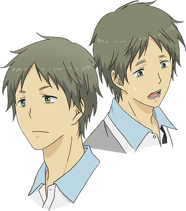
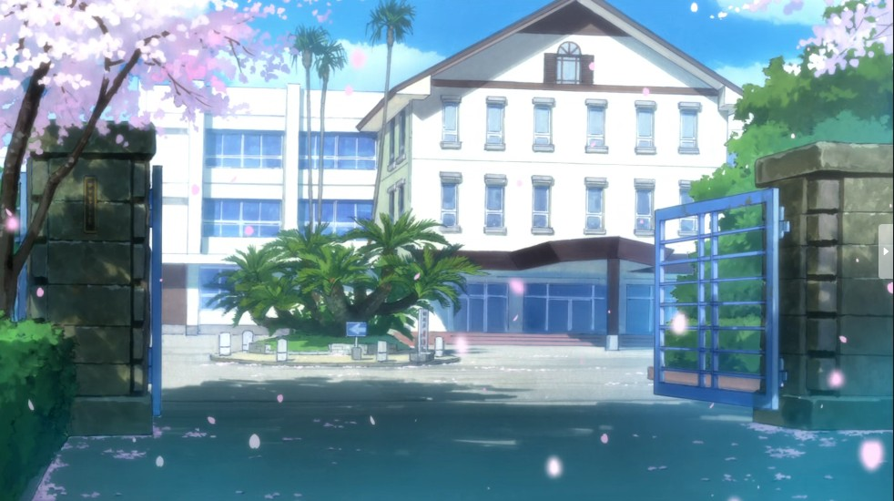

> [!bookinfo|noicon]+ **ReLIFE 完结篇**
> 
>
| 日文名 | ReLIFE 完結編 |
|:------: |:------------------------------------------: |
| 类型 | 漫改 |
| 新番 | 2018 年 3 月 |
| 集数 | 共4话 |
| 官网 | [http://relife-anime.com/](https://http://relife-anime.com/) |
| 制作 | トムス・エンタテインメント |
| 导演 | 小坂知 |
| 脚本 | 兵頭一歩 |
| 评分 | 7.7|
| 制片人 |  |

> [!abstract]+ **简介**
> 無職でニートの海崎新太(27歳)はリライフ研究所の社会復帰プログラム「リライフ」へ参加し、1年間限定で高校生として高校に通っていた。
2学期に入り日代と一緒に青葉祭の実行委員を任された海崎は日代にある気持ちを抱く。一方、日代も花火大会以降、海崎を意識するがその気持ちが何なのか整理がつかないでいた。
そんな二人に「リライフ」が終了するタイムリミットの卒業式が迫っていた。

> [!tip]+ **章节列表**
>- [ ] 第14话：萌芽 (2018-03-21)
>- [ ] 第15话：需要 (2018-03-21)
>- [ ] 第16话：约会 (2018-03-21)
>- [ ] 第17话：生活 (2018-03-21)
>- [ ] 第1话：监视录像机 (2018-03-21)
>- [ ] 第2话：约会 (2018-03-21)

> [!tip]+ **主要角色**
> 
| 角色 | CV | 简介| 角色图片 |
|:----:|:---:|:---:|:--------:|
| 日代千鶴 | 茅野愛衣 | 青叶高中3年3班34号，12月25日生，B型，身高162cm。 成绩优秀，学年第一的天才，每年开学试中均获得班级第一而成为班长。但社交能力很差，因此经常单独一人并没有朋友，虽然如此，但也勇于改变自己的积极派。与新太沟通过后成为朋友。有遇到不解的问题立即上网搜索的癖好。 |  |
| 海崎新太 | 小野賢章 | 本作主人公，青叶高中3年3班4号，27岁，8月12日生，O型，身高176cm。 老家为九州的渔村。重考两次才考上东京的大学，毕业前成功就业但只做了三个月就辞职，导致之后招工都被雇佣方以此刁难，没有女朋友，老家由于其长时间没找到工作准备不再提供生活费要求其回老家。 |  |
| 小野屋杏 | 上田麗奈 | 青叶高中3年3班23号，5月27日生，B型，身高153cm。 与新太一样的同班转校生，和新太一样开学试不合格，但和新太十分理解大神与玲奈的关系。 |  |
| 夜明了 | 木村良平 | 青叶高中3年3班20号，27岁，1月5日生，B型，身高173cm。 ReLIFE研究所的工作员，邀请新太参加ReLIFE实验，并一同以17岁的外貌身份同时入读高中以协助和记录新太的试验情况，编写相应的《ReLIFE实验报告书（リライフ実験報告書）》，自称在实验前已经开始入读高中一年级以适应学校生活。 说话总保持微笑和敬语用法，但总是说出击中别人痛处的话，被新太形容为“抖S”。同时也曾担任 ReLIFE No.001 的负责人。 |  |
| 大神和臣 | 内田雄馬 | 青叶高中3年3班3号，17岁，6月4日生，O型，身高171cm。 与新太同班的同学，在新太前桌。有带耳环，在高中三年级前也是班长，高中三年级也因为开学试班级成绩第一而成为班长。体育成绩意外的很烂，对感情比较迟钝而没发现玲奈的暗恋。 |  |
| 狩生玲奈 | 戸松遥 | 青叶高中3年3班24号，17岁，9月6日生，A型，身高166cm。 与新太同班的同学，与新太同桌。有参加排球部，在高中三年级前就是班长，直到高中三年级新班级才被日代取代。努力派的性格，在学习成绩上和体育上都十分努力来希望保持第一，但可惜学习成绩仍追不上日代，体育上追不上萌香，由此感到自卑。 |  |
| 玉来ほのか | 茜屋日海夏 | 青叶高中3年3班30号，17岁，10月1日生，O型，身高155cm。 晓和信长的童年玩伴，狩生的好友，与玲奈同为排球部成员，体育成绩优秀但学习成绩不行。看上去斯文无比，实则力大无穷。体能异于常人的运动型天才。喜欢喝牛奶。巨乳。 |  |
| 犬飼暁 | 杉山紀彰 | 青叶高中3年3班2号，17岁，7月31日生，AB型，身长174cm。 萌香和信长的童年玩伴。沉默寡言，行动快于理智型，因为信长和萌香性格过于柔弱，而放心不下。（其实他才是危险人物）　 |  |
| 天津心 | 沢城みゆき | 25岁，3月10日生，A型，身高157cm。 新太所在班级的班主任、体育老师、女子排球部的指导老师。 |  |
| 朝地信長 | 浪川大輔 | 青叶高中3年3班1号，17岁，3月2日生，A型，身高184cm。 晓和萌香的童年玩伴。 |  |
| 青葉高等学校 |  |  |  |