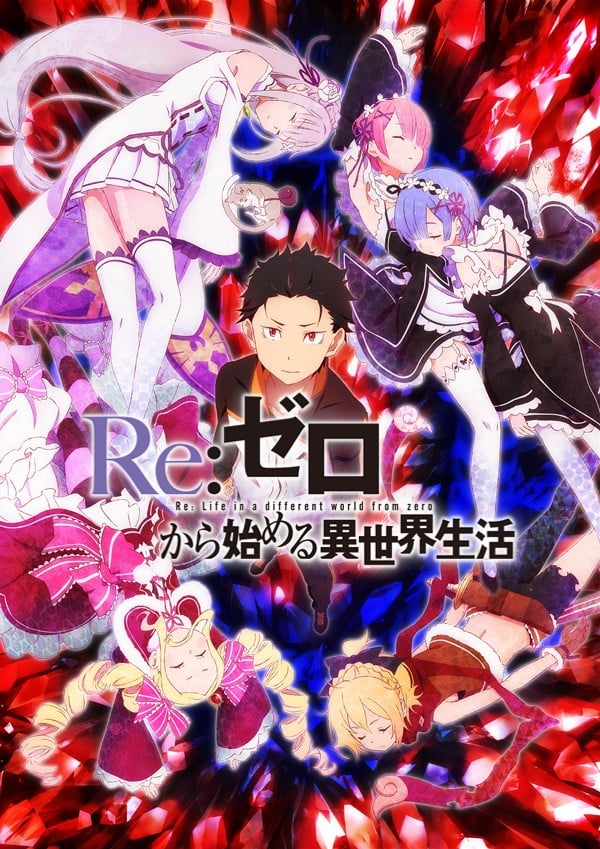
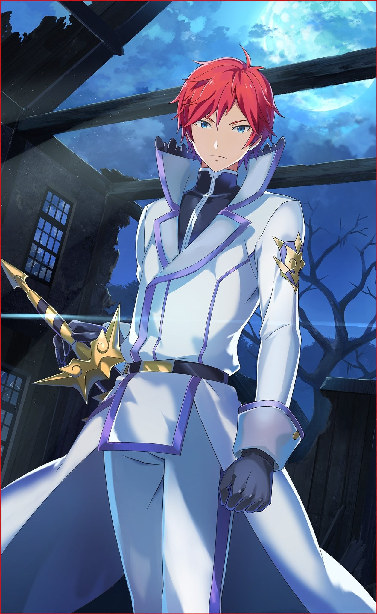

> [!bookinfo|noicon]+ **Re：从零开始的异世界生活**
> 
>
| 日文名 | Re:ゼロから始める異世界生活 |
|:------: |:------------------------------------------: |
| 类型 | 小说改 |
| 新番 | 2016 年 4 月 |
| 集数 | 共25话 |
| 官网 | [http://re-zero-anime.jp/](https://http://re-zero-anime.jp/) |
| 制作 | WHITE FOX |
| 导演 | 渡邊政治 |
| 脚本 | 中村能子,梅原英司,横谷昌宏 |
| 评分 | 7.4|
| 制片人 | 吉川綱樹 |

> [!abstract]+ **简介**
> 　　从便利店回来的路上突然被召唤到异世界的少年，菜月昴。在无可依赖的异世界，无力的少年所唯一拥有的力量……那就是死后便会使时间倒转的“死亡回归”的力量。为了守护重要的人，并取回那些无可替代的时间，少年向绝望抗争，挺身面对残酷的命运。

> [!tip]+ **章节列表**
>- [ ] 第1话：起始的终结和终结的起始 (2016-04-03)
>- [ ] 第2话：再遇魔女 (2016-04-10)
>- [ ] 第3话：从零开始的异世界生活 (2016-04-17)
>- [ ] 第4话：罗兹瓦尔邸的团聚 (2016-04-24)
>- [ ] 第5话：约定的早晨遥不可及 (2016-05-01)
>- [ ] 第6话：锁链之音 (2016-05-08)
>- [ ] 第7话：菜月昴的重新开始 (2016-05-15)
>- [ ] 第8话：哭过喊过便会停止哭泣 (2016-05-22)
>- [ ] 第9话：勇气的意义 (2016-05-29)
>- [ ] 第10话：如有鬼助的做法 (2016-06-05)
>- [ ] 第11话：蕾姆 (2016-06-12)
>- [ ] 第12话：再访王都 (2016-06-19)
>- [ ] 第13话：自称骑士的菜月昴 (2016-06-26)
>- [ ] 第14话：名为绝望的疾病 (2016-07-03)
>- [ ] 第15话：疯狂的外侧 (2016-07-10)
>- [ ] 第16话：猪的欲望 (2016-07-17)
>- [ ] 第17话：丑态的尽头 (2016-07-24)
>- [ ] 第18话：从零开始 (2016-07-31)
>- [ ] 第19话：白鲸攻略战 (2016-08-07)
>- [ ] 第20话：威尔海姆·梵·阿斯特雷亚 (2016-08-14)
>- [ ] 第21话：反抗绝望的赌博 (2016-08-21)
>- [ ] 第22话：怠惰一闪 (2016-08-28)
>- [ ] 第23话：恶毒的怠惰 (2016-09-04)
>- [ ] 第24话：自称骑士与最优的骑士 (2016-09-11)
>- [ ] 第25话：仅此而已的故事 (2016-09-18)
>- [ ] 第0话：特别节目「Re：从零开始异世界体验」 (2016-04-02)

> [!tip]+ **主要角色**
> 
| 角色 | CV | 简介| 角色图片 |
|:----:|:---:|:---:|:--------:|
| モブキャラクター | 相馬康一 | 闲角，常称作路人，在电视剧、电影等作品中，指戏份薄弱的副角、不相关的小人物、串场的闲杂人等。可能用来表达地方民众的声音，或是充当背景。 モブキャラクター（mob character）とは、漫画、アニメ、映画、コンピュータゲームなどに描かれる端役のこと。群衆（群集）、または主要キャラクター以外の、その他大勢のこと。群集キャラ、背景キャラともいう。 |  |
| ナツキ・スバル | 小林裕介 | 無知無能にして無力無謀と四拍子欠けた主人公。突如として異世界に召喚され、訳の分からない状況に翻弄される。物怖じしない性質と持ち前の図々しさで、逆境に弱音を吐きつつも過酷な運命に立ち向かっていく。  誕生日は四月一日。誕生花は「カスミソウ」で、花言葉は「清らかな心」です。 |  |
| エミリア | 高橋李依 | 銀髪に紫紺の瞳を持つ美しい少女。お人好しで面倒見の良い性格だが、当人はなぜかそれを素直に認めようとしない。家族同然の猫精霊であるパックをお供に連れており、彼の前でだけ甘えた表情を見せる。 |  |
| パック | 内山夕実 | エミリアと共に行動している精霊。灰色の体毛、まん丸の瞳にピンク色の鼻をした、手のひらに乗るサイズの二足歩行の小猫の姿をしている。 |  |
| フェルト | 赤﨑千夏 | くすんだ金髪に勝気な赤い目、尖った八重歯がチャームポイントの浮浪女児。王都の貧民街育ちで、幼さに見合わないタフで強かな性格の持ち主。 |  |
| ラインハルト・ヴァン・アストレア | 中村悠一 | 「――そこまでだ」 燃えるような赤毛に、空を映したような澄みきった青い瞳を持つ美青年。 洗練された仕草に、言動一つ一つが他者への思いやりに満ちた完璧超人。 『剣聖』と呼ばれる騎士の中の騎士であり、王都でも知らぬものがいない有名人。 普段は王城で近衛隊に所属しているが、この日は非番で王都を散策している。 普段から休日でも、市井の人々のために力を尽くす青年が、この日に目にしたものは――。 |  |
| エルザ・グランヒルテ | 能登麻美子 | 「ああ、今のはとても、感じたわ」 異世界では珍しい黒髪を長く伸ばした、艶めいた雰囲気をまとう美女。 グラマラスな肢体を大胆な衣装に包み、惜しげもなく周囲に艶然とした態度を振りまいている。 ただ、おっとりとした顔つきと穏やかな口調と裏腹に、瞳の奥には商売女とは一線を画した闇を孕んでいる。 何やら盗品蔵に用があり、そこでフェルトと落ち合う約束を交わしているらしい。 |  |
| ロム爺 | 麦人 | 「やっかましいわぁ！　合図と合言葉も知らんで、扉をぶっ壊す気か！！」 ２メートルを超す筋骨隆々な巨体を持つ、巨人族の老人。 王都の貧民街で、盗品蔵と呼ばれる建物を仕切っている顔役の一人。 強面の見た目に反して面倒見のいい人物であり、他人に親身になりすぎるきらいもある。 盗品蔵によく出入りするフェルトを孫のように可愛がっており、彼女にとっては家族同然の付き合い。 この日も、フェルトから持ち込むと聞かされていた、『さる品物』を鑑定するためにフェルトを待っている。 |  |
| ラム | 村川梨衣 | 怪我をしたスバルが運び込まれた屋敷、ロズワール邸で働く双子メイドの姉。傲岸不遜な毒舌担当。炊事洗濯裁縫掃除、全てにおいて妹に劣るステータスの持ち主。 |  |
| レム | 水瀬いのり | 名誉の負傷をしたスバルが担ぎ込まれた屋敷で、雑務全般を一手に担う双子メイドの妹。慇懃無礼な毒舌担当。屋敷の機能が維持されているのは、彼女の有能さが全てといっていい。 |  |
| ベアトリス | 新井里美 | 凭着隐藏门口的能力在罗兹瓦尔府邸充当禁书库的管理员，给人十分仙气和少女的印象。  是强欲魔女制造的精灵，称强欲魔女为母亲。 |  |
| プリシラ・バーリエル | 田村ゆかり | 「世界は妾にとって都合の良いようにできておる」 王都で悪漢に絡まれていたところを、スバルに救われた美貌の少女。 傲岸不遜な態度と、大胆不敵な行動と、唯我独尊の覇道を謳う人物でもある。 『血染めの花嫁』と呼ばれる、ルグニカ王国次代王位の候補者の一人。 奇抜な衣装のアルを騎士とし、全てを見下す微笑をたたえて王選に臨んでいる。 挫折を知らない豪運の持ち主であり、脅威の胸囲の持ち主でもある。 |  |