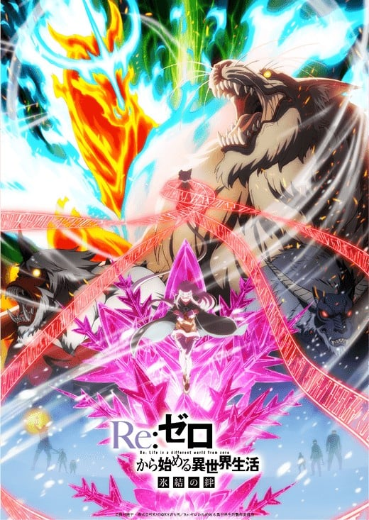
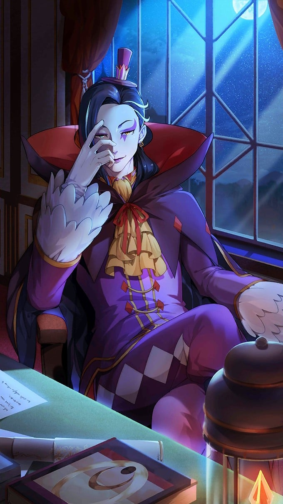

> [!bookinfo|noicon]+ **Re：从零开始的异世界生活 冰结之绊**
> 
>
| 日文名 | Re:ゼロから始める異世界生活 氷結の絆 |
|:------: |:------------------------------------------: |
| 类型 | 小说改 |
| 新番 | 2019 年 11 月 |
| 集数 | 共1话 |
| 官网 | [http://re-zero-anime.jp/hyoketsu/](https://http://re-zero-anime.jp/hyoketsu/) |
| 制作 | WHITE FOX |
| 导演 | 渡邊政治 |
| 脚本 | 横谷昌宏 |
| 评分 | 6.7|
| 制片人 |  |

> [!abstract]+ **简介**
> かつて世界を滅ぼしかけ、四百年を過ぎた今なお人々にとっての
恐怖の対象であり、忌み嫌われ続ける存在である《嫉妬の魔女》。
伝説によれば、彼女は紫紺の瞳を持つ銀髪のハーフエルフであったという。
雪と氷に覆われたエリオール大森林に、たった一人で暮らすエミリアは、
嫉妬の魔女に瓜二つという理由から、魔女と恐れられていた。
誤解され、傷つき、それでも小さな希望を持って、孤独を生きていた
エミリアの前に現れたのは、小さな猫の姿をした精霊だった。

> [!tip]+ **章节列表**
>- [ ] 第1话：Re：从零开始的异世界生活 冰结之绊 (2019-11-08)

> [!tip]+ **主要角色**
> 
| 角色 | CV | 简介| 角色图片 |
|:----:|:---:|:---:|:--------:|
| ナツキ・スバル | 小林裕介 | 無知無能にして無力無謀と四拍子欠けた主人公。突如として異世界に召喚され、訳の分からない状況に翻弄される。物怖じしない性質と持ち前の図々しさで、逆境に弱音を吐きつつも過酷な運命に立ち向かっていく。  誕生日は四月一日。誕生花は「カスミソウ」で、花言葉は「清らかな心」です。 |  |
| エミリア | 高橋李依 | 銀髪に紫紺の瞳を持つ美しい少女。お人好しで面倒見の良い性格だが、当人はなぜかそれを素直に認めようとしない。家族同然の猫精霊であるパックをお供に連れており、彼の前でだけ甘えた表情を見せる。 |  |
| パック | 内山夕実 | エミリアと共に行動している精霊。灰色の体毛、まん丸の瞳にピンク色の鼻をした、手のひらに乗るサイズの二足歩行の小猫の姿をしている。 |  |
| ラム | 村川梨衣 | 怪我をしたスバルが運び込まれた屋敷、ロズワール邸で働く双子メイドの姉。傲岸不遜な毒舌担当。炊事洗濯裁縫掃除、全てにおいて妹に劣るステータスの持ち主。 |  |
| レム | 水瀬いのり | 名誉の負傷をしたスバルが担ぎ込まれた屋敷で、雑務全般を一手に担う双子メイドの妹。慇懃無礼な毒舌担当。屋敷の機能が維持されているのは、彼女の有能さが全てといっていい。 |  |
| ロズワール・L・メイザース | 子安武人 | 「君は私になーぁにを望むのかな？」 ルグニカ王国貴族で、辺境伯の立場にある有力者。 王国有数の魔法使いでもあり、王城では筆頭宮廷魔導士としても知られる人物。 その立派な肩書きと溢れる才能を、奇行奇言と道化のメイクで台無しにする変わり者。 好んで顔を白く塗り、ピエロの化粧と他人をおちょくる言動で事態を掻き回す変人。 付いた渾名が『亜人趣味』である彼と、エミリアの関係性やいかに。 |  |