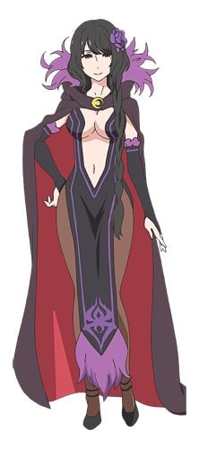
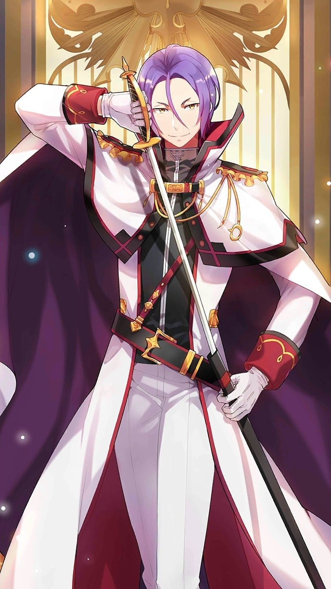

> [!bookinfo|noicon]+ **Re：从零开始的异世界生活 第三季 反击篇**
> 
>
| 日文名 | Re:ゼロから始める異世界生活 3rd season 反擊編 |
|:------: |:------------------------------------------: |
| 类型 | 小说改 |
| 新番 | 2025 年 2 月 |
| 集数 | 共8话 |
| 官网 | [http://re-zero-anime.jp/tv/](https://http://re-zero-anime.jp/tv/) |
| 制作 | WHITE FOX |
| 导演 | 篠原正寛 |
| 脚本 | 中村能子,梅原英司,横谷昌宏 |
| 评分 | 7|
| 制片人 | 加藤晋一朗 |

> [!abstract]+ **简介**
> 襲い来るエルザたちの猛攻を退け、大兎との戦いでベアトリスとの契約を果たした「聖域」の解放から1年が過ぎた。
王選に臨むエミリア陣営は一致団結、充実した日々を送っていたナツキ・スバルだったが、平穏は使者によって届けられた一枚の書状によって終わりを告げる。
それは王選候補者の一人、アナスタシアがエミリアへ宛てたルグニカの五大都市に数えられる水門都市プリステラへの招待状だった。
招待を受け、プリステラへ向かうスバルたち一行を待っていたのは様々な再会。
一つは意外な、一つは意図せぬ、そして一つは来るべき。水面下で蠢く悪意の胎動と降りかかる未曾有の危機。
少年は再び過酷な運命に立ち向かう。

> [!tip]+ **章节列表**
>- [ ] 第59话：混战都市 (2025-02-05)
>- [ ] 第60话：强欲攻略战 (2025-02-12)
>- [ ] 第61话：莉莉安娜·玛斯柯瑞德 (2025-02-19)
>- [ ] 第62话：雷格鲁斯·柯尼亚斯 (2025-02-26)
>- [ ] 第63话：战士的称赞 (2025-03-05)
>- [ ] 第64话：特蕾西亚·梵·阿斯特雷亚 (2025-03-12)
>- [ ] 第65话：丑恶的晚餐会 (2025-03-19)
>- [ ] 第66话：扑利斯提拉政防战结果 (2025-03-26)

> [!tip]+ **主要角色**
> 
| 角色 | CV | 简介| 角色图片 |
|:----:|:---:|:---:|:--------:|
| ナツキ・スバル | 小林裕介 | 無知無能にして無力無謀と四拍子欠けた主人公。突如として異世界に召喚され、訳の分からない状況に翻弄される。物怖じしない性質と持ち前の図々しさで、逆境に弱音を吐きつつも過酷な運命に立ち向かっていく。  誕生日は四月一日。誕生花は「カスミソウ」で、花言葉は「清らかな心」です。 |  |
| エミリア | 高橋李依 | 銀髪に紫紺の瞳を持つ美しい少女。お人好しで面倒見の良い性格だが、当人はなぜかそれを素直に認めようとしない。家族同然の猫精霊であるパックをお供に連れており、彼の前でだけ甘えた表情を見せる。 |  |
| フェルト | 赤﨑千夏 | くすんだ金髪に勝気な赤い目、尖った八重歯がチャームポイントの浮浪女児。王都の貧民街育ちで、幼さに見合わないタフで強かな性格の持ち主。 |  |
| ラインハルト・ヴァン・アストレア | 中村悠一 | 「――そこまでだ」 燃えるような赤毛に、空を映したような澄みきった青い瞳を持つ美青年。 洗練された仕草に、言動一つ一つが他者への思いやりに満ちた完璧超人。 『剣聖』と呼ばれる騎士の中の騎士であり、王都でも知らぬものがいない有名人。 普段は王城で近衛隊に所属しているが、この日は非番で王都を散策している。 普段から休日でも、市井の人々のために力を尽くす青年が、この日に目にしたものは――。 |  |
| エルザ・グランヒルテ | 能登麻美子 | 「ああ、今のはとても、感じたわ」 異世界では珍しい黒髪を長く伸ばした、艶めいた雰囲気をまとう美女。 グラマラスな肢体を大胆な衣装に包み、惜しげもなく周囲に艶然とした態度を振りまいている。 ただ、おっとりとした顔つきと穏やかな口調と裏腹に、瞳の奥には商売女とは一線を画した闇を孕んでいる。 何やら盗品蔵に用があり、そこでフェルトと落ち合う約束を交わしているらしい。 |  |
| ベアトリス | 新井里美 | 凭着隐藏门口的能力在罗兹瓦尔府邸充当禁书库的管理员，给人十分仙气和少女的印象。  是强欲魔女制造的精灵，称强欲魔女为母亲。 |  |
| プリシラ・バーリエル | 田村ゆかり | 「世界は妾にとって都合の良いようにできておる」 王都で悪漢に絡まれていたところを、スバルに救われた美貌の少女。 傲岸不遜な態度と、大胆不敵な行動と、唯我独尊の覇道を謳う人物でもある。 『血染めの花嫁』と呼ばれる、ルグニカ王国次代王位の候補者の一人。 奇抜な衣装のアルを騎士とし、全てを見下す微笑をたたえて王選に臨んでいる。 挫折を知らない豪運の持ち主であり、脅威の胸囲の持ち主でもある。 |  |
| クルシュ・カルステン | 井口裕香 | 「問おう。恥ずかしいとは思わないのかと」 ルグニカ王国カルステン公爵家当主の肩書きを持つ男装の麗人。 自分にも他者にも厳しい姿勢と、正しくあることを追及する人物。 生まれながらに人の上に立つカリスマを持ち、若くして当主を継いだ才媛。 ルグニカ王国の次代の王を決める王選の候補者であり、最有力候補。 騎士はフェリス。付き合いは幼少の頃からで、強い信頼関係にある。 |  |
| フェリックス・アーガイル | 堀江由衣 | 「んふー、恥ずかしがっちゃってきゃーわゆい」 フリフリの衣装に愛らしい仕草、そして頭には柔らかなネコミミ。 挙動や言動の端々に『狙っている』感があるが、それがやけに似合う。 王選候補であるクルシュの騎士であり、王都でも随一の治癒魔法の使い手。 長い付き合いであるクルシュへの忠誠心は、王選ペアの中でも特に強い。 そのわりに天然の気がある主に嘘を教えて遊ぶ癖がある。さすがフェリスあざとい。 |  |
| アナスタシア・ホーシン | 植田佳奈 | 「安心して、ウチのものになってくれてええよ？」 薄紫の柔らかな髪と、顔立ちに幼さを残した白いドレスが可憐な少女。 隣国カララギの大商会を率いる若き商人であり、ルグニカ王国王位候補者の一人。 果てなき強欲と向上心の持ち主であり、王国を手中に収めるために王選に参加した。 『最優』とされる騎士ユリウスを連れ、己の才覚だけで王位に上り詰めることを狙う。 私兵として傭兵団を保有しているが、傭兵団の人選には彼女の趣味が反映されている。 |  |
| ユリウス・ユークリウス | 江口拓也 | 「君はあの方に、相応しくない」 整った顔立ちに優雅な振舞い、高貴な生まれに確かな地位を持つ優れた騎士。 近衛騎士団に所属し、数ある騎士の中でも『最優の騎士』とされる優秀な人物。 剣技・魔法の技量に優れ、他の騎士たちの信頼も厚い、王国に忠節を誓う美丈夫。 アナスタシアの騎士となり、王選へ臨む主や相争う他の候補者に敬意を払っている。 ただし、王国の剣を自任する彼の意思は、立場を弁えない身の程知らずに容赦しない。  誕生日７月７日、誕生花は「睡蓮」で、花言葉は「清らかな心」です。 |  |
| ヴィルヘルム・ヴァン・アストレア | 堀内賢雄 | 外号“剑鬼”，身上有着大量伤痕的老人。将王选使者带往罗兹瓦尔宅邸的老车夫。剑术高超，本人形容自己并不具备相关才能，靠的仅是持续挥剑半辈子。 很爱自己的妻子，谈论夫妻之间事情时的那份率直让昴都退避三舍。经过锻炼的肉体以及身上散发出的霸气非同常人。 |  |