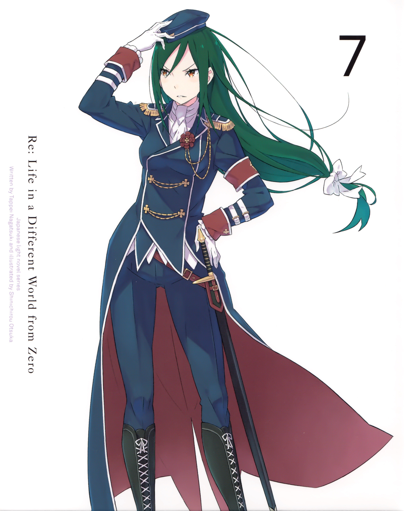

> [!bookinfo|noicon]+ **Re：从零开始的异世界生活 第三季 袭击篇**
> 
>
| 日文名 | Re:ゼロから始める異世界生活 3rd season 襲擊編 |
|:------: |:------------------------------------------: |
| 类型 | 小说改 |
| 新番 | 2024 年 10 月 |
| 集数 | 共8话 |
| 官网 | [http://re-zero-anime.jp/tv/](https://http://re-zero-anime.jp/tv/) |
| 制作 | WHITE FOX |
| 导演 | 篠原正寛 |
| 脚本 | 中村能子,梅原英司,横谷昌宏 |
| 评分 | 7.2|
| 制片人 | 加藤晋一朗 |

> [!abstract]+ **简介**
> 襲い来るエルザたちの猛攻を退け、大兎との戦いでベアトリスとの契約を果たした「聖域」の解放から1年が過ぎた。
王選に臨むエミリア陣営は一致団結、充実した日々を送っていたナツキ・スバルだったが、平穏は使者によって届けられた一枚の書状によって終わりを告げる。
それは王選候補者の一人、アナスタシアがエミリアへ宛てたルグニカの五大都市に数えられる水門都市プリステラへの招待状だった。
招待を受け、プリステラへ向かうスバルたち一行を待っていたのは様々な再会。
一つは意外な、一つは意図せぬ、そして一つは来るべき。水面下で蠢く悪意の胎動と降りかかる未曾有の危機。
少年は再び過酷な運命に立ち向かう。

> [!tip]+ **章节列表**
>- [ ] 第51话：剧场型恶意 (2024-10-02)
>- [ ] 第52话：冰炎之结果 (2024-10-09)
>- [ ] 第53话：华丽猛虎 (2024-10-16)
>- [ ] 第54话：都市市政厅夺还作战 (2024-10-23)
>- [ ] 第55话：浊流 (2024-10-30)
>- [ ] 第56话：骑士的条件 (2024-11-06)
>- [ ] 第57话：最新的英雄与最古老的英雄 (2024-11-13)
>- [ ] 第58话：总有一天会喜欢上的人 (2024-11-20)

> [!tip]+ **主要角色**
> 
| 角色 | CV | 简介| 角色图片 |
|:----:|:---:|:---:|:--------:|
| ナツキ・スバル | 小林裕介 | 無知無能にして無力無謀と四拍子欠けた主人公。突如として異世界に召喚され、訳の分からない状況に翻弄される。物怖じしない性質と持ち前の図々しさで、逆境に弱音を吐きつつも過酷な運命に立ち向かっていく。  誕生日は四月一日。誕生花は「カスミソウ」で、花言葉は「清らかな心」です。 |  |
| エミリア | 高橋李依 | 銀髪に紫紺の瞳を持つ美しい少女。お人好しで面倒見の良い性格だが、当人はなぜかそれを素直に認めようとしない。家族同然の猫精霊であるパックをお供に連れており、彼の前でだけ甘えた表情を見せる。 |  |
| フェルト | 赤﨑千夏 | くすんだ金髪に勝気な赤い目、尖った八重歯がチャームポイントの浮浪女児。王都の貧民街育ちで、幼さに見合わないタフで強かな性格の持ち主。 |  |
| ラインハルト・ヴァン・アストレア | 中村悠一 | 「――そこまでだ」 燃えるような赤毛に、空を映したような澄みきった青い瞳を持つ美青年。 洗練された仕草に、言動一つ一つが他者への思いやりに満ちた完璧超人。 『剣聖』と呼ばれる騎士の中の騎士であり、王都でも知らぬものがいない有名人。 普段は王城で近衛隊に所属しているが、この日は非番で王都を散策している。 普段から休日でも、市井の人々のために力を尽くす青年が、この日に目にしたものは――。 |  |
| エルザ・グランヒルテ | 能登麻美子 | 「ああ、今のはとても、感じたわ」 異世界では珍しい黒髪を長く伸ばした、艶めいた雰囲気をまとう美女。 グラマラスな肢体を大胆な衣装に包み、惜しげもなく周囲に艶然とした態度を振りまいている。 ただ、おっとりとした顔つきと穏やかな口調と裏腹に、瞳の奥には商売女とは一線を画した闇を孕んでいる。 何やら盗品蔵に用があり、そこでフェルトと落ち合う約束を交わしているらしい。 |  |
| ラム | 村川梨衣 | 怪我をしたスバルが運び込まれた屋敷、ロズワール邸で働く双子メイドの姉。傲岸不遜な毒舌担当。炊事洗濯裁縫掃除、全てにおいて妹に劣るステータスの持ち主。 |  |
| レム | 水瀬いのり | 名誉の負傷をしたスバルが担ぎ込まれた屋敷で、雑務全般を一手に担う双子メイドの妹。慇懃無礼な毒舌担当。屋敷の機能が維持されているのは、彼女の有能さが全てといっていい。 |  |
| ベアトリス | 新井里美 | 凭着隐藏门口的能力在罗兹瓦尔府邸充当禁书库的管理员，给人十分仙气和少女的印象。  是强欲魔女制造的精灵，称强欲魔女为母亲。 |  |
| プリシラ・バーリエル | 田村ゆかり | 「世界は妾にとって都合の良いようにできておる」 王都で悪漢に絡まれていたところを、スバルに救われた美貌の少女。 傲岸不遜な態度と、大胆不敵な行動と、唯我独尊の覇道を謳う人物でもある。 『血染めの花嫁』と呼ばれる、ルグニカ王国次代王位の候補者の一人。 奇抜な衣装のアルを騎士とし、全てを見下す微笑をたたえて王選に臨んでいる。 挫折を知らない豪運の持ち主であり、脅威の胸囲の持ち主でもある。 |  |
| クルシュ・カルステン | 井口裕香 | 「問おう。恥ずかしいとは思わないのかと」 ルグニカ王国カルステン公爵家当主の肩書きを持つ男装の麗人。 自分にも他者にも厳しい姿勢と、正しくあることを追及する人物。 生まれながらに人の上に立つカリスマを持ち、若くして当主を継いだ才媛。 ルグニカ王国の次代の王を決める王選の候補者であり、最有力候補。 騎士はフェリス。付き合いは幼少の頃からで、強い信頼関係にある。 |  |
| フェリックス・アーガイル | 堀江由衣 | 「んふー、恥ずかしがっちゃってきゃーわゆい」 フリフリの衣装に愛らしい仕草、そして頭には柔らかなネコミミ。 挙動や言動の端々に『狙っている』感があるが、それがやけに似合う。 王選候補であるクルシュの騎士であり、王都でも随一の治癒魔法の使い手。 長い付き合いであるクルシュへの忠誠心は、王選ペアの中でも特に強い。 そのわりに天然の気がある主に嘘を教えて遊ぶ癖がある。さすがフェリスあざとい。 |  |
| アナスタシア・ホーシン | 植田佳奈 | 「安心して、ウチのものになってくれてええよ？」 薄紫の柔らかな髪と、顔立ちに幼さを残した白いドレスが可憐な少女。 隣国カララギの大商会を率いる若き商人であり、ルグニカ王国王位候補者の一人。 果てなき強欲と向上心の持ち主であり、王国を手中に収めるために王選に参加した。 『最優』とされる騎士ユリウスを連れ、己の才覚だけで王位に上り詰めることを狙う。 私兵として傭兵団を保有しているが、傭兵団の人選には彼女の趣味が反映されている。 |  |