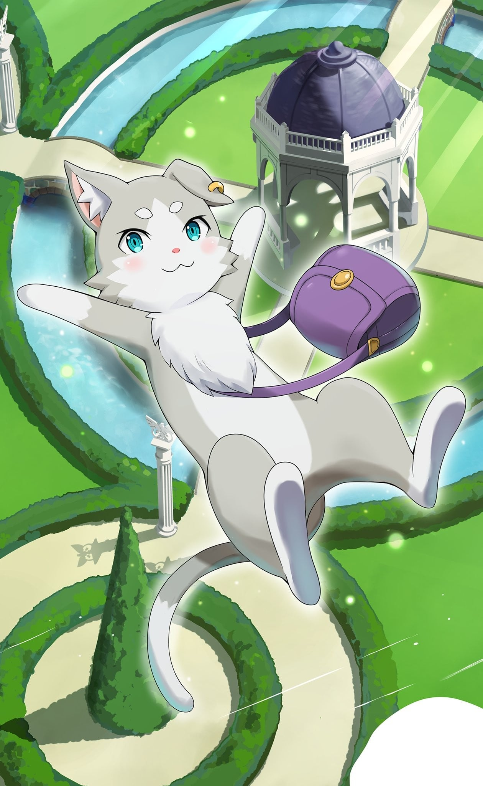
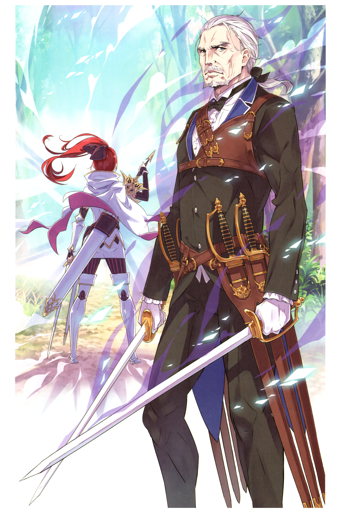

> [!bookinfo|noicon]+ **Re：从零开始的异世界生活 第二季**
> 
>
| 日文名 | Re:ゼロから始める異世界生活 2nd season |
|:------: |:------------------------------------------: |
| 类型 | 小说改 |
| 新番 | 2020 年 7 月 |
| 集数 | 共13话 |
| 官网 | [http://re-zero-anime.jp/](https://http://re-zero-anime.jp/) |
| 制作 | WHITE FOX |
| 导演 | 渡邊政治 |
| 脚本 | 中村能子,梅原英司,横谷昌宏 |
| 评分 | 7.4|
| 制片人 | 吉川綱樹 |

> [!abstract]+ **简介**
> 我一定会拯救你的。
打倒了担任「怠惰」的魔女教大罪司教，贝特鲁吉乌斯·罗曼尼康帝后，菜月昴和爱蜜莉雅又再度相遇了。在跨越了痛苦的诀别，两人终于和解，而新的篇章却又开始了。
超乎想象九死一生的危机，以及冷酷无情的现实。少年将再次起身，面对残酷的命运。

> [!tip]+ **章节列表**
>- [ ] 第26话：各自的誓言 (2020-07-08)
>- [ ] 第27话：下一个地方 (2020-07-15)
>- [ ] 第28话：久候多时的重逢 (2020-07-22)
>- [ ] 第29话：亲子 (2020-07-29)
>- [ ] 第30话：踏出的一步 (2020-08-05)
>- [ ] 第31话：少女的福音 (2020-08-12)
>- [ ] 第32话：朋友 (2020-08-19)
>- [ ] 第33话：生命的价值 (2020-08-26)
>- [ ] 第34话：爱爱爱爱爱爱你 (2020-09-02)
>- [ ] 第35话：地狱的话我已经体验过了 (2020-09-09)
>- [ ] 第36话：死亡的味道 (2020-09-16)
>- [ ] 第37话：魔女们的茶会 (2020-09-23)
>- [ ] 第38话：想哭的声音 (2020-09-30)

> [!tip]+ **主要角色**
> 
| 角色 | CV | 简介| 角色图片 |
|:----:|:---:|:---:|:--------:|
| ナツキ・スバル | 小林裕介 | 無知無能にして無力無謀と四拍子欠けた主人公。突如として異世界に召喚され、訳の分からない状況に翻弄される。物怖じしない性質と持ち前の図々しさで、逆境に弱音を吐きつつも過酷な運命に立ち向かっていく。  誕生日は四月一日。誕生花は「カスミソウ」で、花言葉は「清らかな心」です。 |  |
| エミリア | 高橋李依 | 銀髪に紫紺の瞳を持つ美しい少女。お人好しで面倒見の良い性格だが、当人はなぜかそれを素直に認めようとしない。家族同然の猫精霊であるパックをお供に連れており、彼の前でだけ甘えた表情を見せる。 |  |
| パック | 内山夕実 | エミリアと共に行動している精霊。灰色の体毛、まん丸の瞳にピンク色の鼻をした、手のひらに乗るサイズの二足歩行の小猫の姿をしている。 |  |
| エルザ・グランヒルテ | 能登麻美子 | 「ああ、今のはとても、感じたわ」 異世界では珍しい黒髪を長く伸ばした、艶めいた雰囲気をまとう美女。 グラマラスな肢体を大胆な衣装に包み、惜しげもなく周囲に艶然とした態度を振りまいている。 ただ、おっとりとした顔つきと穏やかな口調と裏腹に、瞳の奥には商売女とは一線を画した闇を孕んでいる。 何やら盗品蔵に用があり、そこでフェルトと落ち合う約束を交わしているらしい。 |  |
| ラム | 村川梨衣 | 怪我をしたスバルが運び込まれた屋敷、ロズワール邸で働く双子メイドの姉。傲岸不遜な毒舌担当。炊事洗濯裁縫掃除、全てにおいて妹に劣るステータスの持ち主。 |  |
| レム | 水瀬いのり | 名誉の負傷をしたスバルが担ぎ込まれた屋敷で、雑務全般を一手に担う双子メイドの妹。慇懃無礼な毒舌担当。屋敷の機能が維持されているのは、彼女の有能さが全てといっていい。 |  |
| ベアトリス | 新井里美 | 凭着隐藏门口的能力在罗兹瓦尔府邸充当禁书库的管理员，给人十分仙气和少女的印象。  是强欲魔女制造的精灵，称强欲魔女为母亲。 |  |
| クルシュ・カルステン | 井口裕香 | 「問おう。恥ずかしいとは思わないのかと」 ルグニカ王国カルステン公爵家当主の肩書きを持つ男装の麗人。 自分にも他者にも厳しい姿勢と、正しくあることを追及する人物。 生まれながらに人の上に立つカリスマを持ち、若くして当主を継いだ才媛。 ルグニカ王国の次代の王を決める王選の候補者であり、最有力候補。 騎士はフェリス。付き合いは幼少の頃からで、強い信頼関係にある。 |  |
| フェリックス・アーガイル | 堀江由衣 | 「んふー、恥ずかしがっちゃってきゃーわゆい」 フリフリの衣装に愛らしい仕草、そして頭には柔らかなネコミミ。 挙動や言動の端々に『狙っている』感があるが、それがやけに似合う。 王選候補であるクルシュの騎士であり、王都でも随一の治癒魔法の使い手。 長い付き合いであるクルシュへの忠誠心は、王選ペアの中でも特に強い。 そのわりに天然の気がある主に嘘を教えて遊ぶ癖がある。さすがフェリスあざとい。 |  |
| ヴィルヘルム・ヴァン・アストレア | 堀内賢雄 | 外号“剑鬼”，身上有着大量伤痕的老人。将王选使者带往罗兹瓦尔宅邸的老车夫。剑术高超，本人形容自己并不具备相关才能，靠的仅是持续挥剑半辈子。 很爱自己的妻子，谈论夫妻之间事情时的那份率直让昴都退避三舍。经过锻炼的肉体以及身上散发出的霸气非同常人。 |  |
| ロズワール・L・メイザース | 子安武人 | 「君は私になーぁにを望むのかな？」 ルグニカ王国貴族で、辺境伯の立場にある有力者。 王国有数の魔法使いでもあり、王城では筆頭宮廷魔導士としても知られる人物。 その立派な肩書きと溢れる才能を、奇行奇言と道化のメイクで台無しにする変わり者。 好んで顔を白く塗り、ピエロの化粧と他人をおちょくる言動で事態を掻き回す変人。 付いた渾名が『亜人趣味』である彼と、エミリアの関係性やいかに。 |  |
| ペトラ・レイテ | 高野麻里佳 | 阿拉姆村的少女，12岁。梦想是长大后到都市制衣。昴在阿拉姆村认识的众多小孩之一。 |  |