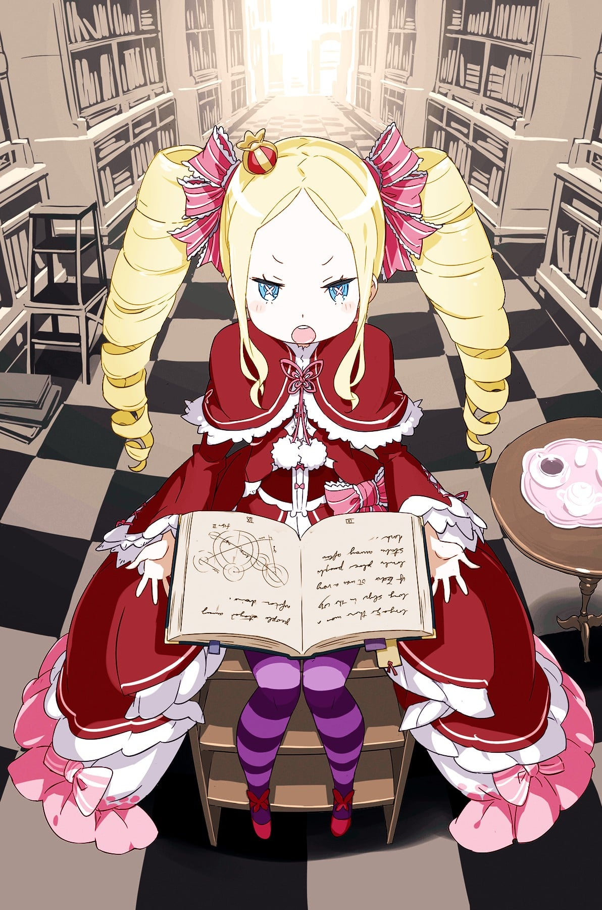
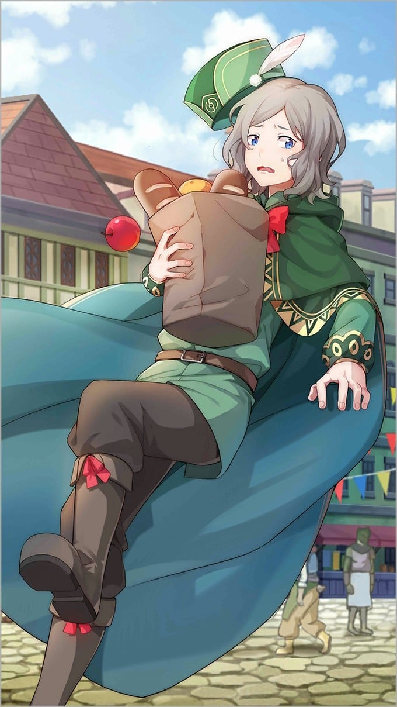
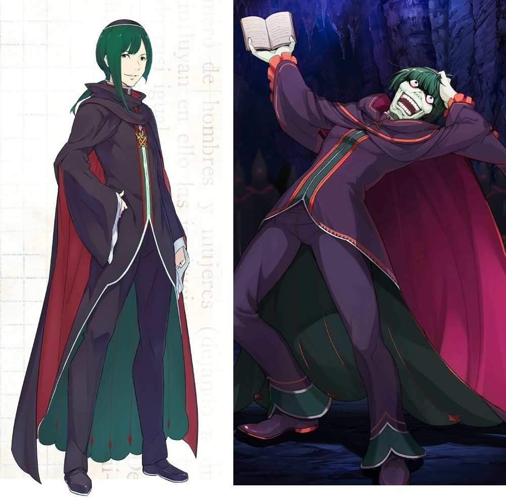

> [!bookinfo|noicon]+ **Re：从零开始的异世界生活 第二季 后半部分**
> 
>
| 日文名 | Re:ゼロから始める異世界生活 2nd season 後半クール |
|:------: |:------------------------------------------: |
| 类型 | 小说改 |
| 新番 | 2021 年 1 月 |
| 集数 | 共12话 |
| 官网 | [http://re-zero-anime.jp/](https://http://re-zero-anime.jp/) |
| 制作 | WHITE FOX |
| 导演 | 渡邊政治 |
| 脚本 | 中村能子,梅原英司,横谷昌宏 |
| 评分 | 7.6|
| 制片人 | 吉川綱樹 |

> [!abstract]+ **简介**
> 俺が必ず、お前を救ってみせる。

魔女教大罪司教「怠惰」担当ペテルギウス・ロマネコンティを打倒し、エミリアとの再開を果たしたナツキ・スバル。
辛い決別を乗り越え、ようやく和解した二人だったが、それは新たな波乱の幕開けだった。

想像を超える絶体絶命の危機、そして襲い来る無慈悲な現実。
少年は再び過酷な運命に立ち向かう。

> [!tip]+ **章节列表**
>- [ ] 第39话：孤注一掷 (2021-01-06)
>- [ ] 第40话：奥托·苏文 / 相信的理由 (2021-01-13)
>- [ ] 第41话：独自一人无法举起女王之石 (2021-01-20)
>- [ ] 第42话：记忆的旅途 (2021-01-27)
>- [ ] 第43话：参宿四（Betelgeuse）微笑的日子 (2021-02-03)
>- [ ] 第44话：艾力欧尔大森林的永久冻土 (2021-02-10)
>- [ ] 第45话：圣域的开始与，崩坏的开始 (2021-02-17)
>- [ ] 第46话：咆哮的再会 (2021-02-24)
>- [ ] 第47话：映照在水面上的幸福 (2021-03-03)
>- [ ] 第48话：连鲜血与内脏都一并痛爱 (2021-03-10)
>- [ ] 第49话：选我吧 (2021-03-17)
>- [ ] 第50话：月下、随性的舞步 (2021-03-24)

> [!tip]+ **主要角色**
> 
| 角色 | CV | 简介| 角色图片 |
|:----:|:---:|:---:|:--------:|
| ナツキ・スバル | 小林裕介 | 無知無能にして無力無謀と四拍子欠けた主人公。突如として異世界に召喚され、訳の分からない状況に翻弄される。物怖じしない性質と持ち前の図々しさで、逆境に弱音を吐きつつも過酷な運命に立ち向かっていく。  誕生日は四月一日。誕生花は「カスミソウ」で、花言葉は「清らかな心」です。 |  |
| エミリア | 高橋李依 | 銀髪に紫紺の瞳を持つ美しい少女。お人好しで面倒見の良い性格だが、当人はなぜかそれを素直に認めようとしない。家族同然の猫精霊であるパックをお供に連れており、彼の前でだけ甘えた表情を見せる。 |  |
| パック | 内山夕実 | エミリアと共に行動している精霊。灰色の体毛、まん丸の瞳にピンク色の鼻をした、手のひらに乗るサイズの二足歩行の小猫の姿をしている。 |  |
| エルザ・グランヒルテ | 能登麻美子 | 「ああ、今のはとても、感じたわ」 異世界では珍しい黒髪を長く伸ばした、艶めいた雰囲気をまとう美女。 グラマラスな肢体を大胆な衣装に包み、惜しげもなく周囲に艶然とした態度を振りまいている。 ただ、おっとりとした顔つきと穏やかな口調と裏腹に、瞳の奥には商売女とは一線を画した闇を孕んでいる。 何やら盗品蔵に用があり、そこでフェルトと落ち合う約束を交わしているらしい。 |  |
| ラム | 村川梨衣 | 怪我をしたスバルが運び込まれた屋敷、ロズワール邸で働く双子メイドの姉。傲岸不遜な毒舌担当。炊事洗濯裁縫掃除、全てにおいて妹に劣るステータスの持ち主。 |  |
| ベアトリス | 新井里美 | 凭着隐藏门口的能力在罗兹瓦尔府邸充当禁书库的管理员，给人十分仙气和少女的印象。  是强欲魔女制造的精灵，称强欲魔女为母亲。 |  |
| ロズワール・L・メイザース | 子安武人 | 「君は私になーぁにを望むのかな？」 ルグニカ王国貴族で、辺境伯の立場にある有力者。 王国有数の魔法使いでもあり、王城では筆頭宮廷魔導士としても知られる人物。 その立派な肩書きと溢れる才能を、奇行奇言と道化のメイクで台無しにする変わり者。 好んで顔を白く塗り、ピエロの化粧と他人をおちょくる言動で事態を掻き回す変人。 付いた渾名が『亜人趣味』である彼と、エミリアの関係性やいかに。 |  |
| ペトラ・レイテ | 高野麻里佳 | 阿拉姆村的少女，12岁。梦想是长大后到都市制衣。昴在阿拉姆村认识的众多小孩之一。 |  |
| メィリィ・ポートルート | 鈴木絵理 |  |  |
| フレデリカ・バウマン | 名塚佳織 | 罗兹瓦尔宅邸的女仆，24岁。身材挺拔，身高略高于菜月昴。有四分之一的亚人血统。 在罗兹瓦尔宅邸服务了十年，近年前往梅札斯分家的蜜罗德家服务。 |  |
| オットー・スーウェン | 天﨑滉平 | 灰发的青年行商人，20岁。独自经商四年不太顺利。因想要出清库存的油货而被昴卷入白鲸事件。 有后天变异才拥有的『言霊の加护』。能够与任何能发声的生物进行交谈。由于使用还不够纯熟，平时处于能力自我封印状态。频繁使用会对身体产生负担。 |  |
| ペテルギウス・ロマネコンティ | 松岡禎丞 | 大罪主教之一，外号“怠惰”，年龄超过400岁，是最早的大罪主教。其说话方式及态度使人认为其是狂人。在众多大罪主教中是最为活跃，亦是最为臭名昭著。兴奋时会咬破自己的手指。 拥有的怠惰魔女因子的权能为“不可视之手”及“怠惰”。“不可视之手”使其能展开及操纵数十只只有昴能看见而他人没法看见的隐形之手。 真正身份为能不断转移肉体的邪恶精灵。当自身的肉体遭遇危险时，能单方面与其他人建立契约，甚至能夺其肉体。异常地认定昴为当代的“傲慢”，为此穷追不舍。 |  |