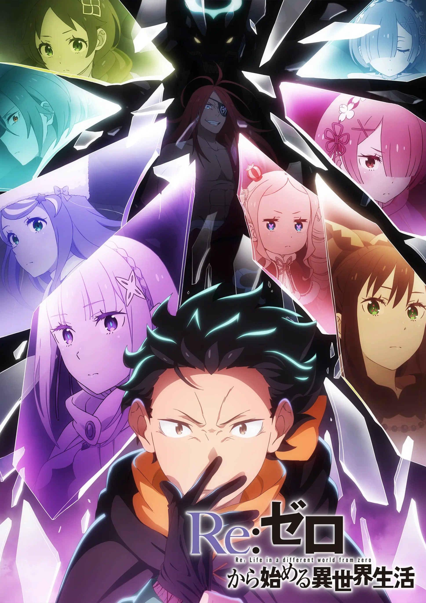
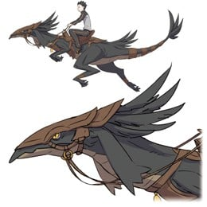
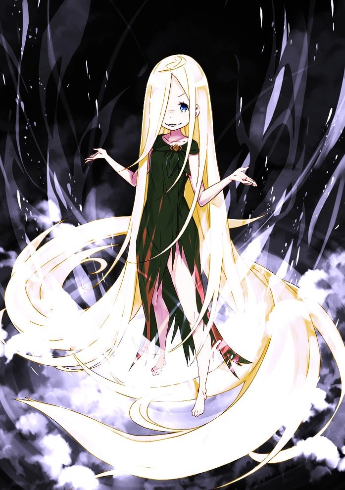
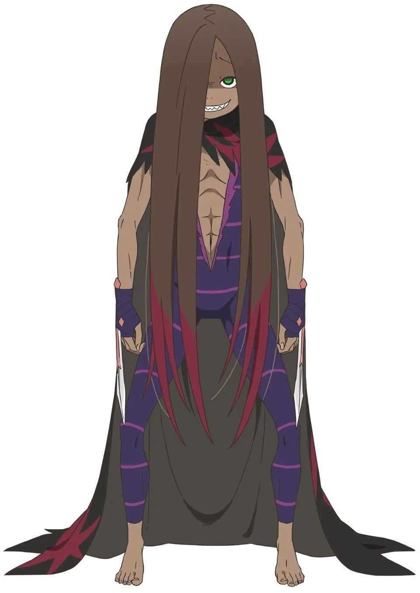
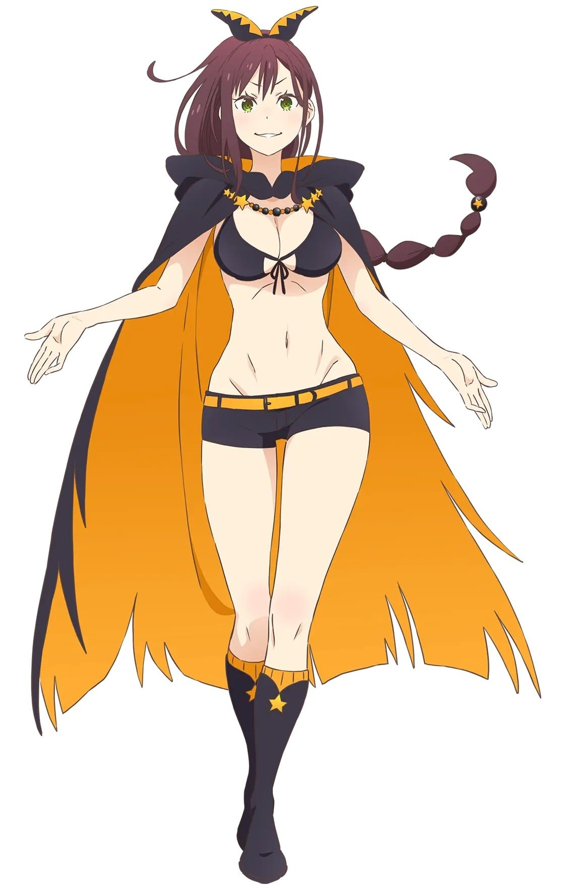

> [!bookinfo|noicon]+ **Re：从零开始的异世界生活 第四季 丧失篇**
> 
>
| 日文名 | Re:ゼロから始める異世界生活 4th season 喪失編 |
|:------: |:------------------------------------------: |
| 类型 | 小说改 |
| 新番 | 2026 年 4 月 |
| 集数 | 共11话 |
| 官网 | [http://re-zero-anime.jp/tv/](https://http://re-zero-anime.jp/tv/) |
| 制作 | WHITE FOX |
| 导演 | 篠原正寛 |
| 脚本 | 横谷昌宏 |
| 评分 | 7.2|
| 制片人 |  |

> [!abstract]+ **简介**
> 在水门都市朴利斯提拉的死战中，昴等人虽然勉强取得胜利，但付出的代价，却过于沉重。因「暴食」权能而陷入沉睡的雷姆，被夺走记忆的库珥修，以及，被夺去名字的由里乌斯。
为了寻找拯救他们的线索，昴得知了一位据说能看透一切、拥有无尽知识的存在——「贤者」夏乌拉。
下一个目的地，是贤者所居住的「普莱迪斯监视塔」。那是一座矗立于大砂漠「奥吉拉沙丘」最深处的最果之塔，就连最强的「剑圣」莱因哈鲁特，也未曾成功攻略。
狂暴的自然——
未知的魔兽——
以及，超越想象的威胁接连袭来。
为了夺回一切——
少年与伙伴们，赌上性命的旅程，就此展开。

[简介原文]
水門都市プリステラの死闘で辛くも勝利を収めたスバルたちだったが、その代償はあまりに大きかった。“暴食“の権能によって眠り続けるレム、記憶を奪われたクルシュ、そして名前を奪われてしまったユリウス。
彼らを救う手がかりを求める中、スバルは全てを見通し、あらゆる知識を持つと言われる『賢者』シャウラの存在を知る。
次の目的地は賢者の住まう「プレアデス監視塔」──そこは、最強の『剣聖』ラインハルトですら攻略できなかった大砂漠「アウグリア砂丘」にそびえ立つ最果ての塔。
猛威を振るう自然、未知なる魔獣、そして想像を絶する脅威が立ちはだかる。仲間と共に、すべてを取り戻すため、命を懸けた少年の旅路が始まる──

> [!tip]+ **章节列表**
>- [ ] 第1话： (2026-04-08)
>- [ ] 第2话： (2026-04-15)
>- [ ] 第3话： (2026-04-22)
>- [ ] 第4话： (2026-04-29)
>- [ ] 第5话： (2026-05-06)
>- [ ] 第6话： (2026-05-13)
>- [ ] 第7话： (2026-05-20)
>- [ ] 第8话： (2026-05-27)
>- [ ] 第9话： (2026-06-03)
>- [ ] 第10话： (2026-06-10)
>- [ ] 第11话： (2026-06-17)

> [!tip]+ **主要角色**
> 
| 角色 | CV | 简介| 角色图片 |
|:----:|:---:|:---:|:--------:|
| ナツキ・スバル | 小林裕介 | 無知無能にして無力無謀と四拍子欠けた主人公。突如として異世界に召喚され、訳の分からない状況に翻弄される。物怖じしない性質と持ち前の図々しさで、逆境に弱音を吐きつつも過酷な運命に立ち向かっていく。  誕生日は四月一日。誕生花は「カスミソウ」で、花言葉は「清らかな心」です。 |  |
| エミリア | 高橋李依 | 銀髪に紫紺の瞳を持つ美しい少女。お人好しで面倒見の良い性格だが、当人はなぜかそれを素直に認めようとしない。家族同然の猫精霊であるパックをお供に連れており、彼の前でだけ甘えた表情を見せる。 |  |
| ラム | 村川梨衣 | 怪我をしたスバルが運び込まれた屋敷、ロズワール邸で働く双子メイドの姉。傲岸不遜な毒舌担当。炊事洗濯裁縫掃除、全てにおいて妹に劣るステータスの持ち主。 |  |
| レム | 水瀬いのり | 名誉の負傷をしたスバルが担ぎ込まれた屋敷で、雑務全般を一手に担う双子メイドの妹。慇懃無礼な毒舌担当。屋敷の機能が維持されているのは、彼女の有能さが全てといっていい。 |  |
| ベアトリス | 新井里美 | 凭着隐藏门口的能力在罗兹瓦尔府邸充当禁书库的管理员，给人十分仙气和少女的印象。  是强欲魔女制造的精灵，称强欲魔女为母亲。 |  |
| アナスタシア・ホーシン | 植田佳奈 | 「安心して、ウチのものになってくれてええよ？」 薄紫の柔らかな髪と、顔立ちに幼さを残した白いドレスが可憐な少女。 隣国カララギの大商会を率いる若き商人であり、ルグニカ王国王位候補者の一人。 果てなき強欲と向上心の持ち主であり、王国を手中に収めるために王選に参加した。 『最優』とされる騎士ユリウスを連れ、己の才覚だけで王位に上り詰めることを狙う。 私兵として傭兵団を保有しているが、傭兵団の人選には彼女の趣味が反映されている。 |  |
| ユリウス・ユークリウス | 江口拓也 | 「君はあの方に、相応しくない」 整った顔立ちに優雅な振舞い、高貴な生まれに確かな地位を持つ優れた騎士。 近衛騎士団に所属し、数ある騎士の中でも『最優の騎士』とされる優秀な人物。 剣技・魔法の技量に優れ、他の騎士たちの信頼も厚い、王国に忠節を誓う美丈夫。 アナスタシアの騎士となり、王選へ臨む主や相争う他の候補者に敬意を払っている。 ただし、王国の剣を自任する彼の意思は、立場を弁えない身の程知らずに容赦しない。  誕生日７月７日、誕生花は「睡蓮」で、花言葉は「清らかな心」です。 |  |
| メィリィ・ポートルート | 鈴木絵理 |  |  |
| パトラッシュ |  | 白鯨討伐の際に、クルシュより送られた漆黒の地竜。ダイアナ種と呼ばれ優秀だが扱いにくい。気位が高いが、何故かスバルにだけは懐いており、その献身によって幾度となく窮地を救われている。性別は雌。スバルへの態度やオットーの通訳によると、クールで姉御肌な性格。 |  |
| ルイ・アルネブ | 小原好美 |  |  |
| ライ・バテンカイトス | 河西健吾 | 魔女教の幹部である大罪司教の一人。『暴食』担当。見た目は無害な子供のように見えるが、その言動の全ては食への異常とも言える執着に支配されており、常にテンションが高い。 他人をおちょくるような飄々とした態度が目立ち、どんな事態に陥っても自らのペースを崩すことはない。 |  |
| シャウラ | ファイルーズあい | 前人未到の大砂漠・アウグリア砂丘の最奥にあると言われるプレアデス監視塔の星番。 蠍のような特徴を持つ奇抜な外見をしており、その言動は謎に包まれている。 世界を救った三英傑の一人『賢者』シャウラは青年として伝えられているのだが、彼女の正体は果たして......。 |  |