> [!bookinfo|noicon]+ **Re：创世主们**
> 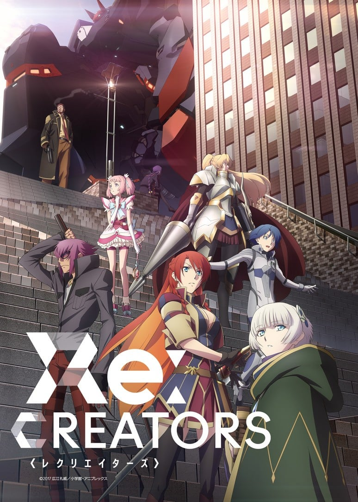
>
| 日文名 | Re:CREATORS |
|:------: |:------------------------------------------: |
| 类型 | 原创 |
| 新番 | 2017 年 4 月 |
| 集数 | 共22话 |
| 官网 | [http://recreators.tv/](https://http://recreators.tv/) |
| 制作 | TROYCA |
| 导演 | あおきえい |
| 脚本 | 中本宗応,広江礼威,菅原雪絵,あおきえい,高崎とおる,木澤行人 |
| 评分 | 6.2|
| 制片人 | 長野敏之 |

> [!abstract]+ **简介**
> 人类创作了许许多多的故事。
喜悦、悲伤、愤怒、感动。这些引人入胜的故事撼动着人们的心灵。
但是，那些不过是作为旁观者的感想罢了。
如果，故事中的登场人物们拥有了“意志”。那么对于他们来说，创作出故事的我们，是神一般的存在吗？

——在我等的世界内发起变革。
——对诸神之地进行制裁。

任何人，都将成为“创造主(Creator)”。

> [!tip]+ **章节列表**
>- [ ] 第1话：绝佳的航海 (2017-04-08)
>- [ ] 第2话：炸药和酷小伙 (2017-04-15)
>- [ ] 第3话：平凡却非凡的日常 (2017-04-22)
>- [ ] 第4话：到时候向他问个好 (2017-04-29)
>- [ ] 第5话：比任何地方都要冷的水底 (2017-05-06)
>- [ ] 第6话：人生苦短，恋爱吧少女 (2017-05-13)
>- [ ] 第7话：世界的小小终结 (2017-05-20)
>- [ ] 第8话：我能做到的一切 (2017-05-27)
>- [ ] 第9话：挖坑吧花开少女 (2017-06-03)
>- [ ] 第10话：别动、死亡、复活吧！ (2017-06-10)
>- [ ] 第11话：屋檐下的怪物 (2017-06-17)
>- [ ] 第12话：最终话还太早 (2017-06-24)
>- [ ] 第13话：一如往常的绕远归路 (2017-07-01)
>- [ ] 第14话：我们走上旅途的理由 (2017-07-08)
>- [ ] 第15话：徘徊尽头波浪近 (2017-07-15)
>- [ ] 第16话：最棒的每一天 (2017-07-29)
>- [ ] 第17话：雨的旋律击打着世界的屋脊 (2017-08-12)
>- [ ] 第18话：一切都不完整的我们 (2017-08-19)
>- [ ] 第19话：若是被温暖拥抱 (2017-08-26)
>- [ ] 第20话：余音消退之前 (2017-09-02)
>- [ ] 第21话：世界仅为二人存在 (2017-09-09)
>- [ ] 第22话：创造主 (2017-09-16)
>- [ ] 第15.5话：夏季特番～与被造物女性所渡过的时光 (2017-07-22)
>- [ ] 第16.5话：续 夏天特别节目~夏天！浴衣！！女生聚会！！！~ (2017-08-05)
>- [ ] 第0话：ENTER THE WORLD OF Re:CREATORS (2017-04-01)

> [!tip]+ **主要角色**
> 
| 角色 | CV | 简介| 角色图片 |
|:----:|:---:|:---:|:--------:|
| モブキャラクター | 櫻井浩美 | 闲角，常称作路人，在电视剧、电影等作品中，指戏份薄弱的副角、不相关的小人物、串场的闲杂人等。可能用来表达地方民众的声音，或是充当背景。 モブキャラクター（mob character）とは、漫画、アニメ、映画、コンピュータゲームなどに描かれる端役のこと。群衆（群集）、または主要キャラクター以外の、その他大勢のこと。群集キャラ、背景キャラともいう。 |  |
| 水篠颯太 | 山下大輝 | 性格内向、柔和 热爱着动画与游戏的高二学生 | 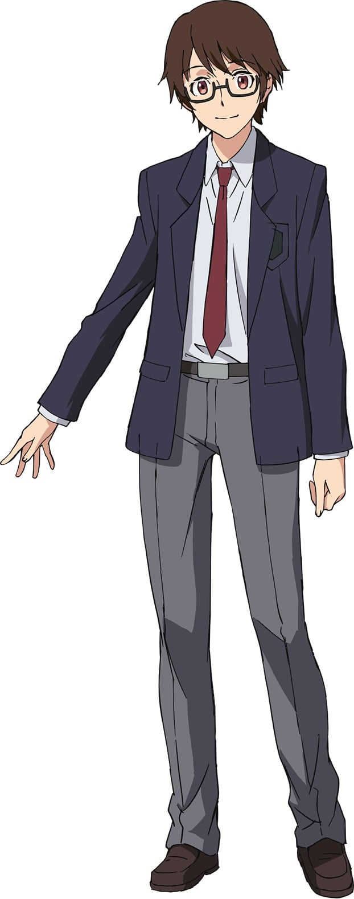 |
| セレジア・ユピティリア | 小松未可子 | 幻想系机器人动画作品“精霊機想曲フォーゲルシュバリエ”的女主人公 | 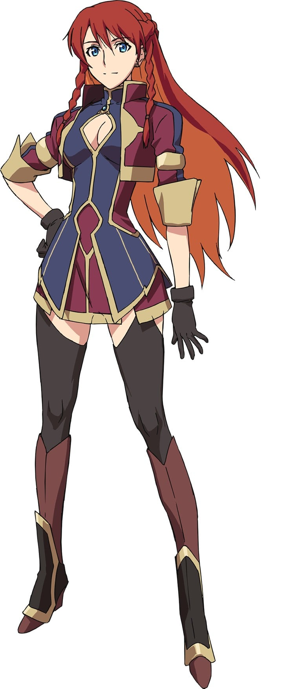 |
| メテオラ・エスターライヒ | 大原さやか | 开放世界型RPG“追憶のアヴァルケン”中，司书一职的贤者，负责引导主人公。 | 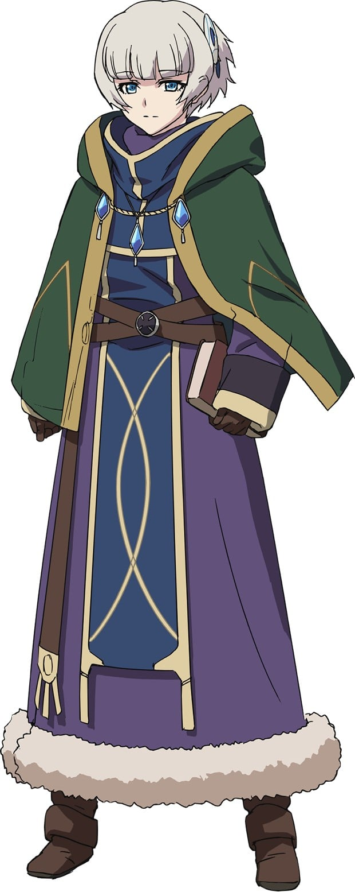 |
| アリステリア・フェブラリィ | 日笠陽子 | 幻想传记作品漫画·动画“绯色的爱丽丝特利亚”的主人公，公主。 | 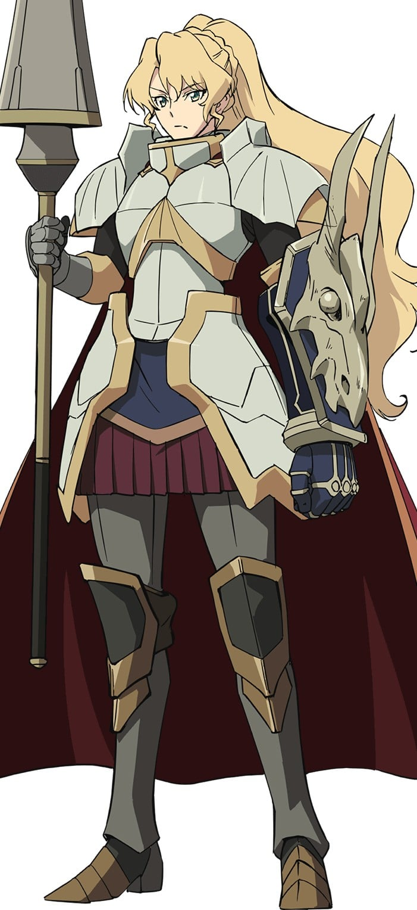 |
| 煌樹まみか | 村川梨衣 | 女童向魔法少女动画“マジカルスレイヤー・まみか”的主人公。 | 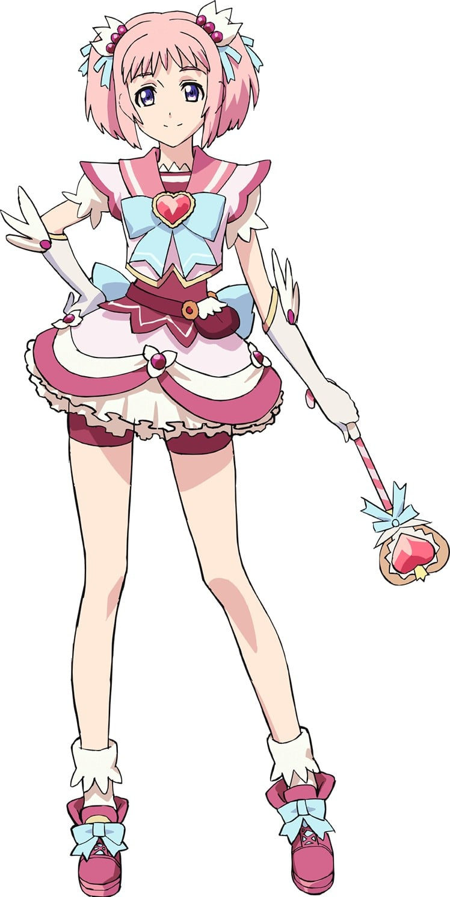 |
| 弥勒寺優夜 | 鈴村健一 | 漫画“閉鎖区underground-dark night-”的最终boss角色。 | 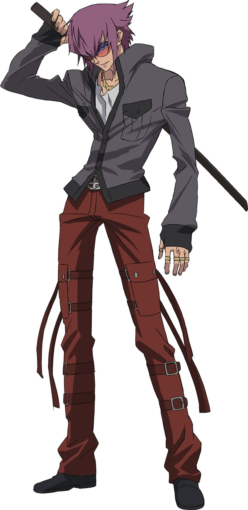 |
| 鹿屋瑠偉 | 雨宮天 | 机器人动画“無限神機モノマギア”的主人公。 巨大机器人“ギガスマキナ”的驾驶者。 | 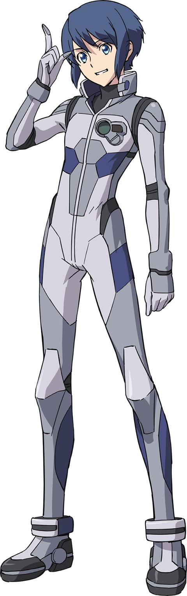 |
| 築城院真鍳 | 坂本真綾 | 传奇系轻小说·动画“夜窗鬼录”之中的登场角色。目的不明。 | 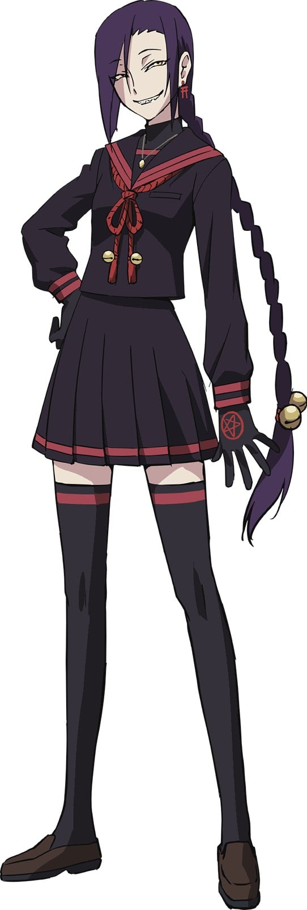 |
| ブリッツ・トーカー | 斧アツシ | 拥有着赛博朋克世界观的漫画·动画“code・Babylon”的登场人物。 原职为警察的赏金猎人。 | 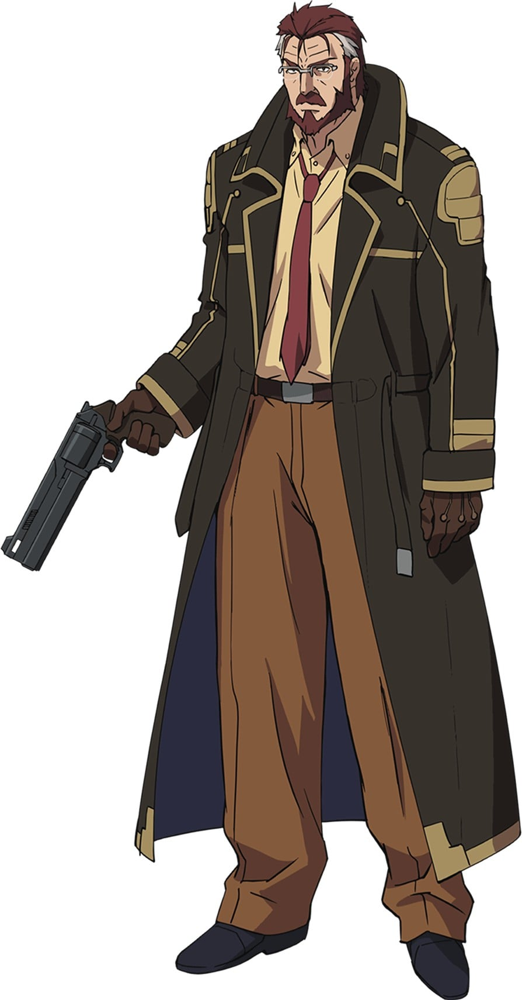 |
| 軍服の姫君 | 豊崎愛生 | 身着军服，华丽地挥舞着佩剑。 现阶段浑身都是谜团的角色。 | 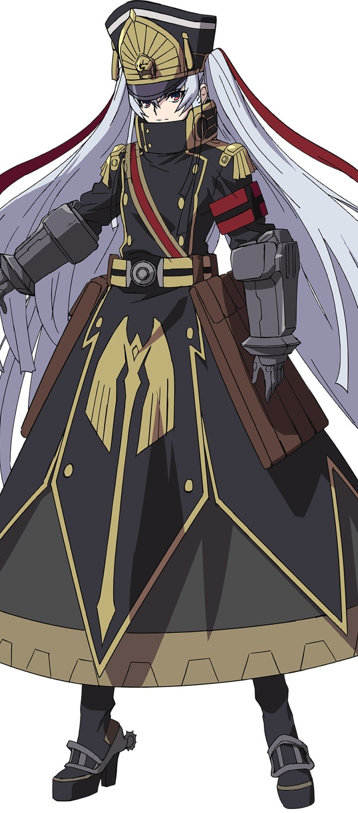 |
| 松原崇 | 小西克幸 | “精霊機想曲フォーゲルシュバリエ”的原作者。 梅特欧菈评价：「无节操且好奇心旺盛」的类型的人。 |  |