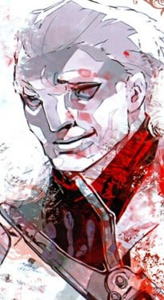
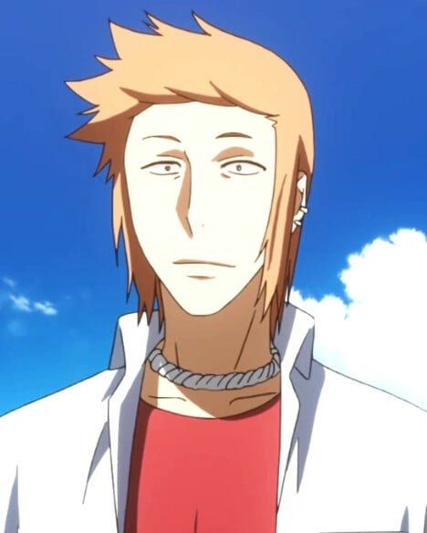
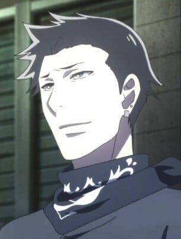
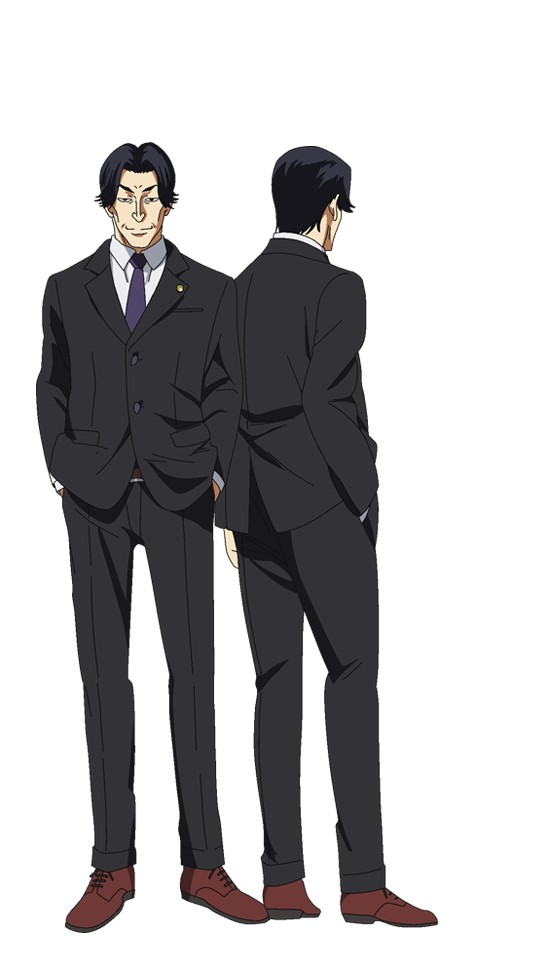
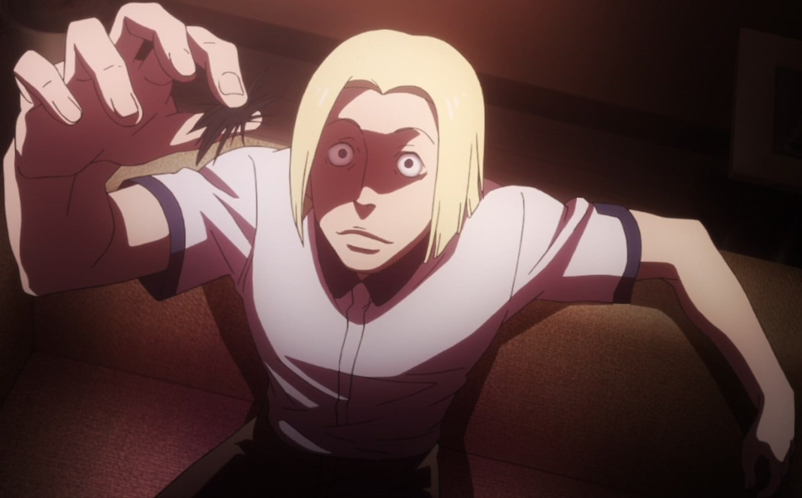

> [!bookinfo|noicon]+ **东京喰种 JACK**
> 
>
| 日文名 | 東京喰種トーキョーグール［JACK］ |
|:------: |:------------------------------------------: |
| 类型 | 漫改 |
| 新番 | 2015 年 9 月 |
| 集数 | 共1话 |
| 官网 | [https://www.marv.jp/special/tokyoghoul/first/products_ova.html#filter=.jack](https://https://www.marv.jp/special/tokyoghoul/first/products_ova.html#filter=.jack) |
| 制作 | ぴえろ |
| 导演 | 嶌田惣一 |
| 脚本 | 御笠ノ忠次,嶌田惣一 |
| 评分 | 6.2|
| 制片人 |  |

> [!abstract]+ **简介**
> 由CCG发起的对「枭」的讨伐战的12年前—。
东京13区内，名为「灯笼」的食尸鬼频频捕食人类，成为了CCG的搜查目标。
高中生·富良太志，受因为伤痛而无法继续打棒球的挫折的影响，与曾经的队友兼挚友的阿凉与阿秋一起做起了不良少年。
后来，与阿凉交恶的太志离开了两人，开始了独自行动。凉与秋虽然担心着太志，但也难以向太志启齿表明。
某一日深夜，与不良集团在一起的凉与秋被「灯笼」所袭击。正巧经过的太志，想要救助两人却敌不过食尸鬼。这时，同班同学·有马贵将出现了——

> [!tip]+ **章节列表**
>- [ ] 第1话：东京喰种 JACK (2015-09-30)

> [!tip]+ **主要角色**
> 
| 角色 | CV | 简介| 角色图片 |
|:----:|:---:|:---:|:--------:|
| 有馬貴将 | 浪川大輔 | 在新人时期因击退枭而成为局内的风云人物，能够将昆克运用自如的天才，曾经将四方莲示姊姊杀害，在漫画139话时将金木研打至濒死 有CCG的死神、不败的喰种搜查官之称。 昆克：“JACK”─甲赫：幸村。 准特等至今使用的昆克：甲赫“IXA”、羽赫“鸣神”。 |  |
| 大守八雲 | 西凜太朗 | アオギリの幹部。3月15日生まれのうお座。血液型O型。鱗赫の半赫者。本名は「大守 八雲（おおもり やくも）」。拷問が趣味で「食」より「遊」で殺しをするサディスト。極めて高い格闘センスを持ち、愛用のホッケーマスクと出身地の13区からCCGより「ジェイソン」の呼称で警戒されている。手の人差し指を曲げ、親指で押して鳴らす癖がある。過去に母親を亡くしたことと、喰種収容所で受けた残虐な拷問によって今の人格になったと述懐している。カネキに執拗な拷問を行うが、覚醒したカネキの反撃に遭い瀕死の重傷を負う結果となり、直後に遭遇したジューゾーを捕食しようとしたが返り討ちにあい死亡し、彼のクインケにされた。 上述の通り性格は醜悪であるが、ニコとナキとは親しい関係にあり、ナキにはそれなりの気遣いを行っていた。そのためナキからは「神兄貴」と呼ばれ慕われていた。 ［JACK］にも登場する。本編登場時とは違い黒髪で、彼も拷問により白髪になった模様。 |  |
| 富良太志 | 木村良平 |  |  |
| 三波麗花 | 早見沙織 | [JACK]登场。富良太志的高中同学。 |  |
| 笹田アキ | 大久保瑠美 | [JACK]登场，富良太志少年起的伙伴。 |  |
| リョウ | 鈴木達央 |  |  |
| 丸手斎 | うえだゆうじ | 対策Ⅱ課所属の男性捜査官。和修 吉時と親交がある。嫌味な性格で、自慢するために職場へハーレーで乗り付けたり、他者を見下す発言や陰口を繰り返すため、局員たちからの印象はあまりよくない。クインケを「オモチャ」と称し嫌っているが、喰種にアサルトライフルで正確な射撃を行うなど戦士としての実力は確かである模様。アオギリの11区襲撃事件に対処する11区特別対策班の指揮官を務めるが、23区の喰種収容所の襲撃を予測できなかった。梟討伐作戦では副指揮を務める。 [JACK]にも登場しており、ランタンに襲われた富良から事情聴取をした。 『:re』にも登場、和修 政を危険視している。 |  |
| 加藤澄晴 | 竹本英史 | [JACK]に登場。美容師。羽赫。店の常連客である三波を襲撃するが、富良と共闘した有馬の手によって討伐される。 |  |