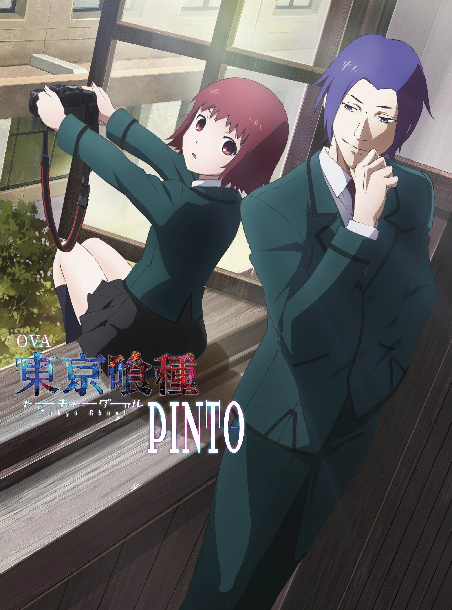

> [!bookinfo|noicon]+ **东京喰种 PINTO**
> 
>
| 日文名 | 東京喰種トーキョーグール［PINTO］ |
|:------: |:------------------------------------------: |
| 类型 | 漫改 |
| 新番 | 2015 年 12 月 |
| 集数 | 共1话 |
| 官网 | [https://www.marv.jp/special/tokyoghoul/first/products_ova.html#filter=.pinto](https://https://www.marv.jp/special/tokyoghoul/first/products_ova.html#filter=.pinto) |
| 制作 | ぴえろ |
| 导演 | 松林唯人 |
| 脚本 | 嶌田惣一 |
| 评分 | 6.1|
| 制片人 |  |

> [!abstract]+ **简介**
> 在与金木和利世相遇的数年前——。追求“美食”的月山习的捕食瞬间被高中同级生·掘千绘拍了个正着。
但是，掘千绘并不惧怕“食尸鬼”月山，只是喜悦于拍摄到了最为精彩的一瞬间。
被打乱了节奏的月山，虽然就此动了兴趣开始接触摄影少女·掘千绘，但作为“美食家”身份的食指却没有动作。
而后，月山向掘千绘发了「晚餐会」的请柬，想要借此一览这位女孩的本质…。

> [!tip]+ **章节列表**
>- [ ] 第1话：东京食尸鬼 PINTO (2015-12-25)

> [!tip]+ **主要角色**
> 
| 角色 | CV | 简介| 角色图片 |
|:----:|:---:|:---:|:--------:|
| 月山習 | 宮野真守 | 己の食に酔いしれる美食家（グルメ）  ｢――僕以外に食べさせてたまるか｣  Profile：3月3日生 うお座 A型/晴南学院大学 人間科学部 社会福祉学科 四年生 眉目秀麗な青年だが、独特の価値観と気色悪い振る舞いで「キザヤロー」呼ばわりされる変わり者。 人間のように『食』にこだわり、異様なまでの執着を見せる。  原喰种餐厅的会员，晴南学院大学人类科学社会科四年级生。21岁→青桐树篇后22岁。 对“食”有着偏执追求的喰种，接近金木，企图吞食他。首次对金木下手时发现其半人半喰种的“独眼”身分后，临时打消集体分食的念头，暗地里打算独自享用这稀有的存在。利用西尾的人类女友西野贵未为人质，逼迫金木现身。为了充分享用金木，特地饿了几天，因此力量无法完全发挥，在这疏忽自大的原因下败给了咬噬金木血肉，得以充分发挥力量的董香。 随着故事推演，自比为“剑”，伴随在金木身边替其办事，是强大却危险、不可信任的存在。 |  |
| 掘ちえ | 潘めぐみ | 身材矮小，爱好摄影，擅长收集情报，主要以出售平时收集到的情报赚钱。虽然已经成年但是外表却依旧如同小孩子一般，也因此常被误解。 最早于官方小说第一卷出场。后于漫画《东京食尸鬼re》中正式登场。 |  |
| 松前 | 中村千絵 | 表面上是晴南学院大学附属高中的老师，真正身份为月山家的佣人。 于漫画第二部“东京喰种:re”正式登场。跟叶一起出席拍卖会。 赫子有两种型态，一种为可产生网状障壁的分离型赫子，另一种为剑与盾的甲赫。 |  |
| 三晃 | 伊藤かな恵 | 只在小说[日々]及其改编动画[Pinto]中登场。月山习的同学，喰种。月山称呼她Miss Ikaru。上井大学神秘学研究会的一员。 |  |
| 老人 | 中博史 | 大学病院に入院している九十代の男性患者。資産家。  痴呆と心臓疾患を抱えており徘徊しては看護師達にセクハラを行っている。 |  |
| 看護師 | 佐藤利奈 | 大学病院に勤めている人気者の看護師。  老人からセクハラを受けている。 |  |