> [!bookinfo|noicon]+ **东京喰种:re 第二季**
> 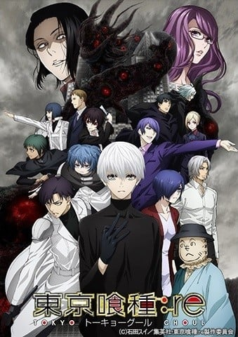
>
| 日文名 | 東京喰種トーキョーグール：re 第2期 |
|:------: |:------------------------------------------: |
| 类型 | 漫改 |
| 新番 | 2018 年 10 月 |
| 集数 | 共12话 |
| 官网 | [https://www.marv.jp/special/tokyoghoul/](https://https://www.marv.jp/special/tokyoghoul/) |
| 制作 | ぴえろ |
| 导演 | 渡部穏寛 |
| 脚本 | 御笠ノ忠次 |
| 评分 | 5.6|
| 制片人 | 熊谷侑也 |

> [!abstract]+ **简介**
> 混杂于群众之中，以人类的肉为食。拥有人类的形态，却与人类不同的存在……“喰种”。
在对“喰种”进行驱逐、研究的“CCG”，曾经率领“Quinx”小组的喰种搜查官“佐佐木琲世”。他正是行踪不明的眼罩喰种“金木研”。
另一方面，在成立了新体制的“CCG”，以旧多二福为中心，不安定的行动终于表面化……
与“金木研”有关的故事，终于迈向最终章——。

> [!tip]+ **章节列表**
>- [ ] 第13话：于是 再一次 Place (2018-10-09)
>- [ ] 第14话：白色黑暗 VOLT (2018-10-16)
>- [ ] 第15话：激战 union (2018-10-23)
>- [ ] 第16话：遗留之物 (2018-10-30)
>- [ ] 第17话：相遇 迷惘 MovE (2018-11-06)
>- [ ] 第18话：赫赫战果 FACE (2018-11-13)
>- [ ] 第19话：牵绊 proof (2018-11-20)
>- [ ] 第20话：觉醒之子 incarnation (2018-11-27)
>- [ ] 第21话：印象 Morse (2018-12-04)
>- [ ] 第22话：悲剧的尽头 call (2018-12-11)
>- [ ] 第23话：邂逅 ACT (2018-12-18)
>- [ ] 第24话： (2018-12-25)

> [!tip]+ **主要角色**
> 
| 角色 | CV | 简介| 角色图片 |
|:----:|:---:|:---:|:--------:|
| 金木研 | 花江夏樹 | 本作第一部の主人公である青年。12月20日生まれのいて座。血液型AB型。愛称は「カネキ」。上井大学文学部国文科一年生で、20区内のマンションで一人暮らしをしていた。喰種のリゼに捕食されかけ瀕死になるものの、リゼの頭上より鉄骨が落下してきたことにより九死に一生を得る。搬送された病院でリゼの臓器を移植されて生き延びるが、その代償で半喰種となり、喰種の世界に関わることになる。喰種化したことで苦悩していたが、あんていくの店長である芳村に救われ、区内に暮らす喰種の集まる場所でもある同店で働くこととなる。そこで人間と喰種双方の苦悩に触れながら自ら生き方を模索するが、アオギリの樹からの拉致とヤモリの拷問を契機に、忌避していた喰種の本質を受け入れ、大切な人々を守るために戦う道を選ぶ。元来の性格は内向的かつ温厚で、亡き母の影響で自己犠牲を尊ぶ受け身な考え方を持っていたが、アオギリの騒乱による一連の事件を経て敵対者に容赦しない冷徹かつ攻撃的な一面を持つに至った。また、ヤモリの執拗な拷問が彼の思考や人格にパラダイムシフトをもたらしたためか、ヤモリの人格と癖を模倣し強い喰種を喰らうようになった。 アオギリの本拠地から脱出した後はあんていくに戻らず、バンジョーや月山、ヒナミたちと反アオギリを掲げて行動を共にする。その後、半年間共喰いのみを行い、不完全ながら赫者となる。嘉納を追い詰める際、篠原を防戦一方に追い込みSSレート認定を受けるほどの実力を発揮するが、その際に自我を失った錯乱状態となり、バンジョーを手にかけようとしたところで正気へと戻った。その後、自身の疑問からあんていくで芳村と会話し、その直後のトーカからの叱咤から自分の間違いに気づき反アオギリを解散する。 あんていく襲撃時には、芳村たちを助けに単身あんていくに向かう。途中、円児とカヤを助けながらも、あんていくに繋がる道にて亜門と激戦を繰り広げ致命傷を負ってしまう。そのため極度の飢餓状態に陥り、リゼやヤモリの幻覚にうなされてしまう。しかし、逃げ込んだ地下道でヒデと再会する。ここから先の記憶はなく、ルートV14で逃げた喰種を全滅させた有馬と遭遇。ヒデの助言に従い理性と狂気を総動員した持ち得る能力の全てを駆使しIXAの防御壁を損傷させるほどの奮戦を見せるが、それすら叶わず圧倒された末に両眼を貫かれて駆逐された。 半喰種であるため食性や身体能力は喰種と同じであるが、赫眼は左目だけに現れ、自分の意思で発現をコントロールできないため、外出時は眼帯をつけている。マスクは普段とは逆に赫眼のみを露出する構造になっている。このマスクの特徴により亜門からは「眼帯の喰種」と呼ばれている。赫子はリゼと同じ先端が鉤爪状になった鱗赫で、右の腎臓付近から発生する。半赫者となった際には、百足のような赫子に、左顔を覆って胸元に向けて尖って伸びた一つ目の面が現れた（元々複数の赫包が発達しているのか、リゼの人格が現れたためかは不明だが、平常時の赫子が6本ある状態の赫子も出せる模様）。この赫子の特徴からCCGにより「ムカデ」の呼称が付けられる。標準的な喰種に比べると体の堅牢さに劣るが、喰種からも異常と見られるほどの回復力を持つ。嗅覚の優れた喰種たちに言わせると喰種や人間とも違う体臭であると指摘されているが、リゼと面識のある者からは彼女の匂いを感じ取られている。Rc検査ゲートと呼ばれる喰種判別装置に反応せず、肉体的に人間的な要素が多く残されている描写がなされている。生きた人間の肉を食らった後に、リゼを思わせる人格が現れることがある。当初は黒髪だったが、ヤモリの拷問による後遺症で白髪となった。 幼くして母を亡くしたことで孤児になり、伯母一家に引き取られて暮らしていたが、伯母によるネグレクトに遭っていたため、親友のヒデが心の支えになっていた。読書が趣味で主にミステリーを好んで読んでおり、作家・高槻泉のファンである。独白シーンではたびたび小説の引用で心境が語られている。 | 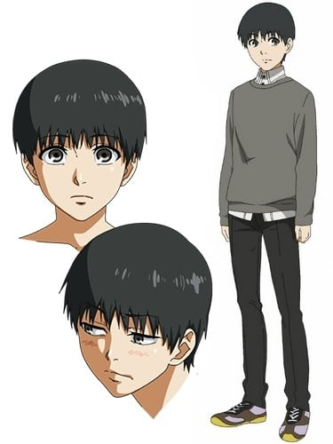 |
| 霧嶋董香 | 雨宮天 | 本作のヒロイン。清巳高等学校普通科二年生。7月1日生まれのかに座。血液型O型。羽赫。愛称は「トーカ」。右眼を前髪で隠している。あんていくでアルバイトをしており、カネキの先輩店員にあたる。ウサギのマスコットを好み、マスクもそれに合わせていることから、CCGからは「ラビット」の呼称が付けられている。親友である依子の手料理を度々口にしているため戦闘能力を十全に発揮できず、赫子を片方の肩からしか出せない。普段はか弱い者にも気遣いを忘れない心優しさを見せるが、感情的になると激情に駆られ、敵対した人間を躊躇なく殺すなど凶暴な一面を持っている。カネキはこの極端な生命観を喰種としての生き方から来ていると考えている。平穏な暮らしを営める人間を羨んでおり、元が人間であるカネキに対しては複雑な感情を抱いているが、彼の優しさに惹かれている。既に両親はおらず、弟のアヤトと同居していたが音信不通となり、後に敵対関係となる。家族を失ったヒナミを引き取って同居していたが、アオギリの騒乱の後に彼女はカネキについていくことを選んだため、元の一人暮らしに戻った。その後カネキの通っていた上井大学の理学部を目指して受験勉強をしていた。カネキが芳村に面会した際に再会、カネキを激しく叱咤し、そのことが彼が６区での組織を解散を決意する切掛になる。 あんていく襲撃をテレビで知り助けに行こうとするが四方に止められてしまう。その後、討伐戦の後に取り壊されるあんていくを見ながら、カネキがいつか帰ってくること信じ、四方とともに20区を脱出した。 『:re』ではヨモを対外的に兄とし、ヨモと二人で喫茶店「:re」を営んでいる。 | 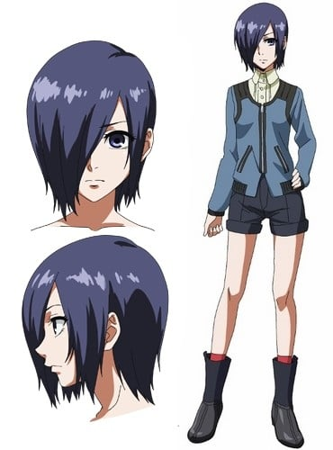 |
| 永近英良 | 豊永利行 | カネキの親友。上井大学に通う男子学生。愛称は「ヒデ」。カネキが人間としての感情を持つ中で柱となっている人物。カネキとは正反対に活発な性格で、友好関係が幅広くなぜか周囲に喰種が多い。小学生時代にカネキに話しかけたのがきっかけで親友となる。あんていくの常連客で、トーカに興味を抱いている。陽気でおおざっぱな性格であるが他者の微かな機微に気付く鋭い洞察力を持ち、真戸の殉職の件もほぼ完全な推理で事件の本質に辿り着いている。 喰種の事件に興味を持ち、新聞の切り抜きを集めたり、ヤモリに発信機を付け、アオギリの樹のアジトの場所を特定するなどして独自に捜査を行っていた。CCGにアルバイトとして働いており局員補佐として採用されたが、アオギリのアジトの情報を匿名でCCGに提供をしたことが丸手に知られ、彼の判断で捜査官補佐となる。梟討伐作戦では丸手の補佐として参加する。地下道で半赫者となったカネキと再会し、カネキが喰種であることに気づいていたことを明かし、もう一度だけ戦うよう励ました。その後の行方は不明となっている。 | 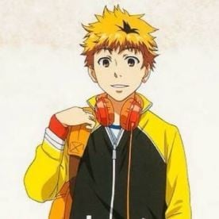 |
| 神代利世 | 花澤香菜 | 欲望に忠実に振舞う『大喰い』  ｢私、食事の邪魔されるのって 　　　　　　　　　　　大嫌いなのよねぇ……｣  欲望のままにヒトを喰らってきた『大喰い』。何にも囚われず、自由気ままに喰場（“喰種”ごとの縄張り）を荒らす曲者だが、出自も不明で謎の多い人物。尋常ではない捕食数と突出した戦闘能力で他の“喰種”からも恐れられている。 | 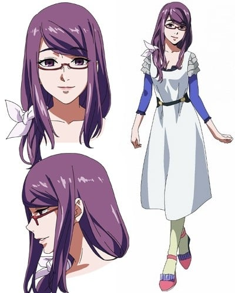 |
| 西尾錦 | 浅沼晋太郎 | ヒトに裏切られた過去を持つ“喰種”  ｢人なんか、信じられるわけがない｣  上井大学　薬学部　薬学科　二年生 姉が裏切りにより命を落とした事で人間を信用できなくなっていたが、現在は“喰種”としての自分を受け入れてくれた人間の恋人・貴未を何よりも大事に思っている。  上井大学药学系二年级生。对即溶咖啡知之甚详。有位与人类交往，却被人类男友背叛的姊姊（已亡，声：内山夕实）。 因为姐姐被人类背叛而完全不信任人类，但却非常珍惜自己的女友贵未，自言被她背叛也心甘情愿。 其喰场曾被神代利世夺去，随后才由吉田和夫手中夺回。带有些许神经质，曾袭击金木与永近，却因败给金木身受重伤，让周围的喰种趁势欺凌。 后来在金木的帮助下进入“安定区”工作。 | 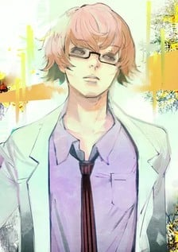 |
| 亜門鋼太朗 | 小西克幸 | 己の正義を信じ“喰種”討伐に燃える〔ＣＣＧ〕のホープ  ｢この世界を歪めているのは、貴様ら“喰種”だ｣  喰種捜査官養成学校卒業(首席) 喰種捜査官養成学校（通称：アカデミー）を首席で卒業したエリート。 “喰種”により歪められたこの血なまぐさい世界を正すべく、“喰種”を駆逐することに命を懸ける。一対一の戦いで自分を圧倒しながらも見逃したカネキの言葉が頭から離れずにいる。 | 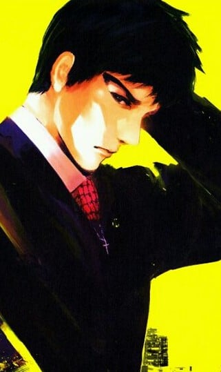 |
| 月山習 | 宮野真守 | 己の食に酔いしれる美食家（グルメ）  ｢――僕以外に食べさせてたまるか｣  Profile：3月3日生 うお座 A型/晴南学院大学 人間科学部 社会福祉学科 四年生 眉目秀麗な青年だが、独特の価値観と気色悪い振る舞いで「キザヤロー」呼ばわりされる変わり者。 人間のように『食』にこだわり、異様なまでの執着を見せる。  原喰种餐厅的会员，晴南学院大学人类科学社会科四年级生。21岁→青桐树篇后22岁。 对“食”有着偏执追求的喰种，接近金木，企图吞食他。首次对金木下手时发现其半人半喰种的“独眼”身分后，临时打消集体分食的念头，暗地里打算独自享用这稀有的存在。利用西尾的人类女友西野贵未为人质，逼迫金木现身。为了充分享用金木，特地饿了几天，因此力量无法完全发挥，在这疏忽自大的原因下败给了咬噬金木血肉，得以充分发挥力量的董香。 随着故事推演，自比为“剑”，伴随在金木身边替其办事，是强大却危险、不可信任的存在。 | 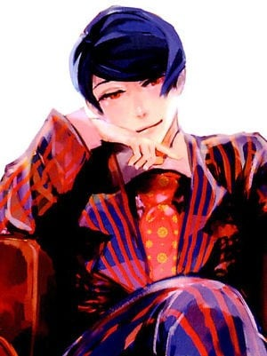 |
| ウタ | 櫻井孝宏 | 新宿にて「HySy ArtMask Studio」という店を営んでいるマスク職人の男性。マイペースな性格で、ピアスとタトゥーの出で立ちが特徴的なパンク・ファッションで装い、攻撃的な外見とは裏腹に対応は穏やかである。常に赫眼状態のため外出時はサングラスを着用している。かつては4区に集う喰種のリーダー格で、ヨモと敵対していた。  面具店“Art Mask Studio”的店主。 耳缘与唇上镶有耳环、颈上刺青、剃去左侧头发的庞克造型。为人与可怕的外貌相反，既体贴又稳重。由于在平时也维持赫眼状态，外出时会戴上太阳眼镜。 虽然至今并没有站在前线，但实力高强。尚未使用过赫子，惯空手战斗。 年轻时曾在4区待过，是负责管理4区的人。实力强大，即使不用赫子单靠双手也能轻松解决一大批搜查官。对于当时突然出现在4区的四方很是感兴趣，与其对战了很长时间发现其实力与自己不相上下，于是和其成为了朋友，称呼其为“乌鸦”，并了解到姐姐被有马搜查官杀死，于是与其一起挑战包括有马在内的众搜查官。之后搬入20区寻求安静的生活，和四方与系璃两人甚是熟悉。 在为了营救出金木而与青桐树一战时展现了其经久不衰的实力。 | 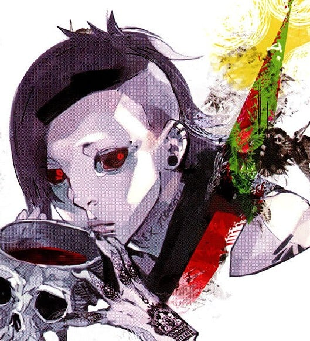 |
| 四方蓮示 | 中村悠一 | 男性。赫子は不明。店長の右腕的な人物。店の業務に関わることはなく、情報収集や自殺者の遺体集めといった実務を担当している。寡黙で無愛想だが誠実な人柄で、周囲からの信頼も厚い。  沉默寡言，平时身穿连帽的风衣。会帮助芳村店长搜集情报，与搜集用作食粮的自杀者遗体。与诗、系璃是朋友。 姊姊被有马杀掉 ，因此对有马怀恨在心。 | 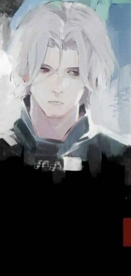 |
| 笛口雛実 | 諸星すみれ | 復讐よりも『家族』を望む孤独な少女  ｢三人で暮らしてた時に戻りたい…… 一人は寂しいよ｣  両親と三人暮らしで幸せに育った。“喰種”としての素質が高く、優れた赫子を持つが、戦闘も復讐も望まない心優しき少女。  13岁→青桐树篇后14岁。 喜欢父母、念书、金木、董香；对高槻泉的作品、人类社会感兴趣。 双亲皆为喰种搜查官所杀。寄宿在“安定区”二楼。个性善良，和其母一样不好战斗，具有优秀的感应能力。 | 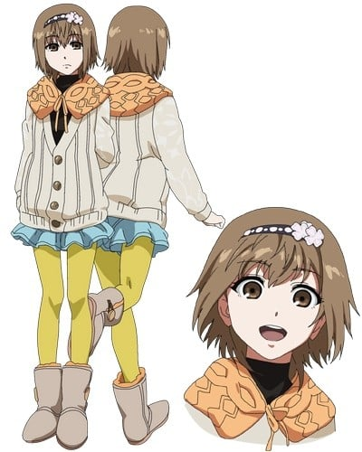 |
| 有馬貴将 | 浪川大輔 | 在新人时期因击退枭而成为局内的风云人物，能够将昆克运用自如的天才，曾经将四方莲示姊姊杀害，在漫画139话时将金木研打至濒死 有CCG的死神、不败的喰种搜查官之称。 昆克：“JACK”─甲赫：幸村。 准特等至今使用的昆克：甲赫“IXA”、羽赫“鸣神”。 | 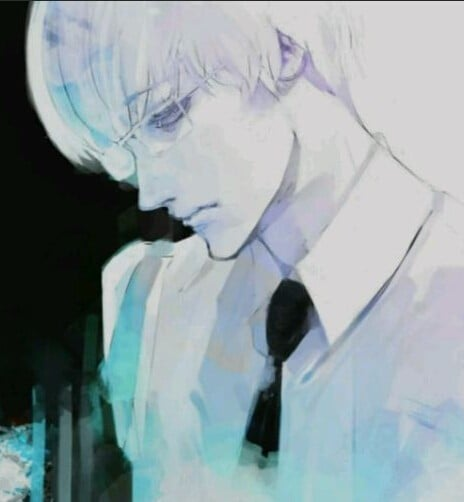 |
| 霧嶋絢都 | 梶裕貴 | 通称：绚都 代号：黑兔 赫子：羽赫 面具：黑色兔子 7月4日生日，巨蟹座。O型。159厘米／49公斤。  青桐树的干部，董香的弟弟。 童年时父亲遭CCG的搜查官杀害，同时姊弟俩为喰种的身份被邻居举发，因此十分憎恶人类，并遵奉力量就是一切的原则。因不赞同董香积极与人类共处的生活生式，与董香决裂并独自离家，于东京各处大闹掠食。而后遇见多田良，加入青桐树。 数年后因追寻利世踪迹返至20区，与董香再会，两人已明显成为敌对关系。但在11区青桐树基地战斗时，被金木看穿仍对姊姊董香抱持着家人与守护的情感。与觉醒的金木战斗中，被金木当场用手慢慢折断其103根骨头后被野吕回收带走。 青桐树篇结束的半年后，开始带上黑色兔子的面具随机杀害喰种搜查官，这时似乎是因为金木的缘故，原本是双翼的羽赫变成了单翼。 | 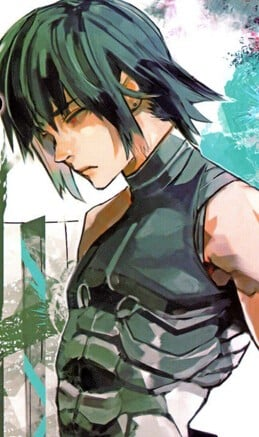 |