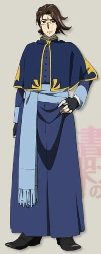
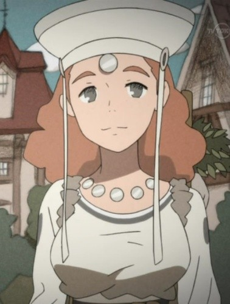

> [!bookinfo|noicon]+ **丹特丽安的书架**
> 
>
| 日文名 | ダンタリアンの書架 |
|:------: |:------------------------------------------: |
| 类型 | 小说改 |
| 新番 | 2011 年 7 月 |
| 集数 | 共12话 |
| 官网 | [https://www.tv-tokyo.co.jp/anime/dantalian/](https://https://www.tv-tokyo.co.jp/anime/dantalian/) |
| 制作 | GAINAX |
| 导演 | 上村泰 |
| 脚本 | 山賀博之,砂山蔵澄,浦畑達彦 |
| 评分 | 7.1|
| 制片人 | 白石直子,白石直子、高橋祐一 |

> [!abstract]+ **简介**
> 修伊从曾用全领地的一半换取一本稀有书的藏书狂祖父处，继承了古老的宅第以及其所有的藏书。条件只有一个——要他继承“书架”。
为整理遗物而造访宅第的修伊在充斥着书本的地下室内，遇见了静静地读着书的少女。
穿着漆黒的裙子，胸前挂着巨大锁的少女达利安。她正是收藏禁断“幻书”的“Dantalian的书架”的入口，通向恶魔智慧的门扉——

原作为三雲岳斗的轻小说作品，由Gユウスケ（グリーンウッド）负责插画，漫画作者则是阿倍野ちゃこ。

> [!tip]+ **章节列表**
>- [ ] 第1话：立体绘本 (2011-07-15)
>- [ ] 第2话：胎儿之书 (2011-07-22)
>- [ ] 第3话：睿智之书 &amp; 月下美人 (2011-07-29)
>- [ ] 第4话：换魂之书 (2011-08-05)
>- [ ] 第5话：魔术师之女 (2011-08-12)
>- [ ] 第6话：焚书官 (2011-08-19)
>- [ ] 第7话：调香师 (2011-08-26)
>- [ ] 第8话：等价之书 &amp; 连理之书 (2011-09-02)
>- [ ] 第9话：黄昏之书 (2011-09-09)
>- [ ] 第10话：幻曲 (2011-09-16)
>- [ ] 第11话：拉洁爱尔的书架 (2011-09-23)
>- [ ] 第12话：尚未见到的明日之诗 (2011-09-30)
>- [ ] 第0话：序章~共犯们的证词~ (2011-07-09)

> [!tip]+ **主要角色**
> 
| 角色 | CV | 简介| 角色图片 |
|:----:|:---:|:---:|:--------:|
| ヒューイ | 小野大輔 | 黒の読姫の正統なる鍵守の後継者，本作の主人公。ウェズリー・ディスワードの孫。18、19歳ほどの青年。  本名はヒュー・アンソニー・ディスワード(Hugh Anthony Disward)。初対面の者にはディスワード卿と呼ばれることもある。  蒐書狂(ビブリオマニア)のウェズリー・ディスワードの孫。十八、九ほどの青年で、ほとんどの話に登場する。  祖父の遺言で古ぼけた屋敷と『ダンタリアンの書架』を引き継ぎ、ダリアンの世話を任された。革製のフロックコートを身にまとい、帽子をかぶっている。一人称は『僕』だが、戦争中は『俺』と名乗っていた。拳銃の扱いに長けており、戦中はパイロットで撃墜王になっているとのこと。最終階級は少尉。愛用銃は、中折れ式のリボルバー。軍用の大型拳銃。  書架解放時の呪文は「我は問う、汝は人なりや？（I ask of thee Art thou mankind?）」  ちなみに、3歳の時『ダンタリアンの書架』に迷い込んだことがあり、一晩中泣き続けていたらしい。 |  |
| ダリアン | 沢城みゆき | 本名はダンタリアン。十二、三歳くらいの容姿をしている。幻書の知識を持つ者には『黒の読姫』と呼ばれる。また、自らを『壺中の天』と呼ぶ。  『ダンタリアンの書架』の管理者で、本と甘いもの（特に砂糖をまぶした揚げパン）をこよなく愛する黒衣の美少女。しかし、美貌に似合わぬ辛辣な物言いをしたり、他人に罵詈雑言を浴びせて人を困惑させる。ヒューイに無理を強いるわがままな一面も持つ一方で、人見知りが激しいなど少女らしい一面も併せ持っている。動物（特に犬）、高い所、幽霊が苦手。  胸元には黒く、鈍く輝く錠前があり、これこそが『ダンタリアンの書架』の入り口こと「悪魔の叡智への扉」であり、ヒューイのもつ鍵で開くことができる。  書架解放時の呪文は「否、我は天――壺中の天なり」 |  |
| 白い服の少女 | 沢城みゆき | 「ダンタリアンの書架」の中で無数の幻書の眠りを守り続けている少女。ダリアンと全く同じ容姿をしており、自身がいる書架を牢獄と語る。書架に迷い込んだ幼いヒューイと出逢い、一緒に外の世界へ行く約束を交わし、今もなお彼を待ち続けている。  アニメではふた結びにしたピンク色の髪にハスの花を模した髪型りとピンク色のドレスを着ており、コミカライズ版「ダンタリアンの書架」では衣装までダリアンと同じ（黒いドレス）であるなど若干の差異が見受けられる。  アニメでは書架の扉を開放した際、その都度必要となる幻書を渡しているかのような描写がある。 |  |
| ハル | 加藤将之 | 本名はハル・カムホート。年齢は20代後半。 「焚書官」「償いの書」「屋敷妖精の受難」「幻書泥棒」「楽園」「王の幻書」に登場。法衣に似た服を身につけ、先端に香炉を埋め込んだ身の丈よりも長い巨大な杖を持ち歩いているため、聖職者（神父）と間違えられることが多いが、実際は聖職者ではなく焚書官。サイドカーで移動していることが多い。 幻書を破壊することに強い執着心を抱いており、過去になんらかの因縁があることが推測される。常に苛立った顔をしており、そのことがフランにからかわれる一因になっていることに気付いていない模様。また、ヒューイからもたびたびうまくあしらわれてしまっている。なお、ヒューイのことは当初は「鍵守」と呼んでいたが、「王の幻書」の最後で「ディスワード」と呼ぶようになった。 バリツという東洋の格闘術を使うほか、先述の杖（スルトの災いの枝、災厄の杖）に幻書を装填し焚きつけにすることで魔力の炎を生み出す。 書架解放時の呪文は「"壊れた読姫"（ロング・ロスト・ライブラリ） フランベルシュ！我は問う、汝は人なりや？ (ask of thee Art thou mankind?) 」  ----------------------------------------------------------------------------------------  本名是哈尔•卡姆赫德。年龄二十五到三十岁。 “焚书官”、“赎罪之书”里登场。身穿像法衣一样的衣服，拿着比身高还要长的大杖，杖上还有一个香炉。常常被误认为是圣职者（神父），事实上不是圣职者而是焚书官。 有着强烈的破坏幻书的欲望，推测与之过去有关。 使用一种叫做巴流术的东洋格斗术。通过将幻书“装填”进先述之杖（灾厄之枝、灾祸之杖）并将其焚烧来产生魔之火焰。 书架解放时的咒文是“‘毁灭读姬’芙兰蓓尔！吾之所问，汝为人乎——？”。 |  |
| フラン | 小清水亜美 | 本名叫芙兰蓓尔（Flamberge）。“焚书官”、“赎罪之书”里登场。  十六、七岁左右，被幻书持有者称之为‘银之读姬’，也被哈尔称作‘毁灭读姬（ロング・ロスト・ライブラリ）’。以‘堕落之天’自称。  银发金瞳穿着白色的衣服，身上还绑有限制其自由的皮制的带子，为了限制芙兰的自由，拘束道具上还有一个漆黑的大锁，以封印芙兰。  书架解放时的咒文是“否，我乃天——堕落之天。” |  |
| 教授 | 四宮豪 | 本名不明。以教授之名‘教授’，在“必胜法”、“拉杰艾露的书架”里登场。另外、除了以教授的称呼出现以外、还以其他的名字在“焚书官”、“赎罪之书”中登场过。 年龄不明的美男子、留着长发马尾、穿着像医生一样的白袍。理解了还不存在于这个时代的核裂变概念的充满谜团的人物。 书架解放时的咒文是“红之书姬拉杰艾露呦……吾之所问，汝为人乎？” |  |
| ラズ | 矢作紗友里 | 本名是拉洁爱尔（Rasiel）。被称作‘红之读姬’，‘拉洁爱尔’是在“拉洁爱尔的书架”中初次登场，和教授一样算上没用本名的出场。在“独裁者之书”、“焚书官”、“眠之书”中登场。  年龄为十三、四岁左右、淡绿色的头发、水嫩白皙的皮肤、如鲜血般鲜红的衣服，身着黄金的护胸。右眼是与头发同样的淡绿色、左眼用带着深色的眼罩。  稍微有些口齿不清的笑声。口癖是“蠢毙了。蠢毙了。”、用德意志语来肯定、否定。  书架解放时的咒文是“否，我乃天——哀叹之天”。 |  |
| アイラ | 小林由美子 |  |  |
| カミラ・ザウアー・ケインズ | 能登麻美子 | 「叡智の書」で初登場し、「等価の書」「時刻表」「災厄と誘惑」「最後の書」にも登場する19歳の女性でサブレギュラー的な立ち位置。ダリアンによれば「ザ・嫁き遅れ」。 王都で貿易商を営むケインズ商会の会長の一人娘。商会はディスワード家と古いつき合いで、特にウェズリーは商会のお得意様でカミラが屋敷に訪れることも多く、それ以来ヒューイとは幼馴染の間柄である。その後しばらく新大陸に渡っていたが、戦争の直後に帰国しボランティアで私塾を開いている。ダリアンは取り付く島もない態度を取り邪険に扱っているがカミラ本人はそのことを欠片も気にしておらず、手のかかる妹のように接しており時々彼女の好物を持って遊びにやってくる。レオンという腹違いの兄がいる。ファッションへは並ならならぬ熱意をもちカウガールをはじめ新大陸での服装にも手を出している。スタイルも良いためダリアンからは複雑な視線で観られている。後に失恋したアルマンを慰めた際には巨乳であることを指摘され彼から恋愛を求められるという災難に遭う。「ダリアンDays」にも登場するがダリアンとの面識がないなど設定が異なっている。 |  |
| アルマン・ジェレマイア | 櫻井孝宏 | 「魔術師の娘」に初登場し、「連理の書」にも登場する、造船業で有名なジェレマイア家の令息。18、9歳くらいの青年で、空軍に所属していた頃はヒューイと同じ基地に配属されていており、ヒューイは命の恩人であるという。ヒューイがかつて軍にいたことに触れられるのを嫌っていることを知っているため、彼の階級である「少尉」ではなく「先輩」と呼んでいる[3]ダリアンによれば「すっとこどっこい」。 |  |