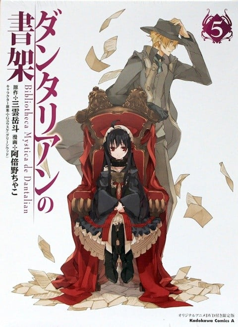

> [!bookinfo|noicon]+ **丹特丽安的书架 荆姬**
> 
>
| 日文名 | ダンタリアンの書架 荊姫 |
|:------: |:------------------------------------------: |
| 类型 | 小说改 |
| 新番 | 2012 年 8 月 |
| 集数 | 共1话 |
| 官网 |  |
| 制作 | GAINAX |
| 导演 | 上村泰 |
| 脚本 | 浦畑達彦 |
| 评分 | 6.8|
| 制片人 |  |

> [!abstract]+ **简介**
> 丹特麗安的書架漫畫第五卷2012年8月11日與OAD「荊姫」同捆発売
这张DVD所收录的内容则是TV未播放的完全新作的原创小故事《荊姬》，讲述幻书“深绿之书”的所有者爵士・约翰・卡拉波斯因为遭遇火灾而死亡，根据目击情报大都认为这本幻书已经和房屋一起烧毁了。到访他的领地的达利安和修伊，却在森林中迷路了，这时候他们遇见一名女性药草师并向她告知名字。据说爵士・约翰・卡拉波斯还有个女儿滞留在附近的别墅，不过……

> [!tip]+ **章节列表**
>- [ ] 第1话：荆棘公主 (2012-08-11)

> [!tip]+ **主要角色**
> 
| 角色 | CV | 简介| 角色图片 |
|:----:|:---:|:---:|:--------:|
| - | - | - | - |