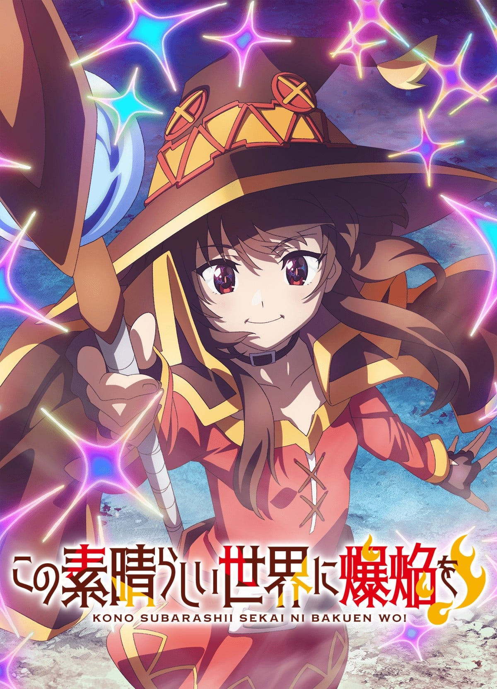
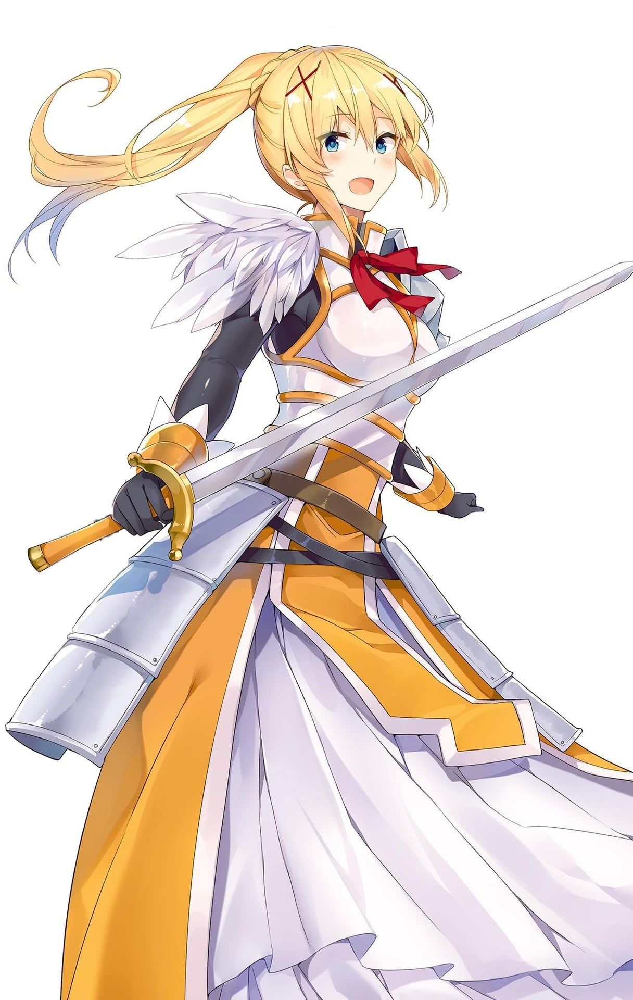
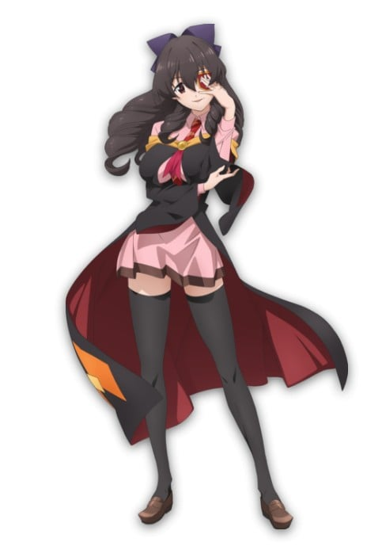

> [!bookinfo|noicon]+ **为美好的世界献上爆焰！**
> 
>
| 日文名 | この素晴らしい世界に爆焔を！ |
|:------: |:------------------------------------------: |
| 类型 | 小说改 |
| 新番 | 2023 年 4 月 |
| 集数 | 共12话 |
| 官网 | [http://konosuba.com/bakuen/](https://http://konosuba.com/bakuen/) |
| 制作 | ドライブ |
| 导演 | 安部祐二郎 |
| 脚本 | 関根聡子,上江洲誠,待田堂子,上江洲誠(1,5,8,12)、蒼樹靖子(2,6,9)、関根聡子(3,10)、待田堂子(4,7,11),蒼樹靖子 |
| 评分 | 7|
| 制片人 | 宮腰徹 |

> [!abstract]+ **简介**
> 红魔之乡——那里是天生拥有高魔力和智力，作为魔法使的高适应性，以及红眼睛的红魔族居住的土地。
这个红魔之乡有个乡训，那就是“只有学会高级魔法才能独当一面。爆裂魔法是梗魔法。”
但是，就在“魔法学园Red Prison”的同学们期待着学习高级魔法的时候，红魔族的少女·惠惠，独自一个人为了掌握爆裂魔法而努力学习。
为了追上小时候看到的那个情景还有那个人——
这是憧憬最强魔法的，一名少女的故事。

> [!tip]+ **章节列表**
>- [ ] 第1话：红眼的魔法师们 (2023-04-05)
>- [ ] 第2话：魔法学校的禁忌 (2023-04-12)
>- [ ] 第3话：红魔之里的守护者们 (2023-04-19)
>- [ ] 第4话：红眼的孤傲少女 (2023-04-26)
>- [ ] 第5话：爆裂狂的诞生 (2023-05-03)
>- [ ] 第6话：爆裂啃老族的求职活动 (2023-05-10)
>- [ ] 第7话：水都的麻烦教团 (2023-05-17)
>- [ ] 第8话：水都的狂热信徒们 (2023-05-24)
>- [ ] 第9话：来自红魔之乡的造访者（Destroyer） (2023-05-31)
>- [ ] 第10话：新手之城的冒险者（out law）们 (2023-06-07)
>- [ ] 第11话：知名爆裂女和森林恶魔 (2023-06-14)
>- [ ] 第12话：为美好的世界献上爆焰！ (2023-06-21)
>- [ ] 第0话：このすばチャンネル特番 ～この素晴らしい世界に爆焔を！放送直前スペシャル with 日清炎メシ～ (2023-03-28)

> [!tip]+ **主要角色**
> 
| 角色 | CV | 简介| 角色图片 |
|:----:|:---:|:---:|:--------:|
| 佐藤和真 | 福島潤 | 本作的主人公，是个喜欢电玩、动画、漫画的茧居尼特高中生。某天偶尔外出时碰上交通意外而身亡（被车子吓死）之后，带着阿克娅一起转生到异世界去。 身高约165上下，黑头发黑眼睛，是个随处可见的16岁青少年，职业是冒险者。自称是“真正的男女平等主义者”，就算对方是女性也会毫不留情的“对付”，也因为这样而被其他人取了“鬼畜和真”“变态的鬼畜男”等等的绰号。职业是冒险者，因为异常高的幸运值以及偷窃技能而意外的活跃。不喜欢惹事生非但却因为同伴们的关系而常被卷入各种事件内。 |  |
| アクア | 雨宮天 | 指引英年早逝者的女神，因为惹火和真而被和真指定为携带的东西而与和真一起转生到异世界。在那里,她是阿克西斯教团祭拜的神体，“阿克娅女神”本尊……话虽如此，却没任何人相信这件事。有着水蓝色的及腰长发跟眼睛，年龄不祥（自称跟和真差不多），职业是大祭司。因为是神体的关系所以能力值一开始就封顶，也习得了“大祭司”“宴会才艺”（杂耍）的所有技能，甚至具有碰到液体就能将其净化的体质，但却有着有别于她美少女形象的傲娇个性。做事常常少一根筋，常常对和真颐指气使，但遇到挫折或害怕的事就会像小孩一样嚎啕大哭。 |  |
| めぐみん | 高橋李依 | 自称红魔族当中首屈一指的天才魔法师，黑发红眼，年龄14岁，职业是大魔法师。深受名为“爆裂魔法”的最强魔法之魅力所吸引，所以只会用这招，也只肯用这招。是个有严重的中二病的萝莉，最喜欢的东西、专长、兴趣都是爆裂魔法，不过因为本人自身魔力不够高的关系，一天的魔力只够用一发爆裂魔法，用完就会不支倒地。因为家庭的经济关系而外出找工作，并以此为契机加入和真的小队。 |  |
| ダクネス | 茅野愛衣 | 外表是个金发碧眼，身材丰满的冰山美人，但真正的本性是有重度受虐癖和妄想癖的大抖M，年龄18岁，职业是防御力最高的“十字骑士”。（而选择这个职业是因为遭受怪物攻击对她而言是种快感，并将之当成一种SM玩法并乐在其中）力气很大，但因为没有习得攻击类技能所以攻击命中率超低。是贵族家的千金，所以对平民生活不是很了解。似乎对和真抱有异性的感情？ |  |
| エリス | 諏訪彩花 | 国教“艾莉丝教”的神体，是个白发及腰的蓝眼美少女，为阿克娅的后辈，年龄不详。（外表16岁左右） 跟阿克娅一样，是指引异世界英年早逝者的女神，但个性却大相径庭，温柔和善又淘气，有时候还会翘班跑下凡来玩。 因为是国教之神的关系所以名字也是货币单位（1艾莉丝=1日圆） |  |
| ウィズ | 堀江由衣 | 魔王军的干部之一，“维斯魔道具店”的店主，是个外表20岁的褐色卷发美女。曾是个著名的大魔法师，退休后隐居在新手的城镇里当道具店的店主。 因为现在是巫妖的关系，被魔王拜托而成为魔王军的干部之一来维持魔王城结界。个性非常温驯，所以常被阿克娅欺负。因为挖掘无用商品的能力非常高超，所以被巴尼尔戏称“拥有越劳动越穷困的不可思议特技的店主”。 |  |
| ゆんゆん | 豊崎愛生 | 惠惠的朋友兼竞争对手，黑发红眼，与惠惠一样是14岁，职业是大魔法师，是红魔族族长的女儿，跟惠惠的关系好到接近百合。 |  |
| ルナ | 原紗友里 |  |  |
| 荒くれ者 | 稲田徹 |  |  |
| こめっこ | 長縄まりあ |  |  |
| 御剣響夜 | 江口拓也 | 跟和真一样从日本转生过来的冒险者，职业是剑术大师。因为有阿克娅给的魔剑，所以在异世界的生活一直相当优渥，也因此而有点自大。在遇见和真的小队后立刻向和真要求决斗想把阿克娅带走，但却被打晕并被和真拿走魔剑卖掉。似乎因为这样而造成心理创伤。 |  |
| あるえ | 名塚佳織 |  |  |