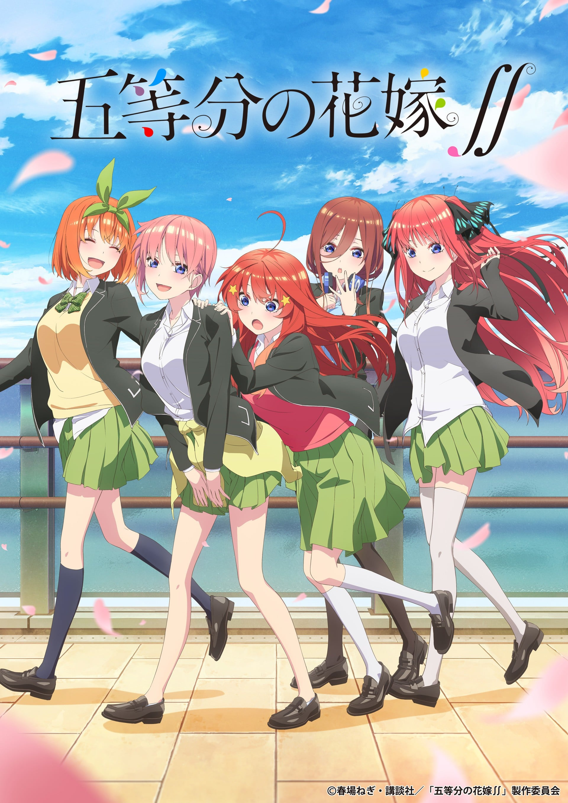
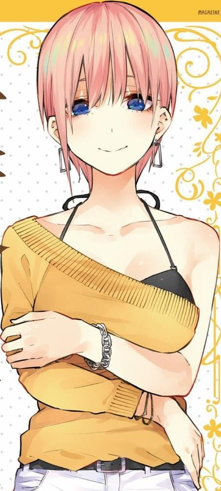
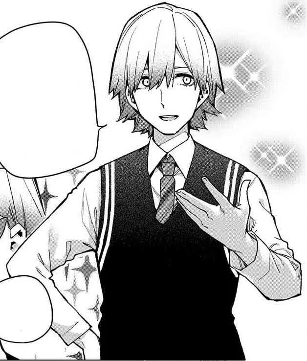

> [!bookinfo|noicon]+ **五等分的新娘∬**
> 
>
| 日文名 | 五等分の花嫁∬ |
|:------: |:------------------------------------------: |
| 类型 | 漫改 |
| 新番 | 2021 年 1 月 |
| 集数 | 共12话 |
| 官网 | [https://www.tbs.co.jp/anime/5hanayome/2nd/](https://https://www.tbs.co.jp/anime/5hanayome/2nd/) |
| 制作 | バイブリーアニメーションスタジオ |
| 导演 | かおり |
| 脚本 | 大知慶一郎 |
| 评分 | 6.6|
| 制片人 | 山本啓裕 |

> [!abstract]+ **简介**
> 面对“将要留级”、“讨厌学习”的美少女五姐妹，身为兼职家庭教师的风太郎要指导她们学习，直到“顺利毕业”为止。经历了林间学校中发生的许多事情后，风太郎与五姐妹的信赖进一步加深。
想要在作为家庭教师的事业上迈进的风太郎本打算在这次的考试中要让五姐妹的成绩全都及格，结果却频频遇到各种麻烦。不仅如此，风太郎的初恋对象“照片里的女孩”也出现了……
风太郎与五姐妹之间新的考验开幕——

> [!tip]+ **章节列表**
>- [ ] 第1话：今日与京都的凶与共 (2021-01-07)
>- [ ] 第2话：七次的再见 第一章 (2021-01-14)
>- [ ] 第3话：七次的再见 第二章 (2021-01-21)
>- [ ] 第4话：七次的再见 第三章 (2021-01-28)
>- [ ] 第5话：今天辛苦了 (2021-02-04)
>- [ ] 第6话：最后的考试 (2021-02-11)
>- [ ] 第7话：攻略开始 (2021-02-18)
>- [ ] 第8话：炒鸡蛋 (2021-02-25)
>- [ ] 第9话：欢迎来到3年1班 (2021-03-04)
>- [ ] 第10话：五只白鹤的报恩 (2021-03-11)
>- [ ] 第11话：姐妹战争 前半 (2021-03-18)
>- [ ] 第12话：姐妹战争 后半 (2021-03-25)

> [!tip]+ **主要角色**
> 
| 角色 | CV | 简介| 角色图片 |
|:----:|:---:|:---:|:--------:|
| 上杉風太郎 | 田村睦心 | 成績優秀。家が貧乏な高校２年生。家の借金返済のため、好条件の家庭教師アルバイトを引き受けたら、同級生の五つ子（落第寸前の超問題児）が生徒だった。五つ子たちの「卒業」を目指し奮闘中。人の目を気にせず我が道を行くタイプ。  喜欢的食物是濑叶烹饪的料理，讨厌的食物是生鱼，喜欢的饮料是麦茶，喜欢的动物是大猩猩，每日的惯例为储蓄1圆硬币。喜欢的地点是桌子。喜欢阅读辞典 |  |
| 中野一花 | 花澤香菜 | 五つ子の長女。面倒見のいいお姉さんタイプの性格だが、家では面倒臭がりで部屋の掃除が苦手というズボラな一面も。女優業をしており、絶賛売り出し中。五つ子の中で最もモテる。  代表颜色为黄色，喜欢的食物是咸鱼，讨厌的食物是香菇，喜欢的饮料是星冰乐，喜欢的动物是河马，喜欢的电视节目类型是戏剧，擅长学习科目为数学，每日的惯例为慢跑。喜欢有海外名人出演的电影。喜欢的地点是床。喜欢阅读小说 |  |
| 中野二乃 | 竹達彩奈 | 五つ子の次女。五つ子の中で一番姉妹を大事にしているため、五つ子の輪の中に入ってくる風太郎を異分子として反発している。料理が得意で中野家の炊事を担当している。五つ子の中で最も女子力が高い。  代表颜色为黑色，喜欢的食物是薄烤饼，讨厌的食物是渍物，喜欢的饮料是常温水，喜欢的动物是兔子，喜欢的电视节目类型是综艺，擅长学习科目为英语，每日的惯例为敷面膜和瑜伽，喜欢有年轻艺人出演的电影，喜欢的地点是打工的地方，喜欢阅读时尚杂志。 |  |
| 中野三玖 | 伊藤美来 | 五つ子の三女。口数が少なく落ち着いているが、戦国武将が好きというマニアックな一面も持っている。自分に自信を持てずにいたが、風太郎との関わりを通して少しずつ成長している。五つ子の中で最も姉妹の変装が得意。  代表颜色为蓝色，喜欢的食物是抹茶，讨厌的食物是巧克力，喜欢的饮料是绿茶，喜欢的动物是刺猬，喜欢的电视节目类型是纪录片，擅长学习科目为社会，每日的惯例为占卜。喜欢有武将出演的电影。喜欢的地点是有缝隙的地方。喜欢阅读自传 |  |
| 中野四葉 | 佐倉綾音 | 五つ子の四女。元気いっぱいで人なつっこく、人から頼まれると断れない性格。スポーツが得意で、よく運動部の手伝いをしている。そのためなかなか勉強の時間が取れないので、五つ子の中で最も成績が悪い  代表颜色为绿色，喜欢的食物是蜜柑，讨厌的食物是菜椒，喜欢的饮料是碳酸果汁，喜欢的动物是骆驼，喜欢的电视节目类型是动画，擅长学习科目为国语，每日的惯例为给观叶植物浇水。喜欢有鲨鱼出现的电影。喜欢的地点是秋千。喜欢阅读漫画 |  |
| 中野五月 | 水瀬いのり | 五つ子の五女。真面目で姉妹の中で一番の頑張り屋だが、その結果が中々出ない不器用な性格。食べることが大好きで、よく何かを食べている。五つ子の中で最も食いしん坊。  代表颜色为红色，喜欢的食物是肉包，讨厌的食物是酸梅，喜欢的饮料是咖喱，喜欢的动物是袋鼠，喜欢的电视节目类型是Wide Show，擅长学习科目为理科，每日的惯例为腹部肌肉锻炼和瑜伽。喜欢有小狗会死的电影。喜欢的地点是宠物店。喜欢阅读旅游指南 |  |
| 上杉らいは | 高森奈津美 | 喜欢的食物是汉堡牛排，讨厌的食物是番茄，喜欢的饮料是橙汁，喜欢的动物是企鹅，每日的惯例为写家庭账簿，喜欢有僵尸出现的电影，喜欢的地点是电子游戏机房，喜欢阅读图鉴 |  |
| 上杉勇也 | 日野聡 | 風太郎とらいはの父親。金髪と額にかけたサングラスが特徴的。 妻に先立たれて以降、男手ひとつで子供2人を育て上げてきた苦労人。ワイルドかつ砕けた性格。 |  |
| 中野マルオ | 黒田崇矢 | 五つ子の継父。大病院を経営する資産家。勇也とは学生時代からの付き合いであり、「マルオ」と呼ばれている。 |  |
| 竹林 | 京花優希 |  |  |
| 武田祐輔 | 斉藤壮馬 |  |  |