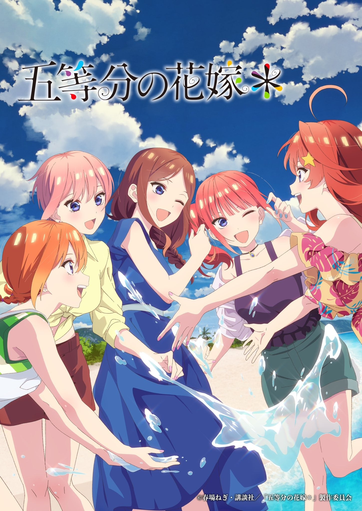
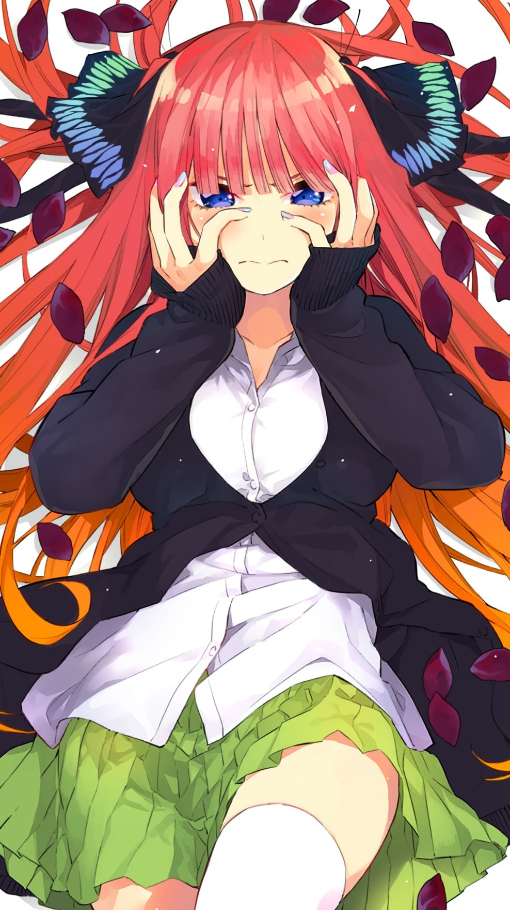
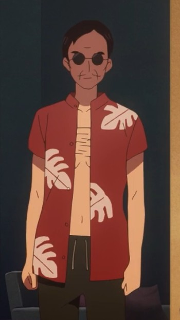
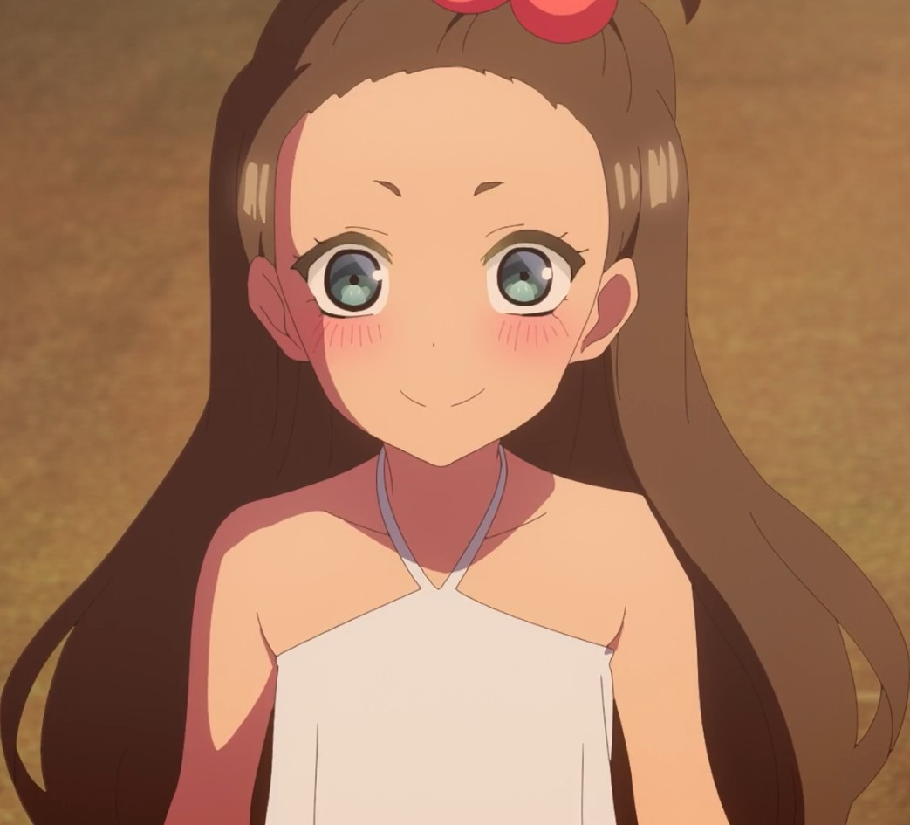
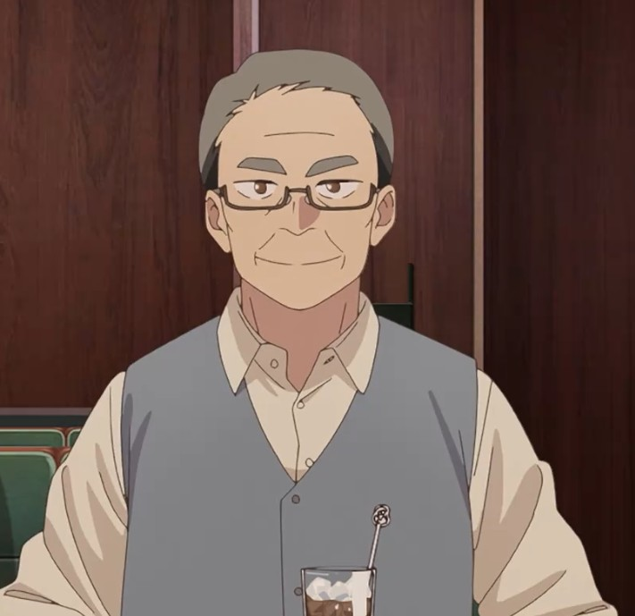
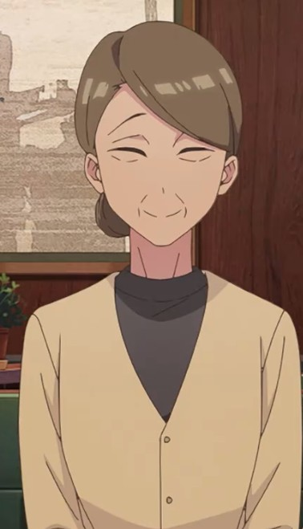

> [!bookinfo|noicon]+ **五等分的新娘＊**
> 
>
| 日文名 | 五等分の花嫁＊ |
|:------: |:------------------------------------------: |
| 类型 | 漫改 |
| 新番 | 2024 年 12 月 |
| 集数 | 共2话 |
| 官网 | [https://www.tbs.co.jp/anime/5hanayome/](https://https://www.tbs.co.jp/anime/5hanayome/) |
| 制作 | バイブリーアニメーションスタジオ |
| 导演 | 神保昌登 |
| 脚本 | 神保昌登 |
| 评分 | 5.7|
| 制片人 | 山本啓裕 |

> [!abstract]+ **简介**
> ファン待望の新婚旅行エピソードを、春場ねぎ原案＆完全監修のもと映像化。
大人になった風太郎と五つ子の日常をお届けします！

「落第寸前」「勉強嫌い」の美少女五つ子を、
アルバイト家庭教師として見事「卒業」まで導いた風太郎。
それぞれの道へと歩み夢を叶えた五つ子だったが、何か悩みを抱えている様子で...。
そんな中、風太郎と五つ子はハネムーンを兼ねたハワイ旅行を計画する。
順調に準備が進んでいた矢先、ある事件が発覚し大慌ての事態に!!
さらには旅行先のハワイでもトラブルに巻き込まれて…!?

かわいさ500％の五つ子ラブコメ、新婚旅行編──!!

> [!tip]+ **章节列表**
>- [ ] 第1话：前篇 (2024-12-23)
>- [ ] 第2话：后篇 (2024-12-23)

> [!tip]+ **主要角色**
> 
| 角色 | CV | 简介| 角色图片 |
|:----:|:---:|:---:|:--------:|
| 上杉風太郎 | 松岡禎丞 | 成績優秀。家が貧乏な高校２年生。家の借金返済のため、好条件の家庭教師アルバイトを引き受けたら、同級生の五つ子（落第寸前の超問題児）が生徒だった。五つ子たちの「卒業」を目指し奮闘中。人の目を気にせず我が道を行くタイプ。  喜欢的食物是濑叶烹饪的料理，讨厌的食物是生鱼，喜欢的饮料是麦茶，喜欢的动物是大猩猩，每日的惯例为储蓄1圆硬币。喜欢的地点是桌子。喜欢阅读辞典 |  |
| 中野一花 | 花澤香菜 | 五つ子の長女。面倒見のいいお姉さんタイプの性格だが、家では面倒臭がりで部屋の掃除が苦手というズボラな一面も。女優業をしており、絶賛売り出し中。五つ子の中で最もモテる。  代表颜色为黄色，喜欢的食物是咸鱼，讨厌的食物是香菇，喜欢的饮料是星冰乐，喜欢的动物是河马，喜欢的电视节目类型是戏剧，擅长学习科目为数学，每日的惯例为慢跑。喜欢有海外名人出演的电影。喜欢的地点是床。喜欢阅读小说 |  |
| 中野二乃 | 竹達彩奈 | 五つ子の次女。五つ子の中で一番姉妹を大事にしているため、五つ子の輪の中に入ってくる風太郎を異分子として反発している。料理が得意で中野家の炊事を担当している。五つ子の中で最も女子力が高い。  代表颜色为黑色，喜欢的食物是薄烤饼，讨厌的食物是渍物，喜欢的饮料是常温水，喜欢的动物是兔子，喜欢的电视节目类型是综艺，擅长学习科目为英语，每日的惯例为敷面膜和瑜伽，喜欢有年轻艺人出演的电影，喜欢的地点是打工的地方，喜欢阅读时尚杂志。 |  |
| 中野三玖 | 伊藤美来 | 五つ子の三女。口数が少なく落ち着いているが、戦国武将が好きというマニアックな一面も持っている。自分に自信を持てずにいたが、風太郎との関わりを通して少しずつ成長している。五つ子の中で最も姉妹の変装が得意。  代表颜色为蓝色，喜欢的食物是抹茶，讨厌的食物是巧克力，喜欢的饮料是绿茶，喜欢的动物是刺猬，喜欢的电视节目类型是纪录片，擅长学习科目为社会，每日的惯例为占卜。喜欢有武将出演的电影。喜欢的地点是有缝隙的地方。喜欢阅读自传 |  |
| 中野四葉 | 佐倉綾音 | 五つ子の四女。元気いっぱいで人なつっこく、人から頼まれると断れない性格。スポーツが得意で、よく運動部の手伝いをしている。そのためなかなか勉強の時間が取れないので、五つ子の中で最も成績が悪い  代表颜色为绿色，喜欢的食物是蜜柑，讨厌的食物是菜椒，喜欢的饮料是碳酸果汁，喜欢的动物是骆驼，喜欢的电视节目类型是动画，擅长学习科目为国语，每日的惯例为给观叶植物浇水。喜欢有鲨鱼出现的电影。喜欢的地点是秋千。喜欢阅读漫画 |  |
| 中野五月 | 水瀬いのり | 五つ子の五女。真面目で姉妹の中で一番の頑張り屋だが、その結果が中々出ない不器用な性格。食べることが大好きで、よく何かを食べている。五つ子の中で最も食いしん坊。  代表颜色为红色，喜欢的食物是肉包，讨厌的食物是酸梅，喜欢的饮料是咖喱，喜欢的动物是袋鼠，喜欢的电视节目类型是Wide Show，擅长学习科目为理科，每日的惯例为腹部肌肉锻炼和瑜伽。喜欢有小狗会死的电影。喜欢的地点是宠物店。喜欢阅读旅游指南 |  |
| 中野マルオ | 黒田崇矢 | 五つ子の継父。大病院を経営する資産家。勇也とは学生時代からの付き合いであり、「マルオ」と呼ばれている。 |  |
| 武田祐輔 | 斉藤壮馬 |  |  |
| 江端 | 三瓶雄樹 |  |  |
| リリー | 橘杏咲 |  |  |
| 風太郎の祖父 | 蒼谷和樹 |  |  |
| 風太郎の祖母 | 小若和郁那 |  |  |