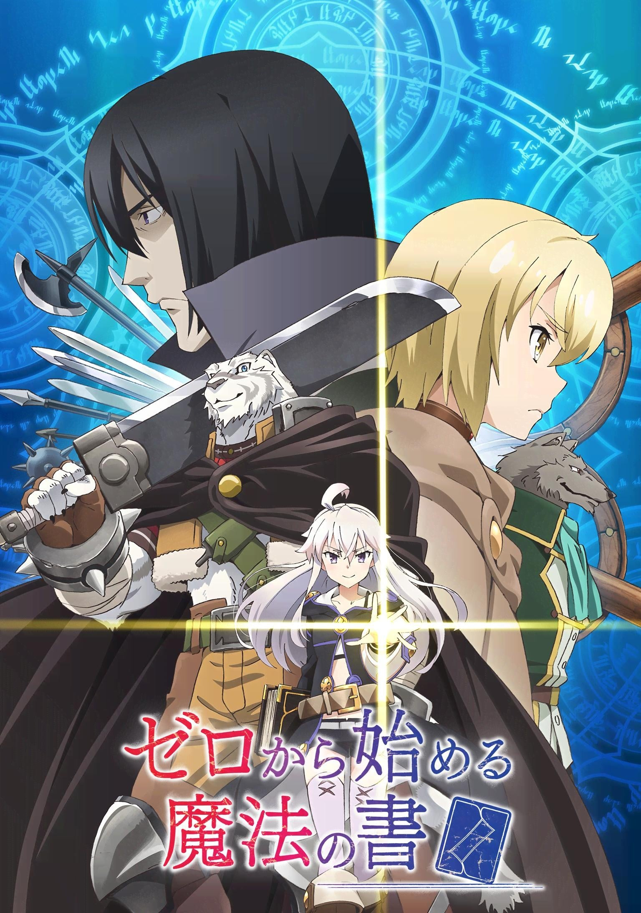
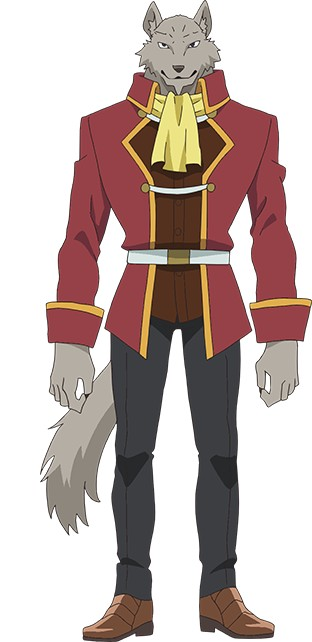
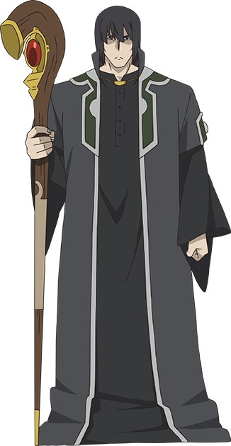
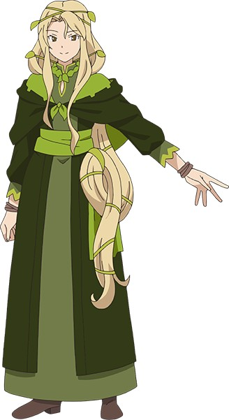

> [!bookinfo|noicon]+ **从零开始的魔法书**
> 
>
| 日文名 | ゼロから始める魔法の書 |
|:------: |:------------------------------------------: |
| 类型 | 小说改 |
| 新番 | 2017 年 4 月 |
| 集数 | 共12话 |
| 官网 | [http://www.zeronosyo.com/](https://http://www.zeronosyo.com/) |
| 制作 | WHITE FOX |
| 导演 | 平川哲生 |
| 脚本 | 髙橋龍也,平川哲生,梅原英司 |
| 评分 | 6.1|
| 制片人 | 吉川綱樹 |

> [!abstract]+ **简介**
> 教会历526年——。
世界中存在着魔女，并普及了“魔术”。
并且，世界尚未知晓“魔法”。
这样的时代，存在着被人们蔑视为“兽化者”的佣兵。
他每天被魔女觊觎着项上人头，梦想着变成人类，但某天在森林中遇到的美丽魔女，改变了他的命运。
“——想要变回人类吗？那么佣兵，成为吾辈的护卫吧”
自称为零的魔女，其所拥有的视使用方法甚至可能毁灭世界的魔法书《零之书》被某人盗走，而她正在寻找它的旅途中。
佣兵以通过零的力量让自己变成人类为条件，接下了自己最讨厌的魔女的护卫一职，然而围绕着禁断的魔法书，人们的思绪纷繁交错……。
高贵的魔女与温柔的兽人所带来的极上幻想剧。

> [!tip]+ **章节列表**
>- [ ] 第1话：魔女与堕兽人 (2017-04-10)
>- [ ] 第2话：狩猎魔女 (2017-04-17)
>- [ ] 第3话：决斗 (2017-04-24)
>- [ ] 第4话：前往拉提特的路上 (2017-05-01)
>- [ ] 第5话：零之魔术师团 (2017-05-08)
>- [ ] 第6话：十三号 (2017-05-15)
>- [ ] 第7话：王都普拉斯塔 (2017-05-22)
>- [ ] 第8话：索雷娜的孙女 (2017-05-29)
>- [ ] 第9话：再会 (2017-06-05)
>- [ ] 第10话：真相大白 (2017-06-12)
>- [ ] 第11话：魔女与魔术师 (2017-06-19)
>- [ ] 第12话：从零开始的魔法书 (2017-06-26)

> [!tip]+ **主要角色**
> 
| 角色 | CV | 简介| 角色图片 |
|:----:|:---:|:---:|:--------:|
| ゼロ | 花守ゆみり | 真名不详。泥暗之魔女。《零之书》的作者，魔法的创始人。性格天然善良，有时会有坏心眼，贪吃。拥有强大的魔力。因为受不了等待于是自己开始寻找《零之书》，与佣兵签下契约答应解开佣兵的兽化。但第一卷最后因为魔力消耗太大再加上佣兵被恶魔附身的影响，灵魂的粘附性似乎更强了所以没有解除。 |  |
| 傭兵 | 小山剛志 | 主人公。本編における「俺」。世間から忌み嫌われ恐れられる半人半獣の獣堕ちの傭兵で、身長2メートルを超える筋骨逞しい体に白地に黒い縞模様の入ったネコ科の猛獣の姿をしており、鼻面には大きな傷がある。人間の姿に戻してもらうという条件で、ゼロと護衛の契約を結び、共に魔法書をめぐる旅に出る。名前を明かすとそれを使って下僕として縛るとゼロに脅されたため名前は明かしておらず、ゼロからは単に「傭兵」と呼ばれている。 獣堕ちの首は魔術を行なう際に重宝されるため、魔女や金目当ての盗賊等に狙われ続けた結果、大の魔女嫌い。故郷の村では外の世界とは違い他の人間に恐れられることも無く、普通の人間と変わらずに育ってきたが、13歳の頃に自分を狙った盗賊に村が襲撃されたことをきっかけに家を出る。その後は獣堕ちをまともに雇ってくれる場所が殆ど存在しないため、仕方なく傭兵として生きるようになる。その目立つ容姿と過去の形振り構わない戦い方から同業者の間では名が通っており、“黒の死獣”という仇名で知られているものの、本人は恥ずかしい過去として忘れたがっている。恐ろしげな見た目に似合わず小心者かつお人好し。実家が酒場を営んでおり、家を離れるまではその手伝いをしていたため、料理が趣味。その腕前はゼロに「そこらの料理屋よりずっと美味い」と言わしめるほど。将来の夢は小さな酒場を開き結婚してのんびり暮らすこと。 ゼロと出会った時点ではその生い立ちもあって魔女に強い偏見を持っていたが、ゼロやアルバスとの交流を通して、魔女と言っても全てが邪悪な存在ではないことを悟り、自分の見方を改めるようになる。また当初は傍観者のスタンスでゼロの護衛をしていたが、アクディオスでの出来事を機に、報酬とは別に自らの意志をもってゼロと共に魔法書を追うことを決意する。 |  |
| ホルデム | 加藤将之 | 女好きで、軽薄な口調と貴族のような身なりが特徴。 |  |
| 十三番 | 子安武人 | ゼロの過去を知る魔術師。 【ゼロの書】についてなにか知っている様子なのだが……。 |  |
| ソーレナ | 榊原良子 | 人間と接し、その願いを聞く事を常とする詠月の系統の代表者。 疫病を流行らせた原因とされ、火あぶりに処された。 |  |
| アルバス | 大地葉 | セービルたちが通うウェニアス王国王立魔法学校の学長を務める魔女。《詠月》の異名を持つ偉大な魔女の孫娘であり、その異名と才能を引き継ぐ実力者。学校の生徒たちは彼女と契約をしており、アルバスの許可なく魔術を使うことはできない。大事な生徒の成長を促すためには、時に危険な試練を与えることも。 |  |