> [!bookinfo|noicon]+ **传说中勇者的传说**
> 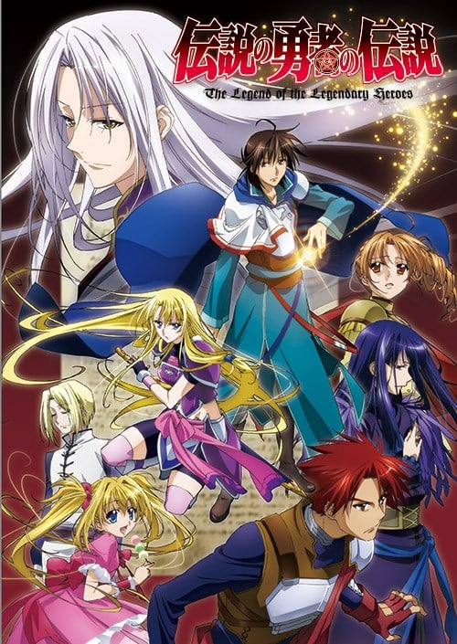
>
| 日文名 | 伝説の勇者の伝説 |
|:------: |:------------------------------------------: |
| 类型 | 小说改 |
| 新番 | 2010 年 7 月 |
| 集数 | 共25话 |
| 官网 | [http://www.denyuden.jp/](https://http://www.denyuden.jp/) |
| 制作 | ZEXCS |
| 导演 | 川崎逸朗 |
| 脚本 | 川崎逸朗,根元歳三,山田由香,藤咲あゆな,吉村清子,大知慶一郎 |
| 评分 | 7|
| 制片人 | 制作制片人：橋本和典,橋本和典 |

> [!abstract]+ **简介**
> 镜贵也第四届龙皇杯优胜作品《传说中的勇者的传说》TV动画正式确定在7月开播。
这部以架空大陆为背景的奇幻冒险作品。描写了主人公莱纳·龙特等人被卷入两国战争的传奇经历。作品中个性丰富的登场人物和精彩的战斗场面都是看点之一。
作品由曾执导《钢壳的雷吉奥斯》、《出租魔法使》等作品的川崎逸朗担任监督。与他搭档系列构成的是曾负责《武装机甲》、《兽的演奏者艾琳》等作品的吉村清子。负责本次动画制作的是制作《守护猫娘绯鞠》、《神隐之狼》的ZEXCS。
福山润、高垣彩阳、小野大辅、杉田智和、日野聪、诹访部顺一等顶级声优将倾力加盟本片。受好评的奇幻冒险系列《传说中的勇者的传说》在连续推出了漫画、游戏、DRAMA CD之后，终于要以动画的形式和观众见面了。动画播出情报在5月20日发售的7月号杂志《DRAGON MAGAZINE》上发表，详见上图。
【故事简介】
在一个流传着众多传说的世界。居住在罗兰德帝国的人民因为腐败的贵族暴政而困苦不堪。这时，一名名叫莱纳的青年接受了王西昂的任命和少女菲莉斯展开了旅行。然而主人公莱纳是个超级没干劲到让人火大的人。他最期待的就是创造一个可以大白天悠闲睡懒觉的王国。最终，莱纳一行人被卷入了战祸中，三位主人公的命运也紧密的羁绊在了一起。那么，莱纳的“瞳”中，映照的究竟是怎样的未来呢？
【CAST】
莱纳·龙特：福山润 
菲利斯·爱丽丝：高垣彩阳 
西昂·阿斯塔尔：小野大辅 
路西尔·爱丽丝：杉田智和
伊莉斯·爱丽丝：村田知沙
米兰·弗洛瓦德：诹访部顺一
蜜儿可·卡拉德：藤田咲
克劳·卡洛姆：伊丸冈笃
路克·史塔克特：日野聪
卡尔奈·凯文尔：泽城みゆき
李莱·林科尔：冈本信彦
拉贝尔·米拉：增谷康纪
埃斯莉纳·富克尔：竹达彩奈
姬法·诺尔斯：大浦冬华
诺亚·安：高桥美佳子
【主题曲】
OP主题曲：《LAMENT~やがて喜びを~》
演唱者：结城比吕
ED主题曲：《Truth Of My Destiny》
演唱者：Ceui 

> [!tip]+ **章节列表**
>- [ ] 第1话：午睡王国的野心 (2010-07-01)
>- [ ] 第2话：英雄和瞌睡男 (2010-07-09)
>- [ ] 第3话：复写眼（Alpha･stigma） (2010-07-16)
>- [ ] 第4话：莱纳・报告书 (2010-07-23)
>- [ ] 第5话：开始觉醒的世界 (2010-07-30)
>- [ ] 第6话：黑暗中的来客 (2010-08-06)
>- [ ] 第7话：绝不放手 (2010-08-13)
>- [ ] 第8话：艾斯塔布尔叛乱 (2010-08-20)
>- [ ] 第9话：忘却碎片 (2010-08-27)
>- [ ] 第10话：黄昏 (2010-09-03)
>- [ ] 第11话：恶魔之子 (2010-09-10)
>- [ ] 第12话：大扫除之宴 (2010-9-17)
>- [ ] 第13话：北方的勇者王 (2010-9-24)
>- [ ] 第14话：谁都不再失去的世界 (2010-10-1)
>- [ ] 第15话：kill the king (2010-10-8)
>- [ ] 第16话：不会微笑的女神 (2010-10-22)
>- [ ] 第17话：歼灭眼 (2010-10-29)
>- [ ] 第18话：被诅咒的双眼 (2010-11-5)
>- [ ] 第19话：行踪不明的白眼狼 (2010-11-12)
>- [ ] 第20话：还没填满绝望的心 (2010-11-19)
>- [ ] 第21话：罗兰德的黑暗 (2010-11-26)
>- [ ] 第22话：名为α的野兽 (2010-12-3)
>- [ ] 第23话：最后一日 (2010-12-10)
>- [ ] 第24话：久远之日的约定 (2010-12-17)
>- [ ] 第15.5话：いりす・れぽ～と 総集編 (2010-10-15)

> [!tip]+ **主要角色**
> 
| 角色 | CV | 简介| 角色图片 |
|:----:|:---:|:---:|:--------:|
| ライナ・リュート | 福山潤 |  | 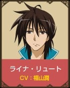 |
| フェリス・エリス | 高垣彩陽 |  |  |
| シオン・アスタール | 小野大輔 |  | 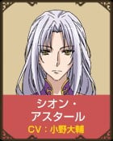 |
| ティーア・ルミブル | 櫻井孝宏 |  | 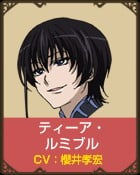 |
| ルシル・エリス | 杉田智和 |  | 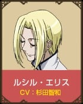 |
| ミラン・フロワード | 諏訪部順一 |  | 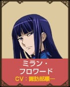 |
| ラッヘル・ミラー | 増谷康紀 | 忌破り追撃隊隊長。身長175cm。かつての革命を計画・実行した人物だが、忌み破り追撃部隊は重要な役職であり、また下からの目線も大事だと主張して元帥への昇進を蹴り、少佐の地位に留まっていた。しかしシオンから「世界の本当の姿」を聞いてその考えを改め、晴れて元帥の地位を受けた。 天才と呼ばれてそれに値するだけの実力を持っているが、本人は必要であることを必要なだけしているだけで自分は天才ではないと否定している。ライナたちの師匠ジェルメ・クレイスロールの夫。未だにジェルメのことを「ジェルメ・クレイスロール君」と呼ぶ癖がある。 | 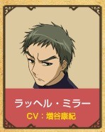 |
| クラウ・クロム | 伊丸岡篤 | 紅指のクラウとして隣国に名をはせている現ローランド帝国元帥にして、シオンの右腕。身長190cm。幼少時から貴族の私兵育成機関で過酷極まる訓練を受けて、ライナ以上の戦闘力を身につけた。ライナやカルネらからは「筋肉バカ」とも呼ばれているが魔法能力も極めて高く、ライナからはローランド最強の魔道兵という評価を受け、指揮官としてもその地位に相応しい能力を持つ。 「殲滅眼（イーノ・ドゥーエ）」保持者ティーア・ルミブルに右腕の一部を食いちぎられた経験があり、腕の機能を維持するために右腕に赤い魔方陣の刺青が刻まれている。そのため、複写眼保持者（クラウは殲滅眼の存在を知らず、ティーアを複写眼保持者だと思っていた）を化け物扱いして嫌っている。後に再びティーアと戦った際には憎悪を剥き出しにして襲いかかるが全く歯が立たずに右腕を完全に喰われ、敗北する。ティーアへの復讐のために禁呪詛により新たな腕、漆黒の呪詛義手を手に入れた。この腕のため最近の通り名は黒手の死神となっている。元エスタブールの王女であるノア・エンと恋仲であるが、戦場に出ればいつ死ぬかわからない軍人という、自分の立場から一線を越えられないらしい。 人が死ぬのとその中で自分だけ安全な場所にいるのが嫌いなため常に前線に出たがるが、元帥に任命されてからは苦手な書類仕事に忙殺されている。重度の貴族嫌い。 | 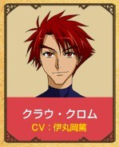 |
| ルーク・スタッカート | 日野聡 | ミルク・カラード隊の副官を務めている人物。身長183cm。白髪長身。 シオン・アスタールより、ライナ・リュートの反抗時の抹殺、ライナ・リュートの見落とした勇者の遺物（=忘却欠片）の調査及び回収を密かに命ぜられていた。 隊のメンバーを家族として大切に思っておりミルクに対してはとことん甘くすっかり父親気分。 幼少期に軍の実験で脳に魔法陣を埋め込まれ、思考力を圧倒的に高められた代償に感情を壊された（理詰めの理解は出来ても、心的に自然発生出来ない）人物。純粋な戦闘能力ではライナ、クラウには圧倒的に劣るが、全ての状況において冷静さを保ち、敵の力を計り、あらゆる状況で勝利する術を見つける能力のために、実際にライナは苦戦を強いられひどく苦手にしている。 ライナが見落としていた忘却欠片「ラッツェルの糸」を武器として使用し作戦の幅を広げている。 ミラーの片腕と目される男で、リューラとも取引をして情報を手に入れており、「女神」、「勇者」、さらにシオンやルシルでさえ知らなかった「司祭」の存在をも把握している。 ローランド軍の遠征に先駆け、レルムス帝国に潜入し調査を続けていたが、レムルスの操る一般市民に捕えられ、レムルス教会の地下で洗脳を受ける。脳の一部をえぐって洗脳を解除し、教会塔の上部へ上がる。途中、独力で脱出したカルネに出会うが、その不自然さのためにレムルスの罠の一つと考え、行動不能にしてひとり最上階へ側壁伝いで進む。ライナとレムルス、シオンの会話を立ち聞きしている途中、レムルスから自分が「決定者」の一人であることを知らされ、他の「決定者」たちとシオン、ライナを巡って戦う。 | 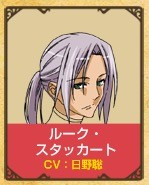 |
| カルネ・カイウェル | 沢城みゆき | 現ローランド帝国の少将、シオンの左腕。身長170cm。クラウの同門の後輩で、やはり貴族を嫌っている。人妻や未亡人好きで常に3人はキープしてあるらしい。またエスリナとは相思相愛だが、エスリナの兄であるフィオルと仲が良かったことと、自分が軍人であるためいつ死ぬかわからないといった理由から告白をしないでいる。 彼の不倫趣味は元々は過去に軍部で内政担当になった時、貴族たちとの摩擦と激務からくるストレスから始まったものだが、今はエスリナを遠ざける手段としてわざと派手に遊んでいる。常にフラれて終わっているので修羅場はない。 シオンの片腕として、20万の兵と共に旧ウルド民管区を守っていたが、レルムス帝国軍の裏切りにあい陥落。同国首都エッテランの教会に監禁されていたが、ライナの体をのっとったレムルスによって解放される。塔を徘徊していたときルークに出会い、エスリナへの愛を吐露するが結局戦闘不能にされる。 | 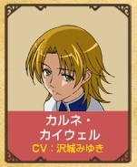 |
| バユーズ・ワイト | 鳥海浩輔 | 元エスタブール大佐。茶色の瞳とくねくねと編み込んだ茶髪が特徴の青年で、歳は初登場時で25歳。エスタブールでは知らぬ者は居ないほどの有名かつ有能な軍人で、多くのエスタブール兵から慕われる一方、個人としてもクラウとほぼ互角の魔法戦闘技術を有している。 公主だったノアを崇拝する一方、彼女が想いを寄せているクラウを露骨なまでに敵視しており、初めて彼にかけた言葉は「低俗なブタは黙ってろ」だった。実力に関しては素直に自分より上と認めているが、やはり負けず嫌いなのか、クラウとの純粋な体術勝負では、開始と同時にナイフを投げつけたり、クラウがそのナイフを受け止めた途端、「卑怯だ！」と叫んだかと思えば、「と、いうわけで相打ちだな」と勝手に勝負を終わらせたりするなどして、クラウから盛大なツッコミを受けた。 その後、クラウとは憎まれ口を叩きあいながらも認め合うようになり、ティーアとの戦闘でクラウが死に掛けた際はエスタブール兵を指揮して彼を助けている。 現在はローランド軍の元帥となり、ネルファに侵攻したクラウと時を同じくしてフロワードと共にルーナ帝国に侵攻。ネルファとルーナの国境線上に居たライナ、トアレらが率いていたネルファ難民たちを襲って虐殺。ライナ、フェリス、トアレに重傷を負わせた。 | 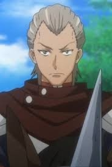 |
| ミルク・カラード | 藤田咲 | 軍部でその名を上げるために貴族のカラード家に引き取られた元孤児。身長145cm。幼い頃ライナと結婚する約束を交わしたと思い込んでいる（もっともそれはミルクの中で勝手に歪曲されていて、実際はそんな約束はしていない）。 亜麻色の巻きポニーテイルに愛らしい童顔。 しかしその容姿と無邪気な性格であるにもかかわらず、能力は非常に高く魔法構築や格闘技術の技術から理論において、水準以上の能力を有し、幼さの残る容姿を活かした、他者を統率して行う彼女の戦術、戦略は常人をはるかに上回る。本人いわく首以外の関節は全て外せる。 シオンの策略によって中尉として忌破り追撃隊のルーク隊の隊長に任命され、「忌破り」ライナ・リュートを追うこととなる。 人並み外れた人望があり、部下の心を一瞬にして掌握する技術（本人が意図して発揮しているわけではない）は天性の才とミラーに言わしめたほど。隊のメンバーには保護者的気分で忠誠を誓われている。隊長であるにもかかわらず隊のメンバー、特にルークからは過保護とも取れる扱いを受けることも少なくない。 当初は半ば自身の執着のために盲目的にライナを追っていたが、次第にライナを追う命令自体に不自然さを感じ、自分がライナをローランドに引き止めておくための人質ではないかという推測に至る。 ライナの父親であるリューラ・リュートルーに何らかの呪いをかけられた。リューラが言うところによれば狂った勇者の回す歯車を一つ外したのであってミルク自身に害のあるものではないとのこと。 実は「円命の女神」（ミルク・エフィレト）という、アスルード・ローランドを宿した人間を、狂わせようと画策する存在である。「勇者」と敵対している「女神」のなかで、唯一「勇者」と共に歩むことを選択した存在で、アスルードを宿した人間が最も手を出してはいけないと考える人間として生まれ、自らを抱きたいというアスルードの欲望を利用して、宿主を狂わせアスルードを目覚めさせようとしている。またその力はルシルですら手も足も出ないほど。だが人間として生れるため人間としての人格も存在する。それがミルクである。前述の呪いは円命の女神を抱いたアスルードを殺す呪い。 現在は「円命の女神」に肉体を乗っ取られてしまったが、ライナへの想いの強さゆえに徐々に「円命の女神」の意識を喰らいつつある。一方で降臨した「円命の女神」はシオンの命で、行方不明となったカルネの捜索と救出のため、レムルス帝国に潜入している。 本作の三大ヒロインの一人で、もっとも長くライナのことを想い続けているが、ライナがローランドを出奔してからは出会う機会がなく、さらにアニメ版ではクラウが大きくクローズアップされているせいか、ヒロインという設定も希薄である。 | 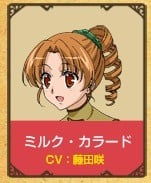 |