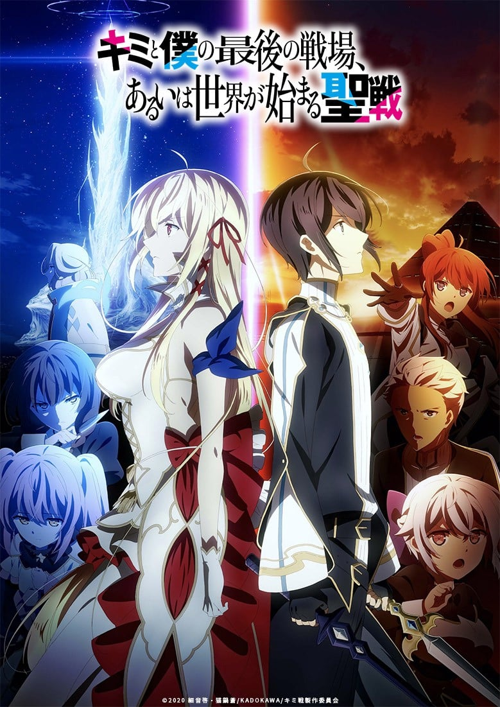
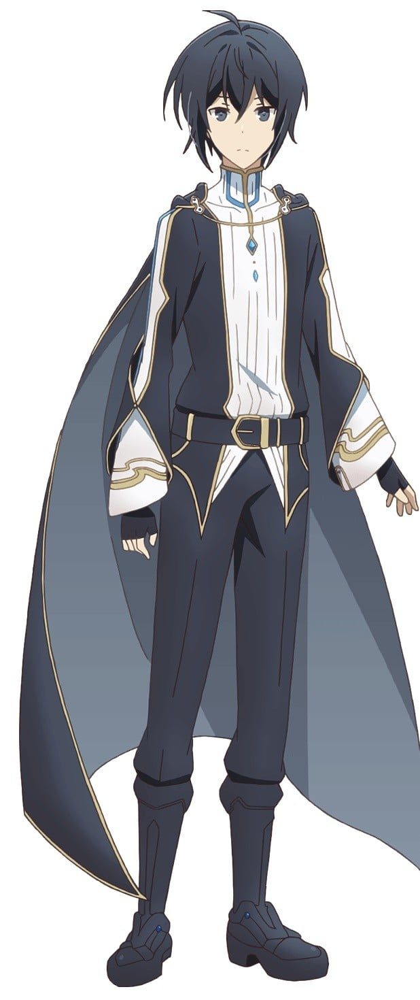
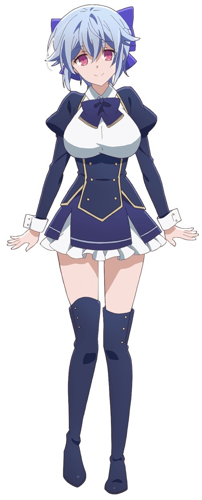
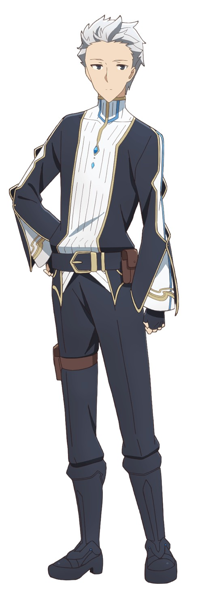
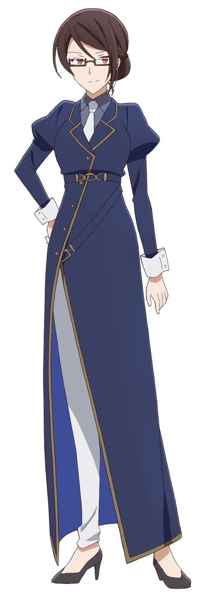
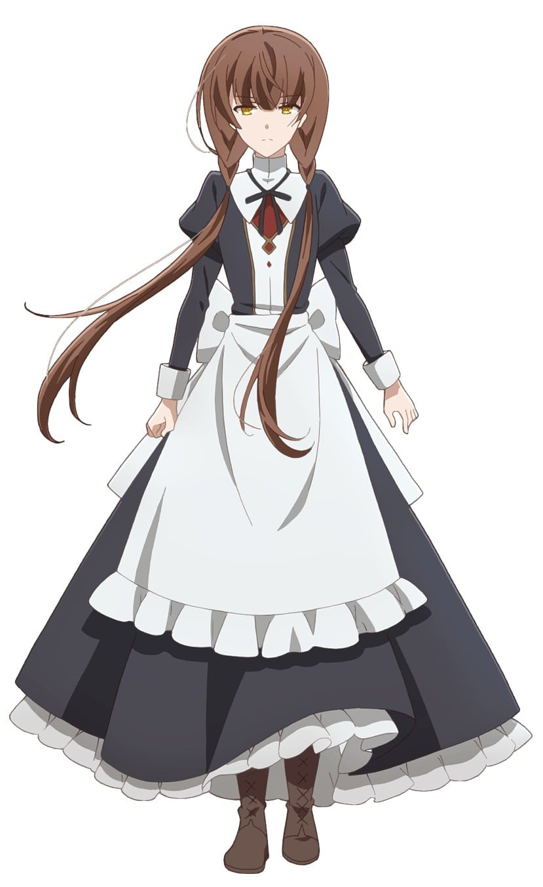

> [!bookinfo|noicon]+ **你与我最后的战场，亦或是世界起始的圣战**
> 
>
| 日文名 | キミと僕の最後の戦場、あるいは世界が始まる聖戦 |
|:------: |:------------------------------------------: |
| 类型 | 小说改 |
| 新番 | 2020 年 10 月 |
| 集数 | 共12话 |
| 官网 | [https://kimisentv.com/](https://https://kimisentv.com/) |
| 制作 | SILVER LINK. |
| 导演 | 湊未來・大沼心,湊未來,大沼心 |
| 脚本 | 下山健人 |
| 评分 | 5.4|
| 制片人 | 清水優人 |

> [!abstract]+ **简介**
> 高度发展科学技术被称为机械驱动的理想乡的“帝国”，以及驱使超自然力量的以“魔女之国”威名受到世人畏惧的“涅比利斯皇厅”。在持续了百年以上战争的两国战场上，有着两位英雄。
以史上最年轻之姿晋升为帝国最强战力的剑士·伊思卡，以及有着“寒冰魔女”称号的涅比利斯皇厅公主·爱丽丝莉洁。
在战场上相遇的两人，以宿敌的身份展开了廝杀。为了保护国家、家人、同伴们，两人都抱有相互无法退让的矜持碰撞到一起。
然而，在激斗过程中两人逐渐地了解对方的内心，都相互地被对方的生存之道和理想信念所吸引。即便两人心中都十分清楚无法并肩而行，能做的唯有战斗至其中一方倒下为止而已。
而世界似乎也在嘲笑两人的残酷命运，两国之间形势逐日变得更加紧张，交织在各种阴谋策略之中。
在这被割裂的世界，少年与少女的心却在不断靠近——

> [!tip]+ **章节列表**
>- [ ] 第1话：邂逅 -两国的最终武器- (2020-10-07)
>- [ ] 第2话：邂逅 -我与我遇到的敌人- (2020-10-14)
>- [ ] 第3话：邂逅 -黑钢后继与冰祸魔女- (2020-10-21)
>- [ ] 第4话：交错 -星脉喷泉攻防- (2020-10-28)
>- [ ] 第5话：交错 -星脉喷泉觉醒- (2020-11-04)
>- [ ] 第6话：乐园 -燐的重大失算- (2020-11-11)
>- [ ] 第7话：乐园 -爱丽丝最漫长的一夜- (2020-11-18)
>- [ ] 第8话：乐园 -超越的魔人- (2020-11-25)
>- [ ] 第9话：乐园 -伊斯卡- (2020-12-02)
>- [ ] 第10话：始动 -向星许愿的少女- (2020-12-09)
>- [ ] 第11话：始动 -魔女狩猎- (2020-12-16)
>- [ ] 第12话：始动 -或开启世界的两人- (2020-12-23)

> [!tip]+ **主要角色**
> 
| 角色 | CV | 简介| 角色图片 |
|:----:|:---:|:---:|:--------:|
| イスカ | 小林裕介 | 本作男主角。帝国所属的16岁军人少年。以史上最小年龄成为帝国军的最高战力“使徒圣”。使用着一把名为“星剑”的特殊黑白双剑。 元使徒圣第11席，一年前因为私自放走难得被捕获的纯血种魔女（涅比里斯始祖的末裔，后确认为希斯贝尔）而被判重罪。 与爱丽丝互认对方为自己的好对手，二人同样喜好美食与欣赏绘画作品等。 |  |
| アリスリーゼ・ルゥ・ネビュリス9世 | 雨宮天 | 本作女主角，17岁。涅比里斯皇厅的第二王女。使用冰系星灵力量的强大星灵使，被帝国冠以“冰祸的魔女”这一畏称。 |  |
| ミスミス・クラス | 白城なお | 第907部队的队长。虽然身躯较小还长着一张娃娃脸，但确实是一名正儿八经的22岁成熟女性。军校时代与现使徒圣第五席璃洒是同期。 星脉喷泉任务中，被假面卿攻击而跌落喷泉，现实际转变为魔女（星灵使，推测为风属性）。 |  |
| シスベル・ルゥ・ネビュリス9世 | 和氣あず未 | 涅比里斯皇厅的第三王女，爱丽丝莉洁之妹。能使过去发生的事情映像化再生的“灯”的星灵使。亦因此是女王之外皇厅其他人的忌惮对象。 年龄约14-15岁，后被确认就是当初伊斯卡私自放走的魔女。 |  |
| 音々・アルカストーネ | 石原夏織 | 担任小队的机械师。将伊斯卡当做兄长来敬仰，开朗的少女。 |  |
| ジン・シュラルガン | 土岐隼一 | 小队的狙击手。过去曾与伊斯卡在同一师门下修行的孽缘。 |  |
| 璃洒・イン・エンパイア | 竹達彩奈 | 使徒圣第五席，女性，天帝的参谋。军校时代与蜜思米丝是同期。 |  |
| 燐・ヴィスポーズ | 花守ゆみり | 爱丽丝莉泽的亲信兼女仆，其家族是诞生王宫守护星的家族。使用土系星灵力量的星灵使，也很擅长暗杀术 |  |
| ミラベア・ルゥ・ネビュリス8世 | 久川綾 | 涅比利斯皇厅的现任女王，露家现任当主，三姐妹之母。 |  |
| ネームレス | 笠間淳 | 使徒圣第八席，暗杀者。 |  |
| イリーティア・ルゥ・ネビュリス9世 | 沢城みゆき | ネビュリス皇庁第1王女。大人の気品と色香を漂わせる絶世の美女として知られ、次期女王の最有力候補に挙げられている。明るく社交的な性格であり、ルゥ家以外の血族とも関係は良好。皇庁の行く末を案じている。 |  |
| 仮面卿 | 緑川光 | ネビュリス皇庁の三血族・ゾア家の当主代理。仮面をつけた黒服という出で立ちで表面上は紳士的な物腰だが、その実、帝国との全面戦争を望む過激派。現女王やアリスたちのルゥ家とは、王位を巡り水面下で争っている。 |  |