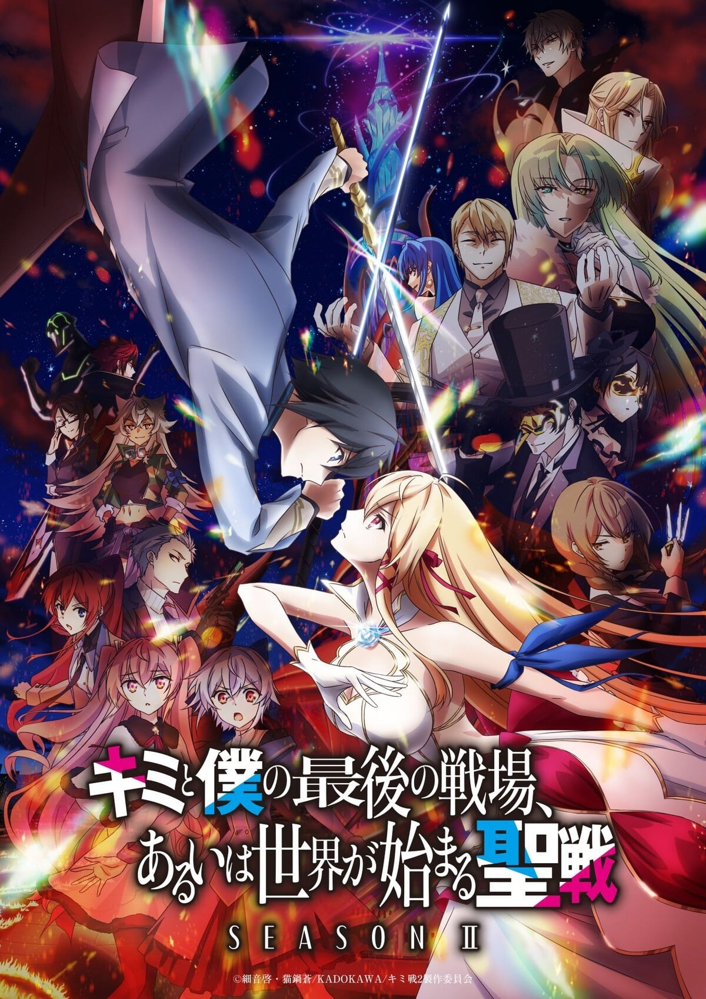
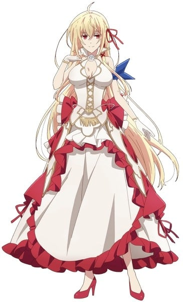
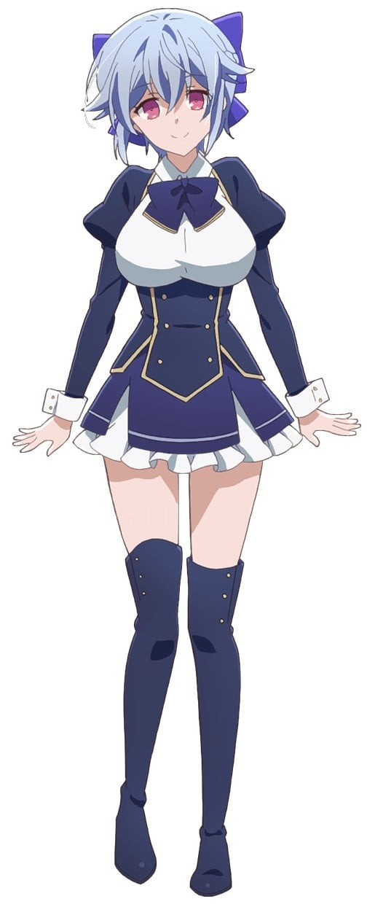
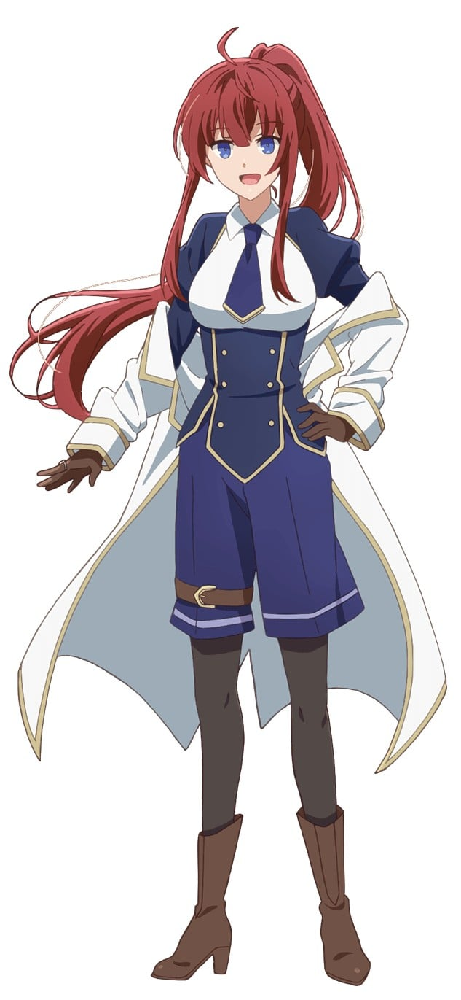
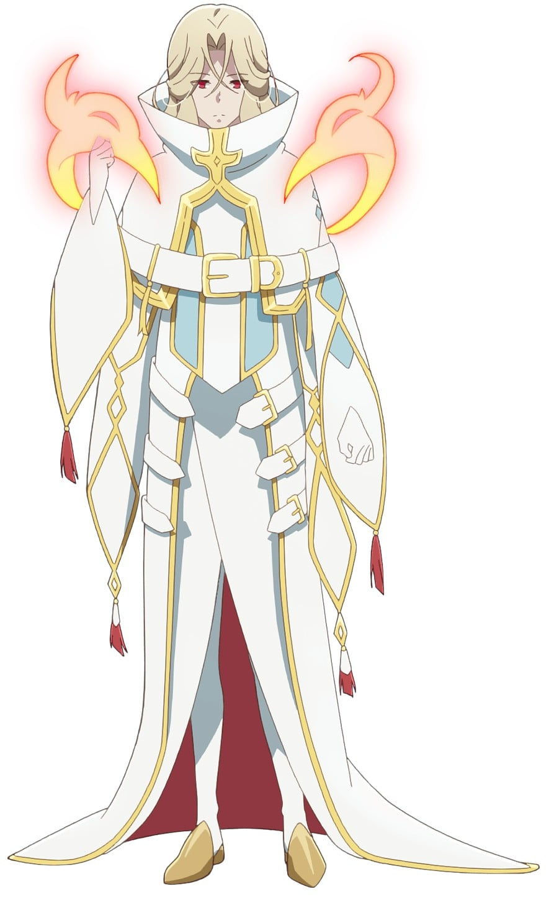
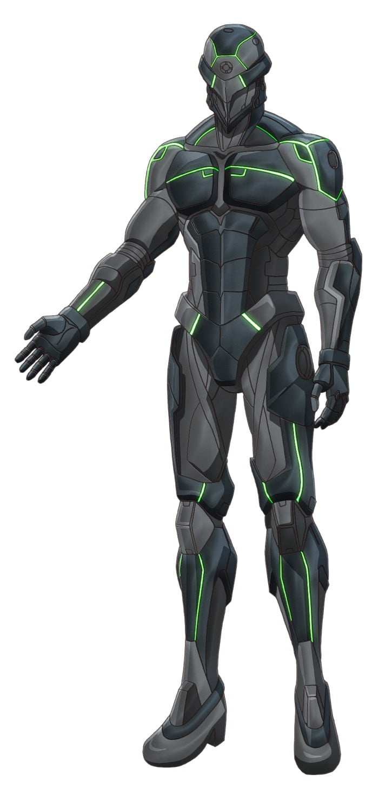
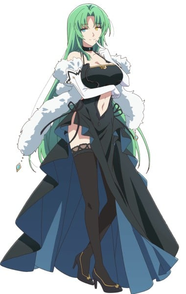

> [!bookinfo|noicon]+ **你与我最后的战场，亦或是世界起始的圣战 第二季**
> 
>
| 日文名 | キミと僕の最後の戦場、あるいは世界が始まる聖戦 Season II |
|:------: |:------------------------------------------: |
| 类型 | 小说改 |
| 新番 | 2024 年 7 月 |
| 集数 | 共12话 |
| 官网 | [https://kimisentv.com/](https://https://kimisentv.com/) |
| 制作 | SILVER LINK. |
| 导演 | 稲葉友紀 |
| 脚本 | 石川俊介,稲葉友紀,細音啓 |
| 评分 | 4.4|
| 制片人 | 石川俊介,齋藤友紀 |

> [!abstract]+ **简介**
> 科学技術が発達した、機械仕掛けの理想郷「帝国」。
超常の力・星霊術を駆使し、“魔女の国”と恐れられる「ネビュリス皇庁」。
二国は長きにわたる戦争を続けてきた――。

帝国の最高戦力イスカと皇庁の王女にして“氷禍の魔女”アリスリーゼは、
激闘の中で互いの素顔に触れ、その生き方と理想に惹かれ合う好敵手となった。

独立国家アルサミラで帝国と皇庁の謀略を打ち砕いた二人は、
再会を誓ってそれぞれの道へと進むが、意外な形でその約束を果たす。

アリスの妹シスベルと取り引きを交わし、護衛として皇庁に潜入するイスカ。
シスベルの捜索隊として皇庁の都市リースバーテンを訪れるアリス。

偶然の再会は二人の心をさらに燃え上がらせるが……
同時に皇庁内では帝国の内通者「純血種・被検体E」が暗躍し、
帝国の「特務・女王捕獲計画」が動き出そうとしていた。

否応なく引き裂かれようとするイスカとアリスは、
その運命に抗うことができるのか――。

> [!tip]+ **章节列表**
>- [ ] 第1话：魔女-星之命运- (2024-07-10)
>- [ ] 第2话：魔女-姐妹战争- (2024-07-17)
>- [ ] 第3话：魔女-月亮与星星与太阳之舞 (2024-07-24)
>- [ ] 第4话：血脉-我是伊莉蒂雅- (2024-07-31)
>- [ ] 第5话：血脈―三姉妹戦争― (2025-05-08)
>- [ ] 第6话：血脈　―楽園の崩壊の始まり― (2025-05-15)
>- [ ] 第7话：決戦　―魔女狩りの夜― (2025-05-22)
>- [ ] 第8话：決戦　―許されざる者― (2025-05-29)
>- [ ] 第9话：決戦　―キミと僕の最後の決戦、あるいは二人が誓う夜― (2025-06-05)
>- [ ] 第10话：暁星 ―そして世界は動き出す― (2025-06-12)
>- [ ] 第11话：暁星 ―雪と太陽― (2025-06-19)
>- [ ] 第12话：暁星 ―拍手と喝采で出迎えよ― (2025-06-26)

> [!tip]+ **主要角色**
> 
| 角色 | CV | 简介| 角色图片 |
|:----:|:---:|:---:|:--------:|
| イスカ | 小林裕介 | 本作男主角。帝国所属的16岁军人少年。以史上最小年龄成为帝国军的最高战力“使徒圣”。使用着一把名为“星剑”的特殊黑白双剑。 元使徒圣第11席，一年前因为私自放走难得被捕获的纯血种魔女（涅比里斯始祖的末裔，后确认为希斯贝尔）而被判重罪。 与爱丽丝互认对方为自己的好对手，二人同样喜好美食与欣赏绘画作品等。 |  |
| アリスリーゼ・ルゥ・ネビュリス9世 | 雨宮天 | 本作女主角，17岁。涅比里斯皇厅的第二王女。使用冰系星灵力量的强大星灵使，被帝国冠以“冰祸的魔女”这一畏称。 |  |
| ミスミス・クラス | 白城なお | 第907部队的队长。虽然身躯较小还长着一张娃娃脸，但确实是一名正儿八经的22岁成熟女性。军校时代与现使徒圣第五席璃洒是同期。 星脉喷泉任务中，被假面卿攻击而跌落喷泉，现实际转变为魔女（星灵使，推测为风属性）。 |  |
| シスベル・ルゥ・ネビュリス9世 | 和氣あず未 | 涅比里斯皇厅的第三王女，爱丽丝莉洁之妹。能使过去发生的事情映像化再生的“灯”的星灵使。亦因此是女王之外皇厅其他人的忌惮对象。 年龄约14-15岁，后被确认就是当初伊斯卡私自放走的魔女。 |  |
| 音々・アルカストーネ | 石原夏織 | 担任小队的机械师。将伊斯卡当做兄长来敬仰，开朗的少女。 |  |
| ジン・シュラルガン | 土岐隼一 | 小队的狙击手。过去曾与伊斯卡在同一师门下修行的孽缘。 |  |
| 璃洒・イン・エンパイア | 竹達彩奈 | 使徒圣第五席，女性，天帝的参谋。军校时代与蜜思米丝是同期。 |  |
| 燐・ヴィスポーズ | 花守ゆみり | 爱丽丝莉泽的亲信兼女仆，其家族是诞生王宫守护星的家族。使用土系星灵力量的星灵使，也很擅长暗杀术 |  |
| ミラベア・ルゥ・ネビュリス8世 | 久川綾 | 涅比利斯皇厅的现任女王，露家现任当主，三姐妹之母。 |  |
| ネームレス | 笠間淳 | 使徒圣第八席，暗杀者。 |  |
| イリーティア・ルゥ・ネビュリス9世 | 沢城みゆき | ネビュリス皇庁第1王女。大人の気品と色香を漂わせる絶世の美女として知られ、次期女王の最有力候補に挙げられている。明るく社交的な性格であり、ルゥ家以外の血族とも関係は良好。皇庁の行く末を案じている。 |  |
| 仮面卿 | 緑川光 | ネビュリス皇庁の三血族・ゾア家の当主代理。仮面をつけた黒服という出で立ちで表面上は紳士的な物腰だが、その実、帝国との全面戦争を望む過激派。現女王やアリスたちのルゥ家とは、王位を巡り水面下で争っている。 |  |