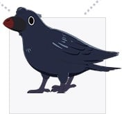

> [!bookinfo|noicon]+ **你好 世界**
> 
>
| 日文名 | HELLO WORLD |
|:------: |:------------------------------------------: |
| 类型 | 原创 |
| 新番 | 2019 年 9 月 |
| 集数 | 共1话 |
| 官网 | [https://hello-world-movie.com/](https://https://hello-world-movie.com/) |
| 制作 | グラフィニカ |
| 导演 | 伊藤智彦 |
| 脚本 | 野﨑まど |
| 评分 | 6.8|
| 制片人 | 森口博史、二木啓輔 |

> [!abstract]+ **简介**
> 「お前は今日から三か月後、一行瑠璃と恋人同士になる」

京都に暮らす内気な男子高校生・直実の前に、
10年後の未来から来た自分を名乗る青年・ナオミが突然現れる。
ナオミによれば、同級生の瑠璃は直実と結ばれるが、
その後事故によって命を落としてしまうと言う。
「頼む、力を貸してくれ。」 彼女を救う為、
大人になった自分自身を「先生」と呼ぶ、奇妙なバディが誕生する。
しかしその中で直実は、瑠璃に迫る運命、ナオミの真の目的、
そしてこの現実世界に隠された大いなる秘密を知ることになる。

世界がひっくり返る、
新機軸のハイスピードSF青春ラブストーリー。

> [!tip]+ **章节列表**
>- [ ] 第1话：你好 世界 (2019-09-20)

> [!tip]+ **主要角色**
> 
| 角色 | CV | 简介| 角色图片 |
|:----:|:---:|:---:|:--------:|
| 堅書直実 | 北村匠海 | 京都に住む高校生で図書委員を務める。 |  |
| カタガキナオミ | 藤新 | 未来の「堅書直実」。10年前の自分に会うためにやって来る。 |  |
| 一行瑠璃 | 浜辺美波 | 直実の同級生。 |  |
| 勘解由小路三鈴 | 福原遥 |  |  |
| カラス | 釘宮理恵 |  |  |
| 千古恒久 | 子安武人 |  |  |
| 徐依依 | 寿美菜子 |  |  |