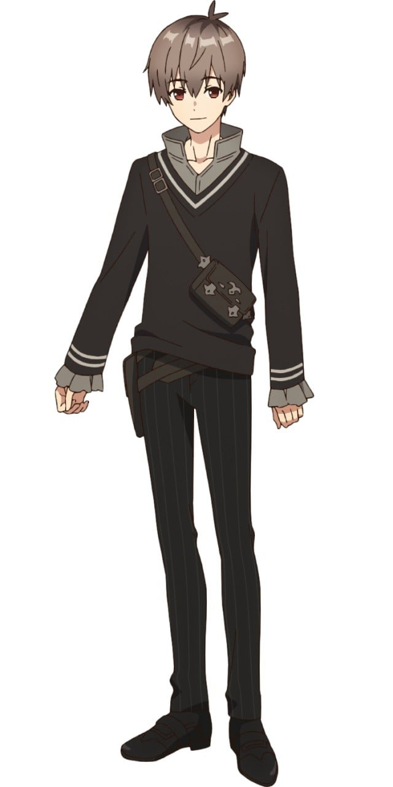
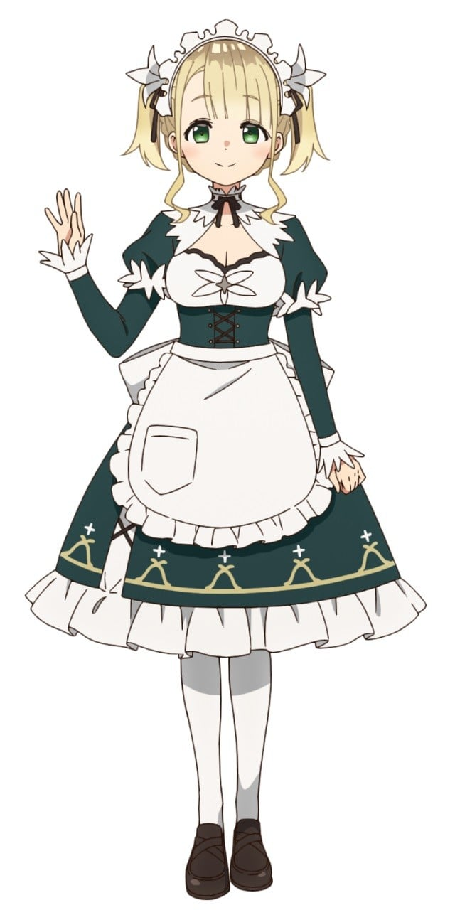
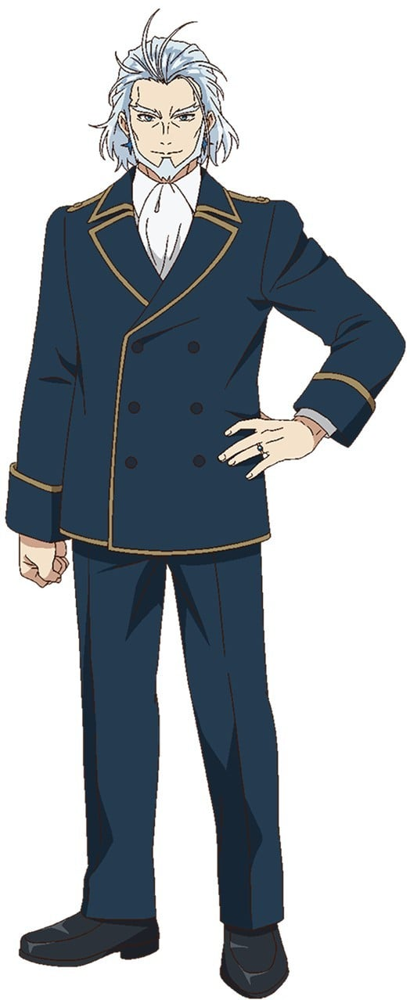
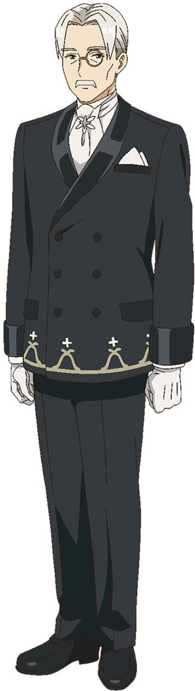
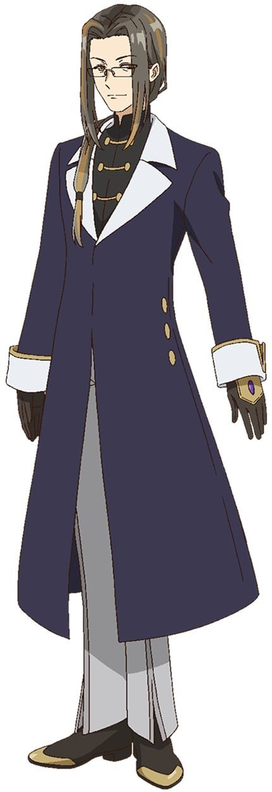
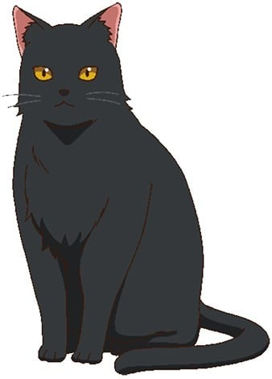

> [!bookinfo|noicon]+ **公爵千金的家庭教师**
> 
>
| 日文名 | 公女殿下の家庭教師 |
|:------: |:------------------------------------------: |
| 类型 | 小说改 |
| 新番 | 2025 年 7 月 |
| 集数 | 共12话 |
| 官网 | [https://koujodenka-anime.com/](https://https://koujodenka-anime.com/) |
| 制作 | Studio Blanc. |
| 导演 | 長山延好 |
| 脚本 | 笹野恵,小鹿りえ,清水恵 |
| 评分 | 5.4|
| 制片人 | 江里口武志 |

> [!abstract]+ **简介**
> ──王宫魔法师的考试落榜了。世道真是残酷。
就算想回老家，身上也没有钱。
正当亚连在找工作时，他接到了一份差事──
担任公爵家的大小姐，也就是公爵千金的家庭教师。
尽管整件事十分可疑，但应该不会像那个「孽缘」一样难教吧？
才刚这么想完，
等着他的却是位完全无法使用魔法的少女！？
妨碍她使用魔法的究竟是……？
亚连颠覆常识的课程，将温柔地照亮少女的未来──

[简介原文]
——王宮魔法士の試験に落ちてしまった。世の中は厳しい。
実家に帰ろうにも、先立つものがない。
仕事を探すアレンに舞い込んだのは、公爵家御息女、
すなわち公女殿下の家庭教師の仕事。
どうも胡散臭いが、あの『腐れ縁』ほど大変な生徒じゃないだろう。
そう高を括っていた矢先、
彼を待っていたのは魔法を一切使うことができない少女だった？！
彼女の魔法を妨げているものとは一体…？
アレンの常識を覆す授業が、
少女の未来をやさしく照らす——。

> [!tip]+ **章节列表**
>- [ ] 第1话：无法使用魔法的公爵千金 (2025-07-05)
>- [ ] 第2话：拒绝的事物 (2025-07-12)
>- [ ] 第3话：落泪后盛开的花朵 (2025-07-19)
>- [ ] 第4话：最终测验 (2025-07-26)
>- [ ] 第5话：嚮往的王立学校　前篇 (2025-08-09)
>- [ ] 第6话：嚮往的王立学校　后篇 (2025-08-16)
>- [ ] 第7话：在温泉进行课外活动 (2025-08-23)
>- [ ] 第8话：虚伪之物 (2025-08-30)
>- [ ] 第9话：无光的道路 (2025-09-06)
>- [ ] 第10话：菲莉西亚的决定 (2025-09-13)
>- [ ] 第11话：在星月闪耀的夜晚 (2025-09-20)
>- [ ] 第12话：少女们的战斗 (2025-09-27)

> [!tip]+ **主要角色**
> 
| 角色 | CV | 简介| 角色图片 |
|:----:|:---:|:---:|:--------:|
| アレン | 上村祐翔 | クラスタ 東都狼族 異名 剣姫の頭脳  平民出身の苦労人で、狼族の養子。優しく謙虚な心の持ち主。 『剣姫』リディヤの相方として、『剣姫の頭脳』と称されるその実力は計り知れない。 整ったルックスとその性格故、今までも多くの子達を救い、慕われていることから、『天性の年下殺し』と揶揄されることも。 |  |
| ティナ・ハワード | 澤田姫 | クラスタ ハワード公爵家 異名 ハワードの忌み子  ハワード公爵家の次女。 四大公爵家に生まれながら、魔法を一切使うことができず『ハワードの忌み子』と蔑まれてきた。それでも王立学校入学を諦めきれず、アレンの教えを受けることに。 努力家で負けん気の強いところがある。 |  |
| エリー・ウォーカー | 守屋亨香 | クラスタ ウォーカー家 異名 ティナの専属メイド  ハワード公爵家を長きにわたり支える、ウォーカー家唯一の跡取り娘にして、ティナの専属メイド。 大好きなティナをそばで支えるため、ティナと一緒にアレンの教えを受けることを決意する。 天然かつドジっ子だが、実はティナより一つ年上。 |  |
| リディヤ・リンスター | 長谷川育美 | クラスタ リンスター公爵家 異名 剣姫  『剣姫』の異名を持つ国内屈指の剣士にして、アレンとは王立学校入学試験以来の腐れ縁。リンスター公爵家の長女で、極致魔法『火焔鳥』を使いこなす。 かつては魔法をまるで使えなかったのだが、アレンの教えで頭角を現し、王立学校と大学校を首席で卒業。アレンの前でだけ甘えた顔をみせる。 |  |
| ステラ・ハワード | 水瀬いのり | ハワード公爵家の長女にして、ティナの姉。 王立学校の現生徒会長。 ハワード家跡継ぎの名に相応しい存在になるべく努力を重ねているのだが、その真面目さと強い責任感ゆえに、自身と周囲との才能の差に思い悩んでいる。  クラスタ：ハワード公爵家 異名：次期ハワード公爵 |  |
| カレン | 前島亜美 | アレンとは血のつながらない妹で、獣人族の中でも珍しい狼族の少女。 剣術、体術、魔法全てに秀でており、王国では差別される獣人族でありながら、生徒会副会長を務める才媛。 お兄ちゃんのことが大好き。  クラスタ：東都狼族 異名：王立学校副生徒会長 |  |
| リィネ・リンスター | 岡咲美保 | リンスター公爵家次女にして、リディヤの妹。 姉譲りの才能の持ち主で、リディヤの指導を受けて王立学校に次席入学を果たす。 アレンに対して憧れを抱き、ティナにライバル心を持っている。  クラスタ：リンスター公爵家 異名：小炎姫 |  |
| フェリシア・フォス | 花澤香菜 | 近年急成長を遂げているフォス商会の娘。病弱で人見知り。男の人も大の苦手。最近まで療養のため休学していたが、ようやく復学。体調に鑑みて最低限の授業だけを受けている。同期のカレンとステラと大の仲良し。  クラスタ：フォス商会 異名：未来の大商人 |  |
| ワルター・ハワード | 諏訪部順一 | ステラ、ティナの実の父親。筋骨隆々な巨躯。妻に先立たれながらも、娘達を育ててきた。ティナの才を認めつつも、武門としてのハワード家の終焉を感じていた。 アレンに対しては感謝しているものの、娘達が慕っているのを見ると、お酒が欲しくなる模様。貴族情勢は理解しつつも、北方という僻地を領土に持つこともあり、教授、リンスター公爵に比べれば物事を単純に考えがち。 極致魔法『氷雪狼』の使い手。歴戦の勇将であり、彼の名前を出すだけで、諸外国が警戒度を上げる程。  クラスタ：ハワード公爵家 異名：ハワード公爵 |  |
| グラハム・ウォーカー | 中博史 | 四大公爵の一角、ハワード家を支えるウォーカー家の当代。エリーの祖父。無類の忠義者にして、教授に「グラハムがいればハワードは何も問題無し」と称される、名実共に公爵家の屋台骨。  エリーの両親は既に亡くなっており、今まで大事に孫娘を育ててきた。アレンを評価しており、彼をウォーカー家に迎えても良いと考えている。……ただし、自分を倒してから。  クラスタ：ウォーカー家 異名：ハワード家執事長 |  |
| 教授 | 内田夕夜 | アレン、リディヤの担当教授。リンスター、ハワード両公爵とは悪友の仲で王立学校長とは同族嫌悪。 花の独身でありながら王国内屈指の魔法士である。 本名はかなり長く、ほとんどの人物が名前を憶えていない。そのため、悪友達からも教授。国王からは「先生」と呼ばれている。使い魔である「アンコさん」がいる。  クラスタ：王立大学校 異名：全王宮魔法士筆頭 |  |
| アンコさん | 佐藤はな | 教授の使い魔な黒猫様。 アレンとはとても仲良し。ブラシをかけてもらうのを好む。  クラスタ：王立大学校 |  |