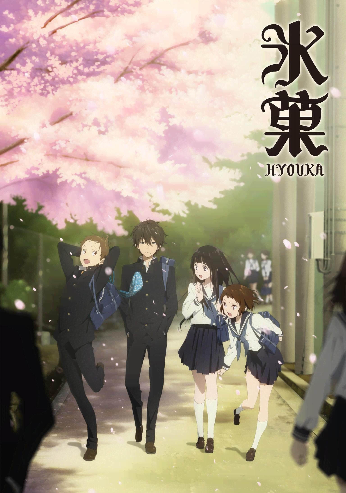
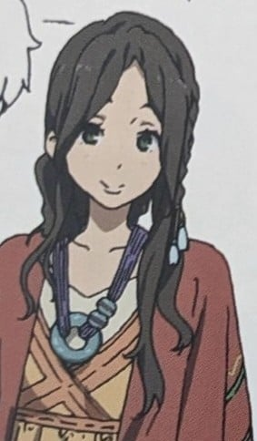
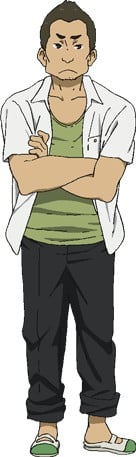

> [!bookinfo|noicon]+ **冰菓**
> 
>
| 日文名 | 氷菓 |
|:------: |:------------------------------------------: |
| 类型 | 小说改 |
| 新番 | 2012 年 4 月 |
| 集数 | 共22话 |
| 官网 | [[{'v': 'http://www.kotenbu.com/'}, {'v': 'https://www.kyotoanimation.co.jp/kotenbu/'}]](https://[{'v': 'http://www.kotenbu.com/'}, {'v': 'https://www.kyotoanimation.co.jp/kotenbu/'}]) |
| 制作 | 京都アニメーション |
| 导演 | 武本康弘 |
| 脚本 | 江上美幸,村元克彦,賀東招二,芦田杉彦,西岡麻衣子 |
| 评分 | 8.2|
| 制片人 | 瀬波里梨 |

> [!abstract]+ **简介**
> 以节能为座右铭的高中生折木奉太郎， 为一个小小的原因而加入了濒临废社的“古典文学部”。古典文学部的社员，包括他在社里认识的好奇宝宝，也就是女主角千反田爱瑠，还有他从国中就认识的伊原摩耶花和福部里志。这是他们四人以神山高中为舞台，对一桩桩事件展开推理的青春学园推理剧。“我很好奇！”奉太郎平静的灰色高中生活，因为千反田的这一句话而为之一变！

> [!tip]+ **章节列表**
>- [ ] 第1话：富有传统的古籍社之再生 (2012-04-22)
>- [ ] 第2话：值得夸耀的古籍社之活动 (2012-04-29)
>- [ ] 第3话：内情尚存的古籍部之末裔 (2012-05-06)
>- [ ] 第4话：辉煌光荣的古籍部之昔日 (2012-05-13)
>- [ ] 第5话：历史悠久的古籍部之真相 (2012-05-20)
>- [ ] 第6话：犯下大罪 (2012-05-27)
>- [ ] 第7话：原形毕露 (2012-06-03)
>- [ ] 第8话：去参加试映会吧！ (2012-06-10)
>- [ ] 第9话：古丘废村杀人事件 (2012-06-17)
>- [ ] 第10话：万人的死角 (2012-06-24)
>- [ ] 第11话：愚者的片尾 (2012-07-01)
>- [ ] 第12话：无限堆积的「那个」 (2012-07-08)
>- [ ] 第13话：黄昏之际伴尸骨 (2012-07-15)
>- [ ] 第14话：Wild Fire (2012-07-22)
>- [ ] 第15话：十文字事件
>- [ ] 第16话：最后的目标 (2012-08-05)
>- [ ] 第17话：库特莉亚芙卡的排序 (2012-08-12)
>- [ ] 第18话：峰峦是否天晴 (2012-08-19)
>- [ ] 第19话：心里有数的人 (2012-08-26)
>- [ ] 第20话：开门大吉 (2012-09-02)
>- [ ] 第21话：手工巧克力事件 (2012-09-09)
>- [ ] 第22话：绕远的雏鸟 (2012-09-16)
>- [ ] 第1话：優しさの理由
>- [ ] 第2话：未完成ストライド
>- [ ] 第1话：浅寐的约定
>- [ ] 第2话：君にまつわるミステリー

> [!tip]+ **主要角色**
> 
| 角色 | CV | 简介| 角色图片 |
|:----:|:---:|:---:|:--------:|
| 折木奉太郎 | 中村悠一 | 神山高中一年级B班的男生。《古典部连载》中的主人公，也是最主要的描述者。有出色的洞察力和推理能力，也是一个奉行多一事不如少一事的 宗旨，座右铭是“能不做的事就不做。非要做不可的话就从简”。由于这种性格，对校内的社团活动几乎没有兴趣，但在作为神山高中古典部OG的 姐姐折木供惠的强烈推荐下，加入了古典部。其洞察力和推理能力被千反田看中，自然而然地担当了侦探的职务。但是他本人将那种能力不叫推理（多数情况下）而是灵光一现。他是姐姐供惠唯一的弱点（包括后来的千反田、入须）。至今为止家庭成员的构成的描写中，只知道他和姐姐及父亲一起生活，没提及母亲。后来写到的福部是他中学结交的朋友，升级后在二年级A班。 |  |
| 千反田える | 佐藤聡美 | 神山高中一年级A班的女生。“豪农”千反田家的女儿。由于“个人原因”进入古典部并担任部长。性格认真，个子很高，披肩黑发，薄薄的嘴唇，外表清秀，说话全部都用敬语，一般来说都是像千金小姐，但是特征是与整体印象不相符的大大的眼睛。平时像千金小姐一样，但一旦有了自己感兴趣的事情或是自己不能理解的事情，都会说“我很在意”这句话，那双大大的眼睛就会闪闪发光成为好奇心的化身。因此多将身边的人牵扯进去（主要的牺牲者是折木），但是不会被别人的情绪左右，懂得适可而止。成绩在整个年级都名列前茅，也很擅长料理，在文化祭中显露了自己的身手。 |  |
| 福部里志 | 阪口大助 | 神山高中一年级D班的男生，既是古典部的也是手工部的，还隶属于总务委员会。身高低于男生平均水平，从远处看像女生，但是喜欢自行车旅行，在很大程度上锻炼了脚力。总是笑眯眯的。擅长杂学，自认为数据库。从现代史到推理小说无所不知，但正如他的口头禅“数据库不能得出结论”，自己从来不进行推理。总是带着荷包，里面有各种各样的东西。收到了伊原的求爱，但总是将话题巧妙岔开。二年级成为了总务委员会副委员长。 |  |
| 伊原摩耶花 | 茅野愛衣 | 神山高校一年级（目前班级不明）女生。既加入了古典部也加入了漫画研究会，还隶属于图书委员会。个子很矮，长着一张娃娃脸，外表看来和小学时的印象几乎没什么变化。但性格与外表很不相符很厉害，无论什么事情都不妥协，也不能容许别人的错误。另外对于自己的失败也是一视同仁。甚至是更严厉。 折木评价说：“个性强有毅力”。和折木小学中学九年的同班同学。不知从何时起喜欢上了福部并表白，但到现在为止仍然是被福部躲着。在本篇中，称福部为“小福”，千反田为“小千”，折木直接是直呼其名“折木”。 |  |
| 遠垣内将司 | 置鮎龍太郎 | 神山高中3年E班的男学生。担任壁报社的社长。父母家是市内的中等教育有影响力的门第。与千反田在校外认识。 |  |
| 折木供恵 | ゆきのさつき | 比奉太郎年长四岁的姐姐。现为大学生，过去亦曾是古籍研究社的会员，于高中毕业两年后的一次外游期间，获悉奉太郎同样考上神山高中后，便以书信劝诱对方加入古研社。合气道和警察擒拿术的高手。洞察力和推理能力也很强。喜欢捉弄奉太郎，在性格上有些若无旁人，但对奉太郎十分关心。旁若无人的性格，在奉太郎还没有参加古籍研究社以前是奉太郎的唯一痛处。 故事当初历访中东、东欧等地，通过航空邮件和电话联系的形式登场。在故事中经常担任转折点的角色，有重要作用。曾在奉太郎消极地想实行节能主义时对他说：一定会有谁出现，让你的假日结束的。虽然很多方面看来都可以说是个怪人，只不过奉太郎仍然认为这个姐姐很优秀，感觉只要是与她相比，无论在任何领域自己都不会有胜算；话虽如此，奉太郎一直也没有想要赢她的意思。 在动画版登场时被刻意遮住长相。在作品里是神一般的存在，贯彻全剧的"计划通"。 |  |
| 糸魚川養子 | 小山茉美 | 神山高中的图书管理员。 |  |
| 入須冬実 | ゆかな | 神山高中2年F班的女学生。家里是市内经营综合医院的当地名士。与千反田家有家族之间的交往，冷酷严肃的气氛和持有威严的美丽少女，学生之间称之为“女帝”。 |  |
| 江波倉子 | 悠木碧 | 神山高中2年F班的女学生。“女帝”事件中，担任古籍研究社和入须冬实的联络员。与本乡真由是好友关系。 |  |
| 善名梨絵 | 豊崎愛生 | 财前村的民间旅馆“青山庄”（单行本写的是“西山庄”）里面的姊妹之一。伊原摩耶花的侄女，善名嘉代的姐姐。 |  |
| 善名嘉代 | 小倉唯 | 财前村的民间旅馆“青山庄”（单行本写的是“西山庄”）里面的姊妹之一。伊原摩耶花的侄女，善名梨绘的妹妹。 |  |
| 中城順哉 | 近藤孝行 | 神山高校2年F組の男子生徒。ビデオ映画撮影に際し、助監督を務める。 |  |