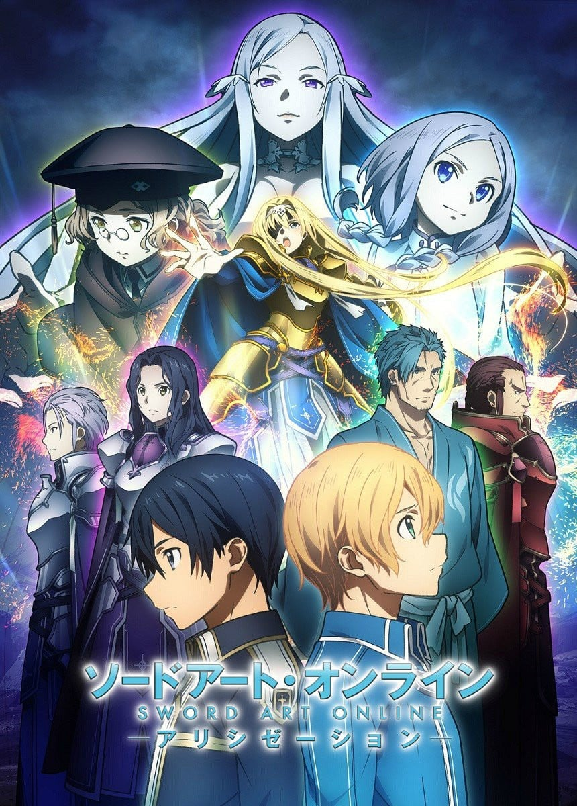
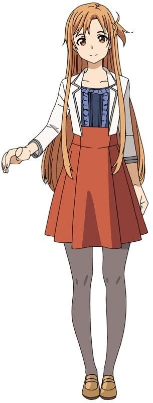
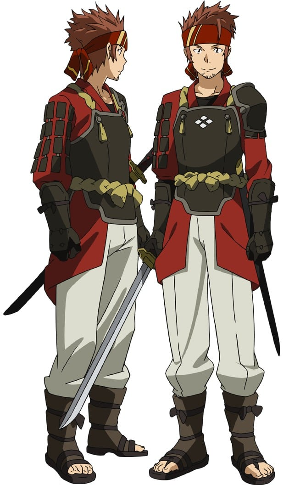
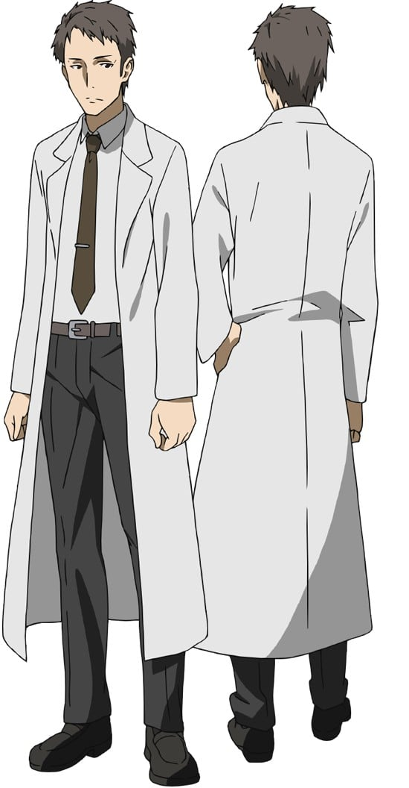
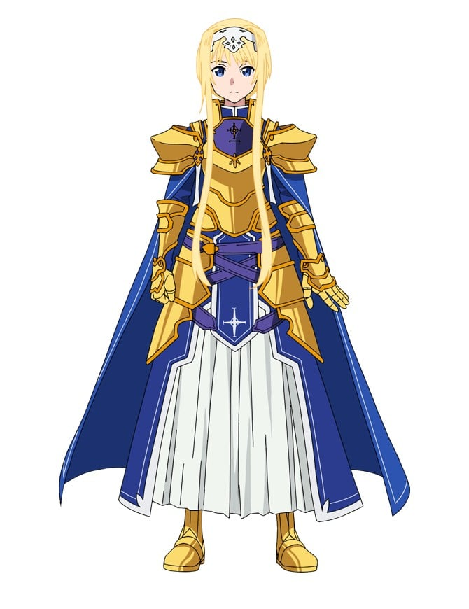
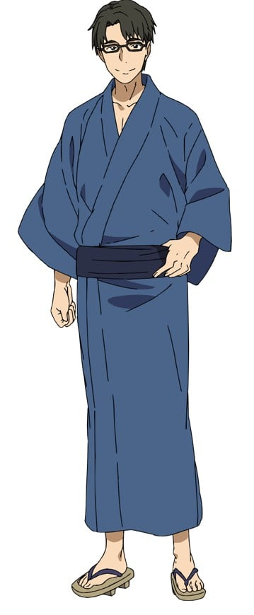

> [!bookinfo|noicon]+ **刀剑神域 爱丽丝篇**
> 
>
| 日文名 | ソードアート・オンライン アリシゼーション |
|:------: |:------------------------------------------: |
| 类型 | 小说改 |
| 新番 | 2018 年 10 月 |
| 集数 | 共24话 |
| 官网 | [https://sao-alicization.net/](https://https://sao-alicization.net/) |
| 制作 | A-1 Pictures |
| 导演 | 小野学 |
| 脚本 | 中本宗応,木澤行人,猫田幸 |
| 评分 | 6.2|
| 制片人 | 金子敦史 |

> [!abstract]+ **简介**
> “这里……是哪儿……”
察觉到的时候，桐人不知为什么陷入了庞大的幻想风格虚拟世界。登录前的记忆模糊不清，只得在周围徘徊寻找线索。
之后，来到漆黑的巨树“基家斯西达”旁边的他，同一名少年相遇了。“我的名字是尤吉欧。请多关照，桐人君。”少年是在虚拟世界的居民――即“NPC”，但是却如同人类一样拥有“丰富感情”。
在和尤吉欧加深交往的同时，桐人也在摸索着登出这个世界的方法。在桐人的脑海中，某一个记忆苏醒了。那是幼年时的桐人和尤吉欧在山野奔跑的记忆――原本，不可能存在的记忆。而在那个回忆中，除了尤吉欧还有一个金发少女的身影。她的名字，是爱丽丝。绝对不应该忘记的、重要的名字。

> [!tip]+ **章节列表**
>- [ ] 第1话：Under World (2018-10-06)
>- [ ] 第2话：恶魔之树 (2018-10-13)
>- [ ] 第3话：尽头山脉 (2018-10-20)
>- [ ] 第4话：启程 (2018-10-27)
>- [ ] 第5话：海龟 (2018-11-03)
>- [ ] 第6话：Alicization计划 (2018-11-10)
>- [ ] 第7话：剑的学舍 (2018-11-17)
>- [ ] 第8话：剑士的自尊 (2018-11-24)
>- [ ] 第9话：贵族的责任 (2018-12-01)
>- [ ] 第10话：禁忌目录 (2018-12-08)
>- [ ] 第11话：中央大教堂 (2018-12-15)
>- [ ] 第12话：图书室的贤者 (2018-12-22)
>- [ ] 第13话：支配者与调停者 (2019-01-05)
>- [ ] 第14话：红莲的骑士 (2019-01-12)
>- [ ] 第15话：烈日的骑士 (2019-01-19)
>- [ ] 第16话：金桂的骑士 (2019-01-26)
>- [ ] 第17话：休战协定 (2019-02-02)
>- [ ] 第18话：传说的英雄 (2019-02-09)
>- [ ] 第19话：右眼的封印 (2019-02-23)
>- [ ] 第20话：整合秘仪 (2019-03-02)
>- [ ] 第21话：第三十二位骑士 (2019-03-09)
>- [ ] 第22话：剑之巨人 (2019-03-16)
>- [ ] 第23话：Administrator (2019-03-23)
>- [ ] 第24话：我的英雄 (2019-03-30)
>- [ ] 第18.5话：Recollection (2019-02-16)
>- [ ] 第0话：「ソードアート・オンライン アリシゼーション」放送直前！完全攻略SP (2018-10-06)

> [!tip]+ **主要角色**
> 
| 角色 | CV | 简介| 角色图片 |
|:----:|:---:|:---:|:--------:|
| キリト / 桐ヶ谷和人 | 松岡禎丞 | 主人公。开始玩SAO时是14岁，2年后的故事本篇是16岁。生日日期为10月7号。     名副其实的重度玩家。拥有超群的反射神经和洞察力，游戏的才能被茅场晶彦评为最强等级。参加过限额1000名的SAO封测，在封测期间就非常投入游戏。因为完全潜行正式版的SAO而被卷入死亡游戏，并以此为开端，牵扯进各种的虚拟世界事件。非常崇拜茅场晶彦，但这份崇拜因为被茅场晶彦关进死亡游戏而混入了憎恨，变成一种很复杂的感情。     出生没多久父母就因车祸去世，和人虽然也受了重伤但保住了性命，之后被桐谷家（母亲妹夫的家庭）收为养子。6岁就会自己组电脑。10岁时就发现自己的电子户口被修改过并发觉自己的身世，令养父母十分惊讶。五官看起来像少女一样纤细，态度却非常冷淡，给人一种“捉摸不定”、“年龄不详”的印象。     有因为自己而让公会伙伴全部死亡的心理创伤[注 1]，害怕拥有伙伴或与人扯上关系，在亚丝娜半强制的组队下才慢慢克服。和亚丝娜心意相通后在系统上“结婚”，买下艾恩葛朗特22层的玩家小屋开始了新婚生活。ALO事件后和亚丝娜重聚，在现实世界也成为情侣。     在SAO事件中共杀死三名玩家，除了克拉帝尔外都被桐人以自欺欺人的方式忘却，成为桐人的另一心理创伤。     因为SAO事件，长期在VRMMORPG的环境下经历生死相关的“实战”，使和人在现实生活中也拥有极强的剑术。配合原本就过人的反射神经和洞察力，连全国中学剑道大赛前八强的直叶也无法在练习战中以技术取胜，仅能靠力量的差异压制大病初愈的和人。而这些剑术同时也让和人在某些非等级制的VRMMORPG中直接就拥有匹敌甚至凌驾顶级玩家的实力。     在SAO世界是以攻略艾恩葛朗特最上层为目标，分类为“攻略组”的独行玩家，只装备一把单手剑的顶级剑士。技能空格有12格，其中单手长剑技能、索敌技能和武器防御技能已完全习得。喜欢装备朴素但匿踪效果高的黑色斗篷，因全身黑的造型被称为“黑色剑士”。拥有全玩家中最高的反应速度而获得独有技能“二刀流”，使用时会同时装备两把单手剑：黑色剑身的“阐释者（Elucidator／エリュシデータ）”[注 2]和白色剑身的“逐闇者（Dark Repulser／ダークリパルサー）”[注 3]。起初因不想惹麻烦而一直隐藏此技能，在被迫曝光后，和希兹克利夫同样被当成拥有异次元强度的最强玩家。     在第75层的头目攻略战中识破了希兹克利夫的真正身分和想法，与其进行双方设定为超低血量的最终对决。虽然失去冷静而战败，但在消失的瞬间超越系统限制，从已被判定死亡的状态下硬发出一次攻击，成功对茅场造成致命伤，最终二人同归于尽，成功攻略游戏。     在妖精之舞篇中，为了找寻仍然被囚禁在虚拟实景的亚丝娜，而以守护精灵剑士的角色完全潜行“ALO”。因使用保有旧SAO存盘的NERvGear登入ALO，造成SAO中的黑衣剑士“桐人”的资料覆盖到守护精灵“桐人”身上[注 4]，在新手状态就拥有极高的技能熟练度和可观的游戏货币。并因为系统错误而出现在使用相同IP的直叶（莉法）附近，在不知道彼此真正身份下结识对方，直到桐人在游戏中提到亚丝娜的名字才被直叶认出。     新生ALO开始营运后，以“剑士桐人的任务已经完成”为由，将自己的数值重置。     在幽灵子弹篇中，受到菊冈委托，完全潜行“GGO”调查“死枪事件”。使用的武器为光剑和一把口径5.7的FN Five-seveN手枪。     在新生ALO中，以自己在SAO中使用二刀流和GGO中砍断子弹的体验，开发出不在游戏系统内的技能：能无延迟左右手交互施放单手剑剑技的“剑技连携”和以剑技抵销某些种类魔法的“魔法破坏”。被莉法形容比在剑道比赛中使用不合规定的轻量竹刀还要过分100倍。     曾被“绝剑”有纪指有一种“在方向上和自己不同，但也不像活在现实世界的人”的感觉。     座右铭是：在不幸中找出幸运、可以利用的事物就尽量利用。     使用二刀流时的招式有“星爆气流斩”（16连击）（Starburst Stream），“日蚀”（27连击）和“双重扇形斩”     在小说第10集中，遭受金本敦的袭击，被注入药物而濒死，虽然捡回一命，但因脑部缺氧过久，造成神经损耗，目前在Soul Translator中进行神经复原，并在Underworld中进行游戏。     在《加速世界》的番外篇中，由于第四世代的完全潜行机器发生错误的量子纠缠，意外进入了该作的世界，以SAO的黑衣剑士“桐人”姿态登场。与该作主角有田春雪的对战虚拟角色“Silver Crow”短暂交手。 |  |
| アスナ / 結城明日奈 | 戸松遥 | 女主角，开始玩SAO时是15岁，2年后的故事本篇是17岁。     父亲是大型电子用品制造商“RECT”的CEO，母亲是某大学中的教授。     在SAO中除了是原本就不多的女性玩家外，更是在反映真实长相的SAO系统下拥有排名前五名美貌的美女玩家。其美貌与能担任最强公会“血盟骑士团”副团长的实力，让她成为几乎无人不晓的名人。为了避免沾上麻烦，血盟骑士团特别派了两名护卫贴身保护，但本人却不太喜欢的样子。武器是细剑“闪烁之光”，能使出连桐人也看不清的高速高准度连击，而拥有“闪光”的称号。因为个人兴趣，料理技能已经完全习得，甚至以神农氏尝百草的方式，成功合成出酱油与美乃滋等数种调味料的味道，不喜欢像蟾蜍的食物。     以前曾陷入被人评为狂剑士的心理不安定状态：一心只想早日脱离SAO而只把攻略游戏摆第一，其他行动全部视为浪费时间，甚至还强制他人也全速攻略。但是遇到“活在”SAO里的桐人后改变想法，回复原本开朗的个性，也喜欢上桐人。积极的追求后并因误会桐人的一句话（我今晚想与你一起）终于和桐人成为情侣，并在系统上“结婚”。     在桐人与希兹克利夫的最终决斗中，超越了系统限制，在麻痹状态下移动身体，舍身帮桐人挡下一击。     在妖精之舞篇因为须乡伸之的阴谋而困在ALO的世界里，被当成妖精王的王妃“蒂塔妮亚”，囚禁在世界树顶的笼子。被桐人从ALO里救出后在现实世界与他重逢并成为了情侣。     新生ALO开始营运后，将自己的种族设定为擅长治疗魔法的水精灵，但因为时常抛下治疗师的工作并持剑冲上前线，而获得了不优雅的“狂暴补师”称号。     在幽灵子弹篇中，与伙伴们观看BoB实况转播时，发现死枪是“微笑棺木”的生还者，从菊冈口中逼问出桐人潜行的医院后，与结衣赶到了正与死枪进行死斗的和人身边。     在圣母圣咏篇中担任主角，虽然受到母亲京子严厉的责备而感受到在SAO事件前后的自己没有改变的无力感，但在与“绝剑”的战斗后被“绝剑”有纪看上，与沉睡骑士公会一起挑战以七人攻略艾恩葛朗特的楼层头目。从有纪身上学到了何谓坚强，鼓起勇气面对自己的母亲，克服了转学和婚约的问题，之后与有纪共同创造回忆，最后在初次见面的地方获赠有纪在这个世界活过的证明，11连击OSS《圣母圣咏》的秘笈，陪有纪走完最后一程。 |  |
| クライン / 壷井遼太郎 | 平田広明 | 在和亚丝娜第一次认识时说出了自己的年龄是24岁。 桐人在SAO正式营运后认识的第一位玩家，曲刀使，攻略组成员之一，公会“风林火山”的会长，虽然不太有女人缘，却是十分重义气的好伙伴。 在SAO事件发生后，因为桐人说要在其他人之前去下一个城镇获得资源，本想一起去但是因为自己不想再受桐人的恩惠和要去找本身在现实就认识的朋友而和桐人在第一层的第一个城市和桐人分开。桐人一直对此事耿耿于怀，但克莱因本人倒是毫不在意。 新生ALO营运后，将帐号转移至ALO，种族设定为火精灵，基于嗜好而自各地收集各种酒，并放置在桐人与亚丝娜共租的玩家住宅中。基于武士的坚持，配点上完全不选任何与魔法有关的技能，十分讨厌弱化魔法。 |  |
| エギル / アンドリュー・ギルバート・ミルズ | 安元洋貴 | 因为本名很长的缘故，所以在现实世界中仍被称为艾基尔。 为非裔美国人，身材壮硕。在现实中也经营一家咖啡厅兼酒吧的店“Dicey Cafe”，为和人等人于现实中的聚会地点。娶有一位漂亮老婆，在艾基尔被困SAO时独立将店撑下去。 在艾恩葛朗特篇中，桐人相熟的商人，巨斧战士，定居于艾恩葛朗特50层都市，“阿尔格特”道具屋的老板，虽是精打细算的商人，但私底下对培育中层玩家贡献许多心力，本身亦有足以匹敌攻略组的实力。 在新生ALO营运后，将账号转移至ALO，种族设定为大地精灵。并受到桐人等人的资助而在游戏内重新开店。 |  |
| リズベット / 篠崎里香 | 高垣彩陽 | 居住于艾恩葛朗特的48层“琳达司街”，经营冶炼商店的少女，与亚丝娜十分友好，打造出亚丝娜的细剑“闪烁之光”和桐人双剑之一的“逐闇者”，对桐人有好感，但得知桐人与亚丝娜的关系后决定退让，不过曾言回到现实后要进行第二回合。 在打造出桐人的“逐闇者”时曾询问桐人为何需要两把能力相似的剑，桐人做为报酬说出“二刀流”的秘密，让莉兹成为除了有管理者权限的希兹克利夫之外最早得知桐人能用“二刀流”的人。 在ALO事件后与和人于现实中见面，得知亚丝娜在ALO事件中的遭遇，决议暂时压下竞争意识，并与同样喜欢和人的绫野圭子（西莉卡）一起定下一个月内不对和人出手的约定。 新生ALO营运后，将帐号转移至ALO，种族设定为小矮妖，在世界树城市中经营武器店，现今桐人等人的武器几乎皆出于她之手。 |  |
| 茅場晶彦 | 山寺宏一 | 为NERvGear的基础和SAO游戏的设计者。本故事的元凶，幕后黑手般的存在。以量子物理学者兼天才游戏设计师而闻名于世，但很少在媒体上露脸，是桐人曾经景仰的对象。在SAO正式营运的首日绑架了一万名玩家成为NERvGear的囚犯，并宣布SAO死亡游戏化。目的是想实现“真正的异世界”。 |  |
| シリカ / 綾野珪子 | 日高里菜 | 稀有的“驯兽师”少女（“驯兽师”并非游戏设定的职业），被中层玩家称为“龙使．西莉卡”，刚登入游戏时年仅十二岁，在现实中是独生女，故将帮助自己的桐人当成兄长般仰慕，使用短剑技能，使魔“羽翼龙”的名字为“毕娜”。 曾被橙色公会—“泰坦之手”（Titan'Hand）列为目标。后来被“泰坦之手”围攻时，当时是LV78的桐人以压倒性的力量、强大的14500血量及自动回血（Battle Healing Skill）技能打败“泰坦之手”，并用回廊水晶把“泰坦之手”全员送入监狱而所救。 新生ALO营运后，将帐号转移至ALO，种族设定为猫妖。 |  |
| ユイ | 伊藤かな恵 | 倒在桐人和亚丝娜过新婚生活的艾恩葛朗特22层森林里的小女孩。除了记忆错乱，身边还有许多不可解的Bug现象。 真正身分是SAO的MHCP，负责维护玩家精神健康的咨询用AI。当游戏变质为死亡游戏时被剥夺了主动接触玩家的权限，在有义务却没权力执行的矛盾累积下，AI出现错误并丢失部分记忆，游荡到发出强烈正面情绪的桐人和亚丝娜附近并被发现和收养，在前往一层黑铁宫时重新接触安置在那里的紧急管理界面，记忆被修复并道出自己的真正身份，但也因此被Cardinal系统发现，在被系统消去前，因桐人的努力而以道具的状态被保留下来及数据被桐人保全在桐人的NERvGear中。 虽然只是AI，却拥有不输给人类的丰富感情（本人却表示那只是透过模仿及学习的结果），个性有如孩子般天真无邪，把桐人和亚丝娜当成真正的“爸爸”和“妈妈”般仰慕。取回身为AI的记忆后，变成会用正式的语调讲话。 在延用SAO系统的ALO中，以“导航妖精”的身分复活，辅助桐人挑战世界树，一起寻找妈妈亚丝娜。 于ALO事件后定居在和人房间的电脑主机中，在现实世界中会透过手机来对话。拥有任何检索达人也比不上的情报能力，和人等人经常倚赖结衣的帮忙完成学校作业。 |  |
| シノン / 朝田詩乃 | 沢城みゆき | 幽灵子弹篇的女主角。 在Gun Gale Online（GGO）中使用自己昵称为“黑卡蒂II”的狙击步枪“PGM Ultima Ratio HecateII（动画版第二话开头用FR-F2狙击步枪）”及“HK MP7冲锋枪（动画版改为Glock18C手枪）”的15岁少女，2009年出生。 |  |
| ユージオ | 島﨑信長 | 桐人的拍挡，桐人在这个世界中最先遇到的居民。身负砍断恶魔之树“基加斯西达”的天职。 |  |
| アリス・ツーベルク／アリス・シンセシス・サーティ | 茅野愛衣 | Alicization篇的女主角。卢利特村村长的女儿，有着村内最高的神圣术天赋。 尤吉欧与桐人的童年玩伴，三人十一岁那年的一场探险让她误触禁忌目录而被整合骑士押往央都，一度生死不明。 |  |
| クリスハイト / 菊岡誠二郎 | 森川智之 | キリトに新型フルダイブシステムである《ソウル・トランスレーター》のテストプレイを依頼。 総務省に勤める職員だと自称しているが……。 |  |