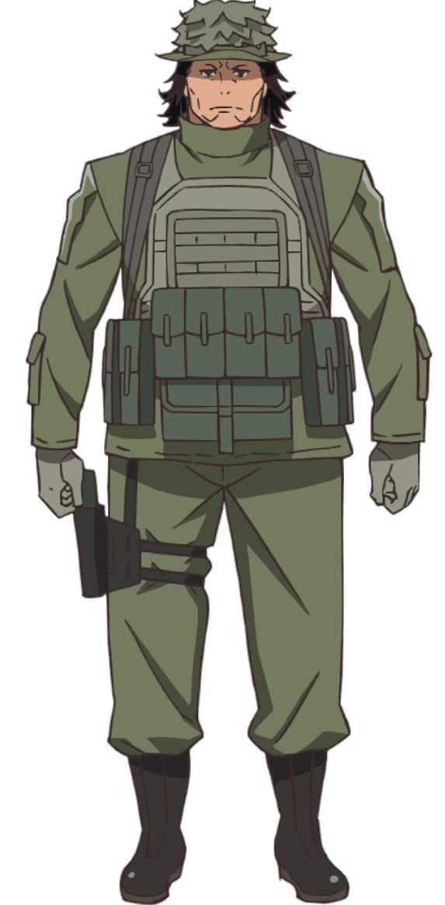
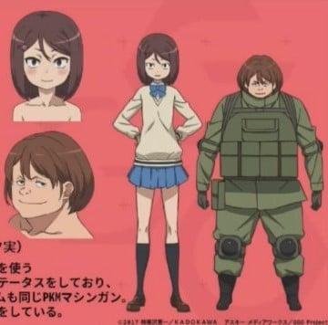
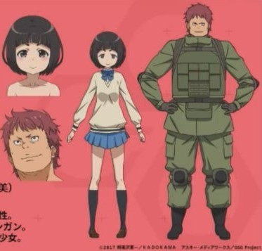
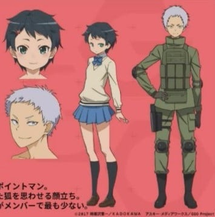
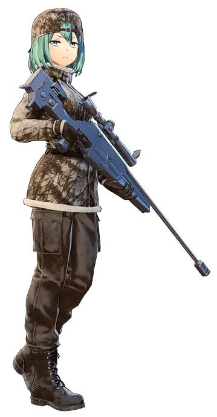

> [!bookinfo|noicon]+ **刀剑神域外传 Gun Gale Online**
> 
>
| 日文名 | ソードアート・オンライン オルタナティブ ガンゲイル・オンライン |
|:------: |:------------------------------------------: |
| 类型 | 小说改 |
| 新番 | 2018 年 4 月 |
| 集数 | 共12话 |
| 官网 | [http://gungale-online.net/](https://http://gungale-online.net/) |
| 制作 | Studio 3Hz |
| 导演 | 迫井政行 |
| 脚本 | 黒田洋介 |
| 评分 | 6.5|
| 制片人 |  |

> [!abstract]+ **简介**
> 在枪与钢铁的世界“Gun Gale Online”享受着单人游戏的女性玩家·莲。喜欢可爱事物的她，全身清一色的粉红色装备，不断累积游戏经验，并逐渐增强实力。之后，由于某件事而对于PK（玩家狩猎）觉醒了兴趣的莲沉迷于PK中，并终于到达被人称作“粉红恶魔”的地步。
这样的莲，与神秘的美女玩家·Pitohui相遇，并和她意气相投。莲按照她所说的，参加了小队作战活动“特攻强袭”。 

> [!tip]+ **章节列表**
>- [ ] 第1话：Squad Jam (2018-04-07)
>- [ ] 第2话：GGO (2018-04-14)
>- [ ] 第3话：粉丝来信 (2018-04-21)
>- [ ] 第4话：死亡游戏 (2018-04-28)
>- [ ] 第5话：将最后一战交给我 (2018-05-05)
>- [ ] 第6话：SAO失败者 (2018-05-19)
>- [ ] 第7话：Second Squad Jam (2018-05-26)
>- [ ] 第8话：Booby Trap (2018-06-02)
>- [ ] 第9话：十分钟的杀戮 (2018-06-09)
>- [ ] 第10话：魔王复活 (2018-06-16)
>- [ ] 第11话：疯狂的莲 (2018-06-23)
>- [ ] 第12话：掌声 (2018-06-30)
>- [ ] 第5.5话：Refrain (2018-05-12)

> [!tip]+ **主要角色**
> 
| 角色 | CV | 简介| 角色图片 |
|:----:|:---:|:---:|:--------:|
| レン / 小比類巻香蓮 | 楠木ともり | 身長150センチに満たない小柄な女性プレイヤー。敏捷性（AGI）に優れており、スピードを活かした近距離戦を得意とする。可愛いものが大好きで、全身の装備をピンクで統一している。メインアームはP90で「ピーちゃん」と呼んでいる。 |  |
| ピトフーイ / 神崎エルザ | 日笠陽子 | レンのフレンドで、頬にタトゥーを入れた長身の美女。《GGO》のベテランプレイヤーで、プレイのたびに違う銃を使うほどのガンマニアということ以外は何もわからない謎多き人物。 |  |
| エム / 阿僧祇豪志 | 興津和幸 | ピトフーイの知り合いの男性プレイヤー。身長190センチを超える巨漢で、中距離～遠距離戦を得意とし、特に狙撃の腕に長ける。冷静で作戦立案能力にも優れており、チームの参謀役を務めている。 |  |
| フカ次郎 / 篠原美優 | 赤﨑千夏 | レンの知り合いで、彼女と同じくらい小柄な女性プレイヤー。VRMMORPG《ALO（アルヴヘイム・オンライン）》からキャラクターをコンバートしているためステータスが高い。その高い筋力（STR）を活かして、六連装グレネードランチャーの二丁持ちで戦う。 |  |
| 銃が出てくる作品ばり書いている小説家 | 時雨沢恵一 | 一位热爱GGO，并给运营商提供资金设立特攻强袭比赛的小说家 |  |
| トーマ / ミラナ・シドロワ | 森永千才 | 高中一年級→二年級，金髮碧眼的俄羅斯人，父母親是貿易商。喜歡車子的父親教過她駕駛手排車。 遊戲內是一名黑色長髮的青年女性。遊戲內的武器為「德拉古諾夫」和「PTRD1941」。 |  |
| エヴァ/ 新渡戸咲 | 朝井彩加 | SHINC的队长，被其他队员称作老大。身材魁梧壮硕的辫子女。武器是无声狙击步枪“VSS”及“雨燕”9mm自动手枪。 |  |
| アンナ / 安中萌 | M・A・O | 金色长发女性，担当狙击手。武器是德拉古诺夫狙击枪。 |  |
| ソフィー/ 藤澤カナ | 内山夕実 | 身材像是矮人族的茶发女性，担当机枪手。武器是PKM机关枪。 |  |
| ローザ/ 野口詩織 | 種﨑敦美 | 红发大妈，担当机枪手。武器是PKM机关枪。 |  |
| ターニャ / 楠リサ | 白石晴香 | 银色短发女性，担当先锋侦察兵。武器是PP-19野牛冲锋枪及“雨燕”9mm自动手枪。 |  |
| シャーリー/ 霧島舞 | 高野麻里佳 | 本名雾岛舞，现实世界中是24岁的女猎人及自然生态导览员。虚拟角色形象是绿发的女性。武器是R93战术2型狙击步枪。  和猎人同伴们一起在GGO里组成队伍“KKHC”（北国猎人俱乐部），但和同伴们不同，一直很抵触对人射击。 |  |