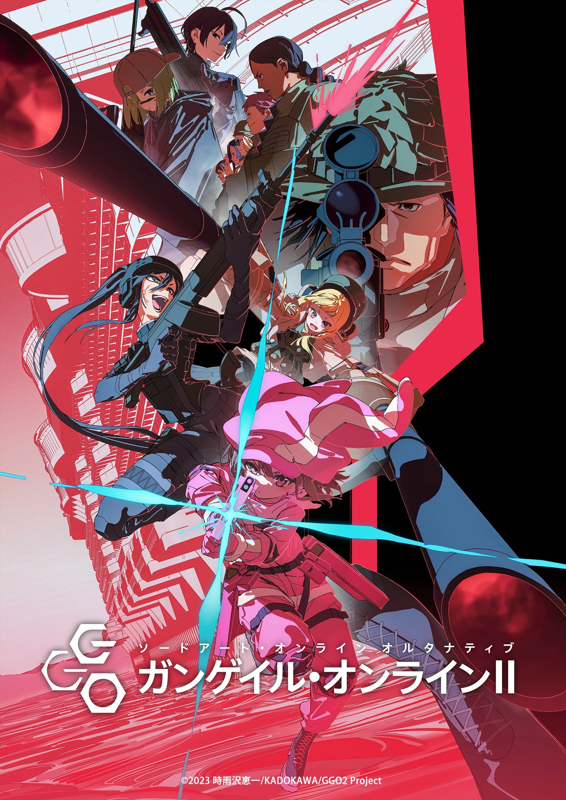
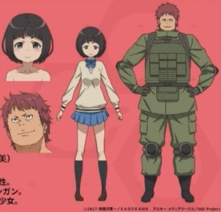
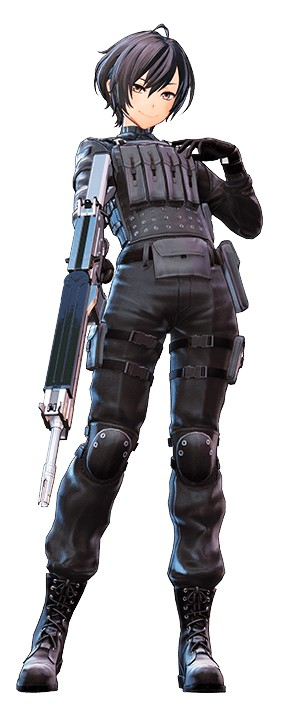

> [!bookinfo|noicon]+ **刀剑神域外传 Gun Gale Online 第二季**
> 
>
| 日文名 | ソードアート・オンライン オルタナティブ ガンゲイル・オンラインⅡ |
|:------: |:------------------------------------------: |
| 类型 | 小说改 |
| 新番 | 2024 年 10 月 |
| 集数 | 共12话 |
| 官网 | [http://gungale-online.net/](https://http://gungale-online.net/) |
| 制作 | A-1 Pictures |
| 导演 | 迫井政行 |
| 脚本 | 黒田洋介 |
| 评分 | 5.8|
| 制片人 | 久保秀彰 |

> [!abstract]+ **简介**
> 舞台は、鉛弾が飛び交い硝煙けぶるVRMMO(仮想現実大規模多人数同時参加型オンラインゲーム)
《ガンゲイル・オンライン》。
長身がコンプレックスで、小さなもう一人の自分を手に入れるためにVRゲーム空間へ降り立った
小比類巻香蓮こと《レン》が愛銃《P90》を携え、チーム対抗デスマッチ《スクワッド・ジャム》へと挑む。

突如アナウンスされた新たなチーム対抗デスマッチ大会に、
レン、エム、フカ次郎、ピトフーイの最強チーム《LPFM》が参戦する。
優勝候補筆頭と目される彼らを待ち受けるのは、
“時間経過とともに海へ沈むフィールド“　“MAP中央に潜む【UNKNOWN】エリア“　
“無名チームの結託”　という過酷な状況だった。
さらに、全プレイヤーに驚愕の特別ルールが告げられる――

> [!tip]+ **章节列表**
>- [ ] 第1话：有二就有三 (2024-10-04)
>- [ ] 第2话：大货车作战 (2024-10-11)
>- [ ] 第3话：克拉伦斯和夏莉 (2024-10-18)
>- [ ] 第4话：启动特别规则 (2024-10-25)
>- [ ] 第5话：叛徒的选择 (2024-11-01)
>- [ ] 第6话：还有时间的攻防战 (2024-11-08)
>- [ ] 第7话：反转 (2024-11-15)
>- [ ] 第8话：决斗 (2024-11-22)
>- [ ] 第9话：前往战场的邀请 (2024-11-29)
>- [ ] 第10话：恶魔城 (2024-12-06)
>- [ ] 第11话：Pitohui的突击 (2024-12-13)
>- [ ] 第12话：战斗的理由 (2024-12-20)

> [!tip]+ **主要角色**
> 
| 角色 | CV | 简介| 角色图片 |
|:----:|:---:|:---:|:--------:|
| レン / 小比類巻香蓮 | 楠木ともり | 身長150センチに満たない小柄な女性プレイヤー。敏捷性（AGI）に優れており、スピードを活かした近距離戦を得意とする。可愛いものが大好きで、全身の装備をピンクで統一している。メインアームはP90で「ピーちゃん」と呼んでいる。 |  |
| ピトフーイ / 神崎エルザ | 日笠陽子 | レンのフレンドで、頬にタトゥーを入れた長身の美女。《GGO》のベテランプレイヤーで、プレイのたびに違う銃を使うほどのガンマニアということ以外は何もわからない謎多き人物。 |  |
| エム / 阿僧祇豪志 | 興津和幸 | ピトフーイの知り合いの男性プレイヤー。身長190センチを超える巨漢で、中距離～遠距離戦を得意とし、特に狙撃の腕に長ける。冷静で作戦立案能力にも優れており、チームの参謀役を務めている。 |  |
| フカ次郎 / 篠原美優 | 赤﨑千夏 | レンの知り合いで、彼女と同じくらい小柄な女性プレイヤー。VRMMORPG《ALO（アルヴヘイム・オンライン）》からキャラクターをコンバートしているためステータスが高い。その高い筋力（STR）を活かして、六連装グレネードランチャーの二丁持ちで戦う。 |  |
| トーマ / ミラナ・シドロワ | 森永千才 | 高中一年級→二年級，金髮碧眼的俄羅斯人，父母親是貿易商。喜歡車子的父親教過她駕駛手排車。 遊戲內是一名黑色長髮的青年女性。遊戲內的武器為「德拉古諾夫」和「PTRD1941」。 |  |
| エヴァ/ 新渡戸咲 | 朝井彩加 | SHINC的队长，被其他队员称作老大。身材魁梧壮硕的辫子女。武器是无声狙击步枪“VSS”及“雨燕”9mm自动手枪。 |  |
| アンナ / 安中萌 | M・A・O | 金色长发女性，担当狙击手。武器是德拉古诺夫狙击枪。 |  |
| ソフィー/ 藤澤カナ | 内山夕実 | 身材像是矮人族的茶发女性，担当机枪手。武器是PKM机关枪。 |  |
| ローザ/ 野口詩織 | 種﨑敦美 | 红发大妈，担当机枪手。武器是PKM机关枪。 |  |
| ターニャ / 楠リサ | 白石晴香 | 银色短发女性，担当先锋侦察兵。武器是PP-19野牛冲锋枪及“雨燕”9mm自动手枪。 |  |
| シャーリー/ 霧島舞 | 高野麻里佳 | 本名雾岛舞，现实世界中是24岁的女猎人及自然生态导览员。虚拟角色形象是绿发的女性。武器是R93战术2型狙击步枪。  和猎人同伴们一起在GGO里组成队伍“KKHC”（北国猎人俱乐部），但和同伴们不同，一直很抵触对人射击。 |  |
| クラレンス | 小松未可子 | 外表看似英俊的男性，但实际上是女性玩家。喜好在游戏中使用卑劣的手段。武器是AR-57。 |  |